An `output_variable` names a task's result so later tasks can read it.

<Note>
Available under `PraisonAIAgents` / `AgentTeam` as of PraisonAI [PR #4907](https://github.com/MervinPraison/PraisonAI/pull/4907). Earlier releases only exposed `output_variable` inside the standalone `Workflow` engine and its YAML syntax.
</Note>

```mermaid
graph LR
    A[🔍 Task A] -->|output_variable=research| S[📦 variables]
    S -->|{{research}}| B[✍️ Task B]

    classDef task fill:#8B0000,stroke:#7C90A0,color:#fff
    classDef store fill:#6366F1,stroke:#7C90A0,color:#fff

    class A,B task
    class S store
```

## Quick Start

<Steps>
<Step title="Store one task's output">

Name the result with `output_variable`.

```python
from praisonaiagents import Agent, Task

researcher = Agent(name="Researcher", instructions="Research the topic and list key facts.")

research = Task(
    name="research",
    action="Research renewable energy trends",
    agent=researcher,
    output_variable="research_data",
)
```

</Step>

<Step title="Read it in the next task">

Reference the stored value with `{{research_data}}` in a later task's `action`.

```python
from praisonaiagents import Agent, Task, PraisonAIAgents

writer = Agent(name="Writer", instructions="Write a short report.")

report = Task(
    action="Write a report using {{research_data}}",
    agent=writer,
    context=[research],
)

PraisonAIAgents(
    agents=[researcher, writer],
    tasks=[research, report],
).start()
```

</Step>
</Steps>

---

## How It Works

After any task completes — agent or handler — its raw output is stored under the given name in the team's shared variables.

```mermaid
graph LR
    T[✅ Task done] --> V[📦 variables&#91;name&#93; = output]
    V --> N[▶️ Next task reads it]

    classDef task fill:#8B0000,stroke:#7C90A0,color:#fff
    classDef store fill:#6366F1,stroke:#7C90A0,color:#fff

    class T,N task
    class V store
```



---

## Reading Variables

Substitute a stored value directly in `action` or `description` with `{{name}}`.

```python
from praisonaiagents import Agent, Task

writer = Agent(name="Writer", instructions="Write a report.")

Task(action="Summarise {{research_data}} in three bullets", agent=writer)
```

Read the same value inside a handler or `should_run` with `ctx.variables["name"]`.

```python
from praisonaiagents import Task

def summarise(ctx):
    return {"summary": ctx.variables["research_data"][:200]}

Task(name="summarise", handler=summarise)
```

---

## Best Practices

<AccordionGroup>
<Accordion title="Name variables for what they hold">
Use clear names like `research_data` or `score` so downstream `{{name}}` references read naturally.
</Accordion>

<Accordion title="Set output_variable on the producing task">
Attach `output_variable` to the task that creates the value, not the one that reads it.
</Accordion>

<Accordion title="Order dependent tasks with context">
Pass `context=[producer_task]` on the consumer so the team runs them in the right order.
</Accordion>
</AccordionGroup>

---

## Related

<CardGroup cols={2}>
<Card title="Handler Tasks" icon="code" href="/features/handler-tasks">
  Run Python code as a task step
</Card>
<Card title="Conditions" icon="git-branch" href="/features/conditions">
  Gate tasks with should_run
</Card>
<Card title="Workflows" icon="diagram-project" href="/features/workflows">
  Chain agents into pipelines
</Card>
</CardGroup>
