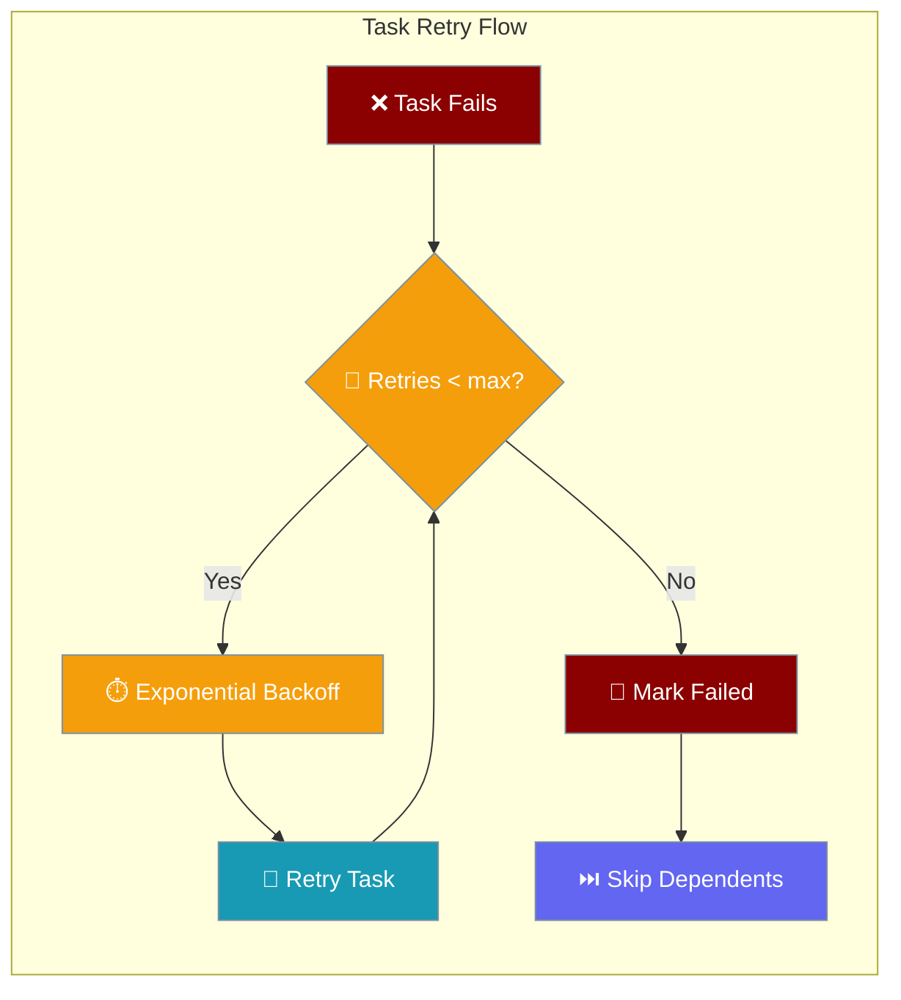
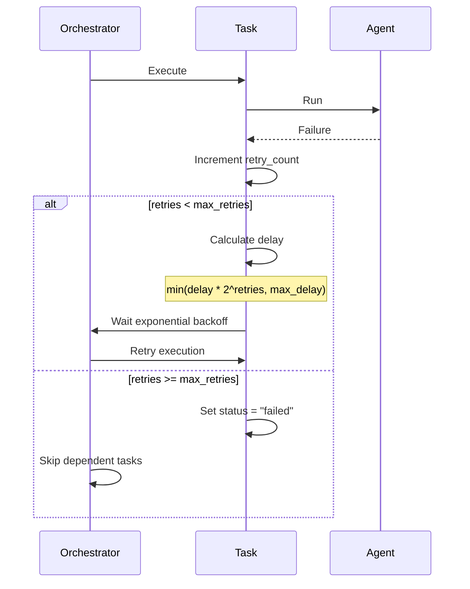
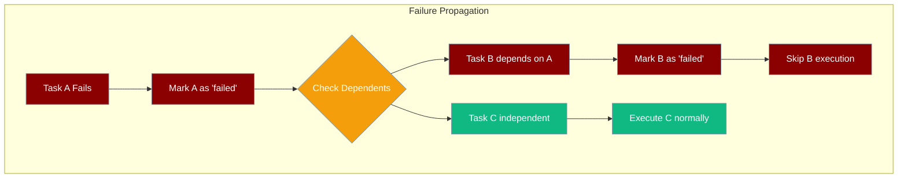
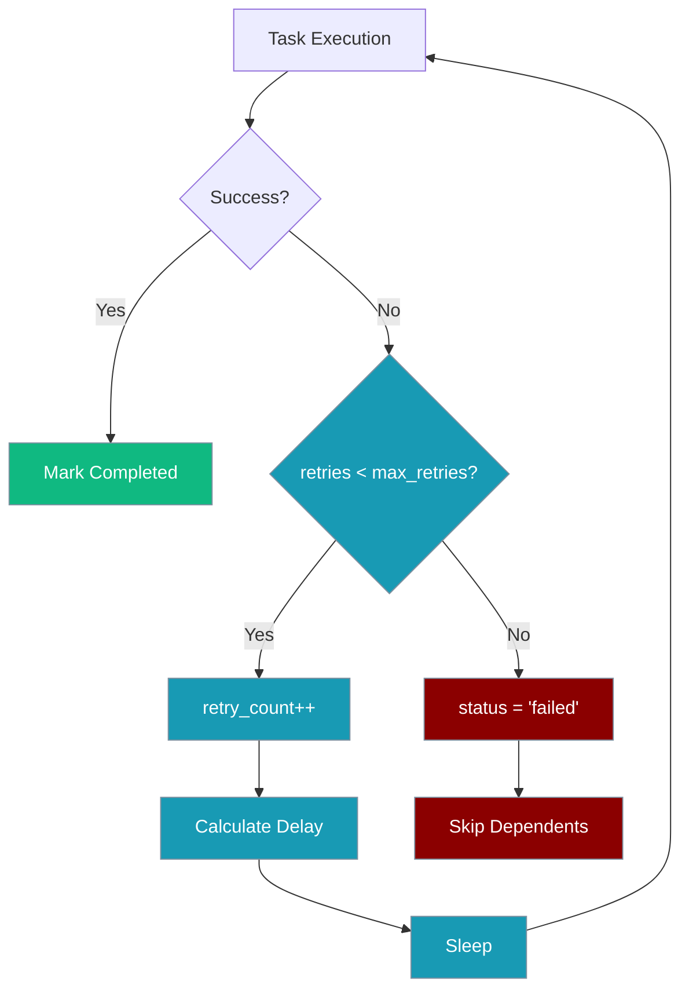

Tasks now support individual retry policies with exponential backoff, replacing hardcoded delays with configurable per-task settings.



## Quick Start

<Steps>
<Step title="Basic Retry Configuration">
```python
from praisonaiagents import Agent, Task, PraisonAIAgents

agent = Agent(
    name="Retry Agent",
    instructions="Process requests with retries"
)

task = Task(
    description="Unreliable operation",
    agent=agent,
    max_retries=5,           # Try up to 5 times
    retry_delay=2.0,         # Start with 2 second delay
    # max_retry_delay defaults to 300 seconds
)

agents = PraisonAIAgents(agents=[agent], tasks=[task])
result = agents.start()
```
</Step>

<Step title="Custom Retry Policy">
```python
from praisonaiagents import Task

task = Task(
    description="Critical task with fast retries",
    max_retries=3,
    retry_delay=0.5,         # Start with 0.5 second delay
    # Backoff: 0.5s, 1s, 2s (then fail)
)

# Dependent tasks are skipped if this fails
dependent_task = Task(
    description="Depends on critical task",
    context=[task]  # Skipped if 'task' fails
)
```
</Step>
</Steps>

---

## How It Works



| Component | Purpose |
|-----------|---------|
| **max_retries** | Maximum number of retry attempts |
| **retry_delay** | Initial delay between retries (seconds) |
| **max_retry_delay** | Cap on exponential backoff delay |
| **retry_count** | Current retry attempt counter |

---

## Retry Configuration

### Task-Level Settings

Each task can configure its own retry behavior:

| Field | Type | Default | Description |
|-------|------|---------|-------------|
| `max_retries` | `int` | `3` | Maximum retry attempts |
| `retry_delay` | `float` | `1.0` | Initial delay in seconds |
| `max_retry_delay` | `float` | `300.0` | Maximum delay cap (5 minutes) |
| `retry_count` | `int` | `0` | Current retry counter (read-only) |

```python
from praisonaiagents import Task

# Aggressive retry policy for critical tasks
critical_task = Task(
    description="Must succeed",
    max_retries=10,
    retry_delay=0.1,         # Start very fast
    max_retry_delay=60       # Cap at 1 minute
)

# Conservative retry policy for expensive operations  
expensive_task = Task(
    description="Expensive API call",
    max_retries=2,
    retry_delay=30,          # Start with 30 seconds
    max_retry_delay=300      # Cap at 5 minutes
)
```

### Exponential Backoff Formula

Retry delays follow exponential backoff with a maximum cap:

```
actual_delay = min(retry_delay * 2^retry_count, max_retry_delay)
```

**Example with `retry_delay=2.0`, `max_retry_delay=60`:**
- Retry 1: `min(2 * 2^0, 60) = 2 seconds`
- Retry 2: `min(2 * 2^1, 60) = 4 seconds`  
- Retry 3: `min(2 * 2^2, 60) = 8 seconds`
- Retry 4: `min(2 * 2^3, 60) = 16 seconds`
- Retry 5: `min(2 * 2^4, 60) = 32 seconds`
- Retry 6: `min(2 * 2^5, 60) = 60 seconds` (capped)

---

## Failed Task Propagation

When a task fails after exhausting retries, dependent tasks are automatically skipped:

```python
from praisonaiagents import Task

# Primary task that might fail
data_fetch = Task(
    description="Fetch data from API",
    max_retries=3
)

# Dependent task - skipped if data_fetch fails
data_process = Task(
    description="Process the fetched data",
    context=[data_fetch]  # Depends on data_fetch
)

# If data_fetch fails:
# 1. data_fetch.status = "failed"  
# 2. data_process.status = "failed" (skipped, not executed)
# 3. No None values passed to dependent tasks
```

### Failure Propagation Flow



---

## Retry Decision Logic

The orchestrator follows this logic for each task execution:



## Common Patterns

### Fast Retry for Transient Errors
```python
network_task = Task(
    description="Network request",
    max_retries=5,
    retry_delay=0.5,        # Quick retries for network blips
    max_retry_delay=10      # But don't wait too long
)
```

### Slow Retry for Rate Limits
```python
api_task = Task(
    description="Rate-limited API call",
    max_retries=3,
    retry_delay=60,         # Start with 1 minute
    max_retry_delay=600     # Max 10 minutes
)
```

### No Retries for One-Shot Operations
```python
notification_task = Task(
    description="Send notification",
    max_retries=0           # Don't retry notifications
)
```

### Chain with Failure Isolation
```python
# Independent tasks - failure of one doesn't affect others
task_a = Task(description="Independent work A", max_retries=2)
task_b = Task(description="Independent work B", max_retries=2)

# Dependent task - only runs if both succeed
final_task = Task(
    description="Combine results",
    context=[task_a, task_b],  # Skipped if either fails
    max_retries=1
)
```

---

## Migration from Hardcoded Delays

**Before:** All tasks used 1-second hardcoded delays
```python
# Old behavior: fixed 1 second between retries
task = Task(description="Work", agent=agent)
# Always waited exactly 1 second between retries
```

**After:** Configurable exponential backoff per task
```python
# New behavior: exponential backoff with caps
task = Task(
    description="Work", 
    agent=agent,
    max_retries=3,
    retry_delay=2.0,        # 2s, 4s, 8s
    max_retry_delay=60      # Capped at 60s
)
```

---

## Best Practices

<AccordionGroup>
<Accordion title="Match Retry Policy to Operation Type">
Different operations need different retry strategies:

```python
# Fast operations: quick retries
cache_task = Task(
    description="Cache lookup",
    max_retries=5,
    retry_delay=0.1,
    max_retry_delay=2
)

# Expensive operations: slower retries  
ml_task = Task(
    description="ML model inference",
    max_retries=2,
    retry_delay=30,
    max_retry_delay=300
)
```
</Accordion>

<Accordion title="Design for Failure Propagation">
Structure task dependencies to handle failures gracefully:

```python
# Core task that others depend on
core_task = Task(
    description="Core operation",
    max_retries=5  # Higher retries for critical path
)

# Optional enhancement - doesn't block others
optional_task = Task(
    description="Optional enhancement",
    max_retries=1,  # Lower retries for optional work
    # No context dependency - failure doesn't affect others
)

# Final task only depends on core, not optional
final_task = Task(
    description="Finalize",
    context=[core_task]  # Only core_task required
)
```
</Accordion>

<Accordion title="Monitor Retry Patterns">
Track retry behavior to tune policies:

```python
from praisonaiagents import Task

class MonitoredTask(Task):
    def __init__(self, *args, **kwargs):
        super().__init__(*args, **kwargs)
        self.retry_history = []
    
    def on_retry(self):
        self.retry_history.append({
            'attempt': self.retry_count,
            'timestamp': time.time()
        })
```
</Accordion>

<Accordion title="Set Reasonable Maximum Delays">
Avoid extremely long delays that block workflows:

```python
# Good: reasonable maximum delay
task = Task(
    description="API call",
    retry_delay=1,
    max_retry_delay=60  # Max 1 minute wait
)

# Avoid: excessively long delays
# max_retry_delay=3600  # 1 hour is usually too long
```
</Accordion>
</AccordionGroup>

---

## Related

<CardGroup cols={2}>
<Card title="Structured LLM Errors" icon="circle-alert" href="/features/structured-llm-errors">
  Handle LLM failure classification
</Card>
<Card title="Workflow Errors" icon="triangle-alert" href="/features/workflow-errors">
  Workflow-level error handling
</Card>
</CardGroup>