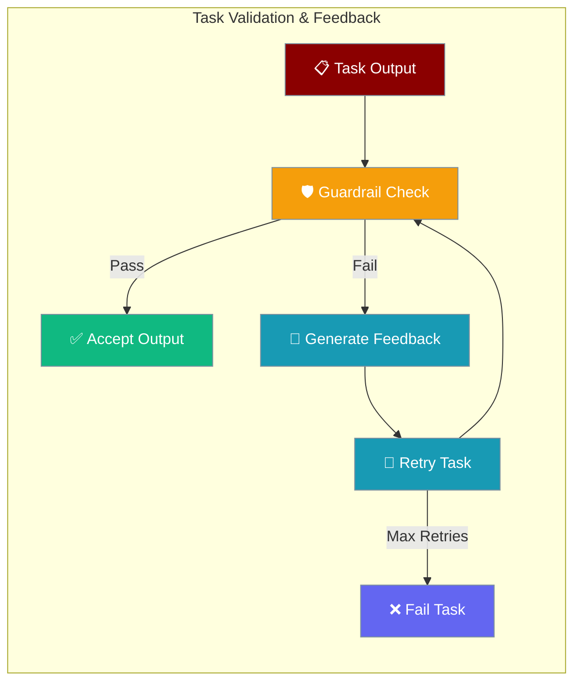

Validate task output with guardrails — failed checks retry automatically with feedback about what to fix.

```python
from praisonaiagents import Agent, Task, AgentTeam

def validate_word_count(output):
    words = len(str(output.raw).split())
    if words >= 100:
        return True, output
    return False, f"Article has {words} words, expected at least 100"

writer = Agent(name="Writer", instructions="Write clear articles")

task = Task(
    description="Write a 500-word article about AI",
    agent=writer,
    guardrails=validate_word_count,
    max_retries=3,
)

AgentTeam(agents=[writer], tasks=[task]).start()
```



## Quick Start

<Steps>
    <Step title="Install Package">
        First, install the PraisonAI Agents package:
        ```bash
        pip install praisonaiagents
        ```
    </Step>

    <Step title="Create Validation with Guardrails">
        The simplest way to add validation is using guardrails:
        ```python
        from praisonaiagents import AgentFlow, Task, WorkflowContext, StepResult
        from typing import Tuple, Any

        # Define validation function
        def validate_word_count(result: StepResult) -> Tuple[bool, str]:
            word_count = len(result.output.split())
            if word_count >= 100:
                return (True, None)
            else:
                return (False, f"Article has {word_count} words, expected at least 100")

        # Step handler
        def write_article(ctx: WorkflowContext) -> StepResult:
            feedback = ctx.variables.get("validation_feedback", "")
            # In real usage, call an agent here
            return StepResult(output="AI is transforming industries..." * 20)

        # Workflow with guardrail validation
        workflow = AgentFlow(
            steps=[
                Task(
                    name="write_article",
                    handler=write_article,
                    guardrails=validate_word_count,  # Validation function
                    max_retries=3  # Will retry up to 3 times if validation fails
                )
            ]
        )

        # Run the workflow
        result = workflow.start("Write a 500-word article about AI")
        print(result["output"])
        ```
    </Step>
</Steps>

## Validation Methods

PraisonAI offers two primary validation approaches:

### 1. Guardrails (Recommended)

Guardrails provide inline validation with automatic retry and feedback mechanisms.

#### Function-Based Guardrails

```python
from typing import Tuple, Any

def validate_output(task_output) -> Tuple[bool, Any]:
    """
    Validate task output
    Returns: (is_valid, feedback_or_output)
    """
    content = task_output.raw
    
    # Your validation logic
    if len(content) > 100:
        return True, task_output
    else:
        return False, "Content too short, needs at least 100 characters"

task = Task(
    description="Generate detailed analysis",
    agent=agent,
    guardrails=validate_output,
    max_retries=3
)
```

#### LLM-Based Guardrails

For complex validation that requires understanding:

```python
writer = Agent(
    name="Writer",
    role="Content creator",
    goal="Write high-quality content",
    llm="gpt-4"  # Required for LLM guardrails
)

task = Task(
    description="Write a technical blog post about quantum computing",
    expected_output="Technical blog post",
    agent=writer,
    guardrails="Validate that the blog post: 1) Is technically accurate, 2) Contains at least 3 code examples, 3) Has proper introduction and conclusion sections",
    max_retries=2
)
```

### 2. Decision-Based Validation Workflows

For complex validation flows with multiple validators:

```python
from praisonaiagents import Agent, Task, AgentTeam

# Create agents
writer = Agent(
    name="Writer",
    role="Content creator",
    goal="Write content"
)

validator = Agent(
    name="Quality Checker",
    role="Content validator",
    goal="Ensure content meets requirements"
)

# Writing task
write_task = Task(
    name="write_article",
    description="Write a 500-word article about AI ethics",
    expected_output="500-word article",
    agent=writer,
    is_start=True,
    next_tasks=["validate_article"]
)

# Validation task (decision type)
validate_task = Task(
    name="validate_article",
    description="Check if article is exactly 500 words and covers key ethical points. Respond with 'valid' if correct, 'retry' with specific feedback if not.",
    expected_output="Validation decision with feedback",
    agent=validator,
    task_type="decision",
    condition={
        "valid": [],  # End workflow if valid
        "retry": ["write_article"]  # Retry writing if invalid
    }
)

# Create workflow with guardrails
from praisonaiagents import AgentFlow, Task

workflow = AgentFlow(
    steps=[
        Task(
            name="write",
            handler=write_handler,
            guardrails=validate_output,
            max_retries=3
        )
    ]
)

result = workflow.start("Write article")
```

## How Validation Feedback Works

When validation fails, the system automatically:

1. **Captures the validation feedback** including:
   - The validation decision (e.g., "retry", "invalid")
   - Detailed feedback about what was wrong
   - The original output that failed
   - Which validator made the decision

2. **Creates typed validation outcome** (recommended):
   ```python
   # Tasks now expose typed validation outcome
   task.validation_outcome = AgentRunOutcome(
       status="invalid_output",  # Typed status
       error="Article has 450 words, needs exactly 500",
       elapsed_s=2.3,
       agent_name="validator",
       context={
           "validator_task": "validate_article",
           "validated_task": "write_article"
       }
   )
   ```

3. **Passes feedback to retry task** via context (legacy):
   ```python
   # The retry task also receives legacy dict format
   task.validation_feedback = {
       "validation_response": "retry",
       "validation_details": "Article has 450 words, needs exactly 500",
       "rejected_output": "The original article text...",
       "validator_task": "validate_article",
       "validated_task": "write_article"
   }
   ```

4. **Includes feedback in task context** for the next attempt

### Typed Validation Outcome (Recommended)

<Tip>
Decision tasks expose `task.validation_feedback` (dict) with retry details. Use it in the next attempt's prompt or handler.
</Tip>

Use the typed outcome for robust error handling:

```python
from praisonaiagents import Agent, Task, AgentTeam

# After validation task runs
validation_task = workflow.get_task("validate_article")

# Check typed outcome (recommended)
if validation_task.validation_outcome.status == "invalid_output":
    print(f"Validation failed: {validation_task.validation_outcome.error}")
    retry_with_specific_fixes()
elif validation_task.validation_outcome.status == "success":
    proceed_to_next_step()

# Legacy dict access still works
if validation_task.validation_feedback["validation_response"] == "retry":
    handle_legacy_retry()
```

## Complete Examples

### Example 1: Data Validation Pipeline

```python
from praisonaiagents import Agent, Task, AgentTeam
import json

# Validation function for JSON data
def validate_json_schema(task_output) -> Tuple[bool, Any]:
    try:
        data = json.loads(task_output.raw)
        
        # Check required fields
        required_fields = ["name", "email", "age"]
        missing_fields = [f for f in required_fields if f not in data]
        
        if missing_fields:
            return False, f"Missing required fields: {', '.join(missing_fields)}"
        
        # Validate data types
        if not isinstance(data["age"], int) or data["age"] < 0:
            return False, "Age must be a positive integer"
        
        if "@" not in data["email"]:
            return False, "Invalid email format"
        
        return True, task_output
        
    except json.JSONDecodeError:
        return False, "Output is not valid JSON"

# Create data processor agent
processor = Agent(
    name="Data Processor",
    role="JSON data generator",
    goal="Generate valid user data in JSON format"
)

# Task with validation
generate_task = Task(
    description="Generate user data for John Doe, age 30, email john@example.com",
    expected_output="Valid JSON with name, email, and age fields",
    agent=processor,
    guardrails=validate_json_schema,
    max_retries=3
)

# Run pipeline
pipeline = AgentTeam(
    agents=[processor],
    tasks=[generate_task]
)

result = pipeline.start()
```

### Example 2: Multi-Stage Validation

```python
from praisonaiagents import Agent, Task, AgentTeam

# Create specialized agents
writer = Agent(
    name="Technical Writer",
    role="Documentation writer",
    goal="Write comprehensive technical documentation"
)

tech_reviewer = Agent(
    name="Technical Reviewer",
    role="Technical accuracy validator",
    goal="Ensure technical accuracy"
)

style_checker = Agent(
    name="Style Checker",
    role="Writing style validator",
    goal="Ensure documentation follows style guide"
)

# Writing task
write_docs = Task(
    name="write_documentation",
    description="Write API documentation for the new authentication endpoint",
    expected_output="Complete API documentation",
    agent=writer,
    is_start=True,
    next_tasks=["technical_review"]
)

# Technical validation
tech_review = Task(
    name="technical_review",
    description="Validate technical accuracy. Check: correct HTTP methods, proper authentication flow, accurate error codes. Respond 'pass' or 'rewrite' with specific issues.",
    expected_output="Technical validation result",
    agent=tech_reviewer,
    task_type="decision",
    condition={
        "pass": ["style_check"],
        "rewrite": ["write_documentation"]
    }
)

# Style validation
style_check = Task(
    name="style_check",
    description="Check documentation style. Verify: consistent formatting, clear examples, proper headings. Respond 'approved' or 'revise' with style issues.",
    expected_output="Style validation result",
    agent=style_checker,
    task_type="decision",
    condition={
        "approved": [],  # Complete
        "revise": ["write_documentation"]
    }
)

# Create validation pipeline with Workflow
from praisonaiagents import AgentFlow, Task

validation_pipeline = AgentFlow(
    steps=[
        Task(name="write", handler=write_docs_handler),
        Task(name="tech", handler=tech_review_handler, guardrails=tech_validator),
        Task(name="style", handler=style_check_handler, guardrails=style_validator)
    ]
)

result = validation_pipeline.start("Write documentation")
```

### Example 3: Complex Validation with Context

```python
from praisonaiagents import Agent, Task, AgentTeam

# Validation that checks against requirements
class RequirementsValidator:
    def __init__(self, requirements):
        self.requirements = requirements
    
    def validate(self, task_output) -> Tuple[bool, Any]:
        content = task_output.raw
        missing_requirements = []
        
        for req in self.requirements:
            if req.lower() not in content.lower():
                missing_requirements.append(req)
        
        if missing_requirements:
            feedback = f"Missing requirements: {', '.join(missing_requirements)}"
            return False, feedback
        
        return True, task_output

# Create agent
analyst = Agent(
    name="Business Analyst",
    role="Requirements analyst",
    goal="Create comprehensive requirement documents"
)

# Define requirements
requirements = [
    "user authentication",
    "data encryption",
    "audit logging",
    "error handling",
    "performance metrics"
]

# Create validator instance
validator = RequirementsValidator(requirements)

# Task with custom validator
requirements_task = Task(
    description="Write security requirements for the new banking application",
    expected_output="Comprehensive security requirements document",
    agent=analyst,
    guardrails=validator.validate,
    max_retries=3
)

# Run task
agents = AgentTeam(
    agents=[analyst],
    tasks=[requirements_task]
)

result = agents.start()
```

## Validation Feedback in Action

When validation fails, agents receive both typed outcomes and legacy feedback:

**Typed Outcome (Recommended):**
```python
# Access typed validation outcome
task.validation_outcome = AgentRunOutcome(
    status="invalid_output",    # Typed status for exhaustive matching  
    error="Article word count is 450, expected 500",
    elapsed_s=1.2,
    agent_name="quality_checker",
    context={
        "failed_criteria": ["word_count"],
        "suggestions": "Add 50 more words to meet requirement"
    }
)

# Use typed status and helper methods
if task.validation_outcome.is_retryable():
    schedule_retry(task.validation_outcome.error)
```

**Legacy Dict Format (Backward Compatibility):**
```python
# Example of legacy validation feedback structure (still available)
task.validation_feedback = {
    "validation_response": "retry",
    "validation_details": {
        "reason": "Article word count is 450, expected 500",
        "suggestions": "Add 50 more words to meet requirement", 
        "failed_criteria": ["word_count"]
    },
    "rejected_output": "The original article content...",
    "validator_task": "validate_article",
    "validated_task": "write_article",
    "retry_count": 1
}

# Available from typed outcome's to_dict() method
typed_dict = task.validation_outcome.to_dict()
```

## Best Practices

<AccordionGroup>
<Accordion title="Clear validation criteria">
Define specific, measurable criteria and return actionable feedback strings when validation fails. Include examples of valid output in task descriptions.
</Accordion>

<Accordion title="Efficient validation">
Use function guardrails for simple checks (length, format, required fields). Reserve LLM guardrails (string prompts) for subjective quality checks.
</Accordion>

<Accordion title="Set reasonable retry limits">
Use `max_retries=3` as a default. Increase only when feedback is precise enough for the agent to self-correct.
</Accordion>

<Accordion title="Fail fast on structural errors">
Validate JSON schema, required sections, or word counts before expensive downstream tasks run.
</Accordion>
</AccordionGroup>

## Advanced Configuration

### Retry Configuration

```python
# Configure retry behavior
task = Task(
    description="Generate report",
    agent=agent,
    guardrails=validate_report,
    max_retries=3,
    retry_delay=2.0,  # seconds between retries (exponential backoff)
)
```

### Custom Feedback Formatting

```python
def validate_with_detailed_feedback(task_output) -> Tuple[bool, Any]:
    # Perform validation
    issues = []
    
    if len(task_output.raw) < 100:
        issues.append("Content too short")
    
    if "conclusion" not in task_output.raw.lower():
        issues.append("Missing conclusion section")
    
    if issues:
        feedback = {
            "status": "failed",
            "issues": issues,
            "suggestions": "Please address the above issues",
            "example": "See template for reference"
        }
        return False, json.dumps(feedback)
    
    return True, task_output
```

## Common Validation Patterns

### Word/Character Count

```python
def validate_length(min_words=100, max_words=500):
    def validator(task_output):
        word_count = len(task_output.raw.split())
        if min_words <= word_count <= max_words:
            return True, task_output
        else:
            return False, f"Word count {word_count} not in range {min_words}-{max_words}"
    return validator

task = Task(
    description="Write article",
    guardrails=validate_length(400, 600)
)
```

### Content Requirements

```python
def validate_content_includes(required_sections):
    def validator(task_output):
        content = task_output.raw.lower()
        missing = [s for s in required_sections if s.lower() not in content]
        
        if missing:
            return False, f"Missing sections: {', '.join(missing)}"
        return True, task_output
    return validator

task = Task(
    description="Write report",
    guardrails=validate_content_includes([
        "Executive Summary",
        "Methodology",
        "Results",
        "Conclusion"
    ])
)
```

## Troubleshooting

<AccordionGroup>
  <Accordion title="Validation always fails">
    - Check validation criteria are achievable
    - Verify feedback is clear and actionable
    - Test validation function separately
    - Increase max_retries if needed
</Accordion>

  <Accordion title="No feedback in retry">
    - Ensure using proper validation return format
    - Check workflow connections
    - Verify decision task conditions
    - Enable verbose mode for debugging
</Accordion>

  <Accordion title="Infinite validation loops">
    - Set appropriate max_retries
    - Implement retry counters
    - Add fallback conditions
    - Log validation attempts
</Accordion>
</AccordionGroup>

## Related

<CardGroup cols={2}>
  <Card title="Agent Run Outcomes" icon="circle-check" href="/docs/features/agent-run-outcomes">
    Typed validation outcomes and status handling
  </Card>
  <Card title="Guardrails" icon="shield" href="/docs/features/guardrails">
    Deep dive into the guardrails system
  </Card>
  <Card title="Task Retry Policy" icon="rotate-ccw" href="/docs/features/task-retry-policy">
    Per-task retry with exponential backoff
  </Card>
  <Card title="Workflows" icon="diagram-project" href="/docs/features/workflows">
    Complex workflow patterns
  </Card>
</CardGroup>