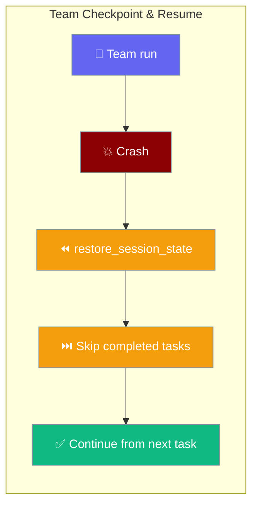
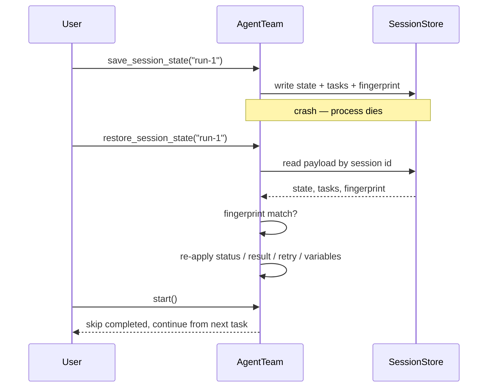
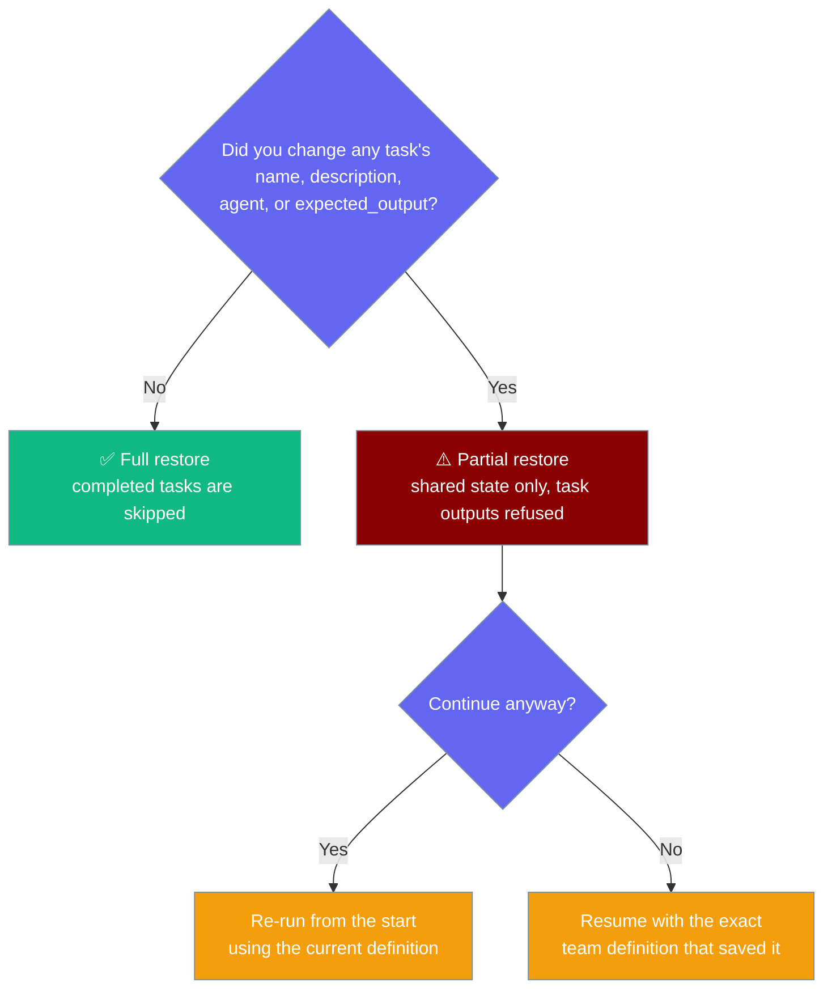

A team resumes where it stopped — completed tasks stay done, in-flight work continues, no re-runs.



Every code example below imports the same top-level classes:

```python
from praisonaiagents import Agent, AgentTeam, Task
```

## Quick Start

<Steps>
<Step title="Save state during a run">
Call `save_session_state` with a session id you can rebuild later. The durable write happens even with `memory=False`.

```python
from praisonaiagents import Agent, AgentTeam, Task

writer = Agent(name="Writer", instructions="Draft the section.", llm="gpt-4o")
editor = Agent(name="Editor", instructions="Polish the draft.", llm="gpt-4o")

team = AgentTeam(
    agents=[writer, editor],
    tasks=[
        Task(name="draft",  description="Write intro",   expected_output="200 words",  agent=writer),
        Task(name="polish", description="Edit for tone", expected_output="clean copy", agent=editor),
    ],
)

team.save_session_state("release-notes-run-1")   # durable, returns True on write
```
</Step>

<Step title="Resume after a crash">
Rebuild the *same* team with the *same* tasks, restore with the *same* session id, then `start()`. Completed tasks come back marked done, so the run picks up at the first not-done task.

```python
from praisonaiagents import Agent, AgentTeam, Task

writer = Agent(name="Writer", instructions="Draft the section.", llm="gpt-4o")
editor = Agent(name="Editor", instructions="Polish the draft.", llm="gpt-4o")

team = AgentTeam(
    agents=[writer, editor],
    tasks=[
        Task(name="draft",  description="Write intro",   expected_output="200 words",  agent=writer),
        Task(name="polish", description="Edit for tone", expected_output="clean copy", agent=editor),
    ],
)

team.restore_session_state("release-notes-run-1")   # completed tasks come back done
team.start()                                          # continues from the next task
```
</Step>
</Steps>

---

## How It Works

A team writes a durable checkpoint to the `SessionStore`, then reads it back on restore and re-applies per-task status before the run continues.



| Method | Signature | Returns |
|--------|-----------|---------|
| `save_session_state` | `save_session_state(session_id: str, include_memory: bool = True)` | `bool` — `True` when the durable write reached disk |
| `restore_session_state` | `restore_session_state(session_id: str)` | `bool` — `True` on any restore, including a partial one after a fingerprint mismatch |

---

## What the checkpoint carries

The payload records enough to skip completed work, not just the shared variables.

| Field | What it is | Why it's there |
|-------|-----------|----------------|
| `state` | The shared `_state` dict | Cross-task variables and shared context |
| `agents` | Agent display names | Diagnostics only |
| `process` | The team's process mode | Diagnostics only |
| `tasks` | Per-task snapshot: `status`, `result`, `retry_count`, `variables` | So the process layer skips completed tasks on resume |
| `tasks_fingerprint` | 16-char SHA-256 prefix of the task set | Prevents restoring a checkpoint from a *different* team onto positional task keys |

---

## Task-set fingerprint

Task keys inside a team are **positional** (`0, 1, 2, …`), not stable ids, so a checkpoint from a different team would restore by index and put task 3's output onto a *different* task 3 — a resume that looks successful and is silently wrong.

The fingerprint hashes each task, in sorted order, over:

- task id
- `task.name`
- the **full** `task.description` (not truncated — a late-in-string edit must still change the fingerprint)
- `task.agent.name` (or `display_name`)
- `task.expected_output`

On mismatch, the shared `state` is still restored — it is keyed by name and safe — but task outputs are **refused**. A warning is logged naming the session id, and `restore_session_state()` still returns `True` because the shared state came back. This asymmetry matters for callers: a `True` return does not guarantee task outputs were re-applied.



---

## JSON-safe serialisation

A single non-portable value (`datetime`, `set`, `bytes`, a custom object) inside a `dict` or `list` result would fail the JSON write and lose the whole checkpoint, so each field degrades on its own instead:

- A `TaskOutput` result is reduced to its `.raw` text before writing.
- A `dict` / `list` result carrying a nested non-JSON value falls back to its `str(...)` form.
- A `variables` dict that isn't JSON-safe falls back to `{}`.
- The rest of the checkpoint is written intact.

On restore, a checkpointed result string is rebuilt into a minimal `TaskOutput(description=..., raw=..., agent=..., output_format="RAW")`, so consumers reading `prev_task.result.raw` (workflow dependency context, routing decisions) keep working. If you inspect a checkpoint file by hand, expect `result` to be stored as a string when it originated from a `TaskOutput`.

---

## Best Practices

<AccordionGroup>
<Accordion title="Use a stable session_id you can rebuild">
The same string must be used to save and restore. Pick an id you can reconstruct after a crash — a run name, a job id — not a random value generated in-process.
</Accordion>

<Accordion title="Rebuild the team with the same task definitions">
A mismatched fingerprint refuses task outputs. The run won't crash — it will re-do the work from the start — but you lose the skip-on-resume benefit. Keep the task set identical to the one that saved the checkpoint.
</Accordion>

<Accordion title="Don't put un-picklable objects into task.variables">
A `variables` dict that isn't JSON-safe falls back to `{}` on save. Keep task variables to plain JSON types so they survive the round-trip.
</Accordion>

<Accordion title="Unknown task ids in the checkpoint are skipped, not invented">
A checkpoint task with no matching task in the current team is skipped. A partial mismatch cannot half-restore, so a resume can never look successful while silently running the wrong work.
</Accordion>

<Accordion title="For CLI-driven teams, use praisonai run agents.yaml --continue">
The CLI wraps this same API. See [YAML / Team Session Continuity](/features/yaml-session-continuity) — it calls `save_session_state` / `restore_session_state` under the hood.
</Accordion>
</AccordionGroup>

---

## Related

<CardGroup cols={2}>
<Card title="YAML / Team Session Continuity" icon="folder-tree" href="/features/yaml-session-continuity">
CLI-level `--continue` — uses this API under the hood.
</Card>
<Card title="Workflow Checkpoint & Resume" icon="rotate" href="/features/workflow-checkpoint-resume">
A different feature: markdown workflows via `WorkflowManager`, not `AgentTeam`.
</Card>
<Card title="Session Persistence" icon="database" href="/features/session-persistence">
The underlying `SessionStore` that holds the durable payload.
</Card>
<Card title="save_session_state Reference" icon="code" href="/sdk/reference/praisonaiagents/functions/AgentTeam-save_session_state">
Auto-generated SDK reference for the save API.
</Card>
</CardGroup>
