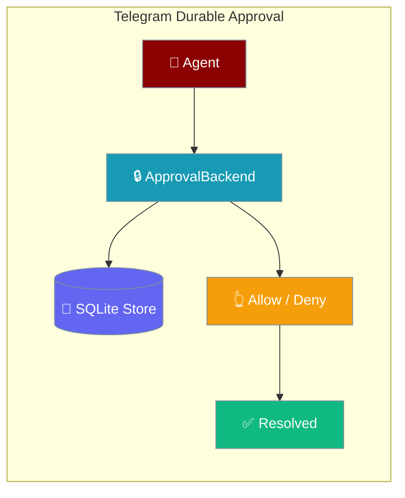
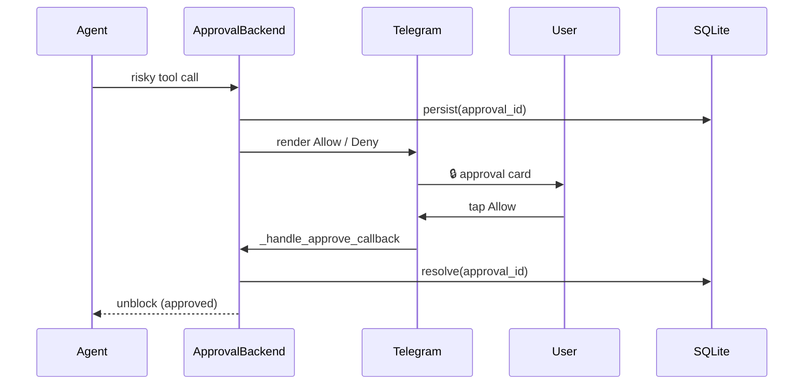
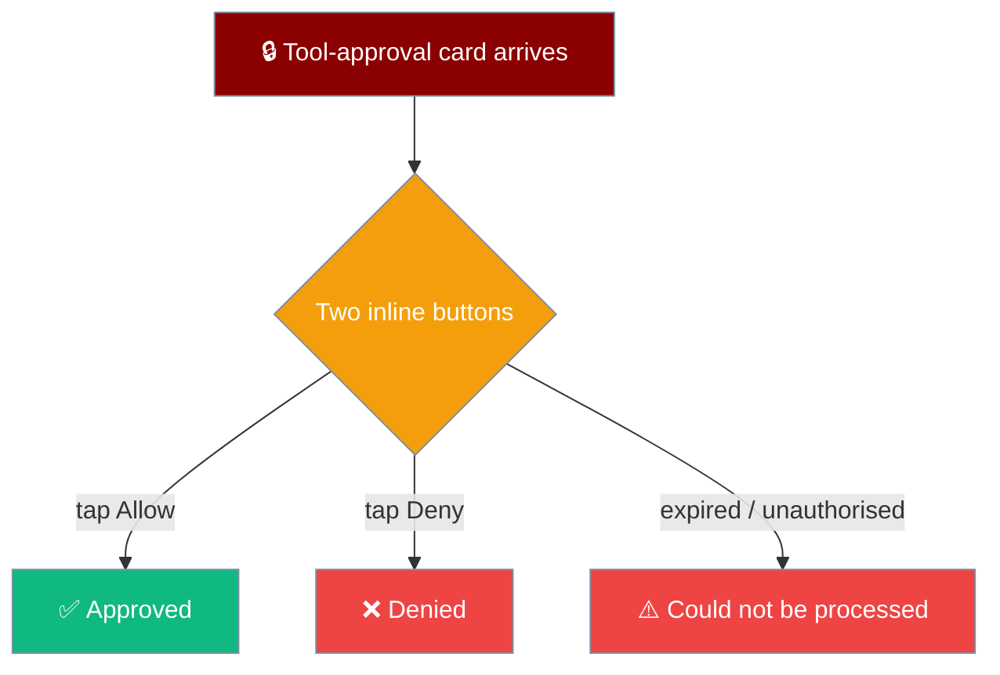

Set `approval="presentation"` on your Agent and run a Telegram bot — Allow/Deny buttons render on chat, resolve against a SQLite store, and survive a restart.



## Quick Start

<Steps>
<Step title="Auto-wire from the agent">
Set `approval="presentation"` on the Agent — the bot wires the durable backend to the chat on `start()`. No `register_approval_backend()` call needed.

```python
from praisonaiagents import Agent
from praisonai.bots import Bot

agent = Agent(
    name="Ops",
    instructions="Ask before destructive tools.",
    approval="presentation",   # durable + actor-authorised
    tools=["execute_command"],
)

bot = Bot("telegram", agent=agent)
bot.run()
```

The bot detects the backend on the agent and connects it to the chat automatically. Unknown decision values (anything outside `allow`, `deny`, `always`) are rejected before reaching the backend — fail closed.
</Step>

<Step title="Manual wire (advanced)">
Wire a backend you constructed separately — for tests or custom bootstrap where the backend is built by hand.

```python
from praisonaiagents import Agent
from praisonai.bots import Bot, PresentationApprovalBackend, ApprovalStore

backend = PresentationApprovalBackend(
    store=ApprovalStore(path="~/.praisonai/state/approvals.sqlite"),
    allowed_actors={"12345"},
)

agent = Agent(name="Ops", instructions="Ask before destructive tools.")
bot = Bot("telegram", agent=agent)
bot.register_approval_backend(backend, target="chat-1")
bot.run()
```

`register_approval_backend` gives the backend the channel renderer and target, then enables the `/approve` callback route.
</Step>
</Steps>

---

## How It Works

An agent tool call persists to the store, renders Allow/Deny buttons, and unblocks only when an authorised tap resolves the approval ID.



Each decision binds to an unguessable `approval_id`, not a message id — so a late tap after a redeploy still resolves against the SQLite store instead of falling through as an unhandled callback.

---

## What the user sees

The whole point of the feature — a non-developer only ever sees two buttons and a result.



The original message updates in place: **✅ Approved**, **❌ Denied**, or **⚠️ Approval could not be processed**.

---

## Configuration Options

Backend construction lives on the secure-backend page — this page only wires it to Telegram.

<CardGroup cols={2}>
<Card title="Secure Approval Backend" icon="code" href="/docs/features/approval-secure-backend">
  `PresentationApprovalBackend` constructor args (store, allowed_actors, timeout)
</Card>
<Card title="Durable Approvals" icon="database" href="/docs/features/durable-approvals">
  The SQLite `ApprovalStore` schema behind the durable path
</Card>
</CardGroup>

---

## Common Patterns

**Auto-wire from agent (default).** Set `approval="presentation"` on the Agent and run the bot — nothing else. This is the Quick Start path.

```python
agent = Agent(name="Ops", instructions="Ask first.", approval="presentation")
bot = Bot("telegram", agent=agent)
bot.run()
```

**Manual wire with explicit target.** Address approval buttons to a specific chat.

```python
bot.register_approval_backend(backend, target="chat-1")
```

**Restart drill.** Restart the bot; a late Allow tap on a message sent before the restart still resolves. `rehydrate_approvals()` runs automatically on `start()` and returns the restored count.

```python
restored = await bot.rehydrate_approvals()
print(f"Restored {restored} pending approvals")
```

---

## Best Practices

<AccordionGroup>
<Accordion title="Set PRAISONAI_APPROVAL_ACTORS">
The backend is fail-closed — set the actor allowlist so only your approvers can resolve a tap. Without it, no actor is authorised.
</Accordion>

<Accordion title="One transport per backend">
Do not pass an already-wired backend from Slack to Telegram. When a backend already owns a sender, the coupling guard leaves it untouched so it never renders on one transport while addressing another.
</Accordion>

<Accordion title="Prefer the auto-wire path">
Reserve `register_approval_backend()` for tests or custom bootstrap. In normal deployments, `approval="presentation"` on the Agent is enough.
</Accordion>

<Accordion title="Log the rehydrated count on startup">
`start()` logs how many approvals were restored. Watch that number to catch a broken deploy where pending approvals never come back.
</Accordion>
</AccordionGroup>

---

## Related

<CardGroup cols={2}>
<Card title="Durable Approvals" icon="database" href="/docs/features/durable-approvals">
  The SQLite store behind the durable path
</Card>
<Card title="Secure Approval Backend" icon="shield-check" href="/docs/features/approval-secure-backend">
  The `PresentationApprovalBackend` this page wires
</Card>
<Card title="Gateway Approval Durability" icon="plug" href="/docs/features/gateway-approval-durability">
  The gateway sibling of this transport wiring
</Card>
<Card title="Messaging Bots" icon="robot" href="/docs/features/messaging-bots">
  Deploy agents to chat channels
</Card>
</CardGroup>
