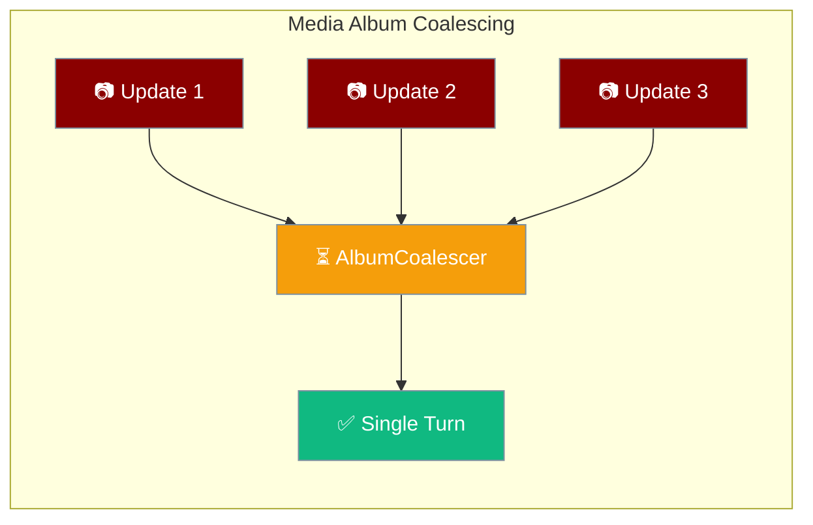
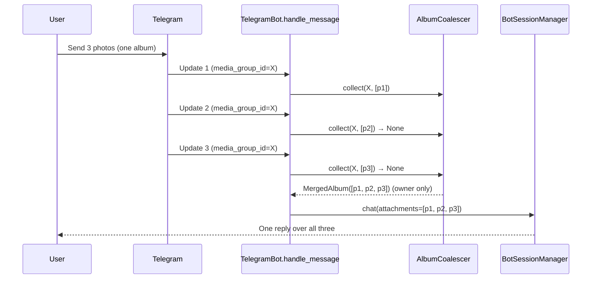

Set one config knob and a Telegram media album — several photos or files sent together — becomes **one multimodal agent turn** instead of one turn per part.



A user taps three receipt photos, hits Send once, and the agent sees all three attachments in a single turn — so it can compare them.

```python
from praisonaiagents import Agent
from praisonai.bots import Bot, BotConfig

agent = Agent(
    name="Receipt Reviewer",
    instructions="Compare the receipts the user sends and highlight the highest total.",
)

bot = Bot(
    "telegram",
    agent=agent,
    config=BotConfig(
        token="YOUR_BOT_TOKEN",
        metadata={"media_group_window_ms": 1200},  # enable album coalescing
    ),
)
bot.run()
```

## Quick Start

<Steps>
<Step title="Enable album coalescing">
Set `media_group_window_ms` on `BotConfig.metadata` to switch coalescing on. `0` (the default) keeps every album part as its own turn.

```python
from praisonaiagents import Agent
from praisonai.bots import Bot, BotConfig

agent = Agent(
    name="Receipt Reviewer",
    instructions="Compare the receipts the user sends.",
)

bot = Bot(
    "telegram",
    agent=agent,
    config=BotConfig(
        token="YOUR_BOT_TOKEN",
        metadata={"media_group_window_ms": 1200},  # 1200 ms silence = flush
    ),
)
bot.run()
```
</Step>

<Step title="Tune the album size cap">
Add `media_group_max` to bound how many attachments buffer per album before a forced flush. The default (`10`) covers a full Telegram album.

```python
bot = Bot(
    "telegram",
    agent=agent,
    config=BotConfig(
        token="YOUR_BOT_TOKEN",
        metadata={
            "media_group_window_ms": 1200,
            "media_group_max": 6,  # split larger albums into multiple turns
        },
    ),
)
bot.run()
```
</Step>
</Steps>

---

## How It Works

Telegram delivers each album part as its own update sharing one `media_group_id`. The coalescer buffers the parts and flushes them once, after a short window of silence.



Exactly one caller per group receives the `MergedAlbum`; sibling `handle_message` calls return `None` because their media was folded into the owner's turn. A standalone (non-album) message has no `media_group_id`, so it returns its own parts immediately — no debounce added.

| Behaviour | Result |
|-----------|--------|
| Album parts within window | Merged into one turn |
| Sibling updates | Return `None` (already folded in) |
| Standalone message | Returns immediately, unaffected |
| `media_group_max` reached | Forced flush, remaining parts start a new turn |
| Owning update cancelled | Buffered temp files reclaimed via `on_orphan` |

---

## Configuration Options

Both knobs live on `BotConfig.metadata` (passthrough — there are no dedicated `BotConfig` fields).

| Key | Type | Default | Description |
|-----|------|---------|-------------|
| `media_group_window_ms` | `int` | `0` | Debounce window in ms. `0` = feature off. `1200` covers Telegram's inter-part gap. |
| `media_group_max` | `int` | `10` | Max attachments buffered per album. Once reached, flush is forced immediately (bounds latency and memory). A full Telegram album fits under the default; lower it only on purpose. |

<Note>
The feature is **disabled by default** (`media_group_window_ms=0`). Existing deployments are unchanged until you set the knob.
</Note>

---

## Common Patterns

Compare several images in one turn:

```python
agent = Agent(
    name="Receipt Reviewer",
    instructions="Compare the receipts the user sends and highlight the highest total.",
)
# User: sends 3 receipt photos as one album, caption "which is highest?"
# Agent sees one turn with 3 attachments → "Receipt #2 has the highest total: $84.20."
```

Split very large albums into multiple turns by lowering the cap:

```python
bot = Bot(
    "telegram",
    agent=agent,
    config=BotConfig(
        token="YOUR_BOT_TOKEN",
        metadata={"media_group_window_ms": 1200, "media_group_max": 4},
    ),
)
# An album of 9 photos is delivered as turns of 4, 4, then 1.
bot.run()
```

---

## Best Practices

<AccordionGroup>
<Accordion title="Start with 1200 ms">
`1200` ms covers Telegram's typical inter-part gap. Raise it only if slow phones trickle parts across more than a second.
</Accordion>

<Accordion title="Keep media_group_max at the default">
The default (`10`) fits a full Telegram album. Lower it only when you have a specific latency or memory target — doing so splits a single album across multiple turns.
</Accordion>

<Accordion title="The feature is opt-in">
Clean deployments stay byte-for-byte unchanged until you set `media_group_window_ms`. Enabling it never affects existing behaviour for other message types.
</Accordion>

<Accordion title="Standalone media is unaffected">
Single-photo messages have no `media_group_id`, so they return immediately with no added debounce — album coalescing only touches multi-part albums.
</Accordion>
</AccordionGroup>

---

## Related

<CardGroup cols={2}>
<Card title="Messaging Bots" icon="robot" href="/features/messaging-bots">
  Inbound photos and documents handed to the agent's vision capability.
</Card>
<Card title="Telegram Durable Approval" icon="shield-check" href="/features/telegram-durable-approval">
  Another Telegram-specific gateway feature — durable Allow/Deny buttons.
</Card>
</CardGroup>
