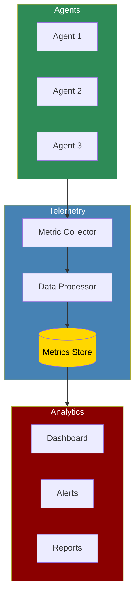

The Telemetry system provides real-time monitoring, performance tracking, and analytics for AI agent operations, enabling data-driven optimization and troubleshooting.

## Quick Start

<Steps>
    <Step title="Install Package">
        Install PraisonAI with telemetry support:
        ```bash
        pip install "praisonaiagents[telemetry]"
        ```
    </Step>

    <Step title="Configure Telemetry">
        Set up telemetry configuration:
        ```bash
        # For OpenTelemetry
        export OTEL_EXPORTER_OTLP_ENDPOINT="http://localhost:4317"
        export OTEL_SERVICE_NAME="praisonai-agents"
        
        # For built-in telemetry
        export PRAISONAI_TELEMETRY_ENABLED=true
        export PRAISONAI_TELEMETRY_ENDPOINT="http://localhost:8080"
        ```
    </Step>

    <Step title="Create Example">
        Create `telemetry_example.py`:
        ```python
        from praisonaiagents import Agent, Task, PraisonAIAgents
        from praisonaiagents.telemetry import Telemetry, MetricCollector

        # Initialize telemetry
        telemetry = Telemetry(
            enabled=True,
            endpoint="http://localhost:8080",
            service_name="my-ai-agents",
            export_interval=10  # seconds
        )

        # Create agents with telemetry
        research_agent = Agent(
            name="Researcher",
            role="Research Analyst",
            goal="Gather and analyze information",
            telemetry=telemetry
        )

        writer_agent = Agent(
            name="Writer",
            role="Content Creator",
            goal="Create content based on research",
            telemetry=telemetry
        )

        # Create monitored tasks
        research_task = Task(
            name="research_task",
            description="Research AI trends for 2024",
            expected_output="Comprehensive research report",
            agent=research_agent,
            monitor_performance=True
        )

        writing_task = Task(
            name="writing_task",
            description="Write article based on research",
            expected_output="Published article",
            agent=writer_agent,
            monitor_performance=True
        )

        # Create workflow with telemetry
        workflow = PraisonAIAgents(
            agents=[research_agent, writer_agent],
            tasks=[research_task, writing_task],
            telemetry_config={
                "track_token_usage": True,
                "track_latency": True,
                "track_errors": True,
                "track_cost": True,
                "custom_metrics": {
                    "task_complexity": "gauge",
                    "quality_score": "histogram"
                }
            }
        )

        # Add custom metrics
        @telemetry.track_metric("task_complexity")
        def calculate_complexity(task):
            # Custom logic to calculate task complexity
            return len(task.description) * 0.1

        print("Starting workflow with telemetry...")
        results = workflow.start()

        # Access telemetry data
        metrics = telemetry.get_metrics()
        print(f"\nPerformance Metrics:")
        print(f"Total tokens used: {metrics['total_tokens']}")
        print(f"Average latency: {metrics['avg_latency']}ms")
        print(f"Success rate: {metrics['success_rate']}%")
        print(f"Total cost: ${metrics['total_cost']}")

        # Generate performance report
        telemetry.generate_report("performance_report.html")
        ```
    </Step>

    <Step title="View Metrics">
        Access the telemetry dashboard:
        ```bash
        # Start the telemetry server (if using built-in)
        praisonai telemetry start

        # View dashboard at http://localhost:8080
        ```
    </Step>
</Steps>

## Core Metrics

<CardGroup cols={2}>
  <Card title="Performance Metrics" icon="gauge">
    - Task execution time
    - Agent response latency
    - Token usage per task
    - Success/failure rates
  </Card>
  <Card title="Resource Metrics" icon="microchip">
    - Memory usage
    - API call counts
    - Model utilization
    - Cost tracking
  </Card>
  <Card title="Quality Metrics" icon="star">
    - Output quality scores
    - Task completion rates
    - Error frequencies
    - Retry attempts
  </Card>
  <Card title="Business Metrics" icon="chart-pie">
    - Cost per task
    - ROI calculations
    - Throughput rates
    - SLA compliance
  </Card>
</CardGroup>

## Telemetry Configuration

### Basic Configuration

```python
telemetry_config = {
    # Core settings
    "enabled": True,
    "endpoint": "http://localhost:8080",
    "export_interval": 30,  # seconds
    "batch_size": 100,
    
    # Metric collection
    "metrics": {
        "latency": {
            "enabled": True,
            "buckets": [50, 100, 200, 500, 1000, 2000, 5000]
        },
        "tokens": {
            "enabled": True,
            "track_prompt_tokens": True,
            "track_completion_tokens": True
        },
        "errors": {
            "enabled": True,
            "include_stacktrace": False
        },
        "cost": {
            "enabled": True,
            "currency": "USD",
            "include_breakdown": True
        }
    },
    
    # Data retention
    "retention": {
        "raw_metrics": "7d",
        "aggregated_metrics": "30d",
        "reports": "90d"
    }
}
```

### OpenTelemetry Integration

```python
from opentelemetry import trace, metrics
from opentelemetry.exporter.otlp.proto.grpc import (
    trace_exporter,
    metric_exporter
)

# Configure OpenTelemetry
def setup_opentelemetry():
    # Trace provider
    trace.set_tracer_provider(
        TracerProvider(
            resource=Resource.create({
                "service.name": "praisonai-agents",
                "service.version": "1.0.0"
            })
        )
    )
    
    # Add OTLP exporter
    otlp_exporter = trace_exporter.OTLPSpanExporter(
        endpoint="localhost:4317",
        insecure=True
    )
    
    trace.get_tracer_provider().add_span_processor(
        BatchSpanProcessor(otlp_exporter)
    )
    
    # Metric provider
    metrics.set_meter_provider(
        MeterProvider(
            resource=Resource.create({
                "service.name": "praisonai-agents"
            }),
            metric_readers=[
                PeriodicExportingMetricReader(
                    metric_exporter.OTLPMetricExporter(
                        endpoint="localhost:4317"
                    )
                )
            ]
        )
    )

# Use with PraisonAI
telemetry = Telemetry(
    provider="opentelemetry",
    setup_function=setup_opentelemetry
)
```

## Custom Metrics

### Defining Custom Metrics

```python
from praisonaiagents.telemetry import MetricType, CustomMetric

# Define custom metrics
custom_metrics = {
    "agent_confidence": CustomMetric(
        type=MetricType.GAUGE,
        unit="percentage",
        description="Agent confidence in response"
    ),
    "task_complexity": CustomMetric(
        type=MetricType.HISTOGRAM,
        unit="score",
        description="Complexity score of tasks",
        buckets=[1, 2, 5, 10, 20, 50, 100]
    ),
    "knowledge_queries": CustomMetric(
        type=MetricType.COUNTER,
        unit="count",
        description="Number of knowledge base queries"
    )
}

# Register metrics
telemetry.register_metrics(custom_metrics)

# Track custom metrics in agents
class MonitoredAgent(Agent):
    def execute_task(self, task):
        # Track task complexity
        complexity = self.calculate_complexity(task)
        telemetry.record_metric("task_complexity", complexity)
        
        # Execute task
        result = super().execute_task(task)
        
        # Track confidence
        confidence = self.calculate_confidence(result)
        telemetry.record_metric("agent_confidence", confidence)
        
        return result
```

### Advanced Metric Collection

```python
# Automatic metric collection with decorators
@telemetry.track_performance
@telemetry.track_tokens
@telemetry.track_cost
def process_document(document):
    # Your processing logic
    return processed_result

# Manual metric collection
with telemetry.track_operation("document_processing") as tracker:
    result = process_document(doc)
    tracker.add_attribute("document_size", len(doc))
    tracker.add_attribute("processing_type", "nlp")
    tracker.set_status("success")
```

## Monitoring Dashboard

### Built-in Dashboard Features

<CardGroup cols={2}>
  <Card title="Real-time Metrics" icon="clock">
    Live updates of agent performance and system health.
  </Card>
  <Card title="Historical Analysis" icon="chart-area">
    Trend analysis and pattern detection over time.
  </Card>
  <Card title="Alert Management" icon="bell">
    Configurable alerts for performance thresholds.
  </Card>
  <Card title="Cost Analytics" icon="dollar-sign">
    Detailed cost breakdown and optimization insights.
  </Card>
</CardGroup>

### Dashboard Configuration

```python
# Configure dashboard
dashboard_config = {
    "refresh_interval": 5,  # seconds
    "default_timerange": "1h",
    "panels": [
        {
            "title": "Agent Performance",
            "type": "graph",
            "metrics": ["latency", "success_rate"],
            "position": {"x": 0, "y": 0, "w": 6, "h": 4}
        },
        {
            "title": "Token Usage",
            "type": "gauge",
            "metric": "token_usage_rate",
            "position": {"x": 6, "y": 0, "w": 3, "h": 4}
        },
        {
            "title": "Cost Tracking",
            "type": "stat",
            "metric": "total_cost",
            "position": {"x": 9, "y": 0, "w": 3, "h": 4}
        }
    ],
    "alerts": [
        {
            "name": "High Latency",
            "condition": "avg(latency) > 5000",
            "window": "5m",
            "severity": "warning"
        },
        {
            "name": "Error Rate",
            "condition": "error_rate > 0.1",
            "window": "10m",
            "severity": "critical"
        }
    ]
}

# Apply configuration
telemetry.configure_dashboard(dashboard_config)
```

## Performance Optimization

### Using Telemetry for Optimization

```python
# Analyze performance bottlenecks
analyzer = telemetry.create_analyzer()

# Get performance insights
insights = analyzer.analyze_performance(
    timerange="24h",
    group_by=["agent", "task_type"]
)

print("Performance Insights:")
for insight in insights:
    print(f"- {insight.description}")
    print(f"  Impact: {insight.impact}")
    print(f"  Recommendation: {insight.recommendation}")

# Apply automatic optimizations
optimizer = telemetry.create_optimizer()
optimizations = optimizer.suggest_optimizations(insights)

for opt in optimizations:
    if opt.confidence > 0.8:
        print(f"Applying optimization: {opt.description}")
        opt.apply()
```

### Cost Optimization

```python
# Cost analysis
cost_analyzer = telemetry.create_cost_analyzer()

# Get cost breakdown
breakdown = cost_analyzer.get_breakdown(
    period="7d",
    group_by=["model", "agent", "task"]
)

# Find cost optimization opportunities
opportunities = cost_analyzer.find_savings_opportunities()

for opp in opportunities:
    print(f"Potential saving: ${opp.estimated_savings}")
    print(f"Action: {opp.action}")
    print(f"Impact on quality: {opp.quality_impact}")
```

## Alerting System

```python
# Configure alerts
alert_config = {
    "channels": {
        "email": {
            "enabled": True,
            "recipients": ["team@example.com"]
        },
        "slack": {
            "enabled": True,
            "webhook": "https://hooks.slack.com/..."
        },
        "pagerduty": {
            "enabled": False,
            "integration_key": "..."
        }
    },
    "rules": [
        {
            "name": "High Error Rate",
            "condition": "error_rate > 0.05",
            "duration": "5m",
            "severity": "critical",
            "channels": ["email", "slack"]
        },
        {
            "name": "Cost Threshold",
            "condition": "hourly_cost > 100",
            "duration": "1h",
            "severity": "warning",
            "channels": ["email"]
        }
    ]
}

# Apply alert configuration
telemetry.configure_alerts(alert_config)

# Custom alert handler
@telemetry.on_alert
def handle_alert(alert):
    if alert.severity == "critical":
        # Take immediate action
        workflow.pause()
        notify_oncall_team(alert)
```

## Data Export & Integration

<Tabs>
  <Tab title="Export Formats">
    ```python
    # Export telemetry data
    exporter = telemetry.create_exporter()

    # Export to different formats
    exporter.export_csv(
        "metrics_export.csv",
        metrics=["latency", "tokens", "cost"],
        timerange="7d"
    )

    exporter.export_json(
        "telemetry_data.json",
        include_raw=True,
        include_aggregated=True
    )

    # Export for specific analysis tools
    exporter.export_prometheus(
        endpoint="http://prometheus:9090/metrics"
    )

    exporter.export_grafana(
        dashboard_json="grafana_dashboard.json"
    )
    ```
  </Tab>
  
  <Tab title="Third-party Integration">
    ```python
    # Integrate with monitoring platforms
    integrations = {
        "datadog": {
            "api_key": "...",
            "app_key": "...",
            "tags": ["env:prod", "team:ai"]
        },
        "newrelic": {
            "license_key": "...",
            "app_name": "PraisonAI-Agents"
        },
        "cloudwatch": {
            "region": "us-east-1",
            "namespace": "PraisonAI/Agents"
        }
    }

    # Enable integrations
    for platform, config in integrations.items():
        telemetry.enable_integration(platform, config)
    ```
  </Tab>
</Tabs>

## Best Practices

<AccordionGroup>
  <Accordion title="Metric Selection">
    Choose metrics that provide actionable insights:
    ```python
    essential_metrics = {
        "business": ["cost_per_task", "success_rate", "roi"],
        "performance": ["p95_latency", "throughput", "error_rate"],
        "quality": ["output_quality_score", "retry_rate"],
        "resource": ["token_efficiency", "api_quota_usage"]
    }
    ```
  </Accordion>

  <Accordion title="Data Retention">
    Balance storage costs with analysis needs:
    ```python
    retention_policy = {
        "raw_metrics": {
            "high_frequency": "24h",  # 1-second granularity
            "standard": "7d",         # 1-minute granularity
            "aggregated": "90d"       # 1-hour granularity
        },
        "traces": {
            "all": "48h",
            "errors_only": "30d",
            "samples": "90d"  # 10% sampling
        }
    }
    ```
  </Accordion>

  <Accordion title="Performance Impact">
    Minimize telemetry overhead:
    ```python
    # Use sampling for high-volume operations
    telemetry.configure_sampling({
        "default": 0.1,  # 10% sampling
        "errors": 1.0,   # 100% for errors
        "slow_requests": 1.0,  # 100% for slow requests
        "threshold_ms": 1000
    })
    ```
  </Accordion>
</AccordionGroup>

## Troubleshooting

<CardGroup cols={2}>
  <Card title="Missing Metrics" icon="triangle-exclamation">
    If metrics aren't appearing:
    - Check telemetry is enabled
    - Verify endpoint connectivity
    - Review metric configuration
    - Check export intervals
  </Card>

  <Card title="Performance Overhead" icon="weight">
    If telemetry impacts performance:
    - Enable sampling
    - Reduce metric granularity
    - Use async exporters
    - Optimize batch sizes
  </Card>
</CardGroup>

## Next Steps

<CardGroup cols={2}>
  <Card title="Monitoring" icon="desktop" href="../monitoring/agentops">
    Explore AgentOps integration for advanced monitoring
  </Card>
  <Card title="Cost Tracking" icon="dollar-sign" href="../monitoring/latency-tracking">
    Learn about detailed latency and cost tracking
  </Card>
</CardGroup>

<Note>
  Telemetry data is crucial for optimizing AI agent performance. Regular analysis of metrics helps identify bottlenecks, reduce costs, and improve overall system reliability.
</Note>