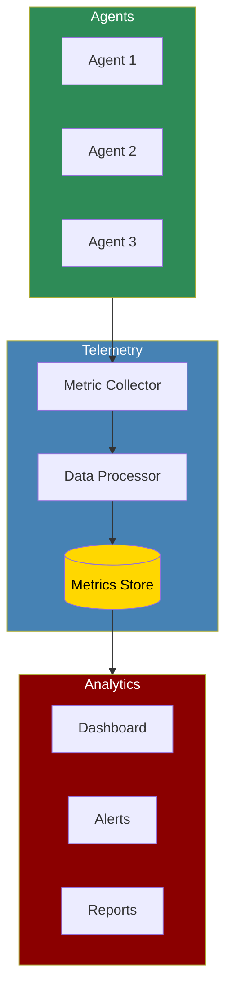

The Telemetry system provides minimal, privacy-focused usage tracking for PraisonAI Agents. It collects only anonymous metrics about feature usage, with no personal data, prompts, or responses tracked. Telemetry is enabled by default but can be easily disabled via environment variables.

## Quick Start

<Steps>
    <Step title="Install Package">
        Install PraisonAI Agents:
        ```bash
        pip install praisonaiagents
        ```
        Note: Telemetry is included by default and automatically enabled unless disabled.
    </Step>

    <Step title="Simple Example">
        Create `simple_agent_example.py`:
        ```python
        from praisonaiagents import Agent, Task, PraisonAIAgents

        # Create a simple agent - telemetry is automatically enabled
        agent = Agent(
            name="Assistant",
            role="Helper",
            goal="Assist with tasks",
            instructions="You are a helpful assistant."
        )

        # Create a task
        task = Task(
            description="Write a haiku about AI",
            expected_output="A three-line haiku poem",
            agent=agent
        )

        # Create and run workflow - telemetry tracks automatically
        workflow = PraisonAIAgents(agents=[agent], tasks=[task])
        result = workflow.start()
        
        print(result)
        ```
    </Step>

    <Step title="Check Telemetry (Optional)">
        Access telemetry metrics programmatically:
        ```python
        from praisonaiagents.telemetry import get_telemetry

        # Get the telemetry instance
        telemetry = get_telemetry()

        # Check metrics (stored in memory)
        metrics = telemetry.get_metrics()
        print(f"Agent executions: {metrics['agent_executions']}")
        print(f"Task completions: {metrics['task_completions']}")
        print(f"Tool calls: {metrics['tool_calls']}")
        print(f"Errors: {metrics['errors']}")
        ```
    </Step>

    <Step title="Disable Telemetry (Optional)">
        To disable telemetry, set any of these environment variables before running:
        ```bash
        export PRAISONAI_TELEMETRY_DISABLED=true
        # or
        export PRAISONAI_DISABLE_TELEMETRY=true
        # or
        export DO_NOT_TRACK=true
        ```
    </Step>
</Steps>

## What is Tracked

PraisonAI telemetry collects only minimal, anonymous metrics:

<CardGroup cols={2}>
  <Card title="Usage Metrics" icon="chart-line">
    - Number of agent executions
    - Number of task completions
    - Tool usage (names only)
    - Error types (no messages)
  </Card>
  <Card title="Environment Info" icon="desktop">
    - Framework version
    - Python version
    - Operating system type
    - Anonymous session ID
  </Card>
</CardGroup>

<Warning>
  **Privacy Guarantee**: No personal data, prompts, responses, or user content is ever collected. Only anonymous usage metrics are tracked.
</Warning>

## Disabling Telemetry

Telemetry can be disabled in multiple ways:

### Environment Variables (Recommended)

```bash
# Set any of these before running your code
export PRAISONAI_TELEMETRY_DISABLED=true
export PRAISONAI_DISABLE_TELEMETRY=true
export DO_NOT_TRACK=true  # Universal standard
```

### Programmatically

```python
# Option 1: Disable before importing
from praisonaiagents.telemetry import disable_telemetry
disable_telemetry()

# Then import and use normally
from praisonaiagents import Agent, Task, PraisonAIAgents

# Option 2: Disable at runtime
from praisonaiagents.telemetry import get_telemetry
telemetry = get_telemetry()
telemetry.enabled = False
```

## How Telemetry Works

Telemetry in PraisonAI is automatic and minimal:

1. **Automatic Integration**: When you create agents and run workflows, telemetry is automatically integrated
2. **Anonymous Tracking**: Only counts and types are tracked, never content
3. **Memory Storage**: Currently metrics are only stored in memory (no network calls)
4. **Session-based**: Each run gets a unique anonymous session ID
5. **Privacy-first**: Respects DO_NOT_TRACK standard and multiple opt-out methods

## Advanced Usage

### Accessing Telemetry Data

```python
from praisonaiagents.telemetry import get_telemetry

# Get the global telemetry instance
telemetry = get_telemetry()

# Check if telemetry is enabled
if telemetry.enabled:
    print("Telemetry is active")

# Get current metrics
metrics = telemetry.get_metrics()
print(f"Total agent executions: {metrics['agent_executions']}")
print(f"Total task completions: {metrics['task_completions']}")
print(f"Total tool calls: {metrics['tool_calls']}")
print(f"Total errors: {metrics['errors']}")

# Get session info
print(f"Session ID: {telemetry.session_id}")
print(f"Environment: {telemetry._environment}")
```

### Manual Tracking (Advanced)

```python
from praisonaiagents.telemetry import get_telemetry

# Get telemetry instance
telemetry = get_telemetry()

# Manually track events (usually automatic)
telemetry.track_agent_execution(agent_name="MyAgent", success=True)
telemetry.track_task_completion(task_name="MyTask", success=True)
telemetry.track_tool_usage(tool_name="web_search", success=True)
telemetry.track_error(error_type="ValueError")

# Track feature usage
telemetry.track_feature_usage("custom_feature")
```

## Integration with External Services

### PostHog Integration (Coming Soon)

PraisonAI telemetry includes built-in PostHog support for anonymous analytics:

```python
# PostHog integration is automatic when available
# Metrics are sent anonymously with session IDs only
# No configuration needed - it just works

# To verify PostHog is available:
try:
    import posthog
    print("PostHog integration available")
except ImportError:
    print("PostHog not installed - metrics stored locally only")
```

### AgentOps Integration

For more advanced monitoring, you can use AgentOps alongside the built-in telemetry:

```python
import agentops
from praisonaiagents import Agent, Task, PraisonAIAgents

# Initialize AgentOps
agentops.init(api_key="your-api-key")

# Use PraisonAI normally - both telemetry systems work together
agent = Agent(
    name="DataAnalyst",
    role="Analyst",
    goal="Analyze data"
)

task = Task(
    description="Analyze sales trends",
    agent=agent
)

workflow = PraisonAIAgents(agents=[agent], tasks=[task])
result = workflow.start()

# End AgentOps session
agentops.end_session("Success")
```

## Backward Compatibility

The telemetry module maintains compatibility with the previous interface:

```python
from praisonaiagents.telemetry import TelemetryCollector

# Legacy interface still works
collector = TelemetryCollector()
collector.start()

with collector.trace_agent_execution("MyAgent"):
    # Agent execution code
    pass

collector.stop()
```

## Best Practices

<AccordionGroup>
  <Accordion title="Privacy First">
    - Telemetry is designed to be minimal and privacy-focused
    - No personal data, prompts, or responses are ever collected
    - Always respect user preferences for tracking
    - Use environment variables for easy opt-out
  </Accordion>

  <Accordion title="Performance Impact">
    - Telemetry has minimal overhead
    - Metrics are stored in memory only (no network calls in current version)
    - Automatic integration means no extra code needed
    - PostHog integration (when available) uses async mode to prevent blocking
  </Accordion>

  <Accordion title="Development vs Production">
    ```python
    # Development - verbose metrics
    import os
    os.environ['LOGLEVEL'] = 'DEBUG'
    
    # Production - disable if needed
    os.environ['PRAISONAI_TELEMETRY_DISABLED'] = 'true'
    ```
  </Accordion>
</AccordionGroup>

## Troubleshooting

<CardGroup cols={2}>
  <Card title="Telemetry Not Working" icon="triangle-exclamation">
    If telemetry isn't tracking:
    - Check environment variables aren't disabling it
    - Verify telemetry.enabled is True
    - Check debug logs with LOGLEVEL=DEBUG
    - Ensure you're using the latest version
  </Card>

  <Card title="Privacy Concerns" icon="shield">
    If you have privacy concerns:
    - Review what's tracked (only anonymous metrics)
    - Disable telemetry via environment variables
    - Check the source code for transparency
    - No network calls in current implementation
  </Card>
</CardGroup>

## Next Steps

<CardGroup cols={2}>
  <Card title="Monitoring" icon="desktop" href="../monitoring/agentops">
    Explore AgentOps integration for advanced monitoring
  </Card>
  <Card title="Cost Tracking" icon="dollar-sign" href="../monitoring/latency-tracking">
    Learn about detailed latency and cost tracking
  </Card>
</CardGroup>

<Note>
  PraisonAI telemetry is designed to be minimal, privacy-focused, and helpful. It collects only anonymous usage metrics to help improve the framework while respecting user privacy. Telemetry can be easily disabled at any time.
</Note>