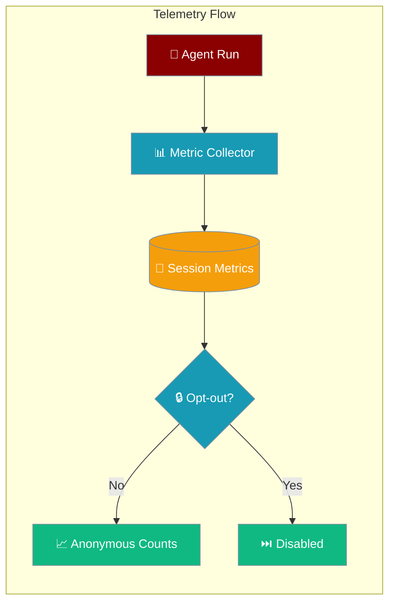

Telemetry tracks anonymous usage counts when agents run — no prompts, responses, or personal data.

```python
from praisonaiagents import Agent

agent = Agent(name="Assistant", instructions="You are helpful.")
agent.start("Hello")  # telemetry counts this run automatically
```


```mermaid
graph LR
    subgraph "Telemetry Flow"
        Agent[🤖 Agent Run] --> Collector[📊 Metric Collector]
        Collector --> Store[(💾 Session Metrics)]
        Store --> OptOut{🔒 Opt-out?}
        OptOut -->|No| Count[📈 Anonymous Counts]
        OptOut -->|Yes| Skip[⏭️ Disabled]
    end

    classDef agent fill:#8B0000,stroke:#7C90A0,color:#fff
    classDef tool fill:#189AB4,stroke:#7C90A0,color:#fff
    classDef store fill:#F59E0B,stroke:#7C90A0,color:#fff
    classDef result fill:#10B981,stroke:#7C90A0,color:#fff

    class Agent agent
    class Collector tool
    class Store store
    class Count,Skip result
    class OptOut tool
    classDef agent fill:#8B0000,color:#fff
    classDef tool fill:#189AB4,color:#fff
```

## Quick Start

<Steps>
    <Step title="Install Package">
        Install PraisonAI Agents:
        ```bash
        pip install praisonaiagents
        ```
        Note: Telemetry is included by default and automatically enabled unless disabled.
    </Step>

    <Step title="Simple Example">
        Create `simple_agent_example.py`:
        ```python
        from praisonaiagents import Agent, Task, AgentTeam

        # Create a simple agent - telemetry is automatically enabled
        agent = Agent(
            name="Assistant",
            role="Helper",
            goal="Assist with tasks",
            instructions="You are a helpful assistant."
        )

        # Create a task
        task = Task(
            description="Write a haiku about AI",
            expected_output="A three-line haiku poem",
            agent=agent
        )

        # Create and run workflow - telemetry tracks automatically
        workflow = AgentTeam(agents=[agent], tasks=[task])
        result = workflow.start()
        
        print(result)
        ```
    </Step>

    <Step title="Check Telemetry (Optional)">
        Access telemetry metrics programmatically:
        ```python
        from praisonaiagents import get_telemetry

        telemetry = get_telemetry()

        # Check metrics (stored in memory)
        metrics = telemetry.get_metrics()
        print(f"Agent executions: {metrics['agent_executions']}")
        print(f"Task completions: {metrics['task_completions']}")
        print(f"Tool calls: {metrics['tool_calls']}")
        print(f"Errors: {metrics['errors']}")
        ```
    </Step>

    <Step title="Disable Telemetry (Optional)">
        To disable telemetry, set any of these environment variables before running:
        ```bash
        export PRAISONAI_TELEMETRY_DISABLED=true
        # or
        export PRAISONAI_DISABLE_TELEMETRY=true
        # or
        export DO_NOT_TRACK=true
        ```
    </Step>

    <Step title="Enable Telemetry Explicitly (Optional)">
        To enable telemetry via environment variable (required since telemetry is off by default):
        ```bash
        export PRAISONAI_TELEMETRY_ENABLED=true
        # or
        export PRAISONAI_PERFORMANCE_ENABLED=true
        ```
    </Step>
</Steps>

## What is Tracked

PraisonAI telemetry collects only minimal, anonymous metrics:

<CardGroup cols={2}>
  <Card title="Usage Metrics" icon="chart-line">
    - Number of agent executions
    - Number of task completions
    - Tool usage (names only)
    - Error types (no messages)
  </Card>
  <Card title="Environment Info" icon="desktop">
    - Framework version
    - Python version
    - Operating system type
    - Anonymous session ID
  </Card>
</CardGroup>

<Warning>
  **Privacy Guarantee**: No personal data, prompts, responses, or user content is ever collected. Only anonymous usage metrics are tracked.
</Warning>

## Disabling Telemetry

Telemetry can be disabled in multiple ways:

### Environment Variables (Recommended)

**Opt-out (any of these disables telemetry):**
```bash
export PRAISONAI_TELEMETRY_DISABLED=true
export PRAISONAI_DISABLE_TELEMETRY=true
export PRAISONAI_PERFORMANCE_DISABLED=true
export DO_NOT_TRACK=true  # Universal standard
export OTEL_SDK_DISABLED=true  # OpenTelemetry standard
```

**Opt-in (required since telemetry is off by default):**
```bash
export PRAISONAI_TELEMETRY_ENABLED=true
# or
export PRAISONAI_PERFORMANCE_ENABLED=true
```

<Note>
**CLI Integration:** As of PR #1552, PraisonAI respects pre-existing `OTEL_SDK_DISABLED` environment variables instead of overwriting them. Telemetry initialization now runs from `cli.PraisonAI.__init__` (explicit call to `_ensure_telemetry_defaults()`), not from the lazy `__getattr__` hook in `praisonai/__init__.py`. This means importing `praisonai` no longer touches the filesystem or `os.environ`; only constructing `PraisonAI(...)` does. Initialization is also thread-safe (uses `threading.Lock`).
</Note>

### Enabling / Disabling Telemetry Programmatically

```python
from praisonaiagents import enable_telemetry, disable_telemetry

# Turn telemetry on (no-op if an env opt-out is set)
enable_telemetry()

# Turn telemetry off — instrumentation hooks stop installing
disable_telemetry()
```

<Note>
**Precedence:** Explicit environment opt-out always wins. Setting `DO_NOT_TRACK=true` (or any of the `*_DISABLED` flags above) makes `enable_telemetry()` a no-op. Otherwise, the most recent programmatic call decides the state. With neither set, telemetry is off by default until `enable_telemetry()` is called or `PRAISONAI_TELEMETRY_ENABLED=true` / `PRAISONAI_PERFORMANCE_ENABLED=true` is exported.
</Note>

### Langfuse + opt-out coexistence

Users now have full control over telemetry settings when using Langfuse for other applications:

```bash
# User has Langfuse credentials for an UNRELATED app, but wants OTEL off in PraisonAI:
export LANGFUSE_PUBLIC_KEY=...
export OTEL_SDK_DISABLED=true     # PraisonAI will now respect this
```

This addresses the issue where PraisonAI previously overwrote explicit user opt-outs when Langfuse environment variables were present.

---

## How Telemetry Works

Telemetry in PraisonAI is automatic and minimal:

1. **Automatic Integration**: When you create agents and run workflows, telemetry is automatically integrated
2. **Anonymous Tracking**: Only counts and types are tracked, never content
3. **Memory Storage**: Currently metrics are only stored in memory (no network calls)
4. **Session-based**: Each run gets a unique anonymous session ID
5. **Privacy-first**: Respects DO_NOT_TRACK standard and multiple opt-out methods

## Advanced Usage

### Accessing Telemetry Data

```python
from praisonaiagents import get_telemetry

telemetry = get_telemetry()

# Check if telemetry is enabled
if telemetry.enabled:
    print("Telemetry is active")

# Get current metrics
metrics = telemetry.get_metrics()
print(f"Total agent executions: {metrics['agent_executions']}")
print(f"Total task completions: {metrics['task_completions']}")
print(f"Total tool calls: {metrics['tool_calls']}")
print(f"Total errors: {metrics['errors']}")

# Get session info
print(f"Session ID: {telemetry.session_id}")
print(f"Environment: {telemetry._environment}")
```

### Manual Tracking (Advanced)

```python
from praisonaiagents import get_telemetry

telemetry = get_telemetry()

# Manually track events (usually automatic)
telemetry.track_agent_execution(agent_name="MyAgent", success=True)
telemetry.track_task_completion(task_name="MyTask", success=True)
telemetry.track_tool_usage(tool_name="web_search", success=True)
telemetry.track_error(error_type="ValueError")

# Track feature usage
telemetry.track_feature_usage("custom_feature")
```

## Integration with External Services

### PostHog Integration (Coming Soon)

PraisonAI telemetry includes built-in PostHog support for anonymous analytics:

```python
# PostHog integration is automatic when available
# Metrics are sent anonymously with session IDs only
# No configuration needed - it just works

# To verify PostHog is available:
try:
    import posthog
    print("PostHog integration available")
except ImportError:
    print("PostHog not installed - metrics stored locally only")
```

### AgentOps Integration

For more advanced monitoring, you can use AgentOps alongside the built-in telemetry:

```python
import os
import agentops
from praisonaiagents import Agent, Task, AgentTeam

agentops.init(api_key=os.getenv("AGENTOPS_API_KEY"))

# Use PraisonAI normally - both telemetry systems work together
agent = Agent(
    name="DataAnalyst",
    role="Analyst",
    goal="Analyze data"
)

task = Task(
    description="Analyze sales trends",
    agent=agent
)

workflow = AgentTeam(agents=[agent], tasks=[task])
result = workflow.start()

# End AgentOps session
agentops.end_session("Success")
```

## Backward Compatibility

The telemetry module maintains compatibility with the previous interface:

```python
from praisonaiagents import TelemetryCollector

# Legacy interface still works
collector = TelemetryCollector()
collector.start()

with collector.trace_agent_execution("MyAgent"):
    # Agent execution code
    pass

collector.stop()
```

## Best Practices

<AccordionGroup>
  <Accordion title="Privacy First">
    - Telemetry is designed to be minimal and privacy-focused
    - No personal data, prompts, or responses are ever collected
    - Always respect user preferences for tracking
    - Use environment variables for easy opt-out
</Accordion>

  <Accordion title="Performance Impact">
    - Telemetry has minimal overhead
    - Metrics are stored in memory only (no network calls in current version)
    - Automatic integration means no extra code needed
    - PostHog integration (when available) uses async mode to prevent blocking
</Accordion>

  <Accordion title="Development vs Production">
    ```python
    # Development - verbose metrics
    import os
    os.environ['LOGLEVEL'] = 'DEBUG'
    
    # Production - disable if needed
    os.environ['PRAISONAI_TELEMETRY_DISABLED'] = 'true'
    ```
  </Accordion>
</AccordionGroup>

## Troubleshooting

<CardGroup cols={2}>
  <Card title="Telemetry Not Working" icon="triangle-exclamation">
    If telemetry isn't tracking:
    - Check environment variables aren't disabling it
    - Verify telemetry.enabled is True
    - Check debug logs with LOGLEVEL=DEBUG
    - Ensure you're using the latest version
    - If you call `enable_telemetry()` but hooks still don't fire, check whether an opt-out env var (`DO_NOT_TRACK`, `PRAISONAI_TELEMETRY_DISABLED`, `PRAISONAI_DISABLE_TELEMETRY`, `PRAISONAI_PERFORMANCE_DISABLED`) is set — those always win
  </Card>

  <Card title="Privacy Concerns" icon="shield">
    If you have privacy concerns:
    - Review what's tracked (only anonymous metrics)
    - Disable telemetry via environment variables
    - Check the source code for transparency
    - No network calls in current implementation
  </Card>
</CardGroup>

## Next Steps

<CardGroup cols={2}>
  <Card title="Monitoring" icon="desktop" href="../monitoring/agentops">
    Explore AgentOps integration for advanced monitoring
  </Card>
  <Card title="Cost Tracking" icon="dollar-sign" href="../monitoring/latency-tracking">
    Learn about detailed latency and cost tracking
  </Card>
</CardGroup>

<Note>
  PraisonAI telemetry is designed to be minimal, privacy-focused, and helpful. It collects only anonymous usage metrics to help improve the framework while respecting user privacy. Telemetry can be easily disabled at any time.
</Note>