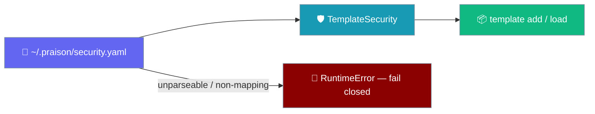
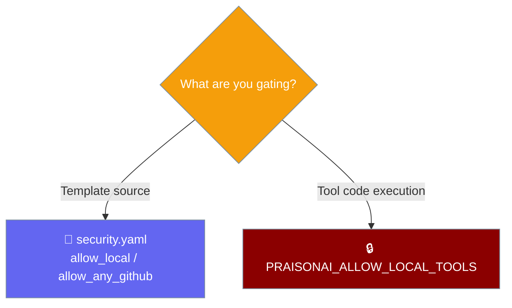

`~/.praison/security.yaml` decides which template sources PraisonAI may load — and now fails closed if that file cannot be parsed.

```python
from praisonaiagents import Agent

agent = Agent(
    name="Recipe Runner",
    instructions="Run the requested agent recipe",
)
agent.start("Load the internal onboarding recipe")
```

The template-loading side of that request is governed by the file below — a bad `security.yaml` aborts startup instead of silently reopening permissive defaults.



## Quick Start

<Steps>
<Step title="Write a hardened config">

```yaml
# ~/.praison/security.yaml
allow_local: false
allow_any_github: false
```

</Step>

<Step title="Construct TemplateSecurity">

```python
from praisonai.templates import TemplateSecurity

# Reads ~/.praison/security.yaml; raises RuntimeError on a broken file.
security = TemplateSecurity()
print(security.is_source_allowed("github:MervinPraison/agent-recipes"))
```

</Step>
</Steps>

---

## File Location

`TemplateSecurity` reads its config from a fixed path relative to your home directory.

| Setting | Value |
|---------|-------|
| Path | `~/.praison/security.yaml` |
| Source | `TemplateSecurity.CONFIG_FILE = ".praison/security.yaml"` (joined with `Path.home()`) |
| Missing file | Permissive `SecurityConfig()` defaults |

---

## Configuration Options

Every field maps to `praisonai.templates.security.SecurityConfig`.

| Option | Type | Default | Description |
|--------|------|---------|-------------|
| `allowed_sources` | `Set[str]` | `{"github:MervinPraison/agent-recipes", "package:agent_recipes"}` | Explicit allowlist of template sources. |
| `allow_local` | `bool` | `True` | Allow loading templates from any local path. |
| `allow_any_github` | `bool` | `True` | Allow loading templates from any `github:` source, not just the allowlist. |
| `allow_http` | `bool` | `False` | Allow non-HTTPS URLs. |
| `require_checksum` | `bool` | `False` | Require an integrity checksum for downloads. |
| `max_template_size` | `int` | `10485760` (10 MiB) | Cap on template payload size. |

<Warning>
Class defaults stay permissive (`allow_local=True`, `allow_any_github=True`). A config file that exists and parses cleanly but omits those keys still gets `True`. Set them explicitly to harden.
</Warning>

---

## File-Parse Behaviour

`_load_config` fails closed — a broken file aborts startup rather than silently reverting to permissive defaults.

| Input | Behaviour |
|-------|-----------|
| No file | `SecurityConfig()` defaults |
| Empty file (`yaml.safe_load → None`) | `SecurityConfig()` defaults |
| Valid mapping | Parsed into `SecurityConfig` |
| Non-mapping (bare scalar, list, `false`) | Raises `RuntimeError("Refusing to start: security config <path> must be a mapping, got <type>.")` |
| YAML syntax error / permission error / any parse exception | Raises `RuntimeError("Refusing to start: security config <path> could not be parsed: <exc>")` |

Quote these verbatim so operators can grep for them:

```text
RuntimeError: Refusing to start: security config /home/user/.praison/security.yaml could not be parsed: <cause>
RuntimeError: Refusing to start: security config /home/user/.praison/security.yaml must be a mapping, got <type>.
```

---

## Common Patterns

Harden every field explicitly so an omitted key never re-opens a default:

```yaml
# ~/.praison/security.yaml
allowed_sources:
  - github:internal/agent-recipes
  - package:agent_recipes
allow_local: false
allow_any_github: false
allow_http: false
require_checksum: true
max_template_size: 5242880  # 5 MiB
```

This file governs *template source* loading. `PRAISONAI_ALLOW_LOCAL_TOOLS` governs *tool code execution*. They are complementary, not redundant — a hardened `security.yaml` still needs `PRAISONAI_ALLOW_LOCAL_TOOLS` left unset to keep `tools.py` autoload off.



---

## Best Practices

<AccordionGroup>
<Accordion title="Keep the file under source control">
Version `security.yaml` for your ops team so `allow_any_github: false` and the allowlist are auditable.
</Accordion>
<Accordion title="Validate YAML before deploying">
A single bad line now aborts startup rather than silently reopening permissive defaults. Lint the file in CI before it ships.
</Accordion>
<Accordion title="Do not rely on restrictive class defaults">
An existing config that omits `allow_local` / `allow_any_github` still gets `True`. Set both keys explicitly.
</Accordion>
<Accordion title="Pair with the tool-execution gate">
`security.yaml` controls template sources; keep `PRAISONAI_ALLOW_LOCAL_TOOLS` unset to keep tool-code execution off.
</Accordion>
</AccordionGroup>

---

## Related

<CardGroup cols={2}>
<Card title="Security Environment Variables" icon="shield-check" href="/features/security-environment-variables">
  Control tool-code execution with `PRAISONAI_ALLOW_LOCAL_TOOLS`
</Card>
<Card title="Templates" icon="file-code" href="/cli/templates">
  Load and render agent recipe templates
</Card>
<Card title="Tools Override" icon="wrench" href="/cli/tools-override">
  Load custom tools from files and modules
</Card>
<Card title="tools add" icon="download" href="/features/tools-add">
  Install a tool package from the CLI
</Card>
</CardGroup>
