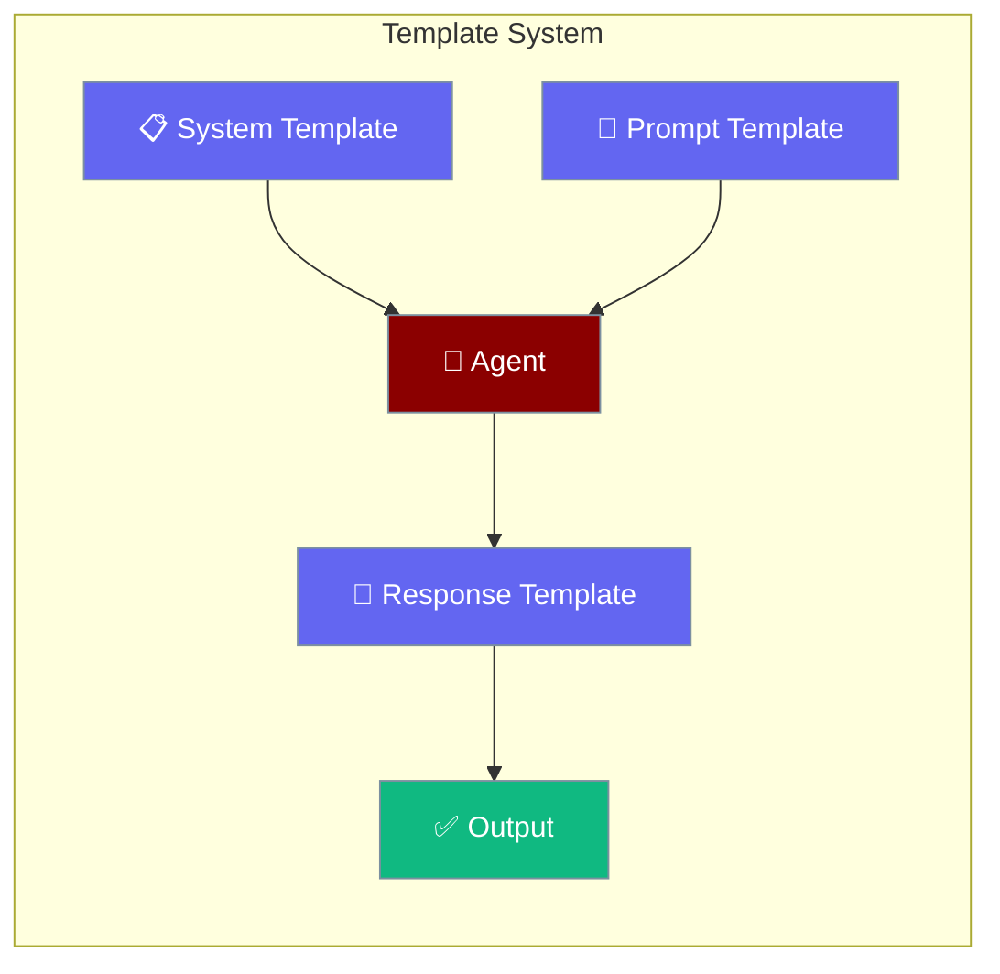
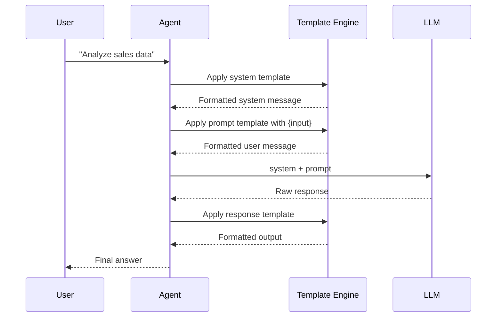

Templates let you control exactly what an agent says, how it says it, and how it formats its response — all in a few lines.

```python
from praisonaiagents import Agent, TemplateConfig

agent = Agent(
    name="Support Bot",
    templates=TemplateConfig(
        system="You are a friendly support agent for Acme Corp.",
        use_system_prompt=True,
    ),
)
agent.start("How do I reset my password?")
```


The user sends a message; system, prompt, and response templates shape what the agent sees and how it replies.



## Quick Start

<Steps>
<Step title="Custom System Prompt">
Override the default system message so the agent stays in character.

```python
from praisonaiagents import Agent

agent = Agent(
    name="Support Bot",
    system_prompt="You are a friendly customer support agent for Acme Corp. Always be concise and helpful.",
)

agent.start("How do I reset my password?")
```
</Step>

<Step title="With TemplateConfig">
Use `TemplateConfig` for full control over system, prompt, and response templates.

```python
from praisonaiagents import Agent, TemplateConfig

agent = Agent(
    name="Analyst",
    instructions="Analyze the data provided.",
    templates=TemplateConfig(
        system="You are a data analyst. Return only structured insights.",
        prompt="Analyze this: {input}",
        response="Summary:\n{response}\n\nKey Points:\n- {points}",
        use_system_prompt=True,
    )
)

agent.start("Sales grew 20% in Q3")
```
</Step>

<Step title="YAML Template Variables">
Define reusable workflows with `{placeholder}` variables in YAML.

```yaml
# workflow.yaml
variables:
  topic: climate change

agents:
  researcher:
    name: Researcher
    instructions: "Research {topic} thoroughly"

steps:
  - agent: researcher
    action: "Find the latest data on {topic}"
```

```python
from praisonaiagents import Agent, YAMLWorkflowParser

parser = YAMLWorkflowParser()
workflow = parser.parse_file("workflow.yaml", extra_vars={"topic": "renewable energy"})
workflow.run()
```
</Step>
</Steps>

---

## How It Works

Templates are applied in a specific order before the LLM sees your request.



---

## Configuration Options

<Card title="TemplateConfig API Reference" icon="code" href="/docs/sdk/praisonaiagents/config/feature-configs-module">
  Full API reference for `TemplateConfig` — system, prompt, response, use_system_prompt
</Card>

### TemplateConfig Fields

| Field | Type | Default | Description |
|-------|------|---------|-------------|
| `system` | `str \| None` | `None` | Override the system prompt |
| `prompt` | `str \| None` | `None` | Template for the user message; use `{input}` as a placeholder |
| `response` | `str \| None` | `None` | Format template applied to the LLM response |
| `use_system_prompt` | `bool` | `True` | Whether to send a system message at all |

---

## Common Patterns

### Structured Output Format

Force the agent to return a consistent format every time.

```python
from praisonaiagents import Agent, TemplateConfig

agent = Agent(
    name="Reporter",
    instructions="Summarize news articles.",
    templates=TemplateConfig(
        system="You are a news summarizer. Always output valid JSON.",
        response='{"headline": "...", "summary": "...", "sentiment": "positive|negative|neutral"}',
        use_system_prompt=True,
    )
)

result = agent.start("OpenAI released a new model today with improved reasoning.")
print(result)
```

### Persona Agent

Lock the agent into a role with a strong system template.

```python
from praisonaiagents import Agent, TemplateConfig

agent = Agent(
    name="Pirate Guide",
    instructions="Help users navigate the Caribbean.",
    templates=TemplateConfig(
        system="You are a 17th century Caribbean pirate. Speak in pirate dialect. Never break character.",
        use_system_prompt=True,
    )
)

agent.start("How do I get to Tortuga?")
```

### YAML Variable Substitution

Run the same workflow against different inputs without editing the YAML.

```python
from praisonaiagents import YAMLWorkflowParser

parser = YAMLWorkflowParser()

# Same workflow, different topics
for topic in ["AI safety", "quantum computing", "space exploration"]:
    workflow = parser.parse_file("research_workflow.yaml", extra_vars={"topic": topic})
    workflow.run()
```

---

## Best Practices

<AccordionGroup>
<Accordion title="Keep system templates focused">
A system template that tries to do everything usually does nothing well. One clear role per template — "You are a customer support agent for Acme Corp" — produces better results than a long list of unrelated instructions.
</Accordion>

<Accordion title="Use {input} placeholder in prompt templates">
When your prompt template includes `{input}`, PraisonAI substitutes the user's actual request at runtime. This keeps your template generic and reusable across many different queries.
</Accordion>

<Accordion title="Test response templates with diverse outputs">
Response templates are applied as a format instruction to the LLM. Test with edge-case inputs (short answers, long answers, refusals) to make sure the template doesn't corrupt valid responses.
</Accordion>

<Accordion title="Prefer YAML templates for team workflows">
When multiple people run the same workflow, store templates in a YAML file rather than hardcoding them in Python. YAML files are easier to version, review, and swap without touching code.
</Accordion>
</AccordionGroup>

---

## Related

<CardGroup cols={2}>
<Card title="YAML Template Variables" icon="code" href="/docs/features/yaml-template-variables">
  Safely use `{placeholder}` in YAML alongside JSON literals
</Card>
<Card title="Industry Templates" icon="building-2" href="/docs/features/industry-templates/overview">
  Pre-built agent workforces for Manufacturing, Energy, Healthcare, and more
</Card>
</CardGroup>
