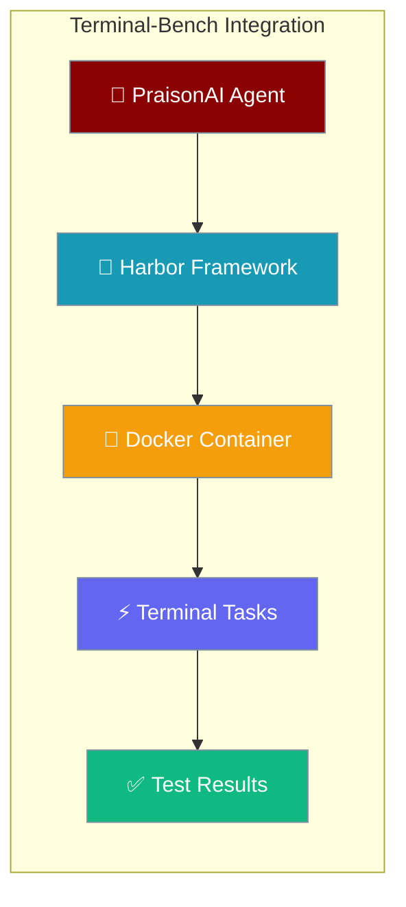
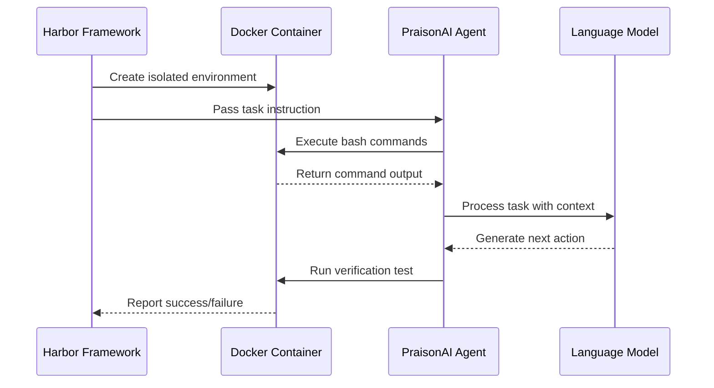

Benchmark PraisonAI agents against Terminal-Bench 2.0, the Stanford/Laude Institute standard for evaluating AI coding agents in realistic terminal environments.



## Quick Start

<Steps>
<Step title="Install Dependencies">
Install Harbor framework and PraisonAI with shell tools.

```bash
pip install harbor praisonaiagents[tools]
```

Set your API key:
```bash
export OPENAI_API_KEY="your-api-key"
```
</Step>

<Step title="Run Benchmark">
Execute Terminal-Bench with PraisonAI external agent on a subset of tasks.

```bash
harbor run -d terminal-bench/terminal-bench-2 \
  --agent-import-path examples.terminal_bench.praisonai_external_agent:PraisonAIExternalAgent \
  --model openai/gpt-4o \
  --ae OPENAI_API_KEY=$OPENAI_API_KEY \
  -n 4
```
</Step>
</Steps>

---

## How It Works

Terminal-Bench provides standardized evaluation of AI agents on realistic coding tasks like compiling code, training models, and system administration.



| Component | Purpose |
|-----------|---------|
| **Terminal-Bench 2.0** | 89 curated tasks covering compilation, ML, servers |
| **Harbor Framework** | Container orchestration and parallel execution |
| **Docker Container** | Isolated environment for safe code execution |
| **PraisonAI Agent** | Intelligent agent using bash tools |

---

## Integration Approaches

<Tabs>
<Tab title="External Agent (Recommended)">
The external agent approach uses PraisonAI's `Agent` class directly with Harbor's container environment.

```python
from harbor.agents.base import BaseAgent
from harbor.environments.base import BaseEnvironment
from harbor.models.agent.context import AgentContext
from praisonaiagents import Agent
from praisonaiagents.approval import get_approval_registry, AutoApproveBackend

class PraisonAIExternalAgent(BaseAgent):
    @staticmethod
    def name() -> str:
        return "praisonai"

    async def run(self, instruction: str, environment: BaseEnvironment, context: AgentContext) -> None:
        # Enable auto-approval for container-isolated execution
        registry = get_approval_registry()
        registry.set_backend(AutoApproveBackend(), agent_name="terminal-agent")
        
        async def bash_tool(command: str) -> str:
            """Execute bash command in Harbor container."""
            result = await environment.exec(command=command, timeout_sec=300)
            
            output_parts = []
            if result.stdout:
                output_parts.append(result.stdout.strip())
            if result.stderr:
                output_parts.append(f"[stderr]: {result.stderr.strip()}")
            if result.return_code != 0:
                output_parts.append(f"[exit_code]: {result.return_code}")
            
            return "\n".join(output_parts) if output_parts else "(no output)"

        agent = Agent(
            name="terminal-agent",
            instructions="You are an expert terminal agent. Use bash_tool to execute shell commands.",
            tools=[bash_tool],
            llm=self.model_name or "openai/gpt-4o"
        )
        
        result = await agent.achat(instruction)
```

**Run command:**
```bash
harbor run -d terminal-bench/terminal-bench-2 \
  --agent-import-path examples.terminal_bench.praisonai_external_agent:PraisonAIExternalAgent \
  --model openai/gpt-4o \
  --ae OPENAI_API_KEY=$OPENAI_API_KEY \
  -n 4
```
</Tab>

<Tab title="Wrapper Agent (CLI-based)">
The wrapper agent uses PraisonAI's CLI interface inside the container.

```python
class PraisonAIWrapperAgent(BaseAgent):
    @staticmethod
    def name() -> str:
        return "praisonai-wrapper"

    async def setup(self, environment: BaseEnvironment) -> None:
        # Install PraisonAI inside container
        await environment.exec(command="pip install praisonai --quiet")
    
    async def run(self, instruction: str, environment: BaseEnvironment, context: AgentContext) -> None:
        model = self.model_name or "openai/gpt-4o"
        
        # Build CLI command
        command = f'praisonai "{instruction}" --model {model}'
        
        result = await environment.exec(
            command=command,
            timeout_sec=600,
            env={"OPENAI_API_KEY": os.environ.get("OPENAI_API_KEY")}
        )
```

**Run command:**
```bash
harbor run -d terminal-bench/terminal-bench-2 \
  --agent-import-path examples.terminal_bench.praisonai_wrapper_agent:PraisonAIWrapperAgent \
  --model openai/gpt-4o \
  --ae OPENAI_API_KEY=$OPENAI_API_KEY \
  -n 4
```
</Tab>
</Tabs>

---

## YAML Configuration

Configure benchmark runs using Harbor's YAML format for reproducible experiments.

```yaml
# job.yaml - Terminal-Bench configuration
dataset: terminal-bench/terminal-bench-2

agent:
  import_path: examples.terminal_bench.praisonai_external_agent:PraisonAIExternalAgent
  model_name: openai/gpt-4o
  env:
    OPENAI_API_KEY: "${OPENAI_API_KEY}"

n_concurrent: 8
n_attempts: 1

# Optional: Filter to specific tasks
# task_filter:
#   task_names: ["compile_simple_c", "install_python_package"]
```

**Run with configuration:**
```bash
harbor run -c examples/terminal_bench/job.yaml
```

---

## Task Filtering & Selection

<AccordionGroup>
<Accordion title="Filter by Task Names">
Run specific tasks for targeted testing or debugging.

```bash
harbor run -d terminal-bench/terminal-bench-2 \
  --agent-import-path examples.terminal_bench.praisonai_external_agent:PraisonAIExternalAgent \
  --model openai/gpt-4o \
  --ae OPENAI_API_KEY=$OPENAI_API_KEY \
  -i "terminal-bench/compile-cython-ext" \
  -i "terminal-bench/bn-fit-modify"
```
</Accordion>

<Accordion title="Limit Task Count">
Run a subset for quick testing with the `-l` flag.

```bash
harbor run -d terminal-bench/terminal-bench-2 \
  --agent-import-path examples.terminal_bench.praisonai_external_agent:PraisonAIExternalAgent \
  --model openai/gpt-4o \
  --ae OPENAI_API_KEY=$OPENAI_API_KEY \
  -l 5 -n 2
```
</Accordion>

<Accordion title="Cloud Execution">
Scale to higher concurrency using cloud providers.

```bash
harbor run -d terminal-bench/terminal-bench-2 \
  --agent-import-path examples.terminal_bench.praisonai_external_agent:PraisonAIExternalAgent \
  --model openai/gpt-4o \
  --env daytona -n 32 \
  --ae OPENAI_API_KEY=$OPENAI_API_KEY
```
</Accordion>
</AccordionGroup>

---

## Interpreting Results

Terminal-Bench uses binary scoring where each task either passes (1.0) or fails (0.0).

```bash
# Example output
praisonai (gpt-4o) on terminal-bench-2         
┏━━━━━━━━━━━━━━━━━━━━━┳━━━━━━━━━━━━━━━━━━━┓
┃ Metric              ┃ Value             ┃
┡━━━━━━━━━━━━━━━━━━━━━╇━━━━━━━━━━━━━━━━━━━┩
│ Agent               │ praisonai (gpt-4o)│
│ Dataset             │ terminal-bench-2  │
│ Trials              │ 89                │
│ Errors              │ 0                 │
│                     │                   │
│ Mean                │ 0.73              │
│                     │                   │
│ Reward Distribution │                   │
│   reward = 1.0      │ 65                │
│   reward = 0.0      │ 24                │
└─────────────────────┴───────────────────┘
```

| Score | Meaning |
|-------|---------|
| **1.0** | Task passed - verification script succeeded |
| **0.0** | Task failed - verification script failed or agent error |
| **Mean** | Overall success rate across all tasks |

<Note>
**Model Performance:** `gpt-4o-mini` typically scores near 0.0 on hard tasks. Use `openai/gpt-4o` or `anthropic/claude-3-7-sonnet-20250219` for meaningful scores.
</Note>

---

## Example Output

Real benchmark session showing PraisonAI external agent results:

```bash
$ harbor run -d terminal-bench/terminal-bench-2 \
    --agent-import-path examples.terminal_bench.praisonai_external_agent:PraisonAIExternalAgent \
    --model openai/gpt-4o --ae OPENAI_API_KEY=$OPENAI_API_KEY -l 5 -n 2

  5/5 Mean: 0.000 ━━━━━━━━━━━━━━━━━━━━━━━━━━━━━━━━━━━━━━━━ 0:10:18 0:00:00
Results written to /tmp/harbor_results/2026-04-12__03-00-00/result.json

        praisonai (gpt-4o) on adhoc         
┏━━━━━━━━━━━━━━━━━━━━━┳━━━━━━━━━━━━━━━━━━━┓
┃ Metric              ┃ Value             ┃
┡━━━━━━━━━━━━━━━━━━━━━╇━━━━━━━━━━━━━━━━━━━┩
│ Agent               │ praisonai (gpt-4o)│
│ Dataset             │ adhoc             │
│ Trials              │ 5                 │
│ Errors              │ 0                 │
│                     │                   │
│ Mean                │ 0.000             │
│                     │                   │
│ Reward Distribution │                   │
│   reward = 0.0      │ 5                 │
└─────────────────────┴───────────────────┘
```

Tasks included: Cython compilation, Bayesian network fitting, C source build, adaptive sampling, JavaScript filtering.

---

## Best Practices

<AccordionGroup>
<Accordion title="Start with Oracle Agent">
Always verify the benchmark works by testing with the oracle agent first.

```bash
harbor run -d terminal-bench/terminal-bench-2 -a oracle -l 1
```

This should achieve a perfect score (1.0) and confirm your setup is correct.
</Accordion>

<Accordion title="Use Appropriate Models">
Choose models based on your goals:

- **Testing integration:** `openai/gpt-4o-mini` (fast, cheap, low scores)
- **Real benchmarking:** `openai/gpt-4o` or `anthropic/claude-3-7-sonnet-20250219`
- **Cost optimization:** Start with 5-10 tasks before running full benchmark
</Accordion>

<Accordion title="Monitor Resource Usage">
Terminal-Bench tasks can be resource intensive:

- Start with `-n 2` concurrency for testing
- Scale to `-n 8` for serious benchmarking
- Use cloud providers (Daytona, E2B, Modal) for `-n 32+` concurrency
</Accordion>

<Accordion title="Debug Failed Tasks">
When tasks fail, examine the execution logs:

```bash
# Results are saved with timestamps
cat /tmp/harbor_results/2026-04-12__03-00-00/task-name/agent/output.txt
```

Common failure modes: timeout, missing dependencies, incorrect file paths.
</Accordion>
</AccordionGroup>

---

## Troubleshooting

| Error | Solution |
|-------|----------|
| `"Object of type coroutine is not JSON serializable"` | Fixed in current PraisonAI version - update to latest |
| `Docker not found` | Install Docker Desktop and ensure it's running |
| `Harbor import error` | Install Harbor: `pip install harbor` |
| `API key not forwarded` | Use `--ae OPENAI_API_KEY=$OPENAI_API_KEY` flag |
| `Permission denied in container` | Ensure Docker has proper permissions |

<Warning>
The coroutine serialization error mentioned in early Terminal-Bench integration docs has been fixed in the current SDK version. If you encounter it, update PraisonAI to the latest version.
</Warning>

---

## Related

<CardGroup cols={2}>
<Card title="Sandbox Execution" icon="cube" href="/docs/features/sandbox">
  Safe code execution in isolated environments
</Card>
<Card title="Real API Testing" icon="flask" href="/docs/features/real-api-testing">
  Testing agents with real API integrations
</Card>
</CardGroup>