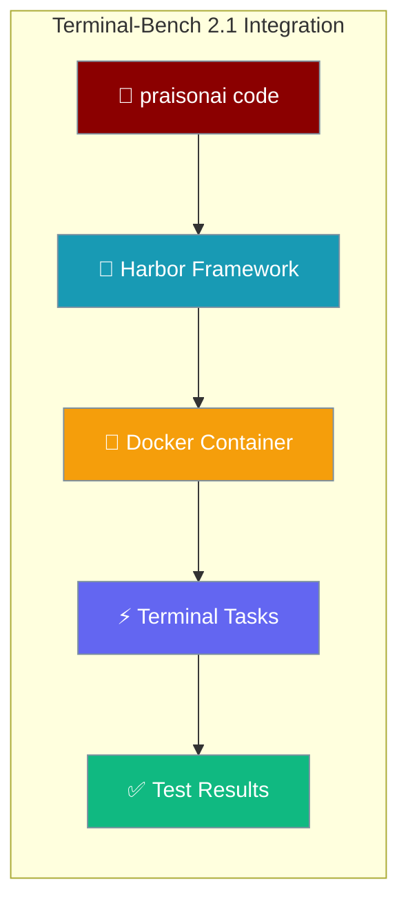
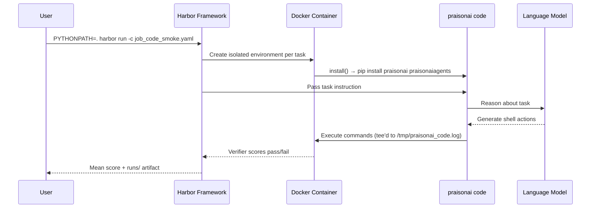

Benchmark PraisonAI on Terminal-Bench 2.1, the Laude Institute standard for evaluating AI coding agents in realistic terminal environments — the headline path drives the `praisonai code` assistant with one command.

```bash
PYTHONPATH=. harbor run -d terminal-bench/terminal-bench-2-1 \
  --agent "examples.terminal_bench.praisonai_code_agent:PraisonAICodeAgent" \
  -m openai/gpt-4o-mini \
  --ae OPENAI_API_KEY=$OPENAI_API_KEY \
  -n 4
```



## Quick Start

<Steps>
<Step title="Install Dependencies">
Install Harbor and PraisonAI into one environment. Regular users install from PyPI; benchmarkers of a working tree use editable installs.

```bash
# Regular users
pip install harbor praisonai praisonaiagents

# Benchmarking a working tree (editable, from the repo root)
pip install harbor
pip install -e src/praisonai-agents -e src/praisonai
export PYTHONPATH=.
```

Set your API key:
```bash
export OPENAI_API_KEY="${OPENAI_API_KEY}"
```
</Step>

<Step title="Run the Code Adapter">
Benchmark the `praisonai code` assistant on Terminal-Bench 2.1. Run from the repo root with `PYTHONPATH=.` so the adapter import path resolves.

```bash
PYTHONPATH=. harbor run -d terminal-bench/terminal-bench-2-1 \
  --agent "examples.terminal_bench.praisonai_code_agent:PraisonAICodeAgent" \
  -m openai/gpt-4o-mini \
  --ae OPENAI_API_KEY=$OPENAI_API_KEY \
  -n 4
```
</Step>
</Steps>

---

## How It Works

Harbor spins up one Docker container per task, installs the agent, drives it against the instruction, then grades the container with a verifier script.



A concrete end-to-end flow:

1. Write `job_code_smoke.yaml` (or reuse the one in the repo).
2. Run `PYTHONPATH=. harbor run -c examples/terminal_bench/job_code_smoke.yaml` from the repo root.
3. Harbor spins up one container per pinned task in parallel (`n_concurrent_trials: 2`).
4. In each container, `PraisonAICodeAgent.install()` runs `pip install praisonai praisonaiagents`.
5. `PraisonAICodeAgent.run()` invokes `praisonai code "<instruction>" --dangerously-skip-approval --model openai/gpt-4o-mini`, tee'd to `/tmp/praisonai_code.log`.
6. Harbor's verifier scores the container after the agent exits.
7. Pass/fail per task and mean score print to the terminal and write to `runs/`; the CI workflow uploads that folder as an artifact.
8. You paste the pass rate as a new row in `RESULTS.md`.

| Component | Purpose |
|-----------|---------|
| **Terminal-Bench 2.1** | 89 curated tasks covering compilation, ML, servers |
| **Harbor Framework** | Container orchestration and parallel execution |
| **Docker Container** | Isolated environment for safe code execution |
| **praisonai code** | Terminal-native assistant driven headlessly |

---

## Integration Approaches

Three adapters cover different levels of the stack — start with the code adapter.

<Tabs>
<Tab title="Code Agent (Recommended)">
The code adapter installs and drives the terminal-native `praisonai code` assistant headlessly inside the container. It is the "one command to benchmark PraisonAI" story.

```python
import shlex

from harbor.agents.installed.base import BaseInstalledAgent
from harbor.environments.base import BaseEnvironment
from harbor.models.agent.context import AgentContext


class PraisonAICodeAgent(BaseInstalledAgent):
    """Benchmarks the `praisonai code` terminal assistant inside a Harbor container."""

    @staticmethod
    def name() -> str:
        return "praisonai-code"

    def get_version_command(self) -> str:
        return "praisonai --version"

    async def install(self, environment: BaseEnvironment) -> None:
        await self.exec_as_root(
            environment,
            command="apt-get update && apt-get install -y python3 python3-pip || true",
            env={"DEBIAN_FRONTEND": "noninteractive"},
        )
        version_spec = f"=={self._version}" if getattr(self, "_version", None) else ""
        await self.exec_as_agent(
            environment,
            command=(
                f"pip install --break-system-packages praisonai{version_spec} praisonaiagents"
            ),
        )

    async def run(self, instruction: str, environment: BaseEnvironment, context: AgentContext) -> None:
        model = self.model_name or "openai/gpt-4o-mini"
        command = (
            f"praisonai code {shlex.quote(instruction)} "
            f"--dangerously-skip-approval "
            f"--model {shlex.quote(model)} "
            "> /tmp/praisonai_code.log 2>&1; "
            "status=$?; "
            "cp /tmp/praisonai_code.log /tmp/praisonai_code_run.log 2>/dev/null || true; "
            "exit $status"
        )
        await self.exec_as_agent(environment, command=command, env=self.env)

    def populate_context_post_run(self, context: AgentContext) -> None:
        context.metadata = {
            "framework": "praisonai",
            "agent_type": "code-cli",
            "agent_name": self.name(),
            "model": self.model_name,
            "log_path": "/tmp/praisonai_code.log",
        }
```

**Run command:**
```bash
PYTHONPATH=. harbor run -d terminal-bench/terminal-bench-2-1 \
  --agent "examples.terminal_bench.praisonai_code_agent:PraisonAICodeAgent" \
  -m openai/gpt-4o-mini \
  --ae OPENAI_API_KEY=$OPENAI_API_KEY \
  -n 4
```

The base `praisonai` package is enough — heavy `code` extras are not required, since ACP tools degrade gracefully. A benchmark miss still exits 0 (Harbor grades by task verification), but a real install/auth/startup crash propagates the nonzero status.

<Note>
`--dangerously-skip-approval` on `praisonai code` sets `PRAISON_APPROVAL_MODE=auto` and `PRAISONAI_TOOL_SAFETY=off`, so the assistant runs fully autonomously in a non-TTY container session (no approval hang). See [Tool Approval](/docs/cli/tool-approval) for the full flag reference.
</Note>
</Tab>

<Tab title="External Agent (Direct Agent)">
The external agent uses PraisonAI's `Agent` class directly, bridging Harbor's `exec()` as a bash tool.

```python
from harbor.agents.base import BaseAgent
from harbor.environments.base import BaseEnvironment
from harbor.models.agent.context import AgentContext
from praisonaiagents import Agent
from praisonaiagents.approval import get_approval_registry, AutoApproveBackend

class PraisonAIExternalAgent(BaseAgent):
    @staticmethod
    def name() -> str:
        return "praisonai"

    async def run(self, instruction: str, environment: BaseEnvironment, context: AgentContext) -> None:
        registry = get_approval_registry()
        registry.set_backend(AutoApproveBackend(), agent_name="terminal-agent")

        async def bash_tool(command: str) -> str:
            """Execute bash command in Harbor container."""
            result = await environment.exec(command=command, timeout_sec=300)

            output_parts = []
            if result.stdout:
                output_parts.append(result.stdout.strip())
            if result.stderr:
                output_parts.append(f"[stderr]: {result.stderr.strip()}")
            if result.return_code != 0:
                output_parts.append(f"[exit_code]: {result.return_code}")

            return "\n".join(output_parts) if output_parts else "(no output)"

        agent = Agent(
            name="terminal-agent",
            instructions="You are an expert terminal agent. Use bash_tool to execute shell commands.",
            tools=[bash_tool],
            llm=self.model_name or "openai/gpt-4o-mini"
        )

        result = await agent.achat(instruction)
```

**Run command:**
```bash
PYTHONPATH=. harbor run -d terminal-bench/terminal-bench-2-1 \
  --agent "examples.terminal_bench.praisonai_external_agent:PraisonAIExternalAgent" \
  -m openai/gpt-4o-mini \
  --ae OPENAI_API_KEY=$OPENAI_API_KEY \
  -n 4
```
</Tab>

<Tab title="Wrapper Agent (CLI-based)">
The wrapper agent installs the `praisonai` CLI inside the container and drives `praisonai code` as a subprocess.

```python
import os
import shlex

from harbor.agents.base import BaseAgent
from harbor.environments.base import BaseEnvironment
from harbor.models.agent.context import AgentContext

class PraisonAIWrapperAgent(BaseAgent):
    @staticmethod
    def name() -> str:
        return "praisonai-wrapper"

    async def setup(self, environment: BaseEnvironment) -> None:
        # Install PraisonAI inside container
        await environment.exec(command="pip install praisonai --quiet")

    async def run(self, instruction: str, environment: BaseEnvironment, context: AgentContext) -> None:
        model = self.model_name or "openai/gpt-4o-mini"

        command = " ".join([
            "praisonai", "code", shlex.quote(instruction),
            "--dangerously-skip-approval",
            "--model", shlex.quote(model),
        ])

        result = await environment.exec(
            command=command,
            timeout_sec=600,
            env={"OPENAI_API_KEY": os.environ.get("OPENAI_API_KEY")}
        )
```

**Run command:**
```bash
PYTHONPATH=. harbor run -d terminal-bench/terminal-bench-2-1 \
  --agent "examples.terminal_bench.praisonai_wrapper_agent:PraisonAIWrapperAgent" \
  -m openai/gpt-4o-mini \
  --ae OPENAI_API_KEY=$OPENAI_API_KEY \
  -n 4
```
</Tab>
</Tabs>

<Note>
**Multi-agent variant.** A planner/executor/verifier team lives at `examples/terminal_bench/multi_agent_example.py` (class `MultiAgentPraisonAI`) for tasks that benefit from decomposition. Run it with:

```bash
PYTHONPATH=. harbor run -d terminal-bench/terminal-bench-2-1 \
  --agent "examples.terminal_bench.multi_agent_example:MultiAgentPraisonAI" \
  -m openai/gpt-4o-mini \
  --ae OPENAI_API_KEY=$OPENAI_API_KEY
```
</Note>

<Note>
Both `--agent "module:Class"` (short form, featured above) and `--agent-import-path module:Class` (long form) work.
</Note>

---

## YAML Configuration

Harbor 2.1 uses arrays for `datasets` and `agents`, plus `n_concurrent_trials` and `n_attempts` — unknown keys are silently ignored, so the old `dataset:`/`agent:`/`n_concurrent:` form runs the default oracle agent on zero tasks.

```yaml
# job.yaml — real Harbor JobConfig schema
datasets:
  - name: terminal-bench
    version: "2.1"

agents:
  - import_path: examples.terminal_bench.praisonai_code_agent:PraisonAICodeAgent
    model_name: openai/gpt-4o-mini
    env:
      OPENAI_API_KEY: "${OPENAI_API_KEY}"

n_concurrent_trials: 4
n_attempts: 1
```

Pin a small verified subset with `task_names:` for a cheap smoke run.

```yaml
# job_code_smoke.yaml — 3-task smoke config
datasets:
  - name: terminal-bench
    version: "2.1"
    task_names:
      - hello-world
      - fix-permissions
      - csv-to-parquet

agents:
  - import_path: examples.terminal_bench.praisonai_code_agent:PraisonAICodeAgent
    model_name: openai/gpt-4o-mini
    env:
      OPENAI_API_KEY: "${OPENAI_API_KEY}"

n_concurrent_trials: 2
n_attempts: 1
```

Verify subset task names against the registry with `harbor datasets list` before editing `task_names:`.

**Run with configuration:**
```bash
PYTHONPATH=. harbor run -c examples/terminal_bench/job_code_smoke.yaml
```

---

## Task Filtering & Selection

Pin tasks in YAML with `task_names:` (preferred) or filter on the command line with `-i`.

<AccordionGroup>
<Accordion title="Filter by Task Names (CLI)">
Run specific tasks for targeted testing or debugging.

```bash
PYTHONPATH=. harbor run -d terminal-bench/terminal-bench-2-1 \
  --agent "examples.terminal_bench.praisonai_code_agent:PraisonAICodeAgent" \
  -m openai/gpt-4o-mini \
  --ae OPENAI_API_KEY=$OPENAI_API_KEY \
  -i "hello-world" \
  -i "fix-permissions"
```
</Accordion>

<Accordion title="Limit Task Count">
Run a subset for quick testing with the `-l` flag.

```bash
PYTHONPATH=. harbor run -d terminal-bench/terminal-bench-2-1 \
  --agent "examples.terminal_bench.praisonai_code_agent:PraisonAICodeAgent" \
  -m openai/gpt-4o-mini \
  --ae OPENAI_API_KEY=$OPENAI_API_KEY \
  -l 5 -n 2
```
</Accordion>

<Accordion title="Cloud Execution">
Scale to higher concurrency using cloud providers.

```bash
PYTHONPATH=. harbor run -d terminal-bench/terminal-bench-2-1 \
  --agent "examples.terminal_bench.praisonai_code_agent:PraisonAICodeAgent" \
  -m openai/gpt-4o-mini \
  --env daytona -n 32 \
  --ae OPENAI_API_KEY=$OPENAI_API_KEY
```
</Accordion>
</AccordionGroup>

---

## Recording Pass Rates

Pass rates are tracked in `examples/terminal_bench/RESULTS.md` in the SDK repo, one row per run.

| Date | Agent | Model | Tasks | Pass rate | Harbor artifact |
|------|-------|-------|-------|-----------|-----------------|

Add a row after each run recording the date, agent, model, task set, pass rate, and the uploaded Harbor artifact. See [`RESULTS.md`](https://github.com/MervinPraison/PraisonAI/blob/main/examples/terminal_bench/RESULTS.md) for the current table.

---

## CI Smoke Workflow

A scheduled workflow at `.github/workflows/terminal-bench-smoke.yml` runs the code adapter on the verified smoke subset and uploads results — copy it to set up your own weekly tracking.

| Setting | Value |
|---------|-------|
| **Trigger** | `workflow_dispatch` (manual) + cron `0 6 * * 1` (Mondays 06:00 UTC) |
| **Runs on PRs** | Never — it costs money (LLM calls) and is inherently flaky |
| **What it does** | Installs Harbor + editable PraisonAI, runs `harbor run -c examples/terminal_bench/job_code_smoke.yaml`, uploads `runs/` as an artifact |
| **Required secret** | `OPENAI_API_KEY` |

---

## Interpreting Results

Terminal-Bench uses binary scoring where each task either passes (1.0) or fails (0.0).

```bash
        praisonai-code (gpt-4o-mini) on terminal-bench-2-1
┏━━━━━━━━━━━━━━━━━━━━━┳━━━━━━━━━━━━━━━━━━━━━━━┓
┃ Metric              ┃ Value                 ┃
┡━━━━━━━━━━━━━━━━━━━━━╇━━━━━━━━━━━━━━━━━━━━━━━┩
│ Agent               │ praisonai-code        │
│ Dataset             │ terminal-bench-2-1    │
│ Trials              │ 3                     │
│ Errors              │ 0                     │
│                     │                       │
│ Mean                │ 0.33                  │
│                     │                       │
│ Reward Distribution │                       │
│   reward = 1.0      │ 1                     │
│   reward = 0.0      │ 2                     │
└─────────────────────┴───────────────────────┘
```

| Score | Meaning |
|-------|---------|
| **1.0** | Task passed — verification script succeeded |
| **0.0** | Task failed — verification script failed or agent error |
| **Mean** | Overall success rate across all tasks |

<Note>
**Model Performance:** the smoke config uses `gpt-4o-mini` for cost; for meaningful pass rates use `openai/gpt-4o` or `anthropic/claude-3-7-sonnet-20250219`. `gpt-4o-mini` typically scores near 0.0 on hard tasks.
</Note>

---

## Best Practices

<AccordionGroup>
<Accordion title="Start with Oracle Agent">
Verify the benchmark works by testing with the oracle agent first.

```bash
PYTHONPATH=. harbor run -d terminal-bench/terminal-bench-2-1 -a oracle -l 1
```

This should achieve a perfect score (1.0) and confirm your setup is correct.
</Accordion>

<Accordion title="Use Appropriate Models">
Choose models based on your goals:

- **Testing integration:** `openai/gpt-4o-mini` (fast, cheap, low scores)
- **Real benchmarking:** `openai/gpt-4o` or `anthropic/claude-3-7-sonnet-20250219`
- **Cost optimization:** Start with 3-5 tasks before running the full benchmark
</Accordion>

<Accordion title="Monitor Resource Usage">
Terminal-Bench tasks can be resource intensive:

- Start with `-n 2` concurrency for testing
- Scale to `-n 8` for serious benchmarking
- Use cloud providers (Daytona, E2B, Modal) for `-n 32+` concurrency
</Accordion>

<Accordion title="Track Pass Rates in RESULTS.md">
Record every run in `examples/terminal_bench/RESULTS.md` so pass-rate trends are visible over time. The CI smoke workflow uploads the Harbor results directory as an artifact for each run.
</Accordion>
</AccordionGroup>

---

## Troubleshooting

| Error | Solution |
|-------|----------|
| `Default oracle agent runs on zero tasks` | Use the real JobConfig schema (`datasets:`/`agents:`/`n_concurrent_trials`), not `dataset:`/`agent:`/`n_concurrent:` |
| `ModuleNotFoundError: examples.terminal_bench` | Prefix every command with `PYTHONPATH=.` from the repo root |
| `Docker not found` | Install Docker Desktop and ensure it's running |
| `Harbor import error` | Install Harbor: `pip install harbor` |
| `API key not forwarded` | Use `--ae OPENAI_API_KEY=$OPENAI_API_KEY` flag |
| `Permission denied in container` | Ensure Docker has proper permissions |

---

## Related

<CardGroup cols={2}>
<Card title="Tool Approval" icon="shield-check" href="/docs/cli/tool-approval">
  Approval flags for the `praisonai code` assistant
</Card>
<Card title="Sandbox Execution" icon="cube" href="/docs/features/sandbox">
  Safe code execution in isolated environments
</Card>
</CardGroup>
