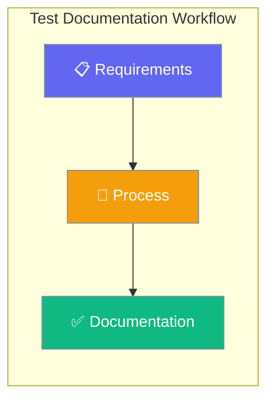
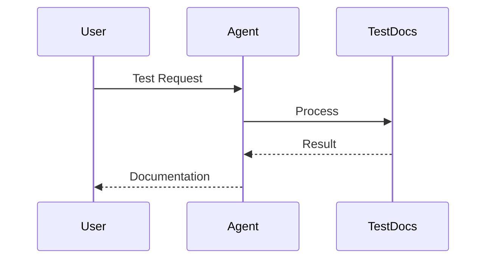

Test documentation demonstrates the complete documentation engineering workflow with proper structure, Mermaid diagrams, and agent-centric examples.



## Quick Start

<Steps>
<Step title="Simple Usage">
Create a basic agent with test documentation features enabled:

```python
from praisonaiagents import Agent

agent = Agent(
    name="Test Agent",
    instructions="You are a test documentation agent that demonstrates features",
    test_mode=True  # Enable test mode
)

result = agent.start("Generate a simple test report")
print(result)
```
</Step>

<Step title="With Configuration">
Configure test documentation with custom settings:

```python
from praisonaiagents import Agent

# Custom configuration for test documentation
test_config = {
    "validation": True,
    "reporting": True,
    "metrics": True
}

agent = Agent(
    name="Advanced Test Agent",
    instructions="You are an advanced test documentation agent",
    test_mode=test_config
)

result = agent.start("Generate a comprehensive test analysis")
print(result)
```
</Step>
</Steps>

---

## How It Works



| Component | Purpose | Output |
|-----------|---------|---------|
| **User** | Initiates test request | Requirements |
| **Agent** | Processes and validates | Analysis |
| **TestDocs** | Generates documentation | Reports |

---

## Configuration Options

<Card title="Test Documentation API Reference" icon="code" href="/docs/sdk/reference/python/classes/TestConfig">
  Python configuration options for test documentation
</Card>

---

## Common Patterns

### Pattern 1: Basic Test Documentation

```python
from praisonaiagents import Agent

# Simple test documentation setup
agent = Agent(
    name="Documentation Tester",
    instructions="Test and document features systematically",
    test_mode=True
)

# Generate test documentation
result = agent.start("Document the agent initialization process")
```

### Pattern 2: Advanced Test Validation

```python
from praisonaiagents import Agent

# Advanced test with validation
agent = Agent(
    name="Validation Tester",
    instructions="Test features with comprehensive validation",
    test_mode={
        "validation": True,
        "error_checking": True,
        "performance_metrics": True
    }
)

# Run comprehensive tests
result = agent.start("Validate all agent features and generate report")
```

### Pattern 3: Multi-Agent Test Documentation

```python
from praisonaiagents import Agent, AgentTeam

# Create specialized test agents
doc_agent = Agent(
    name="Documentation Agent",
    instructions="Focus on documentation quality",
    test_mode=True
)

test_agent = Agent(
    name="Test Agent", 
    instructions="Focus on test execution",
    test_mode=True
)

# Coordinate testing
team = AgentTeam(agents=[doc_agent, test_agent])
result = team.start("Generate comprehensive test documentation")
```

---

## Best Practices

<AccordionGroup>
<Accordion title="Documentation Structure">
Always follow the AGENTS.md page structure template with proper frontmatter, hero diagrams, Quick Start section, How It Works section, and Best Practices section using Mintlify components.
</Accordion>

<Accordion title="Agent-Centric Examples">
Start every documentation page with agent-centric Quick Start examples that show the simplest way to use the feature, followed by more advanced configuration examples.
</Accordion>

<Accordion title="Mermaid Diagram Standards">
Use the standard color scheme: #8B0000 (dark red) for agents, #189AB4 (teal) for tools/processes, #fff (white) for text, ensuring all diagrams are visually consistent.
</Accordion>

<Accordion title="Code Quality">
Ensure all code examples are copy-paste runnable with correct imports, use realistic but simple data, and represent the shortest way to accomplish the task.
</Accordion>
</AccordionGroup>

---

## Related

<CardGroup cols={2}>
<Card title="Agents" icon="user" href="/docs/concepts/agents">
Learn about agent fundamentals and core concepts
</Card>
<Card title="Tools" icon="wrench" href="/docs/concepts/tools">  
Discover available tools and how to use them
</Card>
</CardGroup>