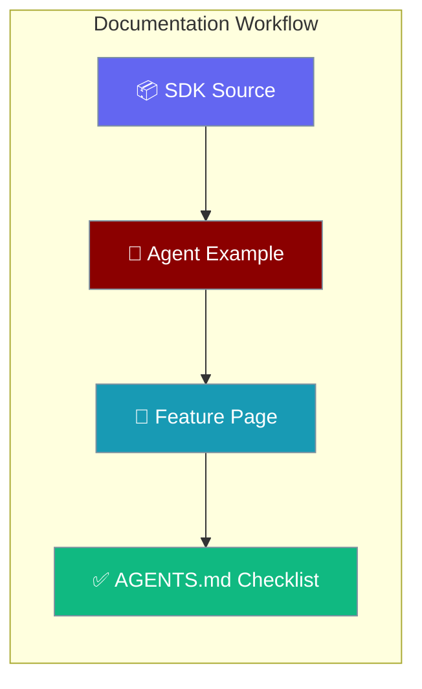
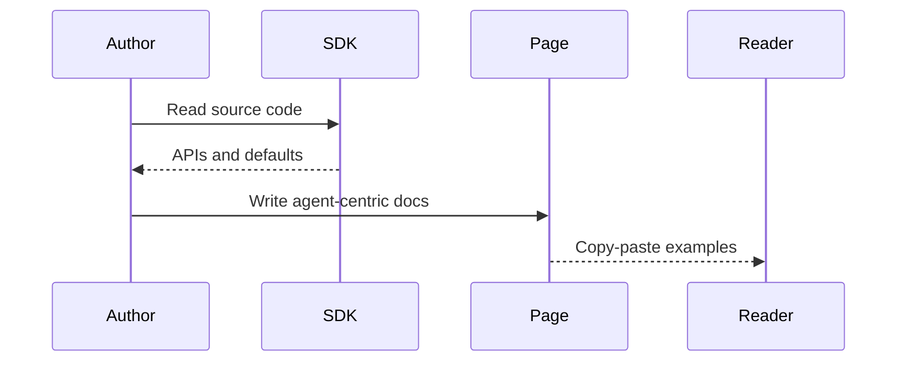

This page demonstrates the AGENTS.md documentation template — agent-centric examples, Mintlify components, and standard diagrams.

```python
from praisonaiagents import Agent

agent = Agent(
    name="Doc Tester",
    instructions="Summarise documentation standards in one paragraph.",
)
agent.start("What makes good agent documentation?")
```


The user reads a reference page; the hero example and diagram show how feature docs should open with Agent code and a user flow.



## Quick Start

<Steps>
<Step title="Agent-Centric Intro">
Every page opens with a minimal `Agent(...)` example before the hero diagram.

```python
from praisonaiagents import Agent

agent = Agent(name="Example", instructions="Demonstrate the feature.")
agent.start("Hello")
```
</Step>

<Step title="Mintlify Structure">
Wrap Quick Start in Steps, Best Practices in AccordionGroup, and Related links in CardGroup (cols=2).

```mdx
<Steps>
  <Step title="Simple Usage">...</Step>
  <Step title="With Configuration">...</Step>
</Steps>
```
</Step>
</Steps>

---

## How It Works



| Component | Purpose | Output |
|-----------|---------|--------|
| **SDK source** | Ground truth for APIs | Accurate examples |
| **Agent example** | Simplest usage path | Quick Start code |
| **Mintlify components** | Consistent layout | Steps, Accordions, Cards |

---

## Best Practices

<AccordionGroup>
<Accordion title="Start with Agent(...)">
Top of every page: a minimal agent example showing the feature in use — not subsystem imports or config-only snippets.
</Accordion>

<Accordion title="Use standard diagram colours">
Hero Mermaid diagrams use `#8B0000` for agents, `#189AB4` for tools/processes, and white text on coloured fills.
</Accordion>

<Accordion title="Keep examples runnable">
Include all imports, use `os.getenv()` for secrets, and avoid placeholder strings like `"your-api-key"`.
</Accordion>

<Accordion title="One sentence per section intro">
Each section gets a single sentence explaining what follows — no preamble phrases from AGENTS.md §6.3.
</Accordion>
</AccordionGroup>

---

## Related

<CardGroup cols={2}>
<Card title="Templates" icon="file-code" href="/docs/features/templates">
  Customise agent prompts and response formatting
</Card>
<Card title="Telemetry" icon="chart-line" href="/docs/features/telemetry">
  Anonymous usage metrics for agent runs
</Card>
</CardGroup>
