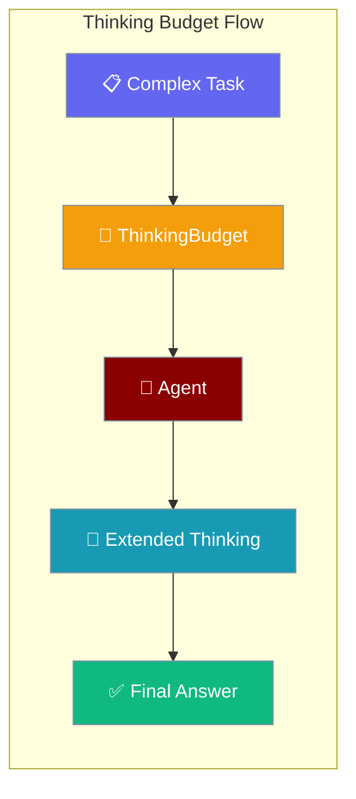

Control how many tokens an agent spends on extended reasoning before producing a response.

```python
from praisonaiagents import Agent
from praisonaiagents.thinking import ThinkingBudget

agent = Agent(
    name="DeepThinker",
    instructions="Solve problems step by step.",
)
agent.thinking_budget = ThinkingBudget.high()
agent.start("Solve this optimisation problem...")
```



## Quick Start

<Steps>
<Step title="Set a Budget Level">
Use predefined levels via the `thinking_budget` property after creating the agent.

```python
from praisonaiagents import Agent
from praisonaiagents.thinking import ThinkingBudget

agent = Agent(name="Thinker", instructions="Reason carefully.")
agent.thinking_budget = ThinkingBudget.medium()  # 8,000 tokens
agent.start("Explain quantum entanglement simply.")
```
</Step>

<Step title="Custom Budget">
Fine-tune token limits and adaptive scaling.

```python
from praisonaiagents import Agent
from praisonaiagents.thinking import ThinkingBudget

budget = ThinkingBudget(
    max_tokens=12000,
    min_tokens=1000,
    adaptive=True,
    max_time_seconds=120.0,
)

agent = Agent(name="CustomThinker", instructions="Solve complex problems.")
agent.thinking_budget = budget
agent.start("Design a load-balancing strategy.")
```
</Step>
</Steps>

## Budget Levels

Pre-configured levels for different task complexity:

| Level | Tokens | Use case |
|-------|--------|----------|
| `minimal()` | 2,000 | Quick answers |
| `low()` | 4,000 | Simple reasoning |
| `medium()` | 8,000 | Default balance |
| `high()` | 16,000 | Complex analysis |
| `maximum()` | 32,000 | Deep research |

```python
from praisonaiagents.thinking import ThinkingBudget

budget = ThinkingBudget.high()
tokens = budget.get_tokens_for_complexity(0.9)  # scales with complexity
```

## CLI Usage

```bash
praisonai thinking status      # Show current budget
praisonai thinking set high    # Set budget level
praisonai thinking stats       # Show usage statistics
```

### `praisonai run --thinking`

Pass `--thinking <budget>` on the `praisonai run` command to set an exact token budget for a one-off prompt:

```bash
# Use a numeric token budget
praisonai run --thinking 4096 "Explain quantum entanglement"

# Use a named level
praisonai run --thinking high "Solve this optimisation problem: ..."

# Use in --command mode
praisonai run --command my_agent.py --thinking 8000
```

<Note>
`--thinking` is now correctly threaded through the direct-prompt path (`praisonai run`) in both `--command` and bare-prompt modes. Earlier releases raised a `NameError` on the direct-prompt path.
</Note>

| Value | Tokens | Notes |
|-------|--------|-------|
| `off` | 0 | Disable extended thinking |
| `minimal` | 2,000 | Quick answers |
| `low` | 4,000 | Simple reasoning |
| `medium` | 8,000 | Balanced |
| `high` | 16,000 | Complex analysis |
| `<int>` | Exact | Any positive integer token budget |

For persistent sessions, use `praisonai thinking set <level>` instead.

---

## Usage Tracking

Track thinking utilisation across sessions:

```python
from praisonaiagents.thinking import ThinkingBudget, ThinkingTracker

tracker = ThinkingTracker()
session = tracker.start_session(budget_tokens=8000)
tracker.end_session(session, tokens_used=5000, time_seconds=30.0)

summary = tracker.get_summary()
print(f"Average utilisation: {summary['average_utilization']:.1%}")
```

---

## Best Practices

<AccordionGroup>
<Accordion title="Match budget to task complexity">
Use `minimal()` or `low()` for quick lookups; reserve `high()` or `maximum()` for multi-step analysis where reasoning depth matters.
</Accordion>

<Accordion title="Set via property, not constructor">
Assign `agent.thinking_budget` after creating the agent — budgets are applied lazily with zero overhead when unset.
</Accordion>

<Accordion title="Enable adaptive scaling">
Set `adaptive=True` so token allocation scales with task complexity via `get_tokens_for_complexity()`.
</Accordion>

<Accordion title="Monitor with CLI">
Use `praisonai thinking stats` to review utilisation before increasing budgets in production.
</Accordion>
</AccordionGroup>

---

## Related

<CardGroup cols={2}>
<Card title="Token Budgeting" icon="coins" href="/docs/features/token-budgeting">
  Manage overall token spend across agent runs
</Card>
<Card title="Reflection" icon="rotate" href="/docs/features/reflection">
  Self-review loops for higher-quality outputs
</Card>
</CardGroup>
