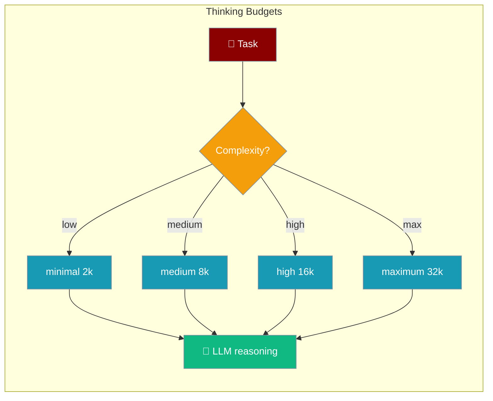
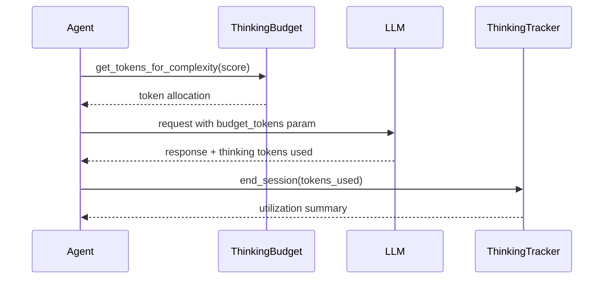

Configure and manage token budgets for extended thinking in LLM reasoning. Control how much "thinking" an agent can do based on task complexity.

## Quick Start

<Steps>
<Step title="Set a thinking budget on an agent">
```python
from praisonaiagents import Agent
from praisonaiagents.thinking import ThinkingBudget

agent = Agent(
    name="DeepThinker",
    instructions="You are a problem-solving assistant that thinks step by step.",
)
agent.thinking_budget = ThinkingBudget.high()
agent.start("Solve this complex optimization problem step by step...")
```
</Step>

<Step title="Use adaptive scaling for variable complexity">
```python
from praisonaiagents.thinking import ThinkingBudget

budget = ThinkingBudget(max_tokens=16000, min_tokens=2000, adaptive=True)
tokens = budget.get_tokens_for_complexity(0.8)
agent.thinking_budget = budget
```
</Step>
</Steps>

---

## How It Works



---

## Budget Levels

Pre-configured budget levels for different use cases:

```python
from praisonaiagents.thinking import ThinkingBudget

# Available levels
minimal = ThinkingBudget.minimal()   # 2,000 tokens
low = ThinkingBudget.low()           # 4,000 tokens
medium = ThinkingBudget.medium()     # 8,000 tokens
high = ThinkingBudget.high()         # 16,000 tokens
maximum = ThinkingBudget.maximum()   # 32,000 tokens
```

## Custom Budgets

```python
budget = ThinkingBudget(
    max_tokens=12000,        # Maximum thinking tokens
    min_tokens=2000,         # Minimum allocation
    adaptive=True,           # Scale based on complexity
    max_time_seconds=120.0   # Time limit
)

agent = Agent(
    name="CustomThinker",
    instructions="You solve complex problems.",
)
# Set thinking budget via property
agent.thinking_budget = budget
```

## Adaptive Scaling

Budgets can scale based on task complexity:

```python
budget = ThinkingBudget(
    max_tokens=16000,
    min_tokens=2000,
    adaptive=True
)

# Get tokens for different complexity levels (0.0 to 1.0)
simple = budget.get_tokens_for_complexity(0.2)   # ~4,800 tokens
medium = budget.get_tokens_for_complexity(0.5)   # ~9,000 tokens
complex = budget.get_tokens_for_complexity(0.9)  # ~14,600 tokens
```

## CLI Usage

```bash
praisonai thinking status      # Show current budget
praisonai thinking set high    # Set budget level
praisonai thinking stats       # Show usage statistics
```

---

## Low-level API Reference

### ThinkingBudget Direct Usage

```python
from praisonaiagents.thinking import ThinkingBudget, ThinkingTracker

# Use predefined budget levels
budget = ThinkingBudget.medium()  # 8,000 tokens
print(f"Max tokens: {budget.max_tokens}")

# Track usage across sessions
tracker = ThinkingTracker()
session = tracker.start_session(budget_tokens=8000)
tracker.end_session(session, tokens_used=5000, time_seconds=30.0)

summary = tracker.get_summary()
print(f"Average utilization: {summary['average_utilization']:.1%}")
```

### Usage Tracking

Track thinking usage across sessions:

```python
from praisonaiagents.thinking import ThinkingUsage, ThinkingTracker

# Single usage record
usage = ThinkingUsage(
    budget_tokens=8000,
    tokens_used=5000,
    time_seconds=30.0,
    budget_time=60.0
)

print(f"Utilization: {usage.token_utilization:.1%}")
print(f"Over budget: {usage.is_over_budget}")
print(f"Tokens remaining: {usage.tokens_remaining}")
```

### Session Tracking

```python
tracker = ThinkingTracker()

# Track multiple sessions
for task in tasks:
    session = tracker.start_session(budget_tokens=8000)
    # ... agent thinking ...
    tracker.end_session(session, tokens_used=actual_tokens)

# Get aggregate statistics
summary = tracker.get_summary()
print(f"Total sessions: {summary['session_count']}")
print(f"Total tokens: {summary['total_tokens_used']}")
print(f"Avg utilization: {summary['average_utilization']:.1%}")
print(f"Over-budget: {summary['over_budget_count']}")
```

### Serialization

```python
from praisonaiagents.thinking.budget import BudgetLevel

# Create from level
budget = ThinkingBudget.from_level(BudgetLevel.HIGH)

# Serialize
data = budget.to_dict()

# Restore
restored = ThinkingBudget.from_dict(data)
```

## Best Practices

<AccordionGroup>
<Accordion title="Match budget to task complexity">
Use `ThinkingBudget.minimal()` (2k) for simple Q&A and `ThinkingBudget.high()` (16k) or `maximum()` (32k) only for multi-step reasoning tasks to avoid unnecessary cost.
</Accordion>

<Accordion title="Enable adaptive scaling">
Set `adaptive=True` and call `get_tokens_for_complexity(score)` with a 0–1 complexity score. This lets a single budget instance handle a wide range of tasks efficiently.
</Accordion>

<Accordion title="Track utilization to tune budgets">
Use `ThinkingTracker.get_summary()` to review average utilization. If average is below 50%, lower your `max_tokens`; if frequently over budget, raise it.
</Accordion>

<Accordion title="Zero overhead when not used">
Thinking budgets use lazy loading — importing `ThinkingBudget` does not load any heavy dependencies until a budget is instantiated.
</Accordion>
</AccordionGroup>

---

## Related

<CardGroup cols={2}>
<Card title="Token Budgeting" icon="calculator" href="/features/token-budgeting">
  Context-window token management for RAG and retrieval
</Card>
<Card title="Lazy Imports" icon="bolt" href="/features/lazy-imports">
  Fast startup and deferred dependency loading
</Card>
</CardGroup>
