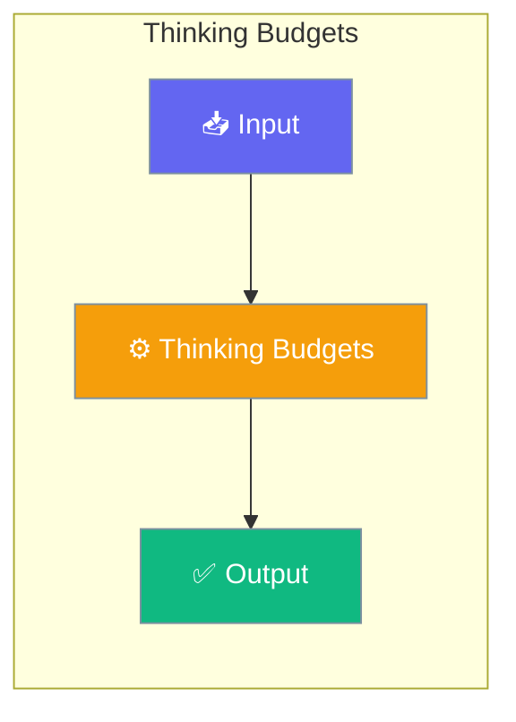

# Thinking Budgets

Configure and manage token budgets for extended thinking in LLM reasoning. Control how much "thinking" an agent can do based on task complexity.




## Quick Start


<Steps>
<Step title="Quick Start">
### Agent-Centric Usage

```python
from praisonaiagents import Agent
from praisonaiagents.thinking import ThinkingBudget

# Agent with thinking budget for complex reasoning
agent = Agent(
    name="DeepThinker",
    instructions="You are a problem-solving assistant that thinks step by step.",
)
# Set thinking budget via property (not constructor param)
agent.thinking_budget = ThinkingBudget.high()  # 16,000 tokens for reasoning

# Agent uses extended thinking for complex problems
agent.start("Solve this complex optimization problem step by step...")

# Available budget levels: minimal(), low(), medium(), high(), maximum()
```
</Step>
</Steps>


## Best Practices

<AccordionGroup>
  <Accordion title="Start simple">
    Enable the feature with a single parameter before adding configuration. Verify it works, then layer in options.
  </Accordion>
  <Accordion title="Use environment variables for secrets">
    Never hardcode API keys or tokens. Use `os.getenv("KEY_NAME")` to read from environment variables.
  </Accordion>
  <Accordion title="Test with minimal examples first">
    Copy the Quick Start example, run it, then extend it. This confirms your environment is set up correctly.
  </Accordion>
  <Accordion title="Check the logs">
    Set `verbose=True` on your agent to see detailed execution logs when debugging unexpected behavior.
  </Accordion>
</AccordionGroup>

## Related

<CardGroup cols={2}>
  <Card title="Features Overview" icon="grid-2" href="/docs/features">
    Browse all PraisonAI features
  </Card>
  <Card title="Quick Start" icon="rocket" href="/docs/introduction">
    Get started with PraisonAI agents
  </Card>
</CardGroup>
