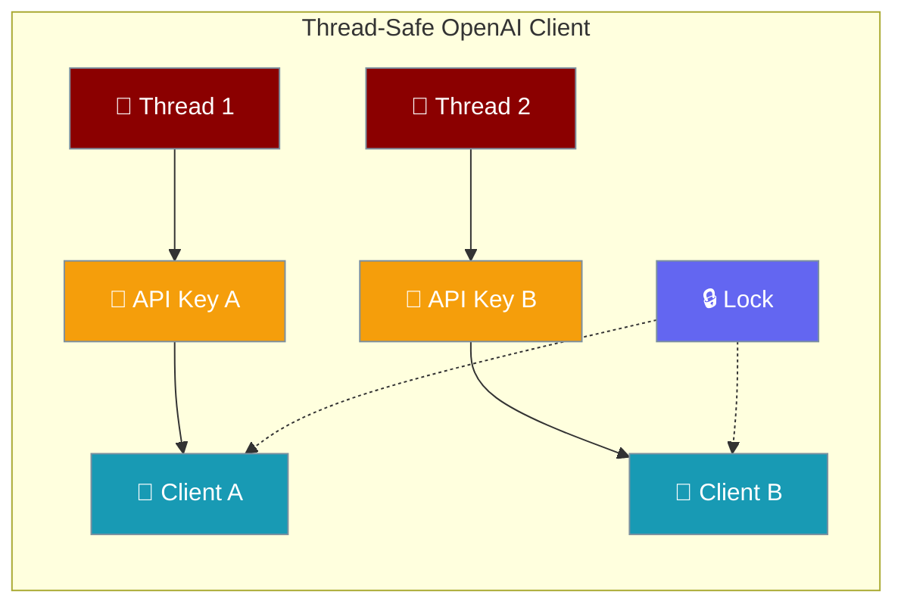

# Thread-Safe Agent State

PraisonAI Agents v0.5.0+ includes thread-safe management of chat history and caches, enabling safe concurrent access from multiple threads.

## Thread-Safe Components

### Chat History

The `chat_history` property is now fully thread-safe with automatic locking. The SDK protects chat history mutations through internal helper methods and a locked setter:

```python
from praisonaiagents import Agent
import threading

agent = Agent(
    name="ThreadSafeAgent",
    instructions="You are helpful."
)

def worker(prompt):
    # Safe to call from multiple threads
    response = agent.chat(prompt)
    print(f"Response: {response[:50]}...")

# Create multiple threads
threads = [
    threading.Thread(target=worker, args=(f"Question {i}",))
    for i in range(5)
]

# Start all threads
for t in threads:
    t.start()

# Wait for completion
for t in threads:
    t.join()
```

#### What changed in PR #1488

<Note>
Prior to PR #1488, chat_history mutations bypassed thread-safety locks at 31+ call sites. The SDK now uses internal helper methods that properly acquire locks:
- `_append_to_chat_history(message)` - Thread-safe message appending
- `_truncate_chat_history(length)` - Thread-safe history truncation  
- `_replace_chat_history(new_history)` - Thread-safe full replacement
- `chat_history` setter now acquires the `AsyncSafeState` lock for assignments
</Note>

#### Safe operations

```python
# These operations are now thread-safe out of the box:
agent.chat_history = []  # Full replacement - uses locked setter
agent.chat("Hello")      # Appends safely via internal methods

# Reading is always safe:
history = agent.chat_history
print(f"History has {len(history)} messages")
```

### Caches

Internal caches use `threading.RLock` for reentrant locking:

- `_system_prompt_cache` - Cached system prompts
- `_formatted_tools_cache` - Cached tool definitions

## LiteAgent Thread Safety

The lite package also provides thread-safe operations:

```python
from praisonaiagents.lite import LiteAgent, create_openai_llm_fn
import threading

llm_fn = create_openai_llm_fn(model="gpt-4o-mini")
agent = LiteAgent(name="LiteThreadSafe", llm_fn=llm_fn)

def concurrent_chat(message):
    return agent.chat(message)

# Safe concurrent access
with threading.ThreadPoolExecutor(max_workers=5) as executor:
    futures = [executor.submit(concurrent_chat, f"Q{i}") for i in range(10)]
    results = [f.result() for f in futures]
```

## Implementation Details

### Lock Types

| Component | Lock Type | Reason |
|-----------|-----------|--------|
| chat_history | `Lock` | Simple mutual exclusion |
| caches | `RLock` | Allows reentrant access |

### Lock Usage Pattern

```python
# Internal implementation pattern
class Agent:
    def __init__(self):
        self._history_lock = threading.Lock()
        self._cache_lock = threading.RLock()
        self.chat_history = []
    
    def _add_to_history(self, message):
        with self._history_lock:
            self.chat_history.append(message)
    
    def _get_cached_prompt(self):
        with self._cache_lock:
            # Safe reentrant access
            return self._system_prompt_cache.get(key)
```

## Best Practices

### Do: Use Agent Methods

```python
# Good - thread-safe
response = agent.chat("Hello")
```

### Don't: Bypass the Property Interface

```python
# Bad - bypasses locks (direct list mutation)
agent.chat_history.append({"role": "user", "content": "Hello"})

# Good - uses locked setter
agent.chat_history = agent.chat_history + [{"role": "user", "content": "Hello"}]

# Better - use agent methods
agent.chat("Hello")
```

<Note>
Reads and full replacements via `agent.chat_history = [...]` are now safe out-of-the-box. The wrapper is only needed for custom compound operations that require atomic read-modify-write sequences.
</Note>

### Do: Clear History Safely

```python
# Good - use provided method
agent.clear_history()  # Thread-safe
```

## Async Considerations

For async code, use asyncio locks instead:

```python
import asyncio
from praisonaiagents import Agent

agent = Agent(name="AsyncAgent")
lock = asyncio.Lock()

async def async_chat(prompt):
    async with lock:
        # Ensure sequential access in async context
        return agent.chat(prompt)

async def main():
    tasks = [async_chat(f"Question {i}") for i in range(5)]
    results = await asyncio.gather(*tasks)
```

## Verifying Thread Safety

Test thread safety with concurrent access:

```python
import threading
from praisonaiagents.lite import LiteAgent

def test_thread_safety():
    agent = LiteAgent(
        name="Test",
        llm_fn=lambda m: "Response"
    )
    
    errors = []
    
    def worker():
        try:
            for _ in range(100):
                agent.chat("Test")
        except Exception as e:
            errors.append(e)
    
    threads = [threading.Thread(target=worker) for _ in range(10)]
    for t in threads:
        t.start()
    for t in threads:
        t.join()
    
    assert len(errors) == 0, f"Thread safety errors: {errors}"
    print("Thread safety test passed!")

test_thread_safety()
```

### Multi-team HTTP launch

PraisonAI provides comprehensive thread-safety for HTTP server deployment:

- Multiple `Agent` / `Agents` instances may call `.launch(port=N)` concurrently from different threads — registration is atomic.
- If two launch calls use the same path on the same port, the second gets an auto-suffixed path (`/path_abc123`) and a warning is logged.
- Server readiness is signalled deterministically (no fixed sleep); `.launch()` returns only after the port is accepting connections (5s timeout).
- `aworkflow()` state lock is created inside the running async context, so workflows remain stable when invoked under pytest-asyncio or when nested inside another loop.

```python
import threading
from praisonaiagents import AgentTeam

def launch_team(team_name, port, path):
    team = AgentTeam(name=team_name)
    team.launch(port=port, path=path)

# Safe concurrent launches
thread1 = threading.Thread(target=launch_team, args=("TeamA", 8000, "/team_a"))
thread2 = threading.Thread(target=launch_team, args=("TeamB", 8000, "/team_b"))

thread1.start()
thread2.start()

thread1.join()
thread2.join()

# Both teams available at:
# - http://localhost:8000/team_a
# - http://localhost:8000/team_b
```

## Wrapper-layer thread safety (`praisonai` package)

The `praisonai` wrapper layer (distinct from the `praisonaiagents` content above) provides thread-safe OpenAI client management and CLI command discovery.



### Key-aware OpenAI client

The OpenAI client is now cached per `(api_key, base_url)` tuple, allowing multiple keys in the same process without cross-talk:

```python
from praisonai import PraisonAI
import threading

def worker_with_different_key(api_key, task_name):
    # Each thread gets its own client based on the key
    praisonai = PraisonAI(
        auto=f"Create a {task_name}",
        api_key=api_key  # Different key per thread
    )
    result = praisonai.run()
    print(f"{task_name} completed")

# Two threads with different OpenAI keys
thread1 = threading.Thread(
    target=worker_with_different_key,
    args=("sk-key-team-a", "marketing plan")
)
thread2 = threading.Thread(
    target=worker_with_different_key, 
    args=("sk-key-team-b", "technical doc")
)

thread1.start()
thread2.start()
thread1.join()
thread2.join()
```

### Thread-safe Typer command discovery

Embedding `python -m praisonai` from multiple threads is now safe. The CLI command discovery uses a double-check lock pattern and doesn't poison the cache on failure:

```python
import threading
import subprocess

def run_cli_command(command):
    # Safe to call from multiple threads
    result = subprocess.run(
        ["python", "-m", "praisonai"] + command,
        capture_output=True, text=True
    )
    return result.stdout

# Multiple threads can safely use the CLI
threads = [
    threading.Thread(target=run_cli_command, args=(["--version"],))
    for _ in range(5)
]

for t in threads:
    t.start()
for t in threads:
    t.join()
```

### Failure-safe cache

A transient discovery error does not lock the CLI into a broken state — the next call retries instead of permanently breaking dispatch. This ensures reliable operation in multi-threaded server environments where temporary import failures might occur.

## Related

- [Thread Safety CLI](/docs/cli/thread-safety)
- [Lite Package](/docs/features/lite-package)
- [Agent Module](/docs/sdk/praisonaiagents/agent/agent)
