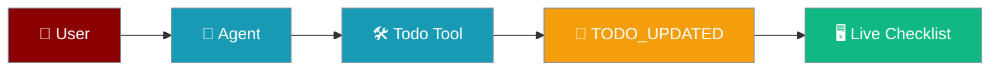
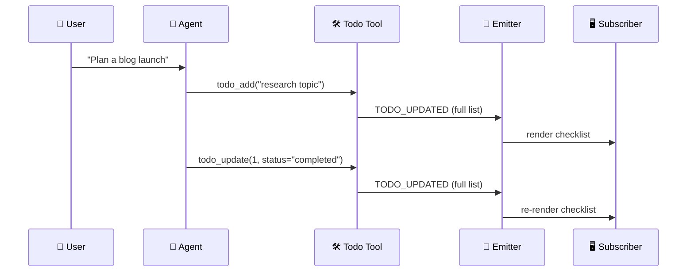
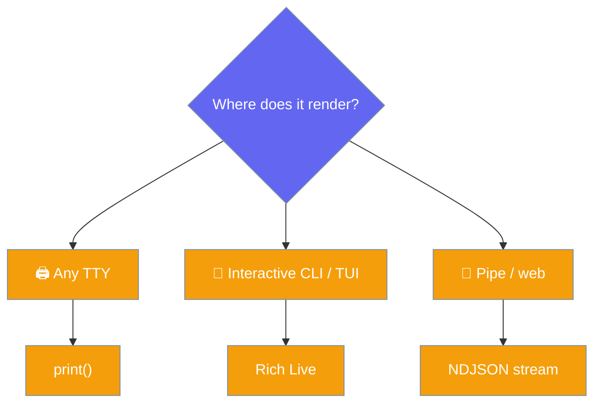

Subscribe to `TODO_UPDATED` to render a live checklist that updates as the agent adds and ticks off items.



The agent adds and updates todos with the built-in todo tool; each change emits a `TODO_UPDATED` event carrying the **full ordered list**, so any subscriber renders the current state without tracking deltas.

## Quick Start

<Steps>
<Step title="Enable the todo tool">
```python
from praisonaiagents import Agent

agent = Agent(
    name="Planner",
    instructions="Break tasks into todos, then execute them one by one.",
    tools=["todo_add", "todo_list", "todo_update"],
)
agent.start("Plan a blog launch — research, draft, publish.")
```
</Step>

<Step title="Subscribe to live updates">
```python
from praisonaiagents import Agent
from praisonaiagents.streaming import StreamEvent, StreamEventType

MARK = {"pending": "[ ]", "in_progress": "[~]", "completed": "[x]", "cancelled": "[-]"}

def on_event(event: StreamEvent):
    if event.type == StreamEventType.TODO_UPDATED:
        for t in event.metadata["todos"]:
            print(f"{MARK[t['status']]} {t['task']}")

agent = Agent(
    name="Planner",
    instructions="Break the task into todos. Mark exactly one as in_progress at a time; complete it before moving on.",
    tools=["todo_add", "todo_list", "todo_update"],
)
agent.stream_emitter.add_callback(on_event)
agent.start("Plan a blog launch — research, draft, publish.")
```

<Note>
Works for a **solo** `Agent` — no `AgentTeam(planning=True)` required. Any frontend (CLI, TUI, web, Python) can subscribe and render a live checklist.
</Note>
</Step>
</Steps>

---

## How It Works

Every `todo_add` and `todo_update` emits a `TODO_UPDATED` event with the complete, ordered list.



The event carries the **full ordered list**, so subscribers never track deltas — each event is a complete snapshot.

---

## What's in the event

The `TODO_UPDATED` event carries the current list in `metadata`.

| Field | Value |
|-------|-------|
| `event.type` | `StreamEventType.TODO_UPDATED` |
| `event.metadata["todos"]` | Full ordered list of todo dicts (`id`, `task`, `status`, `priority`, `category`, …) |

Each todo dict looks like:

```python
{
    "id": 1,
    "task": "research blog topic",
    "priority": "high",
    "category": "general",
    "status": "in_progress",
}
```

Status is one of `pending` | `in_progress` | `completed` | `cancelled`.

---

## The single-`in_progress` rule

Setting a todo to `in_progress` demotes any other `in_progress` item back to `pending`, so exactly one item is active at a time.

```python
todo_update(1, status="in_progress")   # todo 1 is now in_progress
todo_update(2, status="in_progress")   # todo 1 auto-demoted to pending; only todo 2 is in_progress
```

This keeps rendered checklists unambiguous — "what is the agent working on right now?" always has one answer. It matches the prompt policy recommended for the `coding` toolset.

---

## Choosing a Renderer

Pick a renderer based on where the checklist appears.



| Renderer | Best for |
|----------|----------|
| Plain `print()` | Quickest — works on any TTY |
| Rich `Live` | In-place refreshing checklist for interactive CLI / TUI |
| NDJSON (`--output json`) | Pipe to a web client — the event serialises through the existing stream emitter |

Rich `Live` re-renders the same block on every event:

```python
from rich.live import Live
from rich.text import Text
from praisonaiagents import Agent
from praisonaiagents.streaming import StreamEvent, StreamEventType

MARK = {"pending": "[ ]", "in_progress": "[~]", "completed": "[x]", "cancelled": "[-]"}
live = Live(Text(""), refresh_per_second=8)
live.start()

def on_event(event: StreamEvent):
    if event.type == StreamEventType.TODO_UPDATED:
        lines = [f"{MARK[t['status']]} {t['task']}" for t in event.metadata["todos"]]
        live.update(Text("\n".join(lines)))

agent = Agent(
    name="Planner",
    instructions="Break the task into todos. Keep exactly one in_progress.",
    tools=["todo_add", "todo_list", "todo_update"],
)
agent.stream_emitter.add_callback(on_event)
agent.start("Plan a blog launch — research, draft, publish.")
live.stop()
```

<Note>
`TODO_UPDATED` events propagate through the async tool path too — async tools that mutate todos stream live in the same way. No extra wiring is required.
</Note>

---

## Best Practices

<AccordionGroup>
<Accordion title="Keep exactly one item in_progress">
Instruct the agent to mark exactly one item `in_progress` and complete it before moving on. The runtime enforces the single-`in_progress` rule, but a clear instruction produces cleaner checklists.
</Accordion>

<Accordion title="Render the full list, not deltas">
Each `TODO_UPDATED` event is a complete snapshot in `metadata["todos"]`. Re-render the whole list every time — the event is idempotent, so you never need to reconcile partial updates.
</Accordion>

<Accordion title="Cheap when nothing is listening">
The emit is a no-op with no active subscriber, so leaving the todo tool enabled costs nothing until a callback is attached.
</Accordion>

<Accordion title="Combine with TOOL_PROGRESS for a two-tier view">
Render the checklist from `TODO_UPDATED` and the current tool's live output from `TOOL_PROGRESS` for a list-plus-detail view. See [Tool Progress Streaming](/features/tool-progress-streaming).
</Accordion>
</AccordionGroup>

---

## Related

<CardGroup cols={2}>
<Card title="Todo Planning" icon="list-check" href="/features/todo-planning">
  Add, list, and update todos with the built-in todo tool
</Card>
<Card title="Streaming" icon="bolt" href="/features/streaming">
  Subscribe to streaming responses and events
</Card>
<Card title="Tool Progress Streaming" icon="gauge" href="/features/tool-progress-streaming">
  Stream incremental output from inside running tools
</Card>
<Card title="Streaming Progress Compositor" icon="layer-group" href="/features/streaming-progress-compositor">
  Fold typed StreamEvents into a bounded status view
</Card>
</CardGroup>
