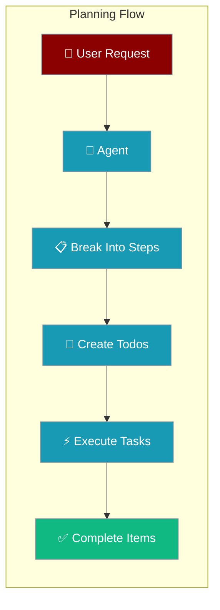
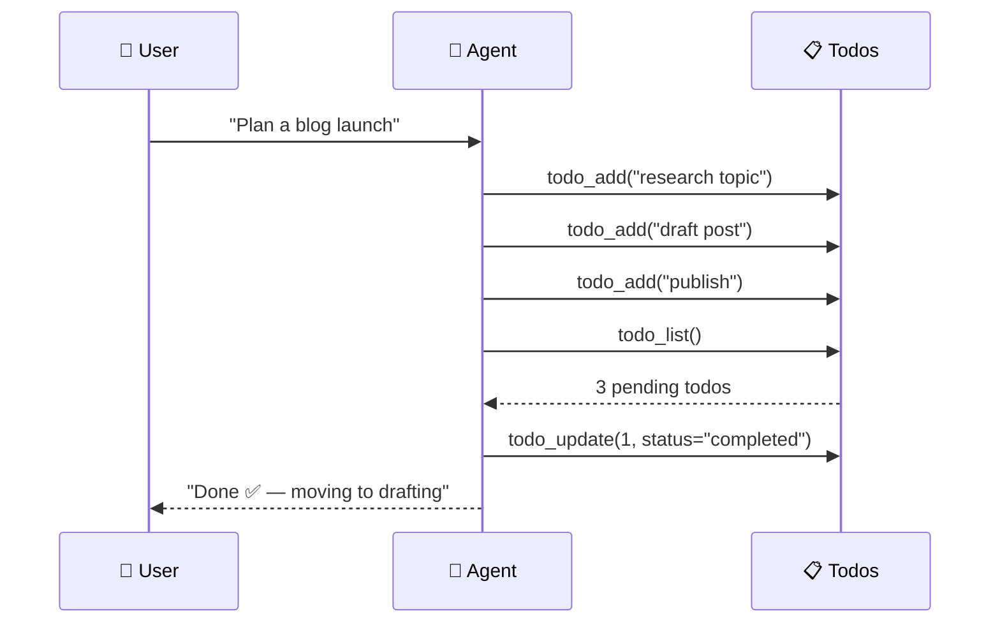

Todo planning enables agents to break complex tasks into manageable steps, track progress, and maintain persistent task lists across sessions.



## Quick Start

<Steps>
<Step title="Agent with Planning">
```python
from praisonaiagents import Agent

agent = Agent(
    name="Planner",
    instructions="Break tasks into todos, then execute them one by one.",
    tools=["todo_add", "todo_list", "todo_update"]
)

agent.start("Plan a blog launch — research, draft, publish.")
```
</Step>

<Step title="Interactive Planning Flow">
```python
# User: "Plan a blog launch"
# Agent automatically:
# 1. Calls todo_add("research blog topic", priority="high")  
# 2. Calls todo_add("draft blog post", priority="medium")
# 3. Calls todo_add("publish to website", priority="medium")
# 4. Calls todo_list() to review plan
# 5. Updates todos as tasks complete
```
</Step>
</Steps>

---

## How It Works



Todo persistence works through JSON storage with automatic workspace integration:

| Storage Location | When Used | Purpose |
|------------------|-----------|---------|
| `<workspace>/todos.json` | Bot with workspace | Session-isolated todos |
| `~/.praisonai/todos.json` | Agent without workspace | Global todo storage |
| Memory only | Stateless mode | No persistence |

---

## Configuration Options

### Todo Management Functions

| Function | Args | Description |
|----------|------|-------------|
| `todo_add` | `task`, `priority="medium"`, `category="general"` | Create new todo item |
| `todo_list` | `status="all"`, `category=None` | List todos with filtering |
| `todo_update` | `todo_id`, `status`, `task`, `priority` | Update existing todo |

### Priority Levels

```python
# Priority affects planning order but not execution
todo_add("critical bug fix", priority="high")      # First priority
todo_add("update docs", priority="medium")          # Standard priority  
todo_add("cleanup code", priority="low")            # Background task
```

### Status Values

```python
# Todo lifecycle management
todo_update(1, status="pending")     # Default state
todo_update(2, status="completed")   # Task finished
todo_update(3, status="cancelled")   # Task abandoned
```

### Category Organization

```python
# Organize todos by type
todo_add("research framework", category="development")
todo_add("schedule meeting", category="coordination") 
todo_add("write tests", category="quality")

# Filter by category
todo_list(category="development")  # Development tasks only
```

---

## Common Patterns

### Multi-Step Project Planning

```python
agent = Agent(
    name="Project Manager",
    instructions="""
    For complex projects:
    1. Break into logical phases using todo_add
    2. Set appropriate priorities (high/medium/low)
    3. Use categories for organization
    4. Update status as work progresses
    """,
    tools=["todo_add", "todo_list", "todo_update"]
)

# User: "Plan a website redesign project"
# Agent creates:
# todo_add("analyze current site", priority="high", category="research")
# todo_add("design mockups", priority="high", category="design")
# todo_add("develop frontend", priority="medium", category="development")
# todo_add("user testing", priority="medium", category="testing")
# todo_add("deploy to production", priority="low", category="deployment")
```

### Progress Tracking

```python
# Agent updates todos as work completes
todo_update(1, status="completed")  # Research finished
todo_list(status="pending")         # Show remaining work
todo_add("implement user feedback", priority="high")  # Add new task
```

### Category-Based Workflow

```python
# Focus on specific work types
todo_list(category="development")   # Development tasks
todo_list(category="research")      # Research tasks  
todo_list(status="completed")       # Review finished work
```

---

## Best Practices

<AccordionGroup>
<Accordion title="Granular Task Breakdown">
Create specific, actionable todo items rather than vague goals. "Write user authentication tests" is better than "test the app".
</Accordion>

<Accordion title="Priority-Driven Planning">
Use priority levels to guide task ordering. High-priority items should address critical blockers or dependencies.
</Accordion>

<Accordion title="Category Organization">
Group related todos by category to maintain clear project structure and enable focused work sessions.
</Accordion>

<Accordion title="Progress Discipline">
Update todo status promptly as work completes. This maintains accurate project visibility and planning momentum.
</Accordion>
</AccordionGroup>

---

## Related

<CardGroup cols={2}>
<Card title="Self-Improving Skills" icon="wand-magic-sparkles" href="/docs/features/skill-manage">
  How todo planning combines with skill creation
</Card>
<Card title="Workspace" icon="folder-lock" href="/docs/features/workspace">
  Todo storage within workspace boundaries
</Card>
</CardGroup>