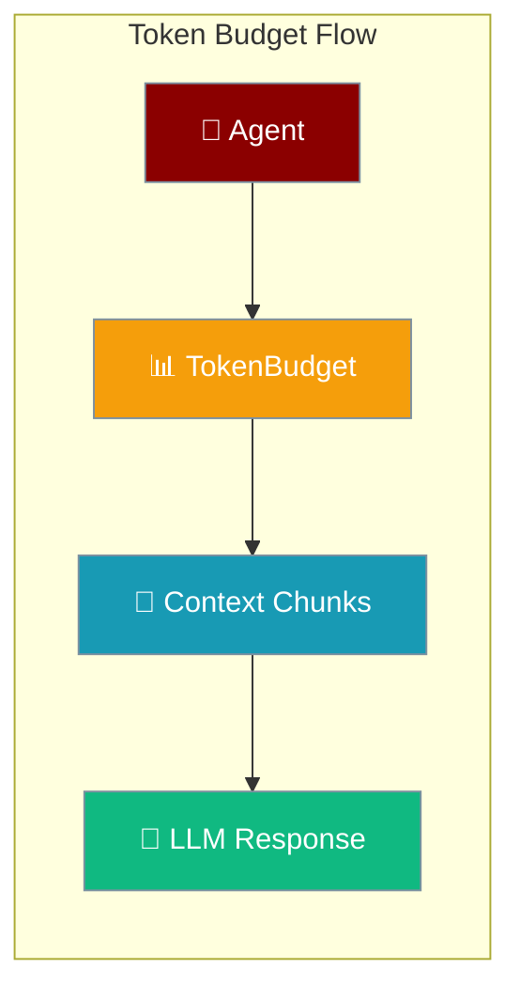

Token budgeting keeps retrieved context within each model's window so agents never overflow the context limit.

```python
from praisonaiagents import Agent, KnowledgeConfig

agent = Agent(
    name="Researcher",
    instructions="Answer from the knowledge base.",
    knowledge=KnowledgeConfig(sources=["./docs"], retrieval_k=5),
)
agent.start("What are the key features?")
```



## Quick Start

<Steps>
<Step title="Agent with Knowledge">
Knowledge retrieval applies token budgets automatically when indexing and retrieving.

```python
from praisonaiagents import Agent, KnowledgeConfig

agent = Agent(
    name="BudgetAwareAgent",
    instructions="Answer questions using the knowledge base.",
    knowledge=KnowledgeConfig(sources=["./docs"], retrieval_k=5),
)
agent.start("What are the key features?")
```
</Step>

<Step title="Direct Budget Control">
Use `TokenBudget` when building custom RAG pipelines.

```python
from praisonaiagents.rag import TokenBudget, DefaultBudgetEnforcer

budget = TokenBudget(model="gpt-4o-mini")
available = budget.dynamic_budget(system_tokens=500, history_tokens=1000)

enforcer = DefaultBudgetEnforcer()
chunks = ["chunk one...", "chunk two...", "chunk three..."]
enforced = enforcer.enforce(budget, chunks)
print(f"Kept {len(enforced)} of {len(chunks)} chunks ({available} tokens available)")
```
</Step>
</Steps>

## Configuration

### TokenBudget Options

| Option | Type | Default | Description |
|--------|------|---------|-------------|
| `model` | `str` | `"gpt-4o-mini"` | Model name for context window lookup |
| `reserved_response` | `int` | `4096` | Tokens reserved for the LLM response |
| `reserved_system` | `int` | `500` | Tokens reserved for system prompt |
| `reserved_history` | `int` | `1000` | Tokens reserved for chat history |

```python
from praisonaiagents.rag import TokenBudget

budget = TokenBudget(
    model="gpt-4o",
    reserved_response=4096,
    reserved_system=1000,
    reserved_history=2000,
)
print(budget.model_context_window)  # 128000
print(budget.max_context_tokens)
```

### Model Context Windows

| Model | Context Window |
|-------|---------------|
| gpt-4o | 128,000 |
| gpt-4o-mini | 128,000 |
| gpt-4-turbo | 128,000 |
| gpt-3.5-turbo | 16,385 |
| claude-3-opus | 200,000 |
| claude-3-sonnet | 200,000 |
| gemini-pro | 32,000 |

## Budget Enforcement

```python
from praisonaiagents.rag import TokenBudget, DefaultBudgetEnforcer

budget = TokenBudget(model="gpt-4o-mini")
enforcer = DefaultBudgetEnforcer()

chunks = ["chunk1 content...", "chunk2 content...", "chunk3 content..."]
enforced_chunks = enforcer.enforce(budget, chunks)
```

Implement `BudgetEnforcerProtocol` for priority-based or custom selection strategies.

## CLI Usage

```bash
praisonai knowledge stats --json
praisonai knowledge index ./docs --verbose
```

---

## Best Practices

<AccordionGroup>
<Accordion title="Reserve adequate response tokens">
Leave enough headroom for complete answers — undersized `reserved_response` truncates outputs mid-sentence.
</Accordion>

<Accordion title="Account for chat history">
Multi-turn conversations consume tokens quickly; increase `reserved_history` or enable context compaction on long sessions.
</Accordion>

<Accordion title="Match budget to model">
Different models have different context windows — always pass the actual model name so `dynamic_budget()` calculates correctly.
</Accordion>

<Accordion title="Monitor with verbose indexing">
Run `praisonai knowledge index ./docs --verbose` to see chunk counts and token estimates before production retrieval.
</Accordion>
</AccordionGroup>

---

## Related

<CardGroup cols={2}>
<Card title="Thinking Budgets" icon="brain" href="/docs/features/thinking-budgets">
  Extended reasoning token limits
</Card>
<Card title="Token Usage Protocol" icon="chart-line" href="/docs/features/token-usage-protocol">
  Track token consumption across runs
</Card>
</CardGroup>
