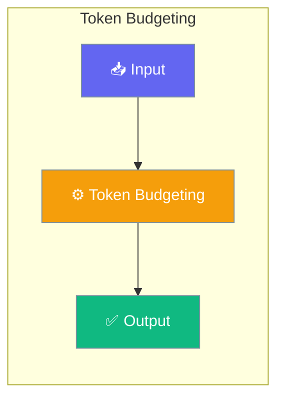

# Token Budgeting

Token budgeting enables intelligent management of context windows across different LLM models, ensuring optimal use of available tokens while reserving space for responses.




## Overview

The token budgeting system provides:
- **Dynamic budget calculation** based on model context windows
- **Reserved token allocation** for system prompts, history, and responses
- **Automatic enforcement** to prevent context overflow
- **Model-aware defaults** for popular LLM providers

## Quick Start


<Steps>
<Step title="Quick Start">
```python
from praisonaiagents.rag import TokenBudget, DefaultBudgetEnforcer

# Create budget for a specific model
budget = TokenBudget(model="gpt-4o-mini")

# Calculate available tokens
available = budget.dynamic_budget(
    system_tokens=500,
    history_tokens=1000,
)

print(f"Model context window: {budget.model_context_window}")
print(f"Available for context: {available}")
```
</Step>
</Steps>


## Best Practices

<AccordionGroup>
  <Accordion title="Start simple">
    Enable the feature with a single parameter before adding configuration. Verify it works, then layer in options.
  </Accordion>
  <Accordion title="Use environment variables for secrets">
    Never hardcode API keys or tokens. Use `os.getenv("KEY_NAME")` to read from environment variables.
  </Accordion>
  <Accordion title="Test with minimal examples first">
    Copy the Quick Start example, run it, then extend it. This confirms your environment is set up correctly.
  </Accordion>
  <Accordion title="Check the logs">
    Set `verbose=True` on your agent to see detailed execution logs when debugging unexpected behavior.
  </Accordion>
</AccordionGroup>

## Related

<CardGroup cols={2}>
  <Card title="Features Overview" icon="grid-2" href="/docs/features">
    Browse all PraisonAI features
  </Card>
  <Card title="Quick Start" icon="rocket" href="/docs/introduction">
    Get started with PraisonAI agents
  </Card>
</CardGroup>
