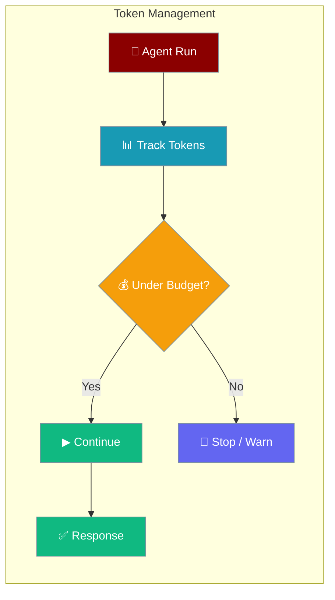
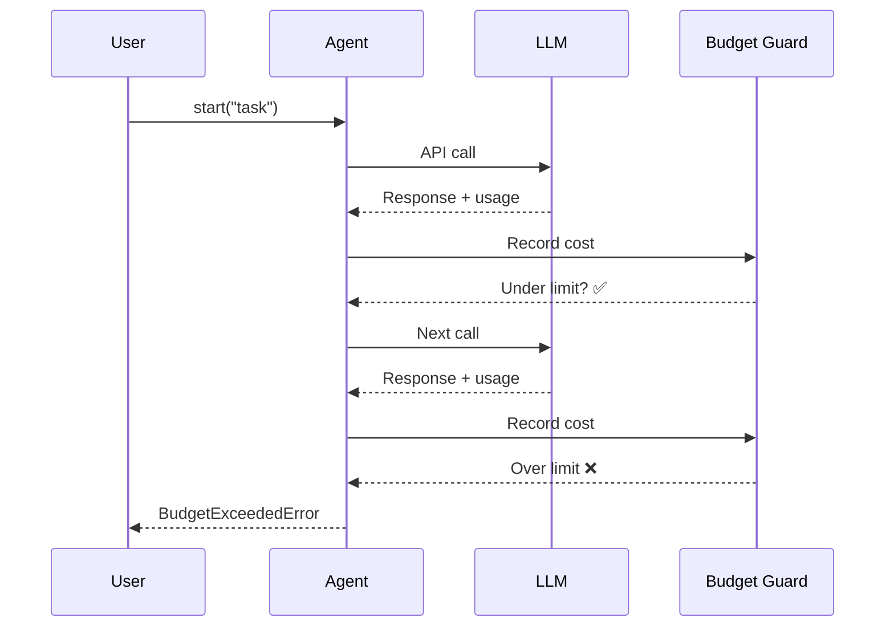

Set hard cost caps, track token usage, and control context window limits so agents never exceed your budget.



## Quick Start

<Steps>
<Step title="Set a USD Budget Cap">
```python
from praisonaiagents import Agent, ExecutionConfig

agent = Agent(
    name="Researcher",
    instructions="Research topics thoroughly",
    execution=ExecutionConfig(max_budget=0.50),
)

agent.start("Summarise the history of machine learning")
```

When spend reaches $0.50, the run stops with `BudgetExceededError`.
</Step>

<Step title="Warn Instead of Stopping">
```python
from praisonaiagents import Agent, ExecutionConfig

agent = Agent(
    name="Analyst",
    instructions="Analyse data",
    execution=ExecutionConfig(
        max_budget=1.00,
        on_budget_exceeded="warn",
    ),
)

agent.start("Analyse quarterly sales trends")
```
</Step>

<Step title="Limit Context Window">
```python
from praisonaiagents import Agent, ExecutionConfig

agent = Agent(
    name="Writer",
    instructions="Write detailed reports",
    execution=ExecutionConfig(
        max_context_tokens=32000,
    ),
)

agent.start("Write a comprehensive market report")
```
</Step>
</Steps>

---

## How It Works



After each LLM call, the SDK accumulates the token cost. When cumulative spend exceeds `max_budget`, the agent raises `BudgetExceededError` before the next call.

---

## Configuration Options

<Card title="ExecutionConfig API Reference" icon="code" href="/docs/sdk/praisonaiagents/config/execution-config">
  Full reference for `ExecutionConfig` — all execution limits including budget, retries, and iteration caps
</Card>

### Budget Parameters

| Parameter | Type | Default | Description |
|-----------|------|---------|-------------|
| `max_budget` | `float \| None` | `None` | Hard USD limit per agent run. `None` = disabled |
| `on_budget_exceeded` | `str \| callable` | `"stop"` | `"stop"` raises `BudgetExceededError`, `"warn"` logs and continues, or a callable `(total_cost, max_budget)` |
| `max_context_tokens` | `int \| None` | `None` | Maximum tokens before context compaction triggers. `None` = auto-detect from model |

### Iteration and Retry Limits

| Parameter | Type | Default | Description |
|-----------|------|---------|-------------|
| `max_iter` | `int` | `20` | Maximum tool-call iterations per run |
| `max_retry_limit` | `int` | `2` | Retries on transient LLM errors |
| `max_execution_time` | `int \| None` | `None` | Wall-clock timeout in seconds |
| `max_rpm` | `int \| None` | `None` | Maximum requests per minute |

---

## Common Patterns

### Custom Budget Handler

```python
from praisonaiagents import Agent, ExecutionConfig

def budget_alert(total_cost: float, max_budget: float):
    print(f"Budget alert: ${total_cost:.4f} of ${max_budget:.2f} used")

agent = Agent(
    name="CostAwareAgent",
    instructions="Complete the task within budget",
    execution=ExecutionConfig(
        max_budget=2.00,
        on_budget_exceeded=budget_alert,
    ),
)

agent.start("Write a 5000-word essay on AI ethics")
```

### Catch BudgetExceededError

```python
from praisonaiagents import Agent, ExecutionConfig
from praisonaiagents.errors import BudgetExceededError

agent = Agent(
    name="Researcher",
    instructions="Research AI safety",
    execution=ExecutionConfig(max_budget=0.10),
)

try:
    result = agent.start("Research AI safety comprehensively")
except BudgetExceededError as e:
    print(f"Budget exceeded: {e}")
```

### Multi-Agent Budget Control

```python
from praisonaiagents import Agent, Task, PraisonAIAgents, ExecutionConfig

researcher = Agent(
    name="Researcher",
    instructions="Research the topic",
    execution=ExecutionConfig(max_budget=0.50),
)

writer = Agent(
    name="Writer",
    instructions="Write the report",
    execution=ExecutionConfig(max_budget=0.30),
)

tasks = [
    Task(description="Research renewable energy", agent=researcher),
    Task(description="Write a 500-word report", agent=writer),
]

PraisonAIAgents(agents=[researcher, writer], tasks=tasks).start()
```

---

## Best Practices

<AccordionGroup>
<Accordion title="Set conservative budgets in development">
Start with low limits (e.g. $0.10) while developing, then increase for production. This surfaces unexpected token usage early — a multi-turn agent can accumulate costs faster than expected.
</Accordion>

<Accordion title="Use warn mode for non-critical workflows">
`on_budget_exceeded="warn"` lets the agent complete its response even after the threshold, giving you visibility without hard stops. Reserve `"stop"` for cost-sensitive production workflows.
</Accordion>

<Accordion title="Combine with context compaction">
Set `max_context_tokens` alongside `max_budget` to cap both cost and context size. Context compaction (`context_compaction=True`) automatically summarises history when the window is full, reducing token spend across long sessions.
</Accordion>

<Accordion title="Monitor costs across multi-agent runs">
Each agent tracks budget independently. Set per-agent `max_budget` limits to ensure a slow agent in a pipeline doesn't consume the entire run budget.
</Accordion>
</AccordionGroup>

---

## Related

<CardGroup cols={2}>
<Card title="Agent Max Budget" icon="wallet" href="/docs/features/agent-max-budget">
  Per-run USD cap and BudgetExceededError reference
</Card>
<Card title="Context Management" icon="brain-circuit" href="/docs/features/context-management">
  Manage context window size and compaction strategies
</Card>
</CardGroup>
