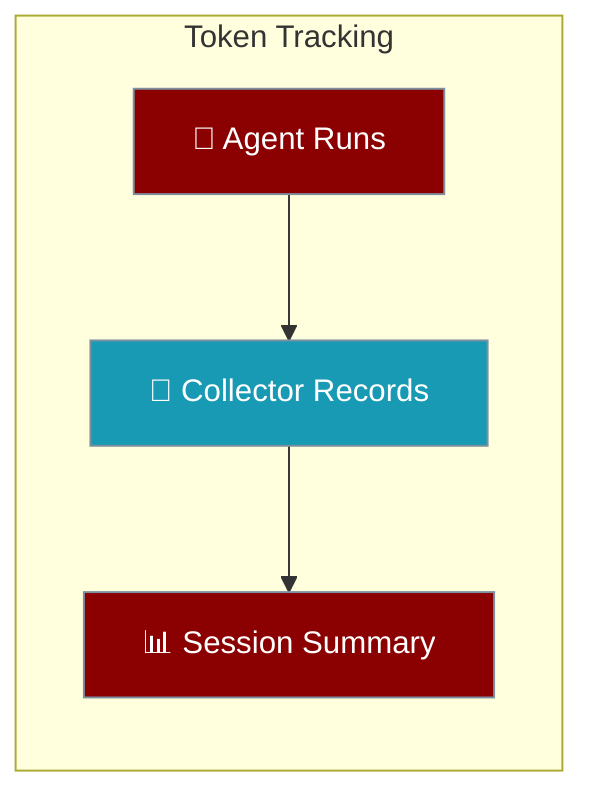
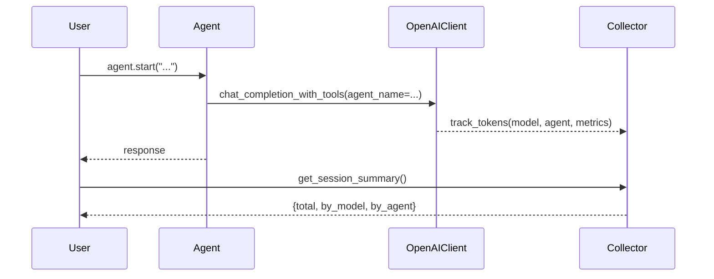

Every agent records its token usage; read the running total whenever you need it.



Token accounting is on for every agent that runs through the native OpenAI path — the default when you pass a bare model name like `"gpt-4o-mini"`. You don't turn it on, you just read it back.

## Quick Start

<Steps>
<Step title="Run an agent and read the total">
A bare `Agent(llm="gpt-4o-mini")` records its usage automatically. Read it back with the global collector:

```python
from praisonaiagents import Agent
from praisonaiagents.telemetry.token_collector import get_token_collector

agent = Agent(llm="gpt-4o-mini")
agent.start("Summarise the theory of relativity in one paragraph")

summary = get_token_collector().get_session_summary()
print(summary["total_interactions"])
print(summary["total_metrics"]["input_tokens"])
print(summary["total_metrics"]["output_tokens"])
```

The numbers are real spend — no `metrics=True`, no `verbose`, no display flag required.
</Step>

<Step title="Break usage down per agent">
Pass a `name` to each agent and the collector rolls usage up under `by_agent`:

```python
from praisonaiagents import Agent
from praisonaiagents.telemetry.token_collector import get_token_collector

researcher = Agent(name="researcher", llm="gpt-4o-mini")
writer = Agent(name="writer", llm="gpt-4o-mini")

researcher.start("Find three facts about the Moon")
writer.start("Write a haiku about the Moon")

summary = get_token_collector().get_session_summary()
print(summary["by_agent"]["researcher"]["output_tokens"])
print(summary["by_agent"]["writer"]["output_tokens"])
```
</Step>
</Steps>

## How It Works

Accounting happens inside the native `OpenAIClient` after every successful completion — one record per tool-loop iteration — and lands in the global `TokenCollector`.



<Note>
Token accounting is on by default and does not depend on `output="verbose"`, `metrics=True`, or any display flag. A quiet default agent still records real spend — display flags gate rendering only, never accounting.
</Note>

## Session Summary Shape

`get_session_summary()` returns a plain dict you can read or serialise:

```python
{
    "total_interactions": 1,
    "total_tokens": 320,
    "total_metrics": {
        "input_tokens": 200,
        "output_tokens": 120,
        "cached_tokens": 0,
        "reasoning_tokens": 0,
        "audio_input_tokens": 0,
        "audio_output_tokens": 0,
    },
    "by_model": {
        "gpt-4o-mini": {
            "input_tokens": 200,
            "output_tokens": 120,
            "cached_tokens": 0,
            "reasoning_tokens": 0,
            "audio_input_tokens": 0,
            "audio_output_tokens": 0,
        }
    },
    "by_agent": {
        "researcher": {
            "input_tokens": 200,
            "output_tokens": 120,
            "cached_tokens": 0,
            "reasoning_tokens": 0,
            "audio_input_tokens": 0,
            "audio_output_tokens": 0,
        }
    },
}
```

| Field | Type | Description |
|-------|------|-------------|
| `total_interactions` | `int` | Number of recorded completions this session |
| `total_tokens` | `int` | Sum of every token category across all interactions |
| `total_metrics` | `dict` | Broken-out token counts for the whole session |
| `by_model` | `dict` | Same token breakout keyed by model name |
| `by_agent` | `dict` | Same token breakout keyed by agent `name` |

Each metrics block carries `input_tokens`, `output_tokens`, `cached_tokens`, `reasoning_tokens`, `audio_input_tokens`, and `audio_output_tokens`.

## Common Patterns

<AccordionGroup>
<Accordion title="How much did this run cost?">
Reset before, read the summary after — you get the spend for just this run:

```python
from praisonaiagents import Agent
from praisonaiagents.telemetry.token_collector import get_token_collector

collector = get_token_collector()
collector.reset()

agent = Agent(llm="gpt-4o-mini")
agent.start("Draft a product announcement")

summary = collector.get_session_summary()
print(summary["total_metrics"]["input_tokens"], summary["total_metrics"]["output_tokens"])
```
</Accordion>

<Accordion title="Multi-agent breakdown">
`by_agent` gives a per-agent rollup so you can attribute spend to the right worker:

```python
summary = get_token_collector().get_session_summary()
for name, metrics in summary["by_agent"].items():
    print(name, metrics["output_tokens"])
```
</Accordion>

<Accordion title="Every tool-loop iteration is billed and recorded">
When an agent calls a tool and then completes, each model call is its own paid iteration. A single tool-using turn therefore records `total_interactions == 2` — one for the tool-call step and one for the final answer — and both are summed into the totals.
</Accordion>
</AccordionGroup>

## Latest Call Only

For CLI or Harbor envelopes that need the most recent completion's usage — not the session total — read `OpenAIClient.last_token_metrics`. It exposes the latest completion's `TokenMetrics` and is cleared when a response carries no usable usage.

## Related

<CardGroup cols={3}>
<Card title="Gateway" icon="network-wired" href="/gateway">
Unified control plane for agents, tools, and delivery.
</Card>
<Card title="Observability" icon="chart-line" href="/observability/overview">
Trace and monitor agent runs end to end.
</Card>
<Card title="Output Config" icon="sliders" href="/features/output">
Control what an agent renders vs what it records.
</Card>
</CardGroup>
