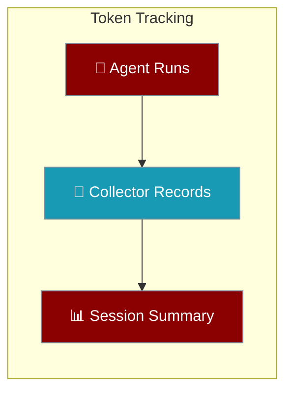
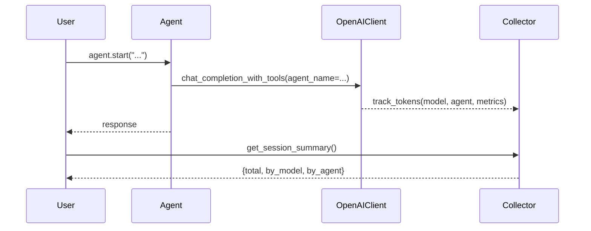
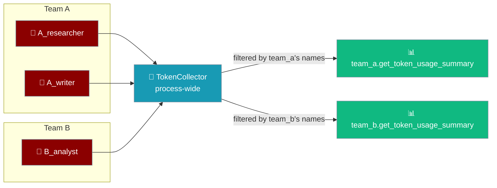

Every agent records its token usage; read the running total whenever you need it.



Token accounting is on for every agent that runs through the native OpenAI path — the default when you pass a bare model name like `"gpt-4o-mini"`. You don't turn it on, you just read it back.

## Quick Start

<Steps>
<Step title="Run an agent and read the total">
A bare `Agent(llm="gpt-4o-mini")` records its usage automatically. Read it back with the global collector:

```python
from praisonaiagents import Agent
from praisonaiagents.telemetry.token_collector import get_token_collector

agent = Agent(llm="gpt-4o-mini")
agent.start("Summarise the theory of relativity in one paragraph")

summary = get_token_collector().get_session_summary()
print(summary["total_interactions"])
print(summary["total_metrics"]["input_tokens"])
print(summary["total_metrics"]["output_tokens"])
```

The numbers are real spend — no `metrics=True`, no `verbose`, no display flag required.
</Step>

<Step title="Break usage down per agent">
Pass a `name` to each agent and the collector rolls usage up under `by_agent`:

```python
from praisonaiagents import Agent
from praisonaiagents.telemetry.token_collector import get_token_collector

researcher = Agent(name="researcher", llm="gpt-4o-mini")
writer = Agent(name="writer", llm="gpt-4o-mini")

researcher.start("Find three facts about the Moon")
writer.start("Write a haiku about the Moon")

summary = get_token_collector().get_session_summary()
print(summary["by_agent"]["researcher"]["output_tokens"])
print(summary["by_agent"]["writer"]["output_tokens"])
```
</Step>
</Steps>

## How It Works

Accounting happens inside the native `OpenAIClient` after every successful completion — one record per tool-loop iteration — and lands in the global `TokenCollector`.



<Note>
Token accounting is on by default and does not depend on `output="verbose"`, `metrics=True`, or any display flag. A quiet default agent still records real spend — display flags gate rendering only, never accounting.
</Note>

## Session Summary Shape

`get_session_summary()` returns a plain dict you can read or serialise:

```python
{
    "total_interactions": 1,
    "total_tokens": 320,
    "total_metrics": {
        "input_tokens": 200,
        "output_tokens": 120,
        "cached_tokens": 0,
        "reasoning_tokens": 0,
        "audio_input_tokens": 0,
        "audio_output_tokens": 0,
    },
    "by_model": {
        "gpt-4o-mini": {
            "input_tokens": 200,
            "output_tokens": 120,
            "cached_tokens": 0,
            "reasoning_tokens": 0,
            "audio_input_tokens": 0,
            "audio_output_tokens": 0,
        }
    },
    "by_agent": {
        "researcher": {
            "input_tokens": 200,
            "output_tokens": 120,
            "cached_tokens": 0,
            "reasoning_tokens": 0,
            "audio_input_tokens": 0,
            "audio_output_tokens": 0,
        }
    },
}
```

| Field | Type | Description |
|-------|------|-------------|
| `total_interactions` | `int` | Number of recorded completions this session |
| `total_tokens` | `int` | `input_tokens + output_tokens` across all interactions |
| `total_metrics` | `dict` | Broken-out token counts for the whole session |
| `by_model` | `dict` | Same token breakout keyed by model name |
| `by_agent` | `dict` | Same token breakout keyed by agent `name` |

In the example above `total_tokens` is `320` because it is `input_tokens` (200) + `output_tokens` (120) — nothing else. Each metrics block also carries `cached_tokens`, `reasoning_tokens`, `audio_input_tokens`, and `audio_output_tokens` for visibility, but those are **subsets** of the input/output counts, so they are not added into the total.

<Note>
**How `total_tokens` is computed.** `total_tokens` is `input_tokens + output_tokens`. `cached_tokens` are a subset of `input_tokens`, and `reasoning_tokens` / audio tokens are subsets of the totals the provider already reports — they are broken out for visibility, not added on top. Adding them would double-count and inflate cached-prompt and o-series (reasoning) usage by up to ~1.8×.
</Note>

Concrete illustration you can compare against:

```python
from praisonaiagents.telemetry.token_collector import TokenMetrics

m = TokenMetrics(input_tokens=1000, output_tokens=500, cached_tokens=800, reasoning_tokens=400)
assert m.total_tokens == 1500  # input + output only, not 2700
```

The `1500` is the provider's own reported total. The `cached_tokens` (800) sit inside the 1000 input tokens, and the `reasoning_tokens` (400) sit inside the 500 output tokens — summing all four would report `2700`, which is wrong.

## Scoping to one team (concurrent instances)

The `get_token_collector()` singleton is process-wide: every agent in every `PraisonAIAgents` instance writes into the same collector. Reading it directly gives you a **combined** total across the whole process.



Since PraisonAI PR [#4462](https://github.com/MervinPraison/PraisonAI/pull/4462) (finalized in PR [#4470](https://github.com/MervinPraison/PraisonAI/pull/4470), which closes issue [#4446](https://github.com/MervinPraison/PraisonAI/issues/4446)), `PraisonAIAgents` exposes instance-scoped views that filter the singleton to the team's own agents — so two concurrent teams never see each other's spend.

```python
from praisonaiagents import Agent, PraisonAIAgents

team_a = PraisonAIAgents(agents=[Agent(name="A_researcher"), Agent(name="A_writer")])
team_b = PraisonAIAgents(agents=[Agent(name="B_analyst")])

# Run both teams concurrently (or one after another)
team_a.start()
team_b.start()

# Instance-scoped: only team_a's own agents
print(team_a.get_token_usage_summary())
# {'total_metrics': {...team_a only...}, 'by_agent': {'A_researcher': {...}, 'A_writer': {...}}, ...}

# Instance-scoped: only team_b's own agents
print(team_b.get_token_usage_summary())
# {'total_metrics': {...team_b only...}, 'by_agent': {'B_analyst': {...}}, ...}

# Global process-wide totals (unchanged behavior)
from praisonaiagents.telemetry.token_collector import get_token_collector
print(get_token_collector().get_session_summary())
# {'total_metrics': {...team_a + team_b...}, ...}
```

The scoped methods:

| Method | Scope | Fallback |
|---|---|---|
| `PraisonAIAgents.get_token_usage_summary()` | This team's agents only | Unfiltered summary if no named agents |
| `PraisonAIAgents.get_detailed_token_report()` | This team's agents only (summary + recent interactions + cost estimate) | Unfiltered if no named agents |
| `PraisonAIAgents.display_token_usage()` | This team's agents only (prints table) | Unfiltered if no named agents |
| `get_token_collector().get_session_summary()` | Process-wide (all agents in the process) | — |

<Note>
**Scoping key = agent `name`.** Filtering matches `Agent.name` against the collector's `by_agent` map. Give each agent a unique `name` for accurate per-team accounting. Agents with `name=None` fall back to the unfiltered summary so an unnamed team still sees real numbers rather than zeros.
</Note>

<Note>
**`total_interactions` and `by_model` are best-effort** in the scoped view. The collector caps its per-interaction log (`_max_recent`), so scoped `total_interactions` and `by_model` reflect only interactions still in that retained window. The token **totals** (`total_metrics`, `by_agent`) come from the full aggregate and stay exact.
</Note>

## Common Patterns

<AccordionGroup>
<Accordion title="How much did this run cost?">
Reset before, read the summary after — you get the spend for just this run:

```python
from praisonaiagents import Agent
from praisonaiagents.telemetry.token_collector import get_token_collector

collector = get_token_collector()
collector.reset()

agent = Agent(llm="gpt-4o-mini")
agent.start("Draft a product announcement")

summary = collector.get_session_summary()
print(summary["total_metrics"]["input_tokens"], summary["total_metrics"]["output_tokens"])
```
</Accordion>

<Accordion title="Multi-agent breakdown">
`by_agent` gives a per-agent rollup so you can attribute spend to the right worker:

```python
summary = get_token_collector().get_session_summary()
for name, metrics in summary["by_agent"].items():
    print(name, metrics["output_tokens"])
```

In multi-agent teams the executor's LLM instance (`executor_agent.llm_instance`) is the one wired into `set_current_agent()` / `last_token_metrics`, so per-agent accounting is accurate for agents built with a real LLM object — not just a bare model-name string.
</Accordion>

<Accordion title="Every tool-loop iteration is billed and recorded">
When an agent calls a tool and then completes, each model call is its own paid iteration. A single tool-using turn therefore records `total_interactions == 2` — one for the tool-call step and one for the final answer — and both are summed into the totals.
</Accordion>
</AccordionGroup>

## Latest Call Only

For CLI or Harbor envelopes that need the most recent completion's usage — not the session total — read `OpenAIClient.last_token_metrics`. It exposes the latest completion's `TokenMetrics` and is cleared when a response carries no usable usage.

## Related

<CardGroup cols={3}>
<Card title="Gateway" icon="network-wired" href="/gateway">
Unified control plane for agents, tools, and delivery.
</Card>
<Card title="Observability" icon="chart-line" href="/observability/overview">
Trace and monitor agent runs end to end.
</Card>
<Card title="Output Config" icon="sliders" href="/features/output">
Control what an agent renders vs what it records.
</Card>
</CardGroup>
