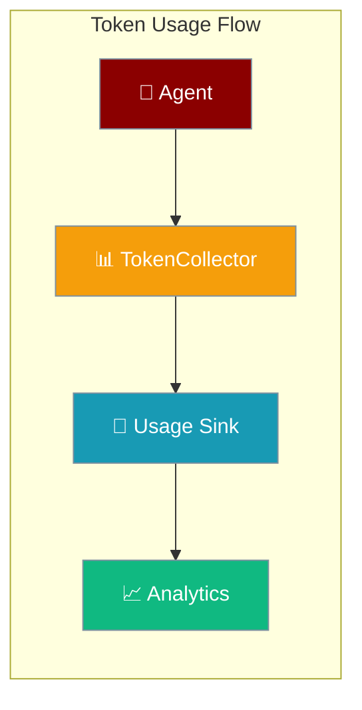

Track token usage across agents with pluggable persistence backends for databases, APIs, or custom analytics systems.

```python
from praisonaiagents import Agent
from praisonaiagents.telemetry.token_collector import get_token_collector
from praisonaiagents.telemetry.protocols import InMemoryTokenUsageSink

collector = get_token_collector()
collector.set_sink(InMemoryTokenUsageSink())

agent = Agent(name="Assistant")
agent.start("Hello world")  # tokens tracked automatically
```


The user runs agents normally; each completion flows through TokenCollector into the configured usage sink for analytics.



## Quick Start

<Steps>
<Step title="Basic Usage">

Enable usage tracking with the global collector:

```python
from praisonaiagents.telemetry.token_collector import get_token_collector
from praisonaiagents.telemetry.protocols import InMemoryTokenUsageSink

collector = get_token_collector()
sink = InMemoryTokenUsageSink()
collector.set_sink(sink)

# Usage is now tracked automatically
from praisonaiagents import Agent
agent = Agent(name="Assistant")
agent.start("Hello world")  # Tokens tracked to sink
```

</Step>

<Step title="Query Usage Data">

Access tracked usage data for analytics:

```python
from praisonaiagents.telemetry.protocols import InMemoryUsageQuery

query = InMemoryUsageQuery(sink)
summary = query.get_summary()
print(f"Total tokens: {summary['total_tokens']}")
print(f"By model: {summary['by_model']}")
```

</Step>
</Steps>

---

## Usage Sink Protocols

### TokenUsageSinkProtocol

Interface for persisting token usage data to any backend:

```python
from praisonaiagents.telemetry.protocols import TokenUsageSinkProtocol

class CustomDatabaseSink:
    def persist(self, task_id: str, agent_name: str, model: str, 
               metrics: Any, metadata: dict = None) -> None:
        # Save to your database
        db.execute("""
            INSERT INTO token_usage 
            (task_id, agent_name, model, input_tokens, output_tokens, cost)
            VALUES (?, ?, ?, ?, ?, ?)
        """, task_id, agent_name, model, 
            metrics.input_tokens, metrics.output_tokens, metrics.cost)
```

### Built-in Sinks

| Sink | Purpose | Use Case |
|------|---------|----------|
| `NoOpTokenUsageSink` | Default - no overhead | Production (when tracking disabled) |
| `InMemoryTokenUsageSink` | In-memory storage | Development, testing |
| Custom | Your implementation | Database, API, analytics service |

---

## Usage Query Protocols

### UsageQueryProtocol

Interface for reading usage data from your backend:

```python
from praisonaiagents.telemetry.protocols import UsageQueryProtocol

class CustomDatabaseQuery:
    def get_summary(self) -> dict:
        return {
            "total_requests": db.count("SELECT COUNT(*) FROM token_usage"),
            "total_tokens": db.sum("SELECT SUM(total_tokens) FROM token_usage"),
            "by_model": self._group_by_model(),
            "by_agent": self._group_by_agent()
        }
    
    def list_recent(self, limit: int = 50) -> list:
        return db.query("SELECT * FROM token_usage ORDER BY timestamp DESC LIMIT ?", limit)
```

### Built-in Query Adapters

<AccordionGroup>

<Accordion title="InMemoryUsageQuery">
Query adapter for `InMemoryTokenUsageSink`:

```python
from praisonaiagents.telemetry.protocols import InMemoryUsageQuery

sink = InMemoryTokenUsageSink()
query = InMemoryUsageQuery(sink)

# Get aggregate statistics
summary = query.get_summary()
# {"total_requests": 42, "total_tokens": 1250, "by_model": {...}}
```
</Accordion>

<Accordion title="TokenCollectorUsageQuery">
Query adapter for global `TokenCollector`:

```python
from praisonaiagents.telemetry.protocols import TokenCollectorUsageQuery
from praisonaiagents.telemetry.token_collector import get_token_collector

collector = get_token_collector()
query = TokenCollectorUsageQuery(collector)
summary = query.get_summary()
```
</Accordion>

</AccordionGroup>

---

## Integration with Host

Wire usage tracking into PraisonAIUI backends:

```python
from praisonai.integration.bridges.usage_bridge import register_usage_sink, get_usage_query

# Auto-wire in-memory tracking
sink = register_usage_sink()
query = get_usage_query()

# Custom backend
from praisonaiagents.telemetry.token_collector import get_token_collector
collector = get_token_collector()
collector.set_sink(MyCustomSink())

import praisonaiui.backends as backends
backends.set_backend("usage_sink", MyCustomSink())
backends.set_backend("usage_query", MyCustomQuery())
```

---

## Custom Sink Example

Complete example with PostgreSQL backend:

```python
import psycopg2
from datetime import datetime
from praisonaiagents.telemetry.protocols import TokenUsageSinkProtocol, UsageQueryProtocol

class PostgresTokenUsageSink:
    def __init__(self, connection_string: str):
        self.conn = psycopg2.connect(connection_string)
        self._ensure_table()
    
    def _ensure_table(self):
        with self.conn.cursor() as cur:
            cur.execute("""
                CREATE TABLE IF NOT EXISTS token_usage (
                    id SERIAL PRIMARY KEY,
                    task_id VARCHAR(255),
                    agent_name VARCHAR(255),
                    model VARCHAR(255),
                    input_tokens INTEGER,
                    output_tokens INTEGER,
                    total_tokens INTEGER,
                    cost DECIMAL(10,6),
                    timestamp TIMESTAMP DEFAULT NOW(),
                    metadata JSONB
                )
            """)
        self.conn.commit()
    
    def persist(self, task_id: str, agent_name: str, model: str, 
               metrics: Any, metadata: dict = None) -> None:
        with self.conn.cursor() as cur:
            cur.execute("""
                INSERT INTO token_usage 
                (task_id, agent_name, model, input_tokens, output_tokens, 
                 total_tokens, cost, metadata)
                VALUES (%s, %s, %s, %s, %s, %s, %s, %s)
            """, (
                task_id, agent_name, model,
                getattr(metrics, 'input_tokens', 0),
                getattr(metrics, 'output_tokens', 0),
                getattr(metrics, 'total_tokens', 0),
                getattr(metrics, 'cost', 0.0),
                metadata or {}
            ))
        self.conn.commit()

class PostgresUsageQuery:
    def __init__(self, sink: PostgresTokenUsageSink):
        self.conn = sink.conn
    
    def get_summary(self) -> dict:
        with self.conn.cursor() as cur:
            cur.execute("""
                SELECT 
                    COUNT(*) as total_requests,
                    SUM(input_tokens) as total_input_tokens,
                    SUM(output_tokens) as total_output_tokens,
                    SUM(total_tokens) as total_tokens,
                    SUM(cost) as total_cost
                FROM token_usage
            """)
            row = cur.fetchone()
            return {
                "total_requests": row[0] or 0,
                "total_input_tokens": row[1] or 0,
                "total_output_tokens": row[2] or 0,
                "total_tokens": row[3] or 0,
                "total_cost": float(row[4] or 0.0),
                "by_model": self._group_by_model(),
                "by_agent": self._group_by_agent()
            }
```

---

## Best Practices

<AccordionGroup>

<Accordion title="Use NoOp sink in production by default">
The default `NoOpTokenUsageSink` has zero overhead. Only enable tracking when needed:

```python
if os.getenv("ENABLE_USAGE_TRACKING"):
    collector.set_sink(DatabaseSink())
else:
    collector.set_sink(NoOpTokenUsageSink())  # Default
```
</Accordion>

<Accordion title="Batch writes for high throughput">
Buffer writes to reduce database load:

```python
class BatchingSink:
    def __init__(self, backend_sink, batch_size=100):
        self.backend = backend_sink
        self.batch = []
        self.batch_size = batch_size
    
    def persist(self, task_id, agent_name, model, metrics, metadata=None):
        self.batch.append((task_id, agent_name, model, metrics, metadata))
        if len(self.batch) >= self.batch_size:
            self.flush()
    
    def flush(self):
        for record in self.batch:
            self.backend.persist(*record)
        self.batch.clear()
```
</Accordion>

<Accordion title="Include custom metadata">
Add business context to usage records:

```python
sink.persist(
    task_id="task-123",
    agent_name="Assistant",
    model="gpt-4o",
    metrics=token_metrics,
    metadata={
        "user_id": "user-456",
        "session_id": "session-789",
        "feature": "code_review",
        "environment": "production"
    }
)
```
</Accordion>

</AccordionGroup>

---

## Usage Metrics Format

Token metrics objects contain these fields:

| Field | Type | Description |
|-------|------|-------------|
| `input_tokens` | `int` | Input tokens consumed |
| `output_tokens` | `int` | Output tokens generated |
| `cached_tokens` | `int` | Cached tokens (if supported) |
| `total_tokens` | `int` | Total tokens (input + output) |
| `cost` | `float` | Estimated USD cost |

Query summary format:

```json
{
  "total_requests": 150,
  "total_input_tokens": 12500,
  "total_output_tokens": 8200,
  "total_tokens": 20700,
  "by_model": {
    "gpt-4o": {"input_tokens": 10000, "output_tokens": 6000, "total_tokens": 16000},
    "gpt-4o-mini": {"input_tokens": 2500, "output_tokens": 2200, "total_tokens": 4700}
  },
  "by_agent": {
    "Assistant": {"input_tokens": 8000, "output_tokens": 5000, "total_tokens": 13000},
    "Reviewer": {"input_tokens": 4500, "output_tokens": 3200, "total_tokens": 7700}
  }
}
```

---

## Related

<CardGroup cols={2}>
<Card title="Host Integration" icon="plug" href="/docs/features/host-integration">
  Auto-wire usage tracking
</Card>
<Card title="Backend Injection" icon="arrows-right-left" href="/docs/features/aiui-backends">
  Custom backend services
</Card>
</CardGroup>