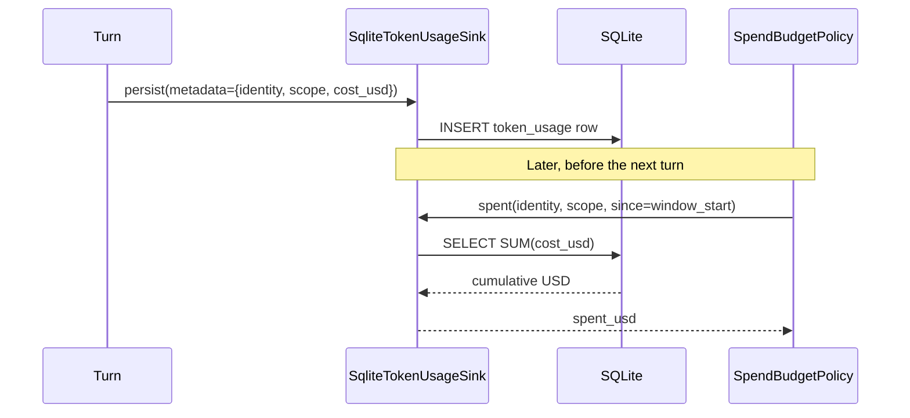

Track cumulative token spend per gateway identity in a restart-safe SQLite ledger — no new dependencies.

```python
from praisonaiagents.telemetry.durable_sink import SqliteTokenUsageSink

sink = SqliteTokenUsageSink("~/.praisonai/usage.db")
sink.record(identity="tg:123", scope="telegram", cost_usd=0.02)
sink.spent(identity="tg:123", scope="telegram", since=0.0)   # -> 0.02
```

```mermaid
graph LR
    subgraph "Durable Usage Ledger"
        L[LLM Call] --> T[track_tokens]
        T --> P[persist / record]
        P --> DB[(SQLite file)]
        DB --> Q[spent / usage reads]
    end
    classDef call fill:#8B0000,stroke:#7C90A0,color:#fff
    classDef proc fill:#189AB4,stroke:#7C90A0,color:#fff
    classDef store fill:#6366F1,stroke:#7C90A0,color:#fff
    classDef read fill:#10B981,stroke:#7C90A0,color:#fff
    class L call
    class T,P proc
    class DB store
    class Q read
```

## Quick Start

<Steps>
<Step title="Ephemeral (in-memory) for tests">

Use `":memory:"` for a throwaway database that never touches disk.

```python
from praisonaiagents.telemetry.durable_sink import SqliteTokenUsageSink

sink = SqliteTokenUsageSink(":memory:")
sink.record(identity="tg:123", scope="telegram", cost_usd=0.01)
```
</Step>

<Step title="On-disk for production gateways">

Pass a file path — `~` is expanded and parent directories are created for you.

```python
from praisonaiagents.telemetry.durable_sink import SqliteTokenUsageSink

sink = SqliteTokenUsageSink("~/.praisonai/usage.db")
```
</Step>

<Step title="Attribute a turn to an identity">

Call `persist` from the telemetry path, passing `identity`, `scope`, and `cost_usd` via metadata.

```python
from types import SimpleNamespace

metrics = SimpleNamespace(input_tokens=120, output_tokens=80, total_tokens=200)
sink.persist(
    task_id="t1",
    agent_name="Support Bot",
    model="gpt-4o",
    metrics=metrics,
    metadata={"identity": "tg:123", "scope": "telegram", "cost_usd": 0.02},
)
```
</Step>

<Step title="Query cumulative spend for a /usage command">

Read aggregate spend and token totals for one identity.

```python
report = sink.usage(identity="tg:123", scope="telegram")
print(f"${report['cost_usd']:.2f} over {report['records']} turns")
```
</Step>
</Steps>

---

## How It Works

Each turn's metrics are persisted keyed by canonical identity + scope, then read back cumulatively for admission or a `/usage` reply.



Lookups stay fast because rows are indexed on `(identity, scope, ts)` via `idx_token_usage_identity_scope_ts`.

---

## Imports

```python
from praisonaiagents.telemetry.durable_sink import SqliteTokenUsageSink
```

---

## API Reference

### `SqliteTokenUsageSink`

Implements the existing `TokenUsageSinkProtocol` using stdlib `sqlite3`. Thread-safe and context-manager friendly.

| Option | Type | Default | Description |
|--------|------|---------|-------------|
| `db_path` | `str` | `":memory:"` | SQLite file path. `~` is expanded, parent directories are created. Use `":memory:"` for an ephemeral database. |

| Method | Signature | Description |
|--------|-----------|-------------|
| `record` | `(*, identity, scope="", model="", input_tokens=0, output_tokens=0, total_tokens=None, cost_usd=0.0, ts=None) -> None` | Gateway-facing write. Appends a usage row keyed by canonical user id. |
| `persist` | `(task_id, agent_name, model, metrics, metadata=None) -> None` | `TokenUsageSinkProtocol` entry point. Reads `identity`, `scope`, `cost_usd` from `metadata`; falls back to `agent_name` as identity. |
| `spent` | `(*, identity, scope=None, since=0.0) -> float` | Cumulative USD spent. `scope=None` sums across all scopes. `since` is the window start. |
| `oldest_spend_ts` | `(*, identity, scope=None, since=0.0) -> float \| None` | Timestamp of the earliest **non-zero-cost** charge in the window. `None` when there is no spend. |
| `usage` | `(*, identity, scope=None, since=0.0) -> dict` | Aggregate for a `/usage` surface: `identity`, `scope`, `cost_usd`, `input_tokens`, `output_tokens`, `total_tokens`, `records`. |
| `close()` | `() -> None` | Close the connection. |
| `__enter__` / `__exit__` | context manager | Enables `with SqliteTokenUsageSink(db) as sink: ...`. |

### Schema

```sql
CREATE TABLE IF NOT EXISTS token_usage (
    id            INTEGER PRIMARY KEY AUTOINCREMENT,
    identity      TEXT    NOT NULL,
    scope         TEXT    NOT NULL DEFAULT '',
    model         TEXT    NOT NULL DEFAULT '',
    input_tokens  INTEGER NOT NULL DEFAULT 0,
    output_tokens INTEGER NOT NULL DEFAULT 0,
    total_tokens  INTEGER NOT NULL DEFAULT 0,
    cost_usd      REAL    NOT NULL DEFAULT 0.0,
    ts            REAL    NOT NULL
);
CREATE INDEX IF NOT EXISTS idx_token_usage_identity_scope_ts
    ON token_usage (identity, scope, ts);
```

<Info>
The `idx_token_usage_identity_scope_ts` index is why per-identity spend lookups stay fast even as the ledger grows.
</Info>

<Card title="SDK Reference" icon="code" href="/docs/sdk/reference/">
  Full auto-generated API surface for the telemetry package.
</Card>

---

## Configuration Options

Three ways to construct the sink.

```python
from praisonaiagents.telemetry.durable_sink import SqliteTokenUsageSink

# Level 1: String path — most common for production
sink = SqliteTokenUsageSink("~/.praisonai/usage.db")

# Level 2: ":memory:" — ephemeral testing
sink = SqliteTokenUsageSink(":memory:")

# Level 3: Context manager — auto-close
with SqliteTokenUsageSink("~/.praisonai/usage.db") as sink:
    sink.record(identity="tg:123", scope="telegram", cost_usd=0.02)
```

---

## Common Patterns

### Attribute a turn to a gateway identity

```python
from types import SimpleNamespace

metrics = SimpleNamespace(input_tokens=120, output_tokens=80, total_tokens=200)
sink.persist(
    task_id="t1",
    agent_name="Support Bot",
    model="gpt-4o",
    metrics=metrics,
    metadata={"identity": "tg:123", "scope": "telegram", "cost_usd": 0.02},
)
```

### Fall back to agent name

```python
# No identity in metadata → spend attributed to agent_name, nothing dropped
sink.persist("t2", "Support Bot", "gpt-4o", metrics, metadata=None)
sink.spent(identity="Support Bot")   # -> accumulated spend
```

### Rolling-window spend for admission

```python
import time
from praisonaiagents.gateway import WindowedSpendBudgetPolicy

policy = WindowedSpendBudgetPolicy(limit_usd=2.00, window_seconds=86_400)
now = time.time()
spent = sink.spent(identity="tg:123", scope="telegram", since=policy.window_start(now))
decision = policy.check(identity="tg:123", scope="telegram", spent_usd=spent, now=now)
```

### /usage command reply

```python
report = sink.usage(identity="tg:123", scope="telegram")
reply = f"Used ${report['cost_usd']:.2f} across {report['records']} messages."
```

### Accurate retry hints

```python
import time

now = time.time()
window_start = policy.window_start(now)
spent = sink.spent(identity="tg:123", scope="telegram", since=window_start)
oldest = sink.oldest_spend_ts(identity="tg:123", scope="telegram", since=window_start)
decision = policy.check(
    identity="tg:123", scope="telegram",
    spent_usd=spent, now=now, oldest_spend_ts=oldest,
)
```

---

## Best Practices

<AccordionGroup>

<Accordion title="Use an absolute path for production">

Pass a full path like `~/.praisonai/usage.db`. `~` is expanded and parent directories are created automatically, so the ledger persists across restarts.
</Accordion>

<Accordion title="Share one instance across threads and loops">

The sink is thread-safe (`check_same_thread=False` plus an internal lock). One instance is fine to share between async event loops and worker threads.
</Accordion>

<Accordion title="Zero-cost rows never distort retry hints">

`oldest_spend_ts` ignores rows with `cost_usd == 0`, so free events don't skew the retry hint fed to the spend-budget policy.
</Accordion>

<Accordion title="Prefer stdlib sqlite3 here">

This sink uses stdlib `sqlite3` — no extra dependency. For Postgres or Redis, implement `TokenUsageSinkProtocol` as a separate sink instead.
</Accordion>

</AccordionGroup>

---

## Related

<CardGroup cols={2}>
<Card title="Token Usage Protocol" icon="chart-line" href="/features/token-usage-protocol">
  The TokenUsageSinkProtocol this sink implements
</Card>
<Card title="Spend Budget" icon="dollar-sign" href="/features/gateway-spend-budget">
  Cap per-identity spend using this sink's readings
</Card>
<Card title="Token Tracking" icon="calculator" href="/features/token-tracking">
  Measure token consumption per turn
</Card>
<Card title="Cost Tracking" icon="dollar-sign" href="/features/cost-tracking">
  Estimate and report LLM costs
</Card>
</CardGroup>
