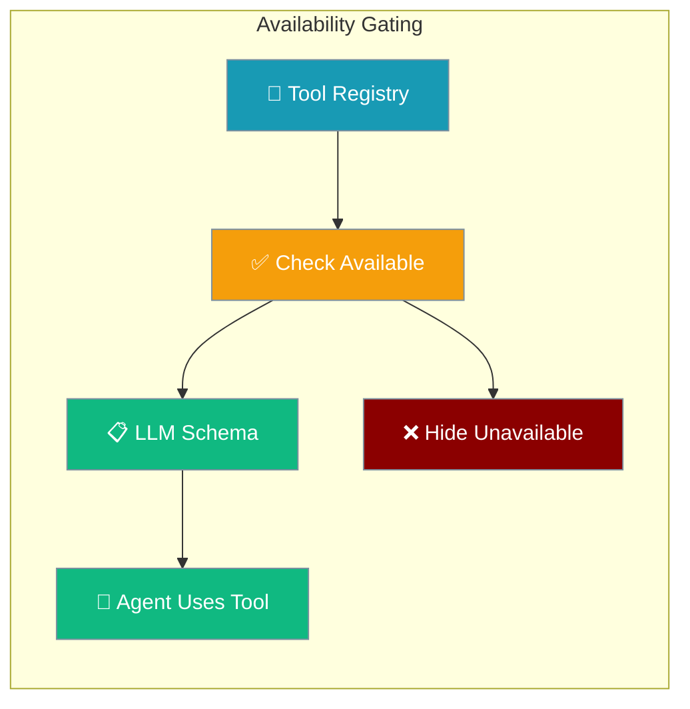
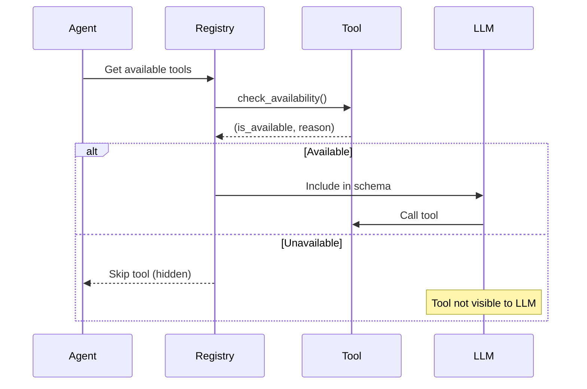

Tool availability gating filters unavailable tools at schema-build time, preventing the LLM from hallucinating calls to tools that can't run.



## Quick Start

<Steps>
<Step title="Decorator with Availability Check">

```python
import os
from praisonaiagents.tools import tool

@tool(availability=lambda: (bool(os.getenv("SERP_API_KEY")), "SERP_API_KEY not set"))
def search_web(query: str) -> str:
    """Search the web for information."""
    api_key = os.getenv("SERP_API_KEY")
    # ... search implementation
    return f"Search results for: {query}"

from praisonaiagents import Agent

agent = Agent(
    name="Researcher", 
    instructions="Research topics the user asks about.",
    tools=[search_web]
)
# If SERP_API_KEY missing → tool hidden from LLM
# If SERP_API_KEY set → tool appears and works normally
agent.start("Research quantum computing")
```

</Step>

<Step title="Class-Based Tool with Availability">

```python
from praisonaiagents.tools.base import BaseTool

class DatabaseTool(BaseTool):
    name = "query_database"
    description = "Query the application database"
    
    def __init__(self, connection_string: str = None):
        super().__init__()
        self.connection_string = connection_string or os.getenv("DATABASE_URL")
    
    def check_availability(self) -> tuple[bool, str]:
        if not self.connection_string:
            return False, "DATABASE_URL not configured"
        
        try:
            # Quick connection test (must be fast, no I/O heavy operations)
            import psycopg2
            return True, ""
        except ImportError:
            return False, "psycopg2 package not installed"
    
    def run(self, query: str) -> str:
        # Implementation here
        return f"Query result: {query}"
```

</Step>
</Steps>

---

## How It Works



| Phase | Behavior | Performance |
|-------|----------|-------------|
| **Schema Build** | Availability checks run once | Zero runtime cost |
| **Tool Execution** | Only available tools included | No availability overhead |
| **LLM Interaction** | Only sees usable tools | Prevents hallucination |

---

## Implementation Methods

### Function Decorator

```python
from praisonaiagents.tools import tool
import os

# Simple environment check
@tool(availability=lambda: (bool(os.getenv("API_KEY")), "API_KEY missing"))
def api_tool(query: str) -> str:
    return f"API result: {query}"

# Complex dependency check  
def check_docker_available():
    try:
        import docker
        client = docker.from_env()
        client.ping()  # Quick ping, not heavy I/O
        return True, ""
    except Exception as e:
        return False, f"Docker unavailable: {e}"

@tool(availability=check_docker_available)
def docker_command(cmd: str) -> str:
    """Run Docker commands."""
    return f"Docker: {cmd}"
```

### BaseTool Protocol

```python
from praisonaiagents.tools.base import BaseTool
from praisonaiagents.tools.protocols import ToolAvailabilityProtocol

class CloudTool(BaseTool, ToolAvailabilityProtocol):
    name = "cloud_deploy"
    description = "Deploy to cloud services"
    
    def check_availability(self) -> tuple[bool, str]:
        # Check multiple dependencies
        if not os.getenv("AWS_ACCESS_KEY"):
            return False, "AWS credentials not configured"
        
        try:
            import boto3
            # Quick credential test (fast operation only)
            boto3.Session().get_credentials()
            return True, ""
        except Exception as e:
            return False, f"AWS SDK error: {e}"
    
    def run(self, service: str) -> str:
        return f"Deployed {service} to cloud"
```

### Registry Functions

```python
from praisonaiagents.tools import list_available_tools, get_registry

# Get only available tools
available_tools = list_available_tools()
print(f"Available: {len(available_tools)} tools")

# Get all tools (including unavailable)
all_tools = get_registry().list_tools()
print(f"Total registered: {len(all_tools)} tools")

# Check specific tool
web_tool = get_registry().get("search_web")
if hasattr(web_tool, 'check_availability'):
    is_available, reason = web_tool.check_availability()
    print(f"Web tool available: {is_available}")
    if not is_available:
        print(f"Reason: {reason}")
```

---

## Availability Rules

### Behavior Patterns

```mermaid
graph TD
    A[Tool Registration] --> B{Has check_availability?}
    B -->|No| C[Always Available]
    B -->|Yes| D[Run Check]
    D --> E{Check Result?}
    E -->|True| F[Include in Schema]
    E -->|False| G[Hide from LLM]
    E -->|Exception| H[Log Warning + Hide]
    
    classDef default fill:#189AB4,stroke:#7C90A0,color:#fff
    classDef available fill:#10B981,stroke:#7C90A0,color:#fff
    classDef unavailable fill:#8B0000,stroke:#7C90A0,color:#fff
    
    class A,B,D default
    class C,F available  
    class G,H unavailable
```

1. **No Check Method**: Tool is always considered available
2. **Check Returns True**: Tool included in LLM schema
3. **Check Returns False**: Tool hidden from LLM
4. **Check Throws Exception**: Tool hidden + warning logged

### Exception Handling

```python
# If check_availability() raises an exception:
def broken_availability_check():
    raise ValueError("Network unreachable")

@tool(availability=broken_availability_check)
def network_tool(host: str) -> str:
    return f"Ping {host}"

# Result: Tool is hidden, log shows:
# WARNING: Tool 'network_tool' unavailable: Availability check failed: Network unreachable
```

### Plain Function Registry

```python
from praisonaiagents.tools import register_tool

def simple_function(text: str) -> str:
    return f"Processed: {text}"

# Plain functions are always available (no protocol support yet)
register_tool(simple_function)
```

---

## Configuration Patterns

### Environment-Based Availability

```python
import os
from praisonaiagents.tools import tool

def check_environment(required_vars: list[str]):
    """Factory for environment-based availability checks."""
    def check():
        missing = [var for var in required_vars if not os.getenv(var)]
        if missing:
            return False, f"Missing environment variables: {', '.join(missing)}"
        return True, ""
    return check

@tool(availability=check_environment(["OPENAI_API_KEY", "PINECONE_API_KEY"]))
def ai_research(topic: str) -> str:
    """Research topics using AI and vector search."""
    return f"AI research on: {topic}"

@tool(availability=check_environment(["SLACK_TOKEN"]))  
def notify_team(message: str) -> str:
    """Send notifications to team Slack."""
    return f"Notified team: {message}"
```

### Service Discovery

```python
from praisonaiagents.tools import tool
import socket

def check_service_available(host: str, port: int):
    """Check if a network service is reachable."""
    def check():
        try:
            with socket.socket(socket.AF_INET, socket.SOCK_STREAM) as s:
                s.settimeout(2)  # Keep fast
                s.connect((host, port))
                return True, ""
        except Exception as e:
            return False, f"Service {host}:{port} unreachable: {e}"
    return check

@tool(availability=check_service_available("localhost", 5432))
def query_local_db(sql: str) -> str:
    """Query local PostgreSQL database."""
    return f"SQL result: {sql}"

@tool(availability=check_service_available("redis-server", 6379))
def cache_data(key: str, value: str) -> str:
    """Cache data in Redis."""
    return f"Cached {key}: {value}"
```

### Conditional Tool Loading

```python
from praisonaiagents import Agent
from praisonaiagents.tools import list_available_tools

# Build agent with only available tools
available_tools = list_available_tools()
print(f"Loading agent with {len(available_tools)} available tools")

agent = Agent(
    name="AdaptiveAgent",
    instructions="Use whatever tools are available in the current environment.",
    tools=available_tools
)

# Agent automatically adapts to environment capabilities
```

---

## Performance Guidelines

<AccordionGroup>
<Accordion title="Keep Checks Fast" icon="clock">
Availability checks run at schema-build time and must be fast (< 100ms recommended).

**Good**: Environment variable checks, import tests, quick pings
**Bad**: Full API calls, heavy file operations, long network requests

```python
# Fast check
@tool(availability=lambda: (bool(os.getenv("API_KEY")), "API_KEY missing"))

# Slow check (avoid)
def slow_check():
    import requests
    requests.get("https://api.example.com/health", timeout=30)  # Too slow!
    return True, ""
```
</Accordion>

<Accordion title="Cache Results When Possible" icon="database">
For checks that might be expensive, consider caching results.

```python
import time
from functools import lru_cache

@lru_cache(maxsize=1)
def cached_docker_check():
    """Cache Docker availability for 5 minutes."""
    try:
        import docker
        docker.from_env().ping()
        return True, ""
    except Exception as e:
        return False, str(e)

# Refresh cache periodically
cached_docker_check.cache_clear()
```
</Accordion>

<Accordion title="Fail Fast on Missing Dependencies" icon="shield-check">
Check critical dependencies first, avoid unnecessary work.

```python
def check_ml_stack():
    # Check imports first (fast)
    try:
        import torch
        import transformers
    except ImportError as e:
        return False, f"Missing ML dependencies: {e}"
    
    # Then check GPU availability (slower)
    if not torch.cuda.is_available():
        return False, "CUDA not available"
    
    return True, ""
```
</Accordion>

<Accordion title="Graceful Degradation" icon="triangle-exclamation">
Design tools to degrade gracefully when dependencies are partially available.

```python
@tool(availability=lambda: (True, ""))  # Always available
def search_content(query: str) -> str:
    """Search using best available method."""
    
    # Try premium search first
    if os.getenv("PREMIUM_SEARCH_KEY"):
        return premium_search(query)
    
    # Fall back to basic search
    return basic_search(query)
```
</Accordion>
</AccordionGroup>

---

## Related

<CardGroup cols={2}>
<Card title="Tools Overview" icon="wrench" href="/docs/concepts/tools">
Core tool system and registration
</Card>

<Card title="Agent Configuration" icon="cog" href="/docs/concepts/agents">
Agent setup and tool integration
</Card>
</CardGroup>