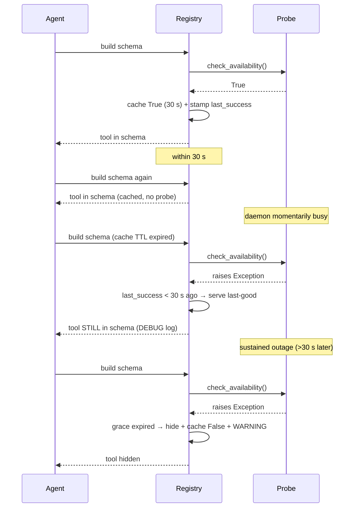
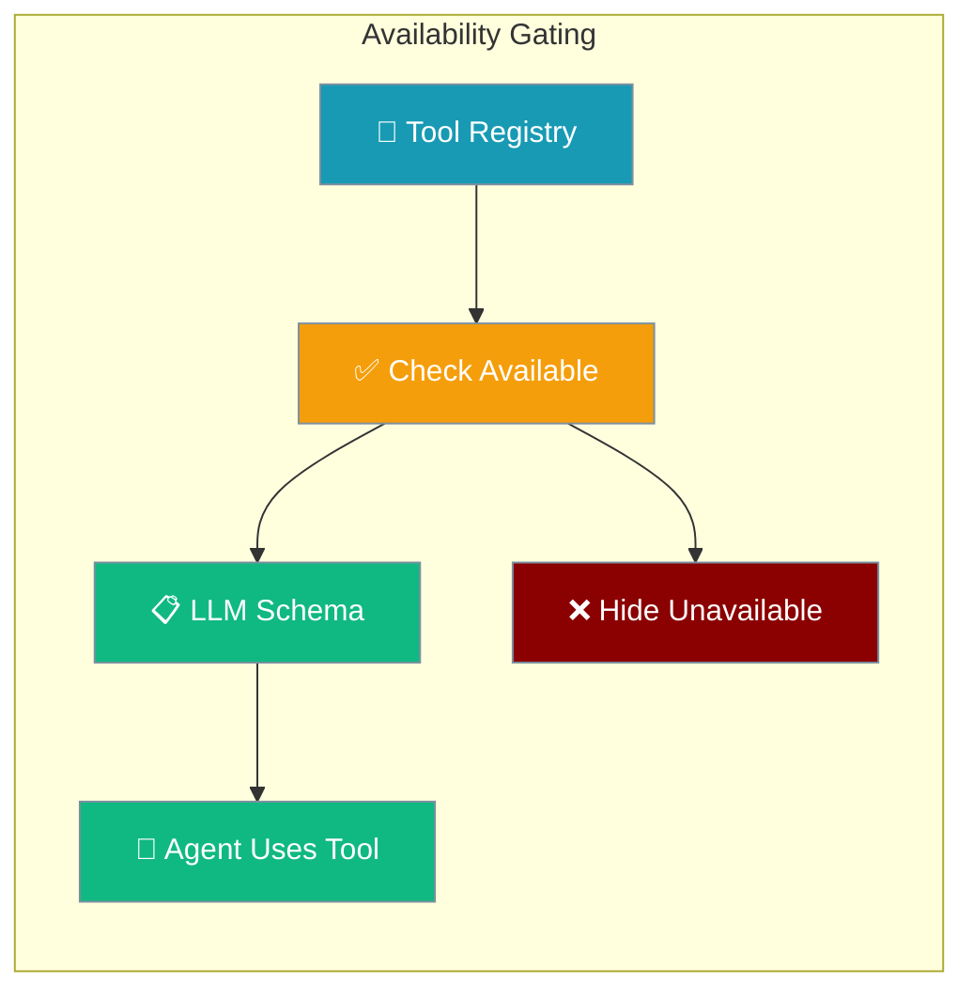
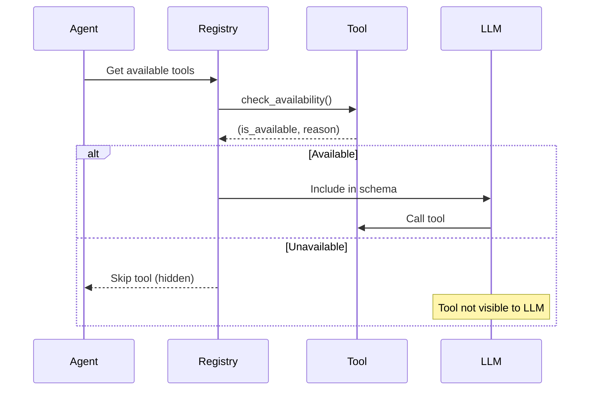
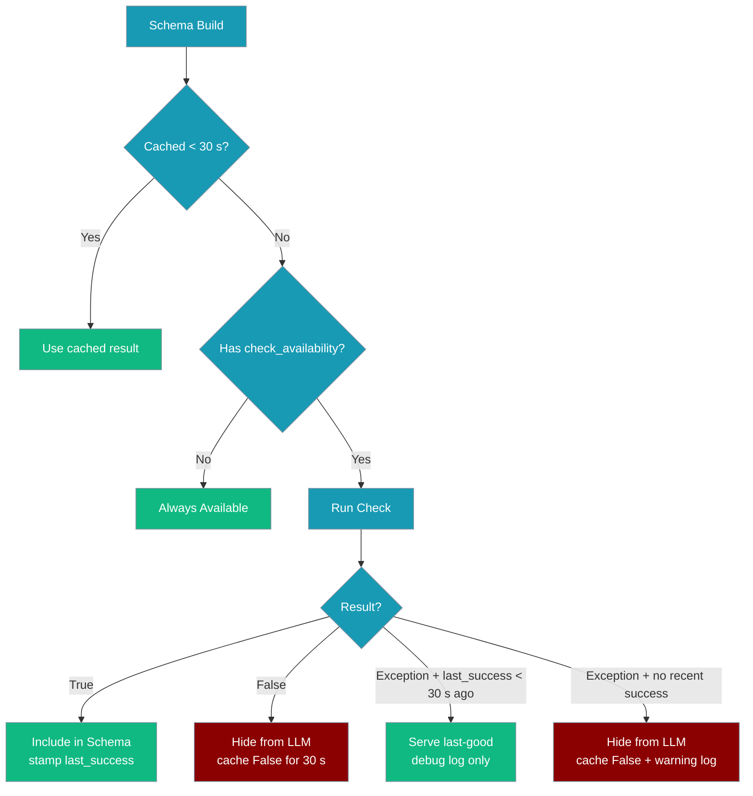

Tool availability gating filters unavailable tools at schema-build time, preventing the LLM from hallucinating calls to tools that can't run.

```python
import os
from praisonaiagents import Agent
from praisonaiagents import tool

@tool(availability=lambda: (bool(os.getenv("SERP_API_KEY")), "SERP_API_KEY not set"))
def search_web(query: str) -> str:
    """Search the web for information."""
    return f"Search results for: {query}"

agent = Agent(name="Researcher", tools=[search_web])
agent.start("Research quantum computing")
# Tool hidden if the key is missing. Once the key is set, a subsequent transient
# probe failure within 30 s keeps the tool available (last-good).
```


The user requests work that needs a gated tool; unavailable tools are hidden from the schema so the model cannot call them.


```mermaid
sequenceDiagram
    participant Agent
    participant Registry
    participant Probe

    Agent->>Registry: build schema
    Registry->>Probe: check_availability()
    Probe-->>Registry: True
    Registry->>Registry: cache True (30 s) + stamp last_success
    Registry-->>Agent: tool in schema

    Note over Registry: within 30 s
    Agent->>Registry: build schema again
    Registry-->>Agent: tool in schema (cached, no probe)

    Note over Probe: daemon momentarily busy
    Agent->>Registry: build schema (cache TTL expired)
    Registry->>Probe: check_availability()
    Probe-->>Registry: raises Exception
    Registry->>Registry: last_success < 30 s ago → serve last-good
    Registry-->>Agent: tool STILL in schema (DEBUG log)

    Note over Probe: sustained outage (>30 s later)
    Agent->>Registry: build schema
    Registry->>Probe: check_availability()
    Probe-->>Registry: raises Exception
    Registry->>Registry: grace expired → hide + cache False + WARNING
    Registry-->>Agent: tool hidden
```


```mermaid
graph LR
    subgraph "Availability Gating"
        A[🔧 Tool Registry] --> B[✅ Check Available]
        B --> C[📋 LLM Schema]
        B --> D[❌ Hide Unavailable]
        C --> E[🤖 Agent Uses Tool]
    end
    
    classDef registry fill:#189AB4,stroke:#7C90A0,color:#fff
    classDef check fill:#F59E0B,stroke:#7C90A0,color:#fff
    classDef available fill:#10B981,stroke:#7C90A0,color:#fff
    classDef hidden fill:#8B0000,stroke:#7C90A0,color:#fff
    classDef agent fill:#6366F1,stroke:#7C90A0,color:#fff
    
    class A registry
    class B check
    class C,E available
    class D hidden
```

## Quick Start

<Steps>
<Step title="Decorator with Availability Check">

```python
import os
from praisonaiagents import tool

@tool(availability=lambda: (bool(os.getenv("SERP_API_KEY")), "SERP_API_KEY not set"))
def search_web(query: str) -> str:
    """Search the web for information."""
    api_key = os.getenv("SERP_API_KEY")
    # ... search implementation
    return f"Search results for: {query}"

from praisonaiagents import Agent

agent = Agent(
    name="Researcher", 
    instructions="Research topics the user asks about.",
    tools=[search_web]
)
# If SERP_API_KEY missing → tool hidden from LLM
# If SERP_API_KEY set → tool appears and works normally
agent.start("Research quantum computing")
```

</Step>

<Step title="Class-Based Tool with Availability">

```python
from praisonaiagents import BaseTool

class DatabaseTool(BaseTool):
    name = "query_database"
    description = "Query the application database"
    
    def __init__(self, connection_string: str = None):
        super().__init__()
        self.connection_string = connection_string or os.getenv("DATABASE_URL")
    
    def check_availability(self) -> tuple[bool, str]:
        if not self.connection_string:
            return False, "DATABASE_URL not configured"
        
        try:
            # Quick connection test (must be fast, no I/O heavy operations)
            import psycopg2
            return True, ""
        except ImportError:
            return False, "psycopg2 package not installed"
    
    def run(self, query: str) -> str:
        # Implementation here
        return f"Query result: {query}"
```

</Step>
</Steps>

---

## How It Works


```mermaid
sequenceDiagram
    participant Agent
    participant Registry
    participant Tool
    participant LLM
    
    Agent->>Registry: Get available tools
    Registry->>Tool: check_availability()
    Tool-->>Registry: (is_available, reason)
    alt Available
        Registry->>LLM: Include in schema
        LLM->>Tool: Call tool
    else Unavailable
        Registry-->>Agent: Skip tool (hidden)
        Note over LLM: Tool not visible to LLM
    end
```

| Phase | Behavior | Performance |
|-------|----------|-------------|
| **Schema Build** | Availability checks run once | Zero runtime cost |
| **Tool Execution** | Only available tools included | Probes cached 30 s; no per-call overhead |
| **LLM Interaction** | Only sees usable tools | Prevents hallucination |

---

## Implementation Methods

### Function Decorator

```python
from praisonaiagents import tool
import os

# Simple environment check
@tool(availability=lambda: (bool(os.getenv("API_KEY")), "API_KEY missing"))
def api_tool(query: str) -> str:
    return f"API result: {query}"

# Complex dependency check  
def check_docker_available():
    try:
        import docker
        client = docker.from_env()
        client.ping()  # Quick ping, not heavy I/O
        return True, ""
    except Exception as e:
        return False, f"Docker unavailable: {e}"

@tool(availability=check_docker_available)
def docker_command(cmd: str) -> str:
    """Run Docker commands."""
    return f"Docker: {cmd}"
```

### BaseTool Protocol

```python
from praisonaiagents import BaseTool
from praisonaiagents.tools.protocols import ToolAvailabilityProtocol

class CloudTool(BaseTool, ToolAvailabilityProtocol):
    name = "cloud_deploy"
    description = "Deploy to cloud services"
    
    def check_availability(self) -> tuple[bool, str]:
        # Check multiple dependencies
        if not os.getenv("AWS_ACCESS_KEY"):
            return False, "AWS credentials not configured"
        
        try:
            import boto3
            # Quick credential test (fast operation only)
            boto3.Session().get_credentials()
            return True, ""
        except Exception as e:
            return False, f"AWS SDK error: {e}"
    
    def run(self, service: str) -> str:
        return f"Deployed {service} to cloud"
```

### Registry Functions

```python
from praisonaiagents.tools import list_available_tools, get_registry

# Get only available tools
available_tools = list_available_tools()
print(f"Available: {len(available_tools)} tools")

# Get all tools (including unavailable)
all_tools = get_registry().list_tools()
print(f"Total registered: {len(all_tools)} tools")

# Check specific tool
web_tool = get_registry().get("search_web")
if hasattr(web_tool, 'check_availability'):
    is_available, reason = web_tool.check_availability()
    print(f"Web tool available: {is_available}")
    if not is_available:
        print(f"Reason: {reason}")
```

---

## Availability Rules

### Behavior Patterns


```mermaid
graph TD
    A[Schema Build] --> B{Cached < 30 s?}
    B -->|Yes| C[Use cached result]
    B -->|No| D{Has check_availability?}
    D -->|No| E[Always Available]
    D -->|Yes| F[Run Check]
    F --> G{Result?}
    G -->|True| H[Include in Schema<br/>stamp last_success]
    G -->|False| I[Hide from LLM<br/>cache False for 30 s]
    G -->|Exception + last_success < 30 s ago| J[Serve last-good<br/>debug log only]
    G -->|Exception + no recent success| K[Hide from LLM<br/>cache False + warning log]

    classDef default fill:#189AB4,stroke:#7C90A0,color:#fff
    classDef available fill:#10B981,stroke:#7C90A0,color:#fff
    classDef unavailable fill:#8B0000,stroke:#7C90A0,color:#fff
    classDef amber fill:#F59E0B,stroke:#7C90A0,color:#fff

    class A,B,D,F,G default
    class C,E,H,J available
    class I,K unavailable
```

1. **No Check Method**: Tool is always considered available
2. **Check Returns True**: Tool included in LLM schema; last-success timestamp stamped
3. **Check Returns False**: Tool hidden from LLM; cached `False` for 30 s
4. **Check Throws Exception**: Flaky — served last-good within the grace window, otherwise hidden (see below)

The full behaviour, before and after the last-good grace window landed:

| Scenario | Before | After |
|---|---|---|
| Probe returns `True` | tool available, cached `True` for 30 s | unchanged; `last_success` also stamped |
| Probe returns `False` | tool hidden, cached `False` for 30 s | unchanged |
| Probe **raises** (no prior success **ever**) | tool hidden, cached `False`, `WARNING` logged | unchanged (hidden, `WARNING`) |
| Probe **raises** within 30 s of a recent success | tool hidden, cached `False`, `WARNING` logged | tool stays available (last-good), no negative cached, `DEBUG` logged |
| Probe **raises** more than 30 s after last success | tool hidden, cached `False`, `WARNING` logged | unchanged (hidden, `WARNING`) |
| `register(tool_v2, name="x", overwrite=True)` when `x` was recently healthy | replacement inherits cache + last-success — a broken v2 can look available for up to 30 s | cache + last-success evicted; the new tool starts clean |
| `unregister("x")` / `clear()` | cache entry lingered | evicted; no stale growth |

### Exception Handling

A raised probe is treated as flaky, not final:

- If the tool succeeded **within the last 30 seconds**, the last-good result is served and a `DEBUG` line is logged. The failure is **not** cached, so the next probe can recover immediately.
- Otherwise (no prior success, or the last success is older than 30 s), the tool is hidden, cached as unavailable for 30 s, and a `WARNING` is logged.

```python
# Result depends on when the last successful probe was:
def flaky_availability_check():
    raise ValueError("Network unreachable")

@tool(availability=flaky_availability_check)
def network_tool(host: str) -> str:
    return f"Ping {host}"

# Never succeeded / >30 s since last success:
# WARNING: Availability check failed for tool 'network_tool': Network unreachable
# → hidden from the LLM for 30 s

# Recent success then transient failure (within 30 s):
# DEBUG:   Availability check failed for tool 'network_tool' but serving last-good within grace window: Network unreachable
# → tool stays in the schema; no negative cached
```

This makes long-lived agents and gateways stable across brief daemon hiccups, import glitches, and network blips.

### Plain Function Registry

```python
from praisonaiagents import register_tool

def simple_function(text: str) -> str:
    return f"Processed: {text}"

# Plain functions are always available (no protocol support yet)
register_tool(simple_function)
```

---

## Availability Caching

Availability checks are cached per-tool for **30 seconds** so probes aren't re-run on every schema build.

| State | TTL | Behaviour |
|---|---|---|
| Cached `True` | 30 s | Reused on every subsequent schema build; probe skipped |
| Cached `False` | 30 s | Reused; tool stays hidden without re-probing |
| Last successful probe timestamp | 30 s | Enables the grace window (see [Exception Handling](#exception-handling)) |

The TTL and grace window are internal defaults (both 30 s) on `ToolRegistry` and are not user-tunable.

**When cache entries are cleared:**

- `registry.unregister(name)` — evicts the tool's cache and last-success timestamp.
- `registry.register(new_tool, name=..., overwrite=True)` — when the replacement is a **different instance**, prior availability state is evicted so a broken replacement can't inherit the previous tool's "healthy" status.
- `registry.clear()` — wipes everything.

<Tip>
Expensive probes (network calls, subprocess spawns) don't need `@lru_cache` — the registry already caches results for 30 s. Add `@lru_cache` only if you need longer caching.
</Tip>

---

## Configuration Patterns

### Environment-Based Availability

```python
import os
from praisonaiagents import tool

def check_environment(required_vars: list[str]):
    """Factory for environment-based availability checks."""
    def check():
        missing = [var for var in required_vars if not os.getenv(var)]
        if missing:
            return False, f"Missing environment variables: {', '.join(missing)}"
        return True, ""
    return check

@tool(availability=check_environment(["OPENAI_API_KEY", "PINECONE_API_KEY"]))
def ai_research(topic: str) -> str:
    """Research topics using AI and vector search."""
    return f"AI research on: {topic}"

@tool(availability=check_environment(["SLACK_TOKEN"]))  
def notify_team(message: str) -> str:
    """Send notifications to team Slack."""
    return f"Notified team: {message}"
```

### Service Discovery

```python
from praisonaiagents import tool
import socket

def check_service_available(host: str, port: int):
    """Check if a network service is reachable."""
    def check():
        try:
            with socket.socket(socket.AF_INET, socket.SOCK_STREAM) as s:
                s.settimeout(2)  # Keep fast
                s.connect((host, port))
                return True, ""
        except Exception as e:
            return False, f"Service {host}:{port} unreachable: {e}"
    return check

@tool(availability=check_service_available("localhost", 5432))
def query_local_db(sql: str) -> str:
    """Query local PostgreSQL database."""
    return f"SQL result: {sql}"

@tool(availability=check_service_available("redis-server", 6379))
def cache_data(key: str, value: str) -> str:
    """Cache data in Redis."""
    return f"Cached {key}: {value}"
```

### Conditional Tool Loading

```python
from praisonaiagents import Agent
from praisonaiagents.tools import list_available_tools

# Build agent with only available tools
available_tools = list_available_tools()
print(f"Loading agent with {len(available_tools)} available tools")

agent = Agent(
    name="AdaptiveAgent",
    instructions="Use whatever tools are available in the current environment.",
    tools=available_tools
)

# Agent automatically adapts to environment capabilities
```

---

## Best Practices

<AccordionGroup>
<Accordion title="Keep Checks Fast" icon="clock">
Availability checks run at schema-build time and must be fast (< 100ms recommended).

**Good**: Environment variable checks, import tests, quick pings
**Bad**: Full API calls, heavy file operations, long network requests

```python
# Fast check
@tool(availability=lambda: (bool(os.getenv("API_KEY")), "API_KEY missing"))

# Slow check (avoid)
def slow_check():
    import requests
    requests.get("https://api.example.com/health", timeout=30)  # Too slow!
    return True, ""
```
</Accordion>

<Accordion title="Let the Registry Cache Your Probes" icon="database">
The registry already caches every probe result for 30 s — see [Availability Caching](#availability-caching). Don't wrap probes in `@lru_cache` unless you need caching longer than 30 s.
</Accordion>

<Accordion title="Fail Fast on Missing Dependencies" icon="shield-check">
Check critical dependencies first, avoid unnecessary work.

```python
def check_ml_stack():
    # Check imports first (fast)
    try:
        import torch
        import transformers
    except ImportError as e:
        return False, f"Missing ML dependencies: {e}"
    
    # Then check GPU availability (slower)
    if not torch.cuda.is_available():
        return False, "CUDA not available"
    
    return True, ""
```
</Accordion>

<Accordion title="Graceful Degradation" icon="triangle-exclamation">
Design tools to degrade gracefully when dependencies are partially available.

```python
@tool(availability=lambda: (True, ""))  # Always available
def search_content(query: str) -> str:
    """Search using best available method."""
    
    # Try premium search first
    if os.getenv("PREMIUM_SEARCH_KEY"):
        return premium_search(query)
    
    # Fall back to basic search
    return basic_search(query)
```
</Accordion>
</AccordionGroup>

---

## Related

<CardGroup cols={2}>
<Card title="Tools Overview" icon="wrench" href="/docs/features/toolsets">
Core tool system and registration
</Card>

<Card title="Agent Configuration" icon="cog" href="/docs/features/agent-profiles">
Agent setup and tool integration
</Card>
</CardGroup>