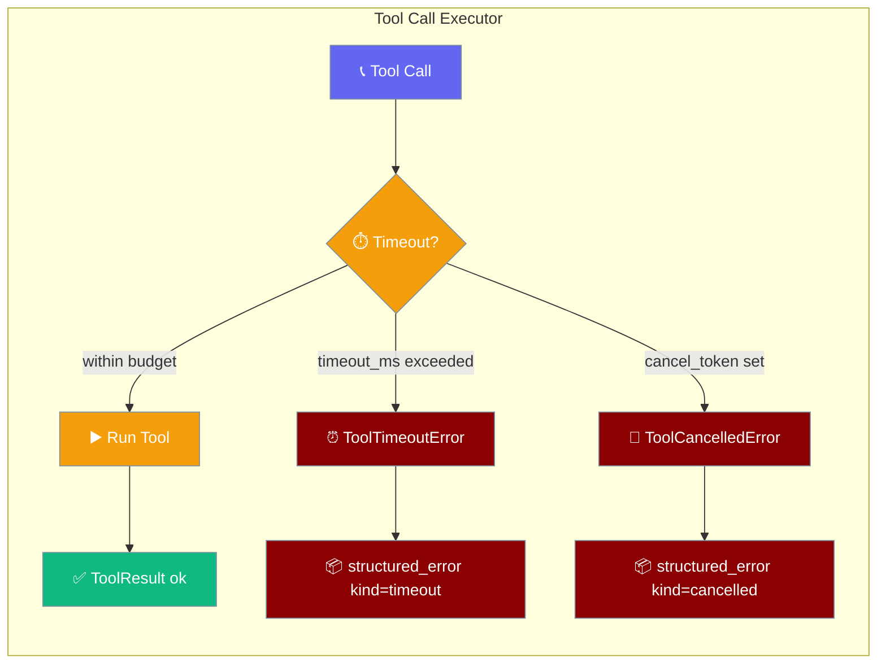
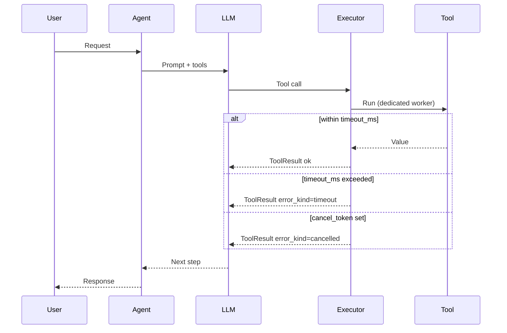

The tool-call executor caps each tool call with a millisecond timeout and lets you cancel pending calls, returning a typed result the model can reason about instead of hanging the turn.

```python
from praisonaiagents import Agent

def fetch_url(url: str) -> str:
    ...  # a tool that may hang

Agent(
    instructions="Look things up.",
    tools=[fetch_url],
    llm={"model": "gpt-4o", "tool_timeout_ms": 5000},  # 5-second per-tool cap
).start("Look up https://example.com")
```



<Warning>
`tool_timeout_ms` is in **milliseconds**. The wrapper-level `tool_timeout` (YAML / CLI) is in **seconds**. `tool_timeout_ms: 5000` = 5 seconds. See [Tool Config](/configuration/tool-config) for the layers.
</Warning>

## Quick Start

<Steps>
<Step title="Cap every tool call">
Set `tool_timeout_ms` inside the `llm=` dict. A slow tool now returns a typed timeout result instead of freezing the turn.

```python
from praisonaiagents import Agent

def fetch_url(url: str) -> str:
    ...  # a tool that may hang

agent = Agent(
    instructions="Fetch pages and summarise them.",
    tools=[fetch_url],
    llm={"model": "gpt-4o", "tool_timeout_ms": 5000},  # 5s per tool
)

agent.start("Summarise https://example.com")
```
</Step>

<Step title="Cancel from another thread">
Signal a `threading.Event`-shaped cancel token to abort pending tool calls — useful in a REPL or gateway where a user hits stop.

```python
import threading
from praisonaiagents.tools import (
    SequentialToolCallExecutor, ToolCall, ToolCancelledError,
)

cancel = threading.Event()

def execute_tool(name, args, tool_call_id):
    return {"ok": True}

executor = SequentialToolCallExecutor()
cancel.set()  # e.g. fired from a signal handler / stop button

results = executor.execute_batch(
    [ToolCall("fetch_url", {"url": "https://example.com"}, "call_1")],
    execute_tool,
    cancel_token=cancel,
)

print(results[0].error_kind)         # "cancelled"
print(results[0].structured_error)   # {"error": True, "kind": "cancelled", ...}
```
</Step>
</Steps>

---

## How It Works

The executor wraps each tool call, branching to a typed result on timeout or cancellation.



| Condition | Behaviour |
|---|---|
| `timeout_ms is None` or `<= 0` | Tool runs directly with zero wrapping overhead. |
| `timeout_ms > 0` | Tool runs on a dedicated `ThreadPoolExecutor(max_workers=1)`; on expiry the worker is abandoned and a typed timeout result is returned. |
| `cancel_token` signalled | Tool never runs; returns a typed cancelled result. |

<Warning>
A timed-out **sync** tool's worker is abandoned, not killed — Python threads cannot be force-killed. The tool may keep running in the background. Do not rely on the timeout for security-critical bounds.
</Warning>

---

## Configuration Options

| Option | Type | Default | Description |
|---|---|---|---|
| `tool_timeout_ms` (in `llm=` dict / `extra_settings`) | `int` | `None` | Per-tool timeout in **milliseconds**. `None` or `<= 0` disables it. |
| `cancel_token` (kwarg to `execute_batch`) | `threading.Event`-like | `None` | Any object with `is_set()`, `is_cancelled`, or `cancelled` (attribute or callable). When signalled, pending tool calls short-circuit. |

The cancel token is duck-typed — it supports both `threading.Event` and `InterruptController`-shaped tokens without importing a concrete type.

---

## Structured Error Envelope

`ToolResult.structured_error` returns a discriminated JSON envelope so the model can tell a timeout from a genuine bug, instead of an opaque `"Error executing tool: ..."` string.

```json
{
  "error": true,
  "kind": "timeout",
  "type": "ToolTimeoutError",
  "message": "Tool 'fetch_url' timed out after 5000ms",
  "tool": "fetch_url"
}
```

| Field | Type | Values |
|---|---|---|
| `error` | `bool` | Always `true` when present |
| `kind` | `str` | `"timeout"` \| `"cancelled"` \| `"error"` |
| `type` | `str` | Exception class name (`ToolTimeoutError`, `ToolCancelledError`, or the tool's own exception) |
| `message` | `str` | `str(exc)` |
| `tool` | `str` | Tool function name |

The `kind` discriminant lets the model retry a `timeout`, abort on a `cancelled`, and report a plain `error` differently.

---

## Exceptions

| Exception | Module | When raised |
|---|---|---|
| `ToolTimeoutError` | `praisonaiagents.tools` | Sync worker exceeded `timeout_ms` |
| `ToolCancelledError` | `praisonaiagents.tools` | `cancel_token` was signalled before / between calls |

```python
from praisonaiagents.tools import ToolTimeoutError, ToolCancelledError
```

These are surfaced as `ToolResult.error` with the matching `error_kind` — they are not thrown to your calling code.

<Warning>
There are **two** `ToolTimeoutError` classes in PraisonAI. `praisonaiagents.tools.ToolTimeoutError` (this page, milliseconds, executor layer) is distinct from `praisonai.agents_generator.ToolTimeoutError` (wrapper layer, seconds, YAML/CLI). Import the one for the layer you are catching at. See [Tool Config](/configuration/tool-config).
</Warning>

---

## Common Patterns

Bound a whole batch with one timeout — most users' entry point:

```python
from praisonaiagents import Agent

def fetch_url(url: str) -> str:
    ...

Agent(
    instructions="Summarise pages.",
    tools=[fetch_url],
    llm={"model": "gpt-4o", "tool_timeout_ms": 3000},  # 3s cap on every tool call
).start("Summarise https://example.com")
```

Wire up graceful cancellation for a REPL or long-running gateway:

```python
import threading
from praisonaiagents.tools import SequentialToolCallExecutor, ToolCall

cancel = threading.Event()

def stop():
    cancel.set()  # call from a signal handler or a UI stop button

def execute_tool(name, args, tool_call_id):
    return {"ok": True}

executor = SequentialToolCallExecutor()
results = executor.execute_batch(
    [ToolCall("fetch_url", {"url": "https://example.com"}, "call_1")],
    execute_tool,
    timeout_ms=5000,
    cancel_token=cancel,
)
```

---

## Best Practices

<AccordionGroup>
<Accordion title="Pick the right timeout layer">
Use millisecond `tool_timeout_ms` for **user-facing latency budgets** (a chat turn should not hang). Use wrapper-level `tool_timeout` (seconds) for **hard operational cutoffs** in YAML/CLI crews.
</Accordion>

<Accordion title="Background work may continue">
A timed-out sync tool's daemon worker is abandoned, not killed. Assume the tool may still be running. Never use the timeout to enforce security-critical bounds.
</Accordion>

<Accordion title="Reserve cancel tokens for interactive loops">
Use `cancel_token` for interactive or streaming loops (bot, CLI, gateway) where a user can hit stop. Background jobs should rely on `tool_timeout_ms` alone.
</Accordion>

<Accordion title="Let the model see structured_error">
Pass `ToolResult.structured_error` to the LLM instead of flattening it to a string. The discriminated `kind` is what lets the agent choose retry vs. abort vs. report.
</Accordion>
</AccordionGroup>

---

## Related

<CardGroup cols={2}>
<Card title="Async Tool Safety" icon="shield" href="/features/async-tool-safety">
Wrapper-level timeouts and safe async tool execution.
</Card>
<Card title="Tool Config" icon="wrench" href="/configuration/tool-config">
Configure timeouts across all three enforcement layers.
</Card>
<Card title="Concurrency" icon="bolt" href="/features/concurrency">
Parallel tool execution and per-agent limits.
</Card>
</CardGroup>
