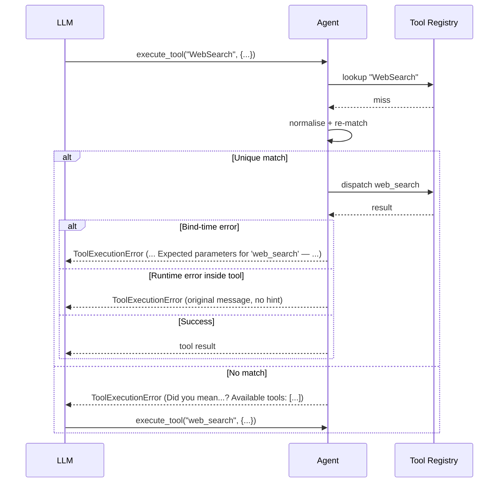

When the model calls `WebSearch` but your tool is registered as `web_search`, PraisonAI fixes the name automatically — and when it can't, it tells the model exactly which tools exist and how to call them.

```python
from praisonaiagents import Agent

def web_search(query: str) -> str:
    """Search the web."""
    return f"results for {query}"

agent = Agent(name="Search", instructions="Search the web", tools=[web_search])
agent.start("Search for 'planet orbits'")
# The model may emit the tool call 'WebSearch' — it dispatches to web_search automatically.
```

```mermaid
graph LR
    subgraph "Tool Call Self-Repair"
        Call[🤖 LLM tool call] --> Match{🔍 Name match?}
        Match -->|Hit| Run[✅ Dispatch tool]
        Match -->|Miss| Norm{🔧 Repairable?}
        Norm -->|Unique match| Run
        Norm -->|No match| Fix[📋 Corrective error + hint]
        Run --> Boom{❌ Raised?}
        Boom -->|Bind error| Hint[📋 Schema hint]
        Boom -->|Value error| Raw[📩 Original message]
        Fix --> Retry[🔁 Model retries]
        Hint --> Retry
        Raw --> Retry
    end

    classDef call fill:#8B0000,stroke:#7C90A0,color:#fff
    classDef check fill:#F59E0B,stroke:#7C90A0,color:#fff
    classDef run fill:#10B981,stroke:#7C90A0,color:#fff
    classDef fix fill:#189AB4,stroke:#7C90A0,color:#fff

    class Call,Retry call
    class Match,Norm,Boom check
    class Run run
    class Fix,Hint,Raw fix
```

## Quick Start

<Steps>
<Step title="Case and separator drift auto-fixes">
```python
agent.execute_tool("WebSearch", {"query": "hello"})   # -> "results for hello"
agent.execute_tool("web-search", {"query": "world"})  # -> "results for world"
```
Both dispatch to `web_search`. No configuration required.
</Step>

<Step title="Unknown names return a corrective message">
```python
from praisonaiagents.errors import ToolExecutionError

try:
    agent.execute_tool("totally_made_up_tool", {})
except ToolExecutionError as e:
    print(str(e))
    # Tool 'totally_made_up_tool' not found. Did you mean 'web_search'? Available tools: ['web_search']
```
The message is what the model sees, so on the next turn it retries with a valid name.
</Step>

<Step title="Bind failures echo the parameters">
```python
try:
    agent.execute_tool("web_search", {})   # missing 'query'
except ToolExecutionError as e:
    print(str(e))
    # ... Expected parameters for 'web_search' — required: ['query'], optional: ['limit'].
```
The model learns which arguments to send next. This hint fires only when the kwargs cannot bind — a genuine argument-binding error.
</Step>

<Step title="Value errors pass through unchanged">
```python
from praisonaiagents import Agent
from praisonaiagents.errors import ToolExecutionError

def web_search(query: str) -> str:
    """Search the web."""
    if not query:
        raise ValueError("query must not be empty")
    return f"results for {query}"

agent = Agent(name="Search", instructions="Search the web", tools=[web_search])

try:
    agent.execute_tool("web_search", {"query": ""})   # bound OK, tool raises
except ToolExecutionError as e:
    print(str(e))
    # query must not be empty
```
The kwargs bound cleanly, so the model isn't told to change the parameter names — it's told to fix the value.
</Step>
</Steps>

<Note>
No new API and no new `Agent(...)` parameter. Self-repair is a runtime behavior of the existing tool-dispatch path, triggered whenever an LLM tool call arrives.
</Note>

---

## How It Works

Every tool call runs through `Agent.execute_tool`; a dispatch miss triggers normalisation, repair, or a corrective error before the result returns to the model.



Normalisation compares `str(name).lower().replace('_', '').replace('-', '').replace(' ', '')`. Repair fires only when exactly **one** active tool normalises to the same key — ambiguous matches skip repair and fall through to the corrective error, so there is never an ambiguous dispatch.

---

## Four failure modes, four responses

<Tabs>
<Tab title="Case / separator drift">
Silent auto-fix. The tool runs and returns its normal result. A debug log records the repair:

```text
Self-repaired tool name 'WebSearch' -> 'web_search'
```
</Tab>

<Tab title="Unknown name">
The impl returns a corrective dict; the public path raises `ToolExecutionError` carrying the same text:

```python
{
    "error": "Tool 'totally_made_up_tool' not found. Did you mean 'web_search'? Available tools: ['calculator', 'web_search']",
    "available_tools": ["calculator", "web_search"],
}
```

The nearest name uses `difflib.get_close_matches(name, available, n=1, cutoff=0.5)`.
</Tab>

<Tab title="Bind failure">
A genuine argument-binding error — `inspect.signature(...).bind(**kwargs)` raises `TypeError` before the tool body runs (missing, extra, or wrong-named kwargs). The runtime introspects the signature and folds the parameters into the message:

```python
{
    "error": "missing a required argument: 'query' Expected parameters for 'web_search' — required: ['query'], optional: ['limit'].",
    "expected_parameters": {"required": ["query"], "optional": ["limit"]},
}
```

Introspection skips `self`, `*args`, and `**kwargs`. `BaseTool` subclasses are inspected via `.run` (classes fall back to `._run`).
</Tab>

<Tab title="Runtime error inside the tool">
The kwargs bind cleanly and the tool body raises its own `TypeError` / `ValueError`. The runtime surfaces the original error and adds **no** parameter hint — the model needs to change the value, not the argument names:

```python
def web_search(query: str) -> str:
    if not query:
        raise ValueError("query must not be empty")
    ...

agent.execute_tool("web_search", {"query": ""})
# {"error": "query must not be empty"}
```

No `expected_parameters` field and no `Expected parameters for '<tool>' — ...` suffix in the message.
</Tab>
</Tabs>

---

## Why the hints reach the model

`ToolExecutionError` preserves only its `message` through conversion, so the corrective payload is folded into the message string itself.

<AccordionGroup>
<Accordion title="Corrective inventory in the message">
The `Did you mean '<nearest>'?` hint and the `Available tools: [...]` list live inside the error string, so the follow-up model turn sees them via the raised `ToolExecutionError.message`.
</Accordion>

<Accordion title="Parameter hint in the message">
The bind-failure branch appends `Expected parameters for '<tool>' — required: [...], optional: [...].` to the message string. The same names are also returned as a structured `expected_parameters` dict on the impl-level result.
</Accordion>

<Accordion title="Only true bind failures get the hint">
A `TypeError` or `ValueError` raised *inside* a successfully-bound tool is a value problem, not a parameter problem. The runtime gates the schema hint on `inspect.signature(target).bind(**kwargs)` — the `required`/`optional` names only appear in the error message when the kwargs actually failed to bind. Otherwise the tool's own error string reaches the model unchanged, so the model fixes the value instead of renaming the parameters.
</Accordion>

<Accordion title="Backward compatible">
No new public API, no new `Agent` parameters, and no new environment variables. The prior behavior on unknown tools was a bare `Tool 'X' is not callable` — not a stable contract, so no valid callers depended on it. When signature introspection itself is impossible (e.g. a C-implemented callable), the gate fails closed — it omits the hint rather than echo a misleading one.
</Accordion>
</AccordionGroup>

---

## MCP tools participate too

MCP-container tools are expanded into their contained tools, so their names appear in the corrective inventory and can be name-repaired — not just the opaque `MCP` container.

```python
from praisonaiagents import Agent
from praisonaiagents.mcp import MCP

mcp = MCP("uvx mcp-server-fetch")     # contains e.g. 'read_file', 'write_file'
agent = Agent(name="Files", instructions="Handle files", tools=[mcp])

# Case/separator drift on an MCP tool name still auto-fixes:
agent.execute_tool("Read-File", {"path": "x"})   # dispatches to read_file
```

If none of the MCP tools match, the corrective error's `Available tools:` list contains the MCP-provided tool names instead of the container. Only MCP instances that iterate into per-tool callables exposing `__name__` or `name` benefit — the standard `praisonaiagents.mcp.MCP` satisfies this.

---

## Init-time vs runtime

Two resolvers cover two different moments.

| Scope | Trigger | Page |
|-------|---------|------|
| Init-time | You pass a tool name to `Agent(tools=[...])` at construction, e.g. `"web_serch"` | [Tool Resolution](/docs/features/tool-resolution) |
| Runtime | The LLM emits a tool call like `WebSearch` during a run | This page |

Self-repair complements — it does not replace — init-time [Tool Resolution](/docs/features/tool-resolution).

---

## Related

<CardGroup cols={2}>
<Card title="Tool Resolution" icon="wand-magic-sparkles" href="/docs/features/tool-resolution">
  Init-time typo detection when you pass tool names to `Agent(tools=[...])`
</Card>
<Card title="Error Handling" icon="shield-halved" href="/docs/features/error-handling">
  Catch and act on `ToolExecutionError` and other structured errors
</Card>
<Card title="MCP" icon="plug" href="/docs/concepts/mcp">
  Connect model-context-protocol servers as tools
</Card>
<Card title="Allowed Tools" icon="lock" href="/docs/features/allowed-tools">
  Restrict which tools an agent can call
</Card>
</CardGroup>
