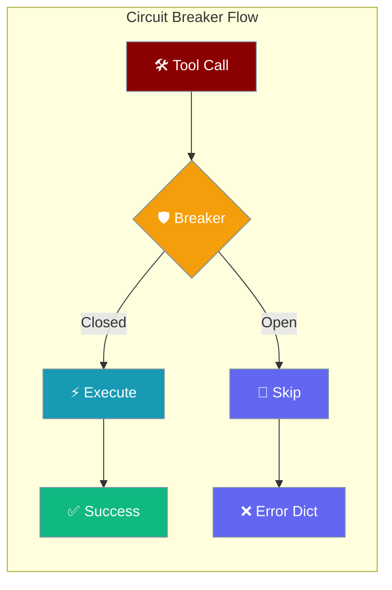
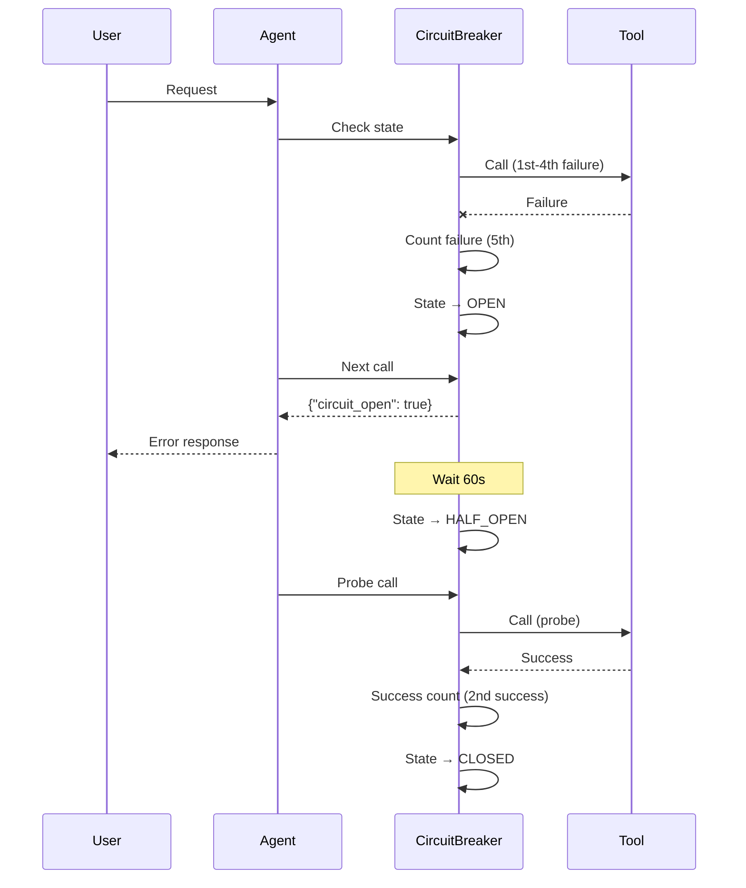
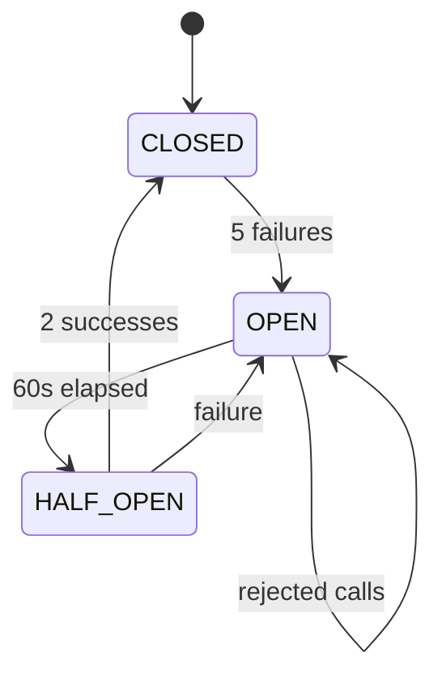
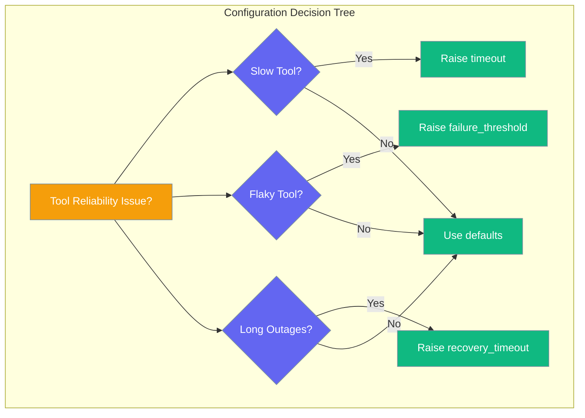

Every tool call is automatically protected by a circuit breaker that stops repeated failures from wasting time.

<Note>
**Sync and Async Parity**: Circuit breaker protection now applies uniformly to both sync and async tool execution paths. Previously, async calls bypassed circuit breaker checks.
</Note>



## Quick Start

<Steps>

<Step title="Works by default">
Circuit breaker protection is automatically enabled for every tool call with zero configuration needed.

```python
from praisonaiagents import Agent

agent = Agent(
    name="Researcher",
    instructions="Research the topic",
    tools=[my_tool],  # Circuit breaker protects my_tool automatically
)

agent.start("Research quantum computing")
```
</Step>

<Step title="Detect open circuit">
When a tool fails 5 times consecutively, subsequent calls return an error dictionary instead of calling the tool.

```python
# If my_tool fails 5 times in a row, subsequent calls return:
# {
#     "error": "Tool 'my_tool' circuit breaker open - too many recent failures", 
#     "circuit_open": True,
#     "agent_name": "Researcher",
#     "session_id": "...",
#     "remediation": "Wait for recovery_timeout (60s) or investigate recent tool failures."
# }
```
</Step>

<Step title="Tune or reset">
Customize circuit breaker behavior or reset all breakers between test runs.

```python
from praisonaiagents.tools.circuit_breaker import (
    get_circuit_breaker, CircuitBreakerConfig, reset_all_circuit_breakers
)

# Tune circuit breaker for a specific tool
breaker = get_circuit_breaker(
    "tool_my_tool", 
    CircuitBreakerConfig(
        failure_threshold=3,  # Open after 3 failures instead of 5
        recovery_timeout=30.0,  # Try again after 30s instead of 60s
    )
)

# Reset all circuit breakers
reset_all_circuit_breakers()
```
</Step>

</Steps>

---

## How It Works





| State | Behavior |
|-------|----------|
| **CLOSED** | Normal operation - all calls pass through |
| **OPEN** | Tool calls blocked - returns error dict |
| **HALF_OPEN** | Recovery mode - limited probe calls allowed |

---

## Configuration Options



| Option | Type | Default | Description |
|--------|------|---------|-------------|
| `failure_threshold` | `int` | `5` | Failures before opening |
| `recovery_timeout` | `float` | `60.0` | Seconds before half-open probe |
| `success_threshold` | `int` | `2` | Successes in half-open to close |
| `timeout` | `float` | `30.0` | Per-call timeout |
| `monitor_window` | `float` | `300.0` | Failure-rate window |
| `enable_health_check` | `bool` | `True` | Periodic health checks |
| `health_check_interval` | `float` | `30.0` | Health-check interval |
| `graceful_degradation` | `bool` | `True` | Return error dict instead of raising |

---

## What Does NOT Trip the Breaker

Circuit breakers ignore certain error types to avoid false positives:

- **Approval denied errors** - User permission issues don't indicate tool problems
- **Permission denied errors** - Access control failures aren't tool failures  
- **Approval process errors** - User workflow issues shouldn't trigger circuit breaking

These errors are handled normally by the agent without affecting circuit breaker state.

---

## Common Patterns

<Tabs>

<Tab title="Observability">
Monitor circuit breaker health and statistics for debugging.

```python
from praisonaiagents.tools.circuit_breaker import get_circuit_breaker

# Get circuit breaker for a tool
breaker = get_circuit_breaker("tool_my_tool")

# Check current state and stats
print(f"State: {breaker.state}")
print(f"Failure count: {breaker.stats.failure_count}")
print(f"Success count: {breaker.stats.success_count}")
print(f"Total requests: {breaker.stats.total_requests}")
print(f"Rejected requests: {breaker.stats.rejected_requests}")
```
</Tab>

<Tab title="Custom Config Per Tool">
Apply different circuit breaker settings to different tools based on their reliability characteristics.

```python
from praisonaiagents.tools.circuit_breaker import get_circuit_breaker, CircuitBreakerConfig

# Strict config for unreliable external APIs
strict_config = CircuitBreakerConfig(
    failure_threshold=2,    # Open quickly
    recovery_timeout=120.0,  # Wait longer before retry
)
api_breaker = get_circuit_breaker("tool_external_api", strict_config)

# Lenient config for internal tools
lenient_config = CircuitBreakerConfig(
    failure_threshold=10,   # Allow more failures
    recovery_timeout=30.0,  # Recover quickly
)
internal_breaker = get_circuit_breaker("tool_internal_db", lenient_config)
```
</Tab>

<Tab title="Global Reset">
Reset all circuit breakers after deployments or system maintenance.

```python
from praisonaiagents.tools.circuit_breaker import reset_all_circuit_breakers

# Reset all breakers (useful for test cleanup or after deployment)
reset_all_circuit_breakers()

# Or reset individual breakers
from praisonaiagents.tools.circuit_breaker import get_circuit_breaker
breaker = get_circuit_breaker("tool_my_tool")
breaker.reset()
```
</Tab>

</Tabs>

---

## Best Practices

<AccordionGroup>

<Accordion title="Don't disable in production">
Circuit breakers prevent cascading failures and protect system stability. Keep them enabled in production environments to ensure reliable agent operation.
</Accordion>

<Accordion title="Monitor circuit breaker stats">
Track circuit breaker statistics in your monitoring systems. Frequent openings indicate underlying tool reliability issues that need attention.
</Accordion>

<Accordion title="Reset between test runs">
Call `reset_all_circuit_breakers()` in test teardown to ensure clean state. This prevents test failures from affecting subsequent test runs.
</Accordion>

<Accordion title="Surface circuit_open to users">
When handling `circuit_open: true` responses, provide clear user feedback about temporary tool unavailability and suggest retry timeframes or alternative approaches.
</Accordion>

</AccordionGroup>

---

## Related

<CardGroup cols={2}>
  <Card title="Model Failover" icon="rotate" href="/features/model-failover">
    Automatic LLM provider switching
  </Card>
  <Card title="Error Handling" icon="triangle-exclamation" href="/best-practices/error-handling">
    Comprehensive error handling strategies
  </Card>
</CardGroup>