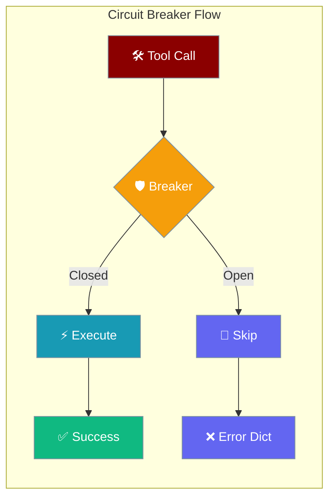
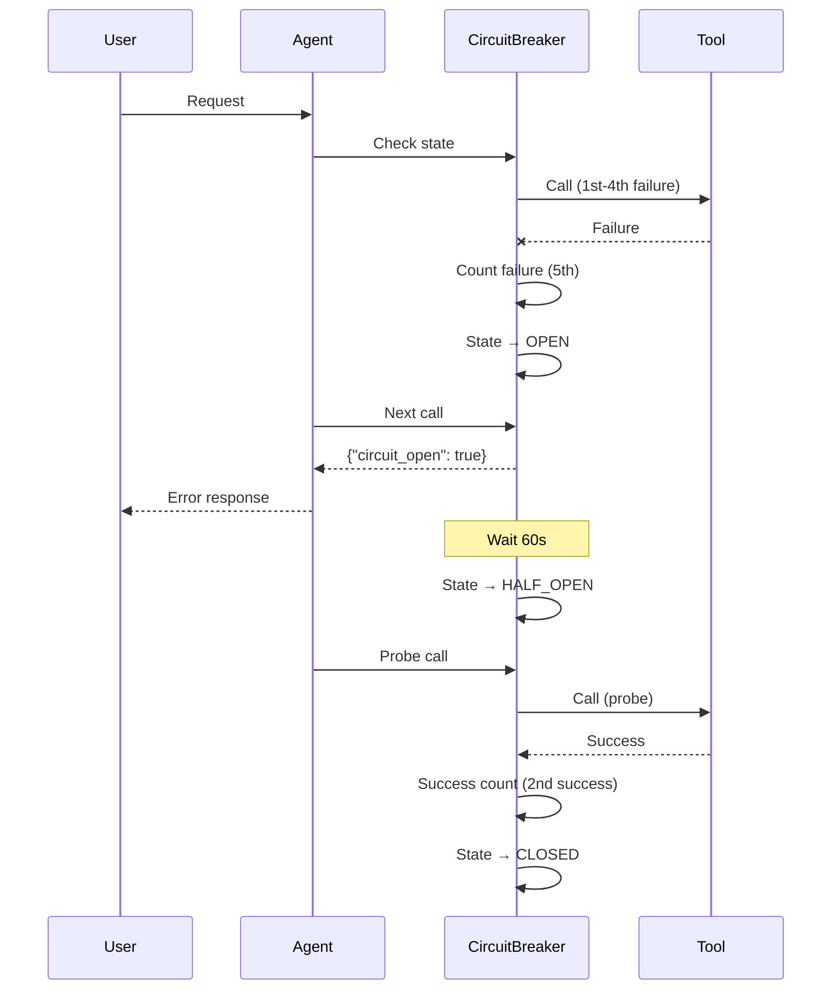
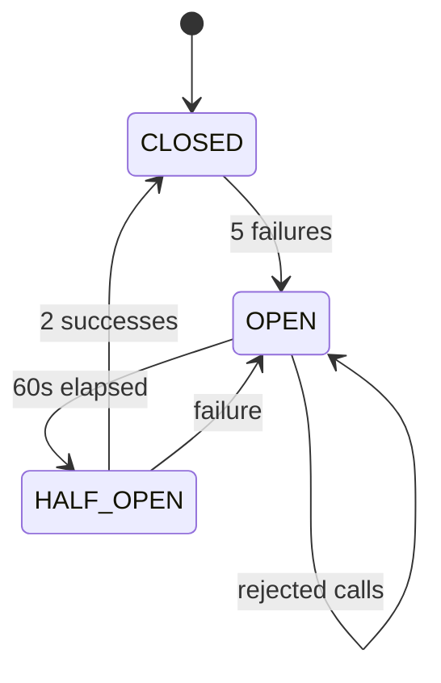
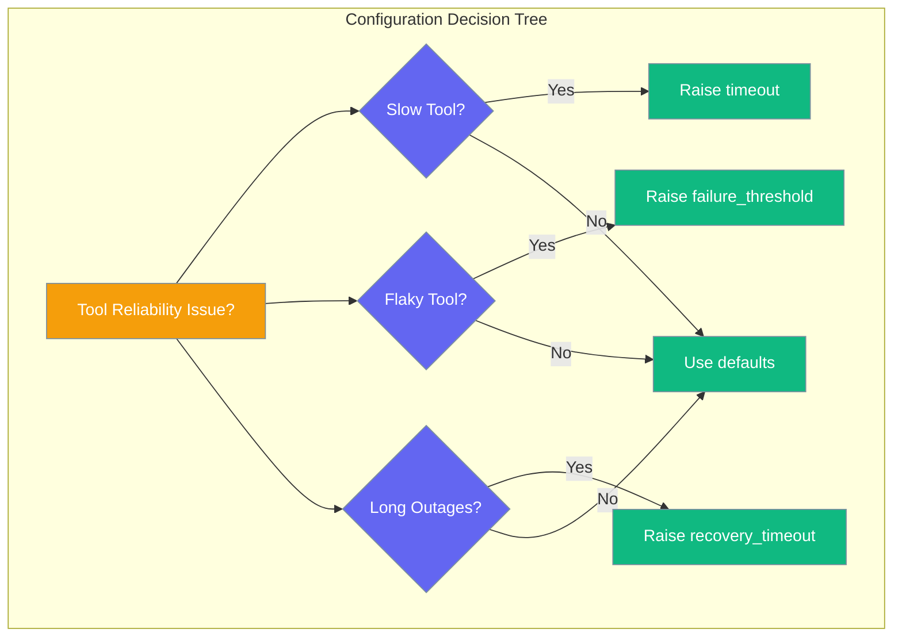

Every tool call is automatically protected by a circuit breaker that stops repeated failures from wasting time.

```python
from praisonaiagents import Agent, tool

@tool
def flaky_api(query: str) -> str:
    """Call an external API."""
    return f"Results for: {query}"

agent = Agent(name="Researcher", tools=[flaky_api])
agent.start("Search quantum computing")  # circuit breaker protects automatically
```

<Note>
**Sync and Async Parity**: Circuit breaker protection applies uniformly to both sync and async tool execution paths. Parity was first delivered in [MervinPraison/PraisonAI#4469](https://github.com/MervinPraison/PraisonAI/pull/4469), which wraps each async invocation through `CircuitBreaker.acall(...)` — event-loop safe, no `time.sleep`. [MervinPraison/PraisonAI#4533](https://github.com/MervinPraison/PraisonAI/pull/4533) then added the `_circuit_breaker_precheck(...)` / `_circuit_breaker_record(...)` helpers for the pre-check and outcome recording. Both a **raised exception** inside the tool and a **result dict carrying `error`** count as breaker failures — but approval / permission / policy / guardrail denials do not. Earlier releases skipped the breaker on `achat()`/`astart()`.
</Note>

<Note>
This tool-level circuit breaker is separate from the new [LLM idle-timeout circuit breaker](/features/llm-error-classification#idle-timeout-circuit-breaker), which protects against LLM provider stalls during model calls.
</Note>

<Note>
**Per-agent scoping:** breakers are now keyed per agent instance (`tool_{id(self)}_{function_name}`), so two agents that expose same-named tools (e.g. `search`) no longer share one breaker — one agent's failures can't degrade the other. Per-agent breakers are auto-pruned from the registry when the `Agent` is garbage-collected (via `weakref.finalize`), so a reused instance id can't inherit a stale OPEN breaker — `agent.close()` / `aclose()` merely reclaims that space earlier.
</Note>


The user triggers a flaky tool; repeated failures open the breaker so later calls fail fast instead of looping on errors.


```mermaid
graph LR
    subgraph "Circuit Breaker Flow"
        A[🛠️ Tool Call] --> B{🛡️ Breaker}
        B -->|Closed| C[⚡ Execute]
        B -->|Open| D[🚫 Skip]
        C --> E[✅ Success]
        D --> F[❌ Error Dict]
    end
    
    classDef tool fill:#8B0000,stroke:#7C90A0,color:#fff
    classDef breaker fill:#F59E0B,stroke:#7C90A0,color:#fff
    classDef execute fill:#189AB4,stroke:#7C90A0,color:#fff
    classDef skip fill:#6366F1,stroke:#7C90A0,color:#fff
    classDef success fill:#10B981,stroke:#7C90A0,color:#fff
    classDef error fill:#6366F1,stroke:#7C90A0,color:#fff
    
    class A tool
    class B breaker
    class C execute
    class D skip
    class E success
    class F error
```

## Quick Start

<Steps>

<Step title="Works by default">
Circuit breaker protection is automatically enabled for every tool call with zero configuration needed.

```python
from praisonaiagents import Agent, tool

@tool
def flaky_api(query: str) -> str:
    """Call an external API."""
    return f"Results for: {query}"

agent = Agent(
    name="Researcher",
    instructions="Research the topic",
    tools=[flaky_api],
)

agent.start("Research quantum computing")
```
</Step>

<Step title="Detect open circuit">
When a tool fails 5 times consecutively, subsequent calls return an error dictionary instead of calling the tool.

```python
# If my_tool fails 5 times in a row, subsequent calls return:
# {
#     "error": "Tool 'my_tool' circuit breaker open - too many recent failures", 
#     "circuit_open": True,
#     "agent_name": "Researcher",
#     "session_id": "...",
#     "remediation": "Wait for recovery_timeout (60s) or investigate recent tool failures."
# }
```
</Step>

<Step title="Tune or reset">
Customize circuit breaker behavior or reset all breakers between test runs.

```python
from praisonaiagents.tools.circuit_breaker import (
    get_circuit_breaker, CircuitBreakerConfig, reset_all_circuit_breakers
)

# Tune circuit breaker for a specific tool
breaker = get_circuit_breaker(
    "tool_my_tool", 
    CircuitBreakerConfig(
        failure_threshold=3,  # Open after 3 failures instead of 5
        recovery_timeout=30.0,  # Try again after 30s instead of 60s
    )
)

# Reset all circuit breakers
reset_all_circuit_breakers()
```
</Step>

</Steps>

---

## How It Works


```mermaid
sequenceDiagram
    participant User
    participant Agent
    participant CircuitBreaker
    participant Tool
    
    User->>Agent: Request
    Agent->>CircuitBreaker: Check state
    CircuitBreaker->>Tool: Call (1st-4th failure)
    Tool--xCircuitBreaker: Failure
    CircuitBreaker->>CircuitBreaker: Count failure (5th)
    CircuitBreaker->>CircuitBreaker: State → OPEN
    Agent->>CircuitBreaker: Next call
    CircuitBreaker-->>Agent: {"circuit_open": true}
    Agent-->>User: Error response
    
    Note over CircuitBreaker: Wait 60s
    CircuitBreaker->>CircuitBreaker: State → HALF_OPEN
    Agent->>CircuitBreaker: Probe call
    CircuitBreaker->>Tool: Call (probe)
    Tool-->>CircuitBreaker: Success
    CircuitBreaker->>CircuitBreaker: Success count (2nd success)
    CircuitBreaker->>CircuitBreaker: State → CLOSED
```


```mermaid
stateDiagram-v2
    [*] --> CLOSED
    CLOSED --> OPEN : 5 failures
    OPEN --> HALF_OPEN : 60s elapsed
    HALF_OPEN --> CLOSED : 2 successes
    HALF_OPEN --> OPEN : failure
    OPEN --> OPEN : rejected calls
```

| State | Behavior |
|-------|----------|
| **CLOSED** | Normal operation - all calls pass through |
| **OPEN** | Tool calls blocked - returns error dict |
| **HALF_OPEN** | Recovery mode - limited probe calls allowed |

The async path (`achat()` / `astart()`) performs the same OPEN → HALF_OPEN → CLOSED transitions through the shared helpers — `_circuit_breaker_precheck` runs the pre-check, `_circuit_breaker_record` records the outcome — so this diagram applies uniformly to `chat`/`start` and `achat`/`astart`.

The mechanism is identical to sync, but delivered through `CircuitBreaker.acall(...)` rather than `CircuitBreaker.call(...)` so it never blocks the event loop ([PR #4469](https://github.com/MervinPraison/PraisonAI/pull/4469)). An **error-dict result** counts as a failure just like a raised exception — the async path surfaces it to the breaker through a `_ToolFailure` sentinel, mirroring the sync `_ToolFailure` wrapper — so five error-dict results open the breaker exactly as five raises would.

Async workflows using `asyncio.gather(...)` get the same parity: one failing tool opens only its own per-agent breaker and short-circuits, so it won't consume retries across every gathered task.

---

## Configuration Options


```mermaid
graph TB
    subgraph "Configuration Decision Tree"
        A[Tool Reliability Issue?] --> B{Slow Tool?}
        A --> C{Flaky Tool?}
        A --> D{Long Outages?}
        B -->|Yes| E[Raise timeout]
        C -->|Yes| F[Raise failure_threshold]
        D -->|Yes| G[Raise recovery_timeout]
        B -->|No| H[Use defaults]
        C -->|No| H
        D -->|No| H
    end
    
    classDef issue fill:#F59E0B,stroke:#7C90A0,color:#fff
    classDef decision fill:#6366F1,stroke:#7C90A0,color:#fff
    classDef action fill:#10B981,stroke:#7C90A0,color:#fff
    
    class A issue
    class B,C,D decision
    class E,F,G,H action
```

| Option | Type | Default | Description |
|--------|------|---------|-------------|
| `failure_threshold` | `int` | `5` | Failures before opening |
| `recovery_timeout` | `float` | `60.0` | Seconds before half-open probe |
| `success_threshold` | `int` | `2` | Successes in half-open to close |
| `timeout` | `float` | `30.0` | Per-call timeout |
| `monitor_window` | `float` | `300.0` | Failure-rate window |
| `enable_health_check` | `bool` | `True` | Periodic health checks |
| `health_check_interval` | `float` | `30.0` | Health-check interval |
| `graceful_degradation` | `bool` | `True` | Return error dict instead of raising |

---

## What Does NOT Trip the Breaker

Circuit breakers ignore certain error types to avoid false positives:

- `approval_denied` — user rejected the tool call
- `permission_denied` — access control failure
- `approval_error` — approval workflow error
- `policy_denied` — policy engine deny
- `guardrail_denied` — guardrail-blocked tool call

These exclusions apply to **both the sync and async** execution paths. On the async path they're checked as keys on the result dict returned by the tool, matching the sync `_ToolFailure` wrapper's exclusions — so a denial never counts toward opening the breaker on either path.

---

## Lifecycle

Per-agent breakers are pruned from the global registry automatically when the `Agent` is garbage-collected — a `weakref.finalize` callback is registered when each breaker is created. This closes the CPython `id()`-reuse window without requiring `agent.close()` / `agent.aclose()` to be called explicitly.

Calling `agent.close()` / `agent.aclose()` still triggers the same cleanup earlier and deterministically — recommended when you know the agent is done and want registry space reclaimed immediately.

---

## Async tools

A user calling an unreliable async tool via `await agent.achat(...)` sees the breaker open after five raised exceptions (or five error-dict results); further calls short-circuit with a `circuit_open: True` error dict, terminating the async retry loop immediately.

```python
import asyncio
from praisonaiagents import Agent, tool

@tool
async def flaky_upstream(query: str) -> str:
    """Async tool that may raise on a bad upstream."""
    raise RuntimeError("upstream 503")

agent = Agent(name="Researcher", tools=[flaky_upstream])

async def main():
    # After 5 raised failures the breaker opens; the 6th call
    # short-circuits with {"circuit_open": True} instead of retrying.
    await agent.achat("Search quantum computing")

asyncio.run(main())
```

Breakers are per Agent instance (`tool_{id(self)}_{function_name}`), so two agents sharing a tool name never share a breaker — an OPEN breaker on `agent_a` never blocks `agent_b`.

```python
import asyncio
from praisonaiagents import Agent, tool

@tool
async def shared_search(query: str) -> str:
    """Same tool name, two independent agents."""
    return f"Results for: {query}"

agent_a = Agent(name="A", tools=[shared_search])
agent_b = Agent(name="B", tools=[shared_search])

async def main():
    # agent_a's breaker opening on shared_search never blocks agent_b.
    await asyncio.gather(
        agent_a.achat("Search topic A"),
        agent_b.achat("Search topic B"),
    )

asyncio.run(main())
```

---

## Common Patterns

<Tabs>

<Tab title="Observability">
Monitor circuit breaker health and statistics for debugging.

```python
from praisonaiagents.tools.circuit_breaker import get_circuit_breaker

# Get circuit breaker for a tool
breaker = get_circuit_breaker("tool_my_tool")

# Check current state and stats
print(f"State: {breaker.state}")
print(f"Failure count: {breaker.stats.failure_count}")
print(f"Success count: {breaker.stats.success_count}")
print(f"Total requests: {breaker.stats.total_requests}")
print(f"Rejected requests: {breaker.stats.rejected_requests}")
```
</Tab>

<Tab title="Custom Config Per Tool">
Apply different circuit breaker settings to different tools based on their reliability characteristics.

```python
from praisonaiagents.tools.circuit_breaker import get_circuit_breaker, CircuitBreakerConfig

# Strict config for unreliable external APIs
strict_config = CircuitBreakerConfig(
    failure_threshold=2,    # Open quickly
    recovery_timeout=120.0,  # Wait longer before retry
)
api_breaker = get_circuit_breaker("tool_external_api", strict_config)

# Lenient config for internal tools
lenient_config = CircuitBreakerConfig(
    failure_threshold=10,   # Allow more failures
    recovery_timeout=30.0,  # Recover quickly
)
internal_breaker = get_circuit_breaker("tool_internal_db", lenient_config)
```
</Tab>

<Tab title="Global Reset">
Reset all circuit breakers after deployments or system maintenance.

```python
from praisonaiagents.tools.circuit_breaker import reset_all_circuit_breakers

# Reset all breakers (useful for test cleanup or after deployment)
reset_all_circuit_breakers()

# Or reset individual breakers
from praisonaiagents.tools.circuit_breaker import get_circuit_breaker
breaker = get_circuit_breaker("tool_my_tool")
breaker.reset()
```
</Tab>

</Tabs>

---

## Best Practices

<AccordionGroup>

<Accordion title="Don't disable in production">
Circuit breakers prevent cascading failures and protect system stability. Keep them enabled in production environments to ensure reliable agent operation.
</Accordion>

<Accordion title="Monitor circuit breaker stats">
Track circuit breaker statistics in your monitoring systems. Frequent openings indicate underlying tool reliability issues that need attention.
</Accordion>

<Accordion title="Reset between test runs">
Per-agent breakers are auto-pruned when the `Agent` is collected (via `weakref.finalize`). Explicit `agent.close()` reclaims registry space immediately. `reset_all_circuit_breakers()` remains the sledgehammer for global tests that need a clean slate regardless of GC timing.
</Accordion>

<Accordion title="Surface circuit_open to users">
When handling `circuit_open: true` responses, provide clear user feedback about temporary tool unavailability and suggest retry timeframes or alternative approaches.
</Accordion>

<Accordion title="Async tools that raise still open the breaker">
An async tool that raises (e.g. `RuntimeError("upstream 503")`) counts as a breaker failure just like an error-dict result — the async path records the failure inside its `except` block. Five raised failures in a row open the breaker so the sixth call short-circuits with `circuit_open: True` instead of hammering the flaky tool again.
</Accordion>

</AccordionGroup>

---

## Related

<CardGroup cols={2}>
  <Card title="Model Failover" icon="rotate" href="/features/failover">
    Automatic LLM provider switching
  </Card>
  <Card title="Error Handling" icon="triangle-exclamation" href="/best-practices/error-handling">
    Comprehensive error handling strategies
  </Card>
</CardGroup>