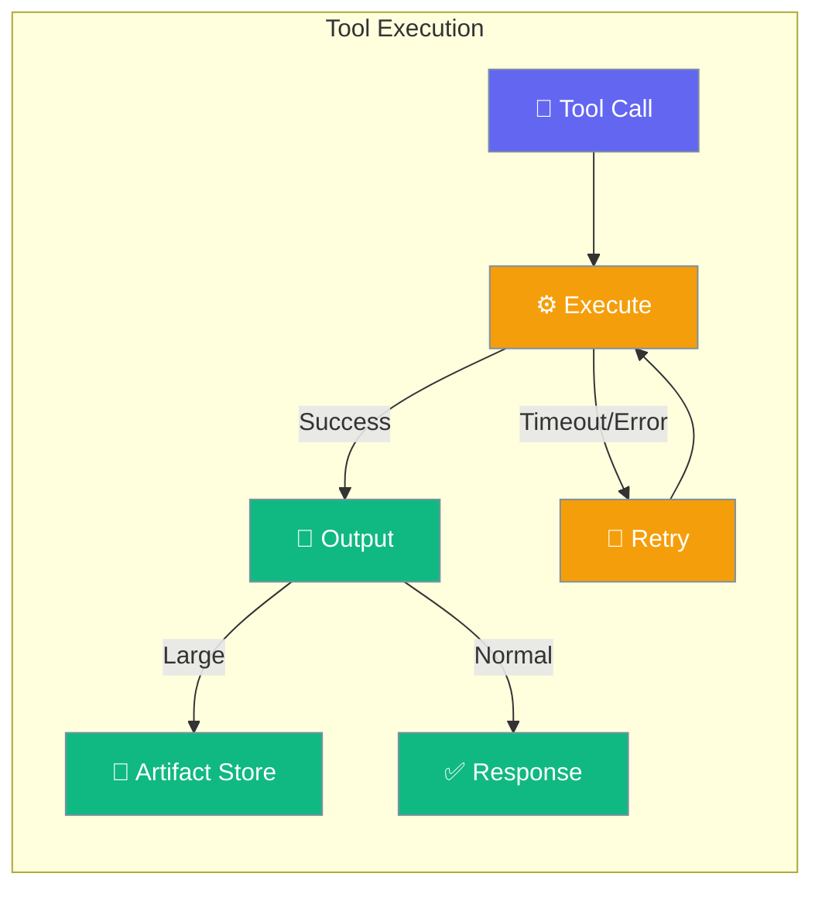
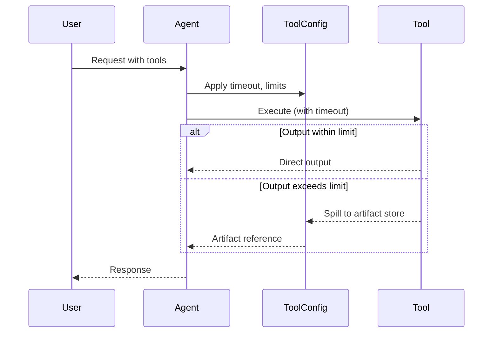

Tool Config controls how tools run — their timeout, retry behavior, output limits, and whether large results get stored as artifacts.

```python
from praisonaiagents import Agent, ToolConfig

agent = Agent(
    name="Assistant",
    instructions="You are a research assistant that uses web search.",
    tool_config=ToolConfig(
        timeout=60,
        parallel=True,
    ),
)

agent.start("Search for recent news about Mars exploration.")
```



## Quick Start

<Steps>
<Step title="Simple Usage">
```python
from praisonaiagents import Agent, ToolConfig

agent = Agent(
    instructions="You are a web research assistant.",
    tool_config=ToolConfig(timeout=30),
)
agent.start("Find the current price of Bitcoin.")
```
</Step>

<Step title="With Parallel Execution">
```python
from praisonaiagents import Agent, ToolConfig

agent = Agent(
    instructions="You are a multi-source research agent.",
    tool_config=ToolConfig(
        parallel=True,
        timeout=60,
        output_limit=32000,
    ),
)
agent.start("Get weather, news, and stock data for San Francisco.")
```
</Step>

<Step title="With Artifact Storage">
```python
from praisonaiagents import Agent, ToolConfig

agent = Agent(
    instructions="You are a data analysis agent.",
    tool_config=ToolConfig(
        enable_artifacts=True,
        artifact_retention_days=14,
        output_limit=32000,
    ),
)
agent.start("Analyze this large CSV file and summarize the findings.")
```
</Step>
</Steps>

---

## How It Works



| Phase | What happens |
|---|---|
| 1. Execute | Tool runs within the configured timeout |
| 2. Retry | Failed executions retry with exponential backoff |
| 3. Output | Large outputs spill to artifact storage |
| 4. Respond | Agent uses tool output to form the final answer |

---

## Configuration Options

<Card icon="code" href="/docs/sdk/reference/python/ToolConfig">
  Full list of options, types, and defaults — `ToolConfig`
</Card>

| Option | Type | Default | Description |
|---|---|---|---|
| `timeout` | `int \| None` | `None` | Tool execution timeout in seconds |
| `retry_policy` | `RetryPolicy \| None` | `None` | Custom retry policy with backoff |
| `parallel` | `bool` | `False` | Run batched tool calls concurrently |
| `output_limit` | `int` | `16000` | Max bytes before spilling to artifact store |
| `output_max_lines` | `int \| None` | `None` | Max lines before spilling |
| `output_direction` | `str` | `"both"` | Truncation: `"head"`, `"tail"`, or `"both"` |
| `enable_artifacts` | `bool` | `False` | Enable artifact storage for large outputs |
| `artifact_retention_days` | `int` | `7` | Days to keep artifacts before deletion |
| `artifact_store` | `Any \| None` | `None` | Custom artifact store instance |
| `redact_secrets` | `bool` | `True` | Redact secrets from stored artifacts |

<Warning>
Legacy keyword arguments for tools now raise `TypeError`. Always use `ToolConfig` for tool configuration. See the migration guide if upgrading from an older version.
</Warning>

---

## Common Patterns

### Pattern 1 — Timeout for slow external APIs
```python
from praisonaiagents import Agent, ToolConfig

agent = Agent(
    instructions="You are an agent that queries slow external APIs.",
    tool_config=ToolConfig(timeout=120, output_limit=50000),
)
response = agent.start("Fetch the full product catalog from our API.")
print(response)
```

### Pattern 2 — Parallel tools for speed
```python
from praisonaiagents import Agent, ToolConfig

agent = Agent(
    instructions="You are a market research agent.",
    tool_config=ToolConfig(parallel=True, timeout=30),
)
agent.start("Compare prices for a MacBook Pro across Amazon, Best Buy, and Apple.com.")
```

---

## Best Practices

<AccordionGroup>
<Accordion title="Set timeout for external tools">
Always set `timeout` when using tools that call external services. Without a timeout, a slow or hung API can block the entire agent run indefinitely. A value of 30–60 seconds covers most cases.
</Accordion>

<Accordion title="Enable parallel for independent tools">
Enable `parallel=True` when the agent is likely to call multiple independent tools in one turn. This cuts latency by running them concurrently instead of sequentially.
</Accordion>

<Accordion title="Use artifacts for large outputs">
If your tools return large data (CSV files, long API responses), enable `enable_artifacts=True` and increase `output_limit`. Without this, large outputs get truncated, losing valuable data.
</Accordion>
</AccordionGroup>

---

## Related

<CardGroup cols={2}>
<Card icon="cpu" href="/docs/features/llm-config">
  LLM Config — configure model selection and fallback
</Card>
<Card icon="play" href="/docs/features/execution">
  Execution — control overall agent execution limits
</Card>
</CardGroup>
