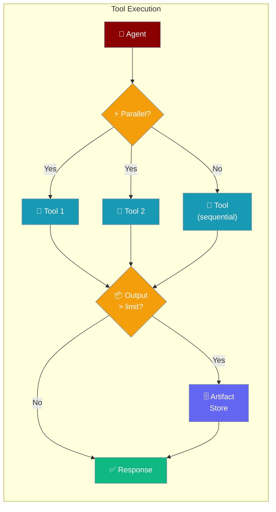
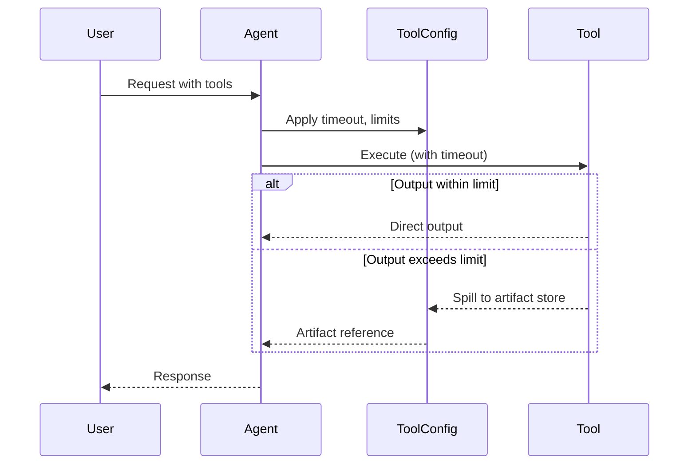

Tool Config controls how tools run — their timeout, retry behavior, output limits, and whether large results get stored as artifacts.

```python
from praisonaiagents import Agent, ToolConfig

agent = Agent(
    name="DataAgent",
    instructions="You analyze data using tools.",
    tools=[my_data_tool],
    tool_config=ToolConfig(
        timeout=60,
        parallel=True,
        enable_artifacts=True,
    )
)

result = agent.start("Analyze the sales data and generate a report")
print(result)
```


The user asks the agent to use tools; ToolConfig controls timeouts, retries, parallel execution, and artifact storage for those calls.



## Quick Start

<Steps>
<Step title="Simple Usage">
Use `ToolConfig()` defaults to get retry protection and safe output limits:

```python
from praisonaiagents import Agent, ToolConfig

agent = Agent(
    name="Assistant",
    instructions="You are a helpful assistant with tools.",
    tools=[search_tool],
    tool_config=ToolConfig()
)

agent.start("Search for recent AI news")
```
</Step>

<Step title="With Custom Settings">
Configure timeout, retries, and parallel execution:

```python
from praisonaiagents import Agent, ToolConfig

agent = Agent(
    instructions="You are a multi-source research agent.",
    tool_config=ToolConfig(
        parallel=True,
        timeout=60,
        output_limit=32000,
    ),
)
agent.start("Get weather, news, and stock data for San Francisco.")
```
</Step>

<Step title="With Artifact Storage">
```python
from praisonaiagents import Agent, ToolConfig

agent = Agent(
    instructions="You are a data analysis agent.",
    tool_config=ToolConfig(
        enable_artifacts=True,
        artifact_retention_days=14,
        output_limit=32000,
    ),
)
agent.start("Analyze this large CSV file and summarize the findings.")
```
</Step>
</Steps>

---

## How It Works



| Phase | What happens |
|---|---|
| 1. Execute | Tool runs within the configured timeout |
| 2. Retry | Failed executions retry with exponential backoff |
| 3. Output | Large outputs spill to artifact storage |
| 4. Respond | Agent uses tool output to form the final answer |

---

## Configuration Options

<Card title="ToolConfig SDK Reference" icon="code" href="/docs/sdk/reference/python/classes/ToolConfig">
  Full parameter reference for ToolConfig
</Card>

**Precedence ladder:**

```python
# Level 1: Bool (enable with defaults)
agent = Agent(tool_config=True)

# Level 2: ToolConfig (full control)
agent = Agent(tool_config=ToolConfig(
    timeout=60,
    parallel=True,
    enable_artifacts=True,
))
```

| Option | Type | Default | Description |
|--------|------|---------|-------------|
| `timeout` | `int \| None` | `None` | Per-tool timeout in seconds |
| `retry_policy` | `RetryPolicy \| None` | `None` | Retry with exponential backoff |
| `parallel` | `bool` | `False` | Run batched LLM tool calls concurrently |
| `output_limit` | `int` | `16000` | Max bytes before spilling to artifact store |
| `output_max_lines` | `int \| None` | `None` | Max lines before spilling |
| `output_direction` | `str` | `"both"` | Truncation direction: `"head"`, `"tail"`, or `"both"` |
| `enable_artifacts` | `bool` | `False` | Enable artifact storage for large outputs |
| `artifact_retention_days` | `int` | `7` | Days to keep artifacts before cleanup |
| `artifact_store` | `Any \| None` | `None` | Custom artifact store instance |
| `redact_secrets` | `bool` | `True` | Redact secrets from artifacts |

<Warning>
Legacy keyword arguments for tools now raise `TypeError`. Always use `ToolConfig` for tool configuration. See the migration guide if upgrading from an older version.
</Warning>

---

## Common Patterns

### Pattern 1 — Timeout for slow external APIs
```python
from praisonaiagents import Agent, ToolConfig

agent = Agent(
    name="DataAnalyzer",
    instructions="Analyze large datasets and return summaries.",
    tools=[run_sql_query],
    tool_config=ToolConfig(
        output_limit=32000,          # Larger inline limit
        enable_artifacts=True,       # Store huge outputs as files
        artifact_retention_days=14,  # Keep for 2 weeks
    )
)

agent.start("Run the monthly sales report query")
```

**Parallel tool execution:**

```python
from praisonaiagents import Agent, ToolConfig

agent = Agent(
    name="ResearchAgent",
    instructions="Search multiple sources simultaneously.",
    tools=[search_news, search_arxiv, search_wikipedia],
    tool_config=ToolConfig(
        parallel=True,   # Run all three searches at once
        timeout=15,      # Fail fast if any tool is slow
    )
)

agent.start("Research the current state of quantum computing")
```

**Tail-only output for log tools:**

```python
from praisonaiagents import Agent, ToolConfig

agent = Agent(
    name="LogAnalyzer",
    instructions="Check system logs for errors.",
    tools=[get_system_logs],
    tool_config=ToolConfig(
        output_direction="tail",  # Keep the most recent log lines
        output_max_lines=500,
    )
)

agent.start("Check recent server error logs for anomalies.")
```

---

## Best Practices

<AccordionGroup>
<Accordion title="Set a timeout for external tool calls">
Any tool that calls an external API or runs a subprocess should have a `timeout`. Without one, a hung tool call blocks your agent indefinitely. Start with 30–60 seconds and adjust based on your tool's expected latency.
</Accordion>

<Accordion title="Enable parallel for independent tools">
Use `parallel=True` when your agent commonly calls multiple tools at once and those tools don't depend on each other's outputs. This can cut wall-clock time significantly.
</Accordion>

<Accordion title="Enable artifacts for large data tools">
If your tools return large datasets (SQL queries, file reads, API responses), set `enable_artifacts=True`. This prevents large outputs from filling the LLM context window, which wastes tokens and can cause errors.
</Accordion>

<Accordion title="Keep redact_secrets=True">
Leave `redact_secrets=True` (the default) to prevent API keys, passwords, and tokens from being stored in artifact files or shown in tool outputs.
</Accordion>
</AccordionGroup>

---

## Related

<CardGroup cols={2}>
<Card title="Artifact Storage" icon="box" href="/docs/features/artifact-storage">
  How artifacts are stored and retrieved
</Card>
<Card title="Async Tool Safety" icon="shield" href="/docs/features/async-tool-safety">
  Safe concurrent tool execution
</Card>
<Card title="Toolsets" icon="wrench" href="/docs/features/toolsets">
  Group and manage tools as sets
</Card>
<Card title="Tool Retry Policy" icon="rotate-cw" href="/docs/features/tool-retry-policy">
  Configure retry behavior for failing tools
</Card>
</CardGroup>
