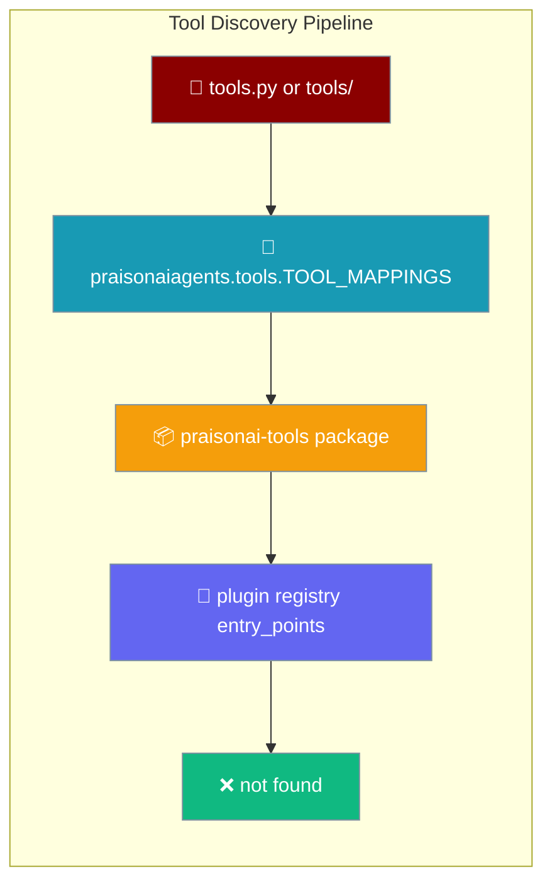

When you ask for `tools=["read_notes"]`, PraisonAI checks four places in a fixed order and stops at the first match.


```python
from praisonaiagents import Agent
import os

os.environ["PRAISONAI_ALLOW_LOCAL_TOOLS"] = "true"

agent = Agent(
    name="Notes Helper",
    instructions="Use local tools when available.",
    tools=["read_notes"],
)
agent.start("Read my latest notes")
```


The user lists a tool by name on Agent(...); PraisonAI resolves it through local files, built-ins, praisonai-tools, then plugins.



## Quick Start

<Steps>
<Step title="Enable Local Tools">

Set the environment variable to allow loading local tool files:

```bash
export PRAISONAI_ALLOW_LOCAL_TOOLS=true
```

</Step>

<Step title="Create a Local Tool">

Create `tools.py` in your project directory:

```python
def read_notes(query: str) -> str:
    """Read local notes matching the query."""
    return f"Notes about: {query}"
```

</Step>

<Step title="Use Tools by Name in Agent">

```python
from praisonaiagents import Agent
import os

os.environ["PRAISONAI_ALLOW_LOCAL_TOOLS"] = "true"

agent = Agent(
    name="Research assistant",
    instructions="Use available tools to answer questions.",
    tools=["read_notes", "internet_search"],
)
agent.start("What did I write about caching and what's new in the news?")
```

PraisonAI finds `read_notes` from your local `tools.py` and `internet_search` from the built-in SDK.

</Step>
</Steps>

---

## The Four Tiers

From the `tool_resolver.py` module docstring — **first match wins**:

| Tier | Source | When it wins |
|------|--------|-------------|
| 1 | **Local `tools.py`** (backward compat, custom tools, custom variables) | Your own function with that name exists in `tools.py` or `tools/` |
| 2 | **`praisonaiagents.tools.TOOL_MAPPINGS`** (built-in SDK tools) | The name is a built-in like `internet_search`, `execute_code`, etc. |
| 3 | **`praisonai-tools` package** (external tools, optional) | The name exists in the optional `praisonai-tools` install |
| 4 | **Tool registry (plugins via `entry_points`)** | A third-party plugin registered via `praisonai.tool_sources` entry point |

---

## Precedence Example

<Warning>
If you define `def search(...)` in your local `tools.py` and there is also a `search` in `praisonai-tools`, the **local one wins** — Tier 1 always beats Tier 3. To see which tier resolved a tool, run with `LOGLEVEL=INFO`:

```bash
LOGLEVEL=INFO PRAISONAI_ALLOW_LOCAL_TOOLS=true praisonai-code run --tools tools.py "Search for something"
```

The log shows: `Resolved 'search' from source 'local-tools.py'`
</Warning>

---

## When `praisonai-tools` Is Not Installed

As of PR #2550, failures from the `praisonai-tools` package are **logged**, not silently skipped. You'll see them at `LOGLEVEL=INFO`:

```
Tool 'some_tool' exists in TOOL_MAPPINGS but failed to load: <error>
```

This means tool resolution failures are now visible and debuggable, rather than passing silently through to an unresolved tool error at runtime.

---

## YAML `tools:` Blocks

`resolve_all_from_yaml` walks both the top-level `tools:` list and the `agents:` shape, so both formats work:

```yaml
# Top-level tools list
tools:
  - internet_search
  - read_notes

# Per-agent tools (also supported)
agents:
  researcher:
    tools:
      - internet_search
  note_taker:
    tools:
      - read_notes
```

Tasks nested under agents can also declare their own `tools:` lists — the resolver walks all of them.

---

## Backward Compatibility

The `praisonai.*` import paths for `tool_resolver`, `_safe_loader`, `tool_registry`, and `_framework_availability` stay live via **identity-preserving `sys.modules` shims**. Each shim does:

```python
import praisonai_code.tool_resolver as _impl
sys.modules[__name__] = _impl
```

This means `praisonai.tool_resolver is praisonai_code.tool_resolver` — both names point at the same object. The same identity holds for `_framework_availability`, `_safe_loader`, and `tool_registry`, as asserted in `test_c5_backward_compat.py::test_module_identity`.

---

## Best Practices

<AccordionGroup>
<Accordion title="Enable local tools only when needed">
Set `PRAISONAI_ALLOW_LOCAL_TOOLS=true` only in environments where you trust the local `tools.py`. This opt-in prevents accidental execution of untrusted code.
</Accordion>

<Accordion title="Avoid naming conflicts between tiers">
If you define a function with the same name as a built-in (e.g., `search`), the local version wins at Tier 1. Choose unique names or use `LOGLEVEL=INFO` to confirm which tier resolved each tool.
</Accordion>

<Accordion title="Register third-party tools via entry_points">
Plugins should register under the `praisonai.tool_sources` group in their `pyproject.toml`. This makes them discoverable at Tier 4 without modifying agent code.
</Accordion>

<Accordion title="Debug discovery order with LOGLEVEL=INFO">
Run with `LOGLEVEL=INFO` to see exactly which tier resolved each tool name. Look for log lines like `Resolved 'tool_name' from source 'local-tools.py'`.
</Accordion>
</AccordionGroup>

---

## Configuration Options

<Card title="Tool Resolver Python Reference" icon="code" href="/docs/sdk/reference/python/modules/tool_resolver">
  Python reference for the tool resolver module
</Card>

---

## Related

<CardGroup cols={2}>
<Card title="Local Tools Loading" icon="wrench" href="/docs/features/local-tools-loading">
How to load your own tools.py safely with the PRAISONAI_ALLOW_LOCAL_TOOLS opt-in.
</Card>
<Card title="Approval Backends" icon="shield-check" href="/docs/features/approval-backends">
Choose who approves tool calls — terminal, plan mode, or a chat channel.
</Card>
</CardGroup>
