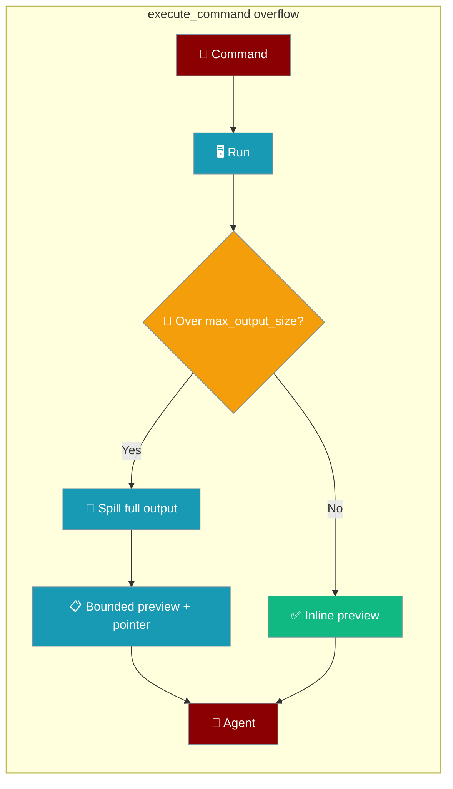
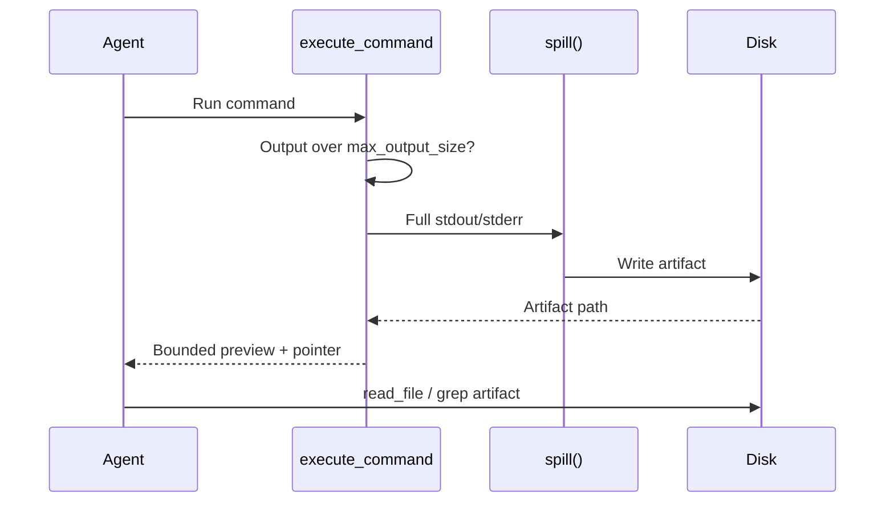

Large `execute_command` output is saved to disk so nothing is lost, and the agent gets a preview plus a path to read the full log.



## Quick Start

<Steps>
<Step title="Default (spill is already on)">

No code change is required — spill is enabled by default.

```python
from praisonaiagents import Agent
from praisonaiagents.tools import execute_command

agent = Agent(
    name="BuildRunner",
    instructions="Run the test suite and read the saved log if output is truncated.",
    tools=[execute_command],
)

agent.start("Run pytest and report which tests failed")
```

When the test log overflows, the tool result includes a `stdout_artifact` path — the agent reads that file for the failing traceback that used to be truncated away.

</Step>

<Step title="Pin artifacts to a workspace dir">

Set `PRAISONAI_TOOL_OUTPUT_DIR` for cross-session retrieval.

```bash
export PRAISONAI_TOOL_OUTPUT_DIR=./.praisonai/logs
```

</Step>

<Step title="Override per call or opt out">

Pass `spill_dir` explicitly, or `spill=False` for the legacy middle-truncated preview.

```python
result = execute_command("very-noisy-command", spill_dir="./logs")

result = execute_command("very-noisy-command", spill=False)
```

</Step>
</Steps>

---

## How It Works



| Step | What happens |
|---|---|
| 1 | Command runs and produces output |
| 2 | Output within `max_output_size` returns inline with zero overhead |
| 3 | Over-budget output is written in full to a disk artifact |
| 4 | The result keeps a head/tail preview plus a pointer to the artifact |
| 5 | The agent reads the artifact with `read_file` or `grep` |

---

## Configuration Options

| Option | Type | Default | Description |
|--------|------|---------|-------------|
| `spill` | `bool` | `True` | Persist over-budget output to a retrievable artifact instead of dropping the middle. |
| `spill_dir` | `Optional[str]` | `None` | Directory for artifacts. Overrides the env var. |
| `max_output_size` | `int` | `10000` | Byte/char budget for the inline preview. |
| `PRAISONAI_TOOL_OUTPUT_DIR` | env | *system temp* | Fallback dir when `spill_dir` isn't passed. Set this for cross-session retrieval. |

The directory resolves in this order: `spill_dir` argument, then `PRAISONAI_TOOL_OUTPUT_DIR`, then `<system temp>/praisonai_tool_output/`.

<Note>
Result-dict fields `stdout_artifact` and `stderr_artifact` (absolute paths) appear only when overflow occurs with `spill=True`.
</Note>

---

## What the Agent Sees

When spill fires, the preview keeps the head and tail with a pointer line in the middle:

```
<head bytes...>
...[52,318 chars / 894 lines truncated in preview]...
Full output saved to: /tmp/praisonai_tool_output/stdout_xxxxx.txt
Use read_file/grep on that path to inspect the omitted region (do NOT re-run the command through head/tail).
<tail bytes...>
```

---

## Retrieval

The agent reads the omitted region straight from the artifact path.

```python
from praisonaiagents.tools import read_file

read_file("/tmp/praisonai_tool_output/stdout_xxxxx.txt")
```

---

## Best Practices

<AccordionGroup>
<Accordion title="Keep the default (spill=True)">
The buried middle is where errors live — a failing assertion or stack trace hides inside verbose build/test output.
</Accordion>

<Accordion title="Use PRAISONAI_TOOL_OUTPUT_DIR for cross-session retrieval">
Set a workspace-scoped dir to keep artifacts across runs; leave it unset for auto-cleanup on process exit.
</Accordion>

<Accordion title="Set spill=False only for strict legacy compatibility">
Opt out only when a caller pins the old middle-truncated preview with no persistence.
</Accordion>

<Accordion title="Don't spill secret-bearing outputs">
Artifacts are plaintext on disk — avoid commands that print credentials or tokens.
</Accordion>
</AccordionGroup>

---

## Related

<CardGroup cols={2}>
<Card title="Shell Agent" icon="terminal" href="/docs/tools/shell_tools">
  Run shell commands with `execute_command`
</Card>
<Card title="Tool Output Store" icon="database" href="/docs/features/tool-output-store">
  Recover full outputs for arbitrary tool return values
</Card>
<Card title="Context Per-Tool Budgets" icon="chart-pie" href="/docs/features/context-per-tool-budgets">
  Per-tool truncation limits
</Card>
</CardGroup>
