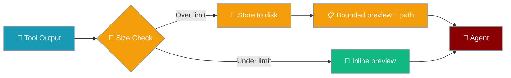
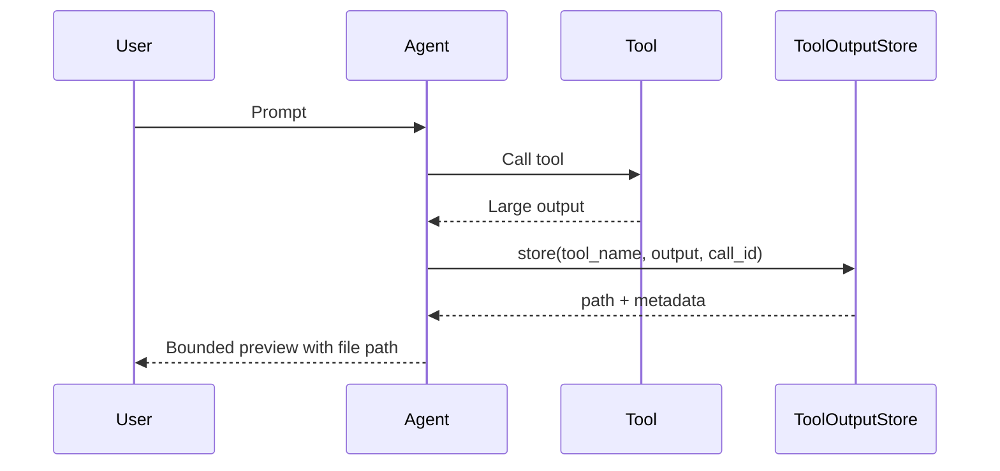

When a tool output is too large for context, the full result is saved to disk so the agent can read it back on demand.



## Quick Start

<Steps>
<Step title="Zero-config (default retention)">

```python
from praisonaiagents import Agent, tool

@tool
def fetch_large_report(query: str) -> str:
    """Return a very large text blob."""
    return "x" * 100_000

agent = Agent(
    name="Researcher",
    instructions="If output is truncated, read the full file from the stored path.",
    tools=[fetch_large_report],
)
agent.start("Fetch the latest report")
```

No setup required — overflow outputs are stored automatically under `~/.praisonai/cache/tool_outputs/`.

</Step>

<Step title="Custom retention">

```bash
export PRAISONAI_TOOL_OUTPUT_RETENTION_HOURS=72
```

Or programmatically:

```python
from praisonaiagents.runtime.tool_output_store import ToolOutputStore

store = ToolOutputStore(retention_hours=72)
```

</Step>
</Steps>

---

## How It Works



| Step | What happens |
|---|---|
| 1 | Tool returns output exceeding the context budget |
| 2 | Full text is written to `~/.praisonai/cache/tool_outputs/{run_id}/{call_id}.txt` |
| 3 | Inline preview keeps head/tail with `Full output stored at: <path>` |
| 4 | Agent uses `read_file` (or similar) to fetch omitted content |

---

## What the Agent Sees

```
First part of output...
...[50,000 chars, showing first/last portions | Full output stored at: ~/.praisonai/cache/tool_outputs/<run>/<call>.txt]...
Last part of output...
```

The agent can then read the full file from the path in the marker.

---

## Configuration

| Option | Type | Default | Description |
|---|---|---|---|
| `run_id` | `Optional[str]` | auto UUID | Scopes outputs to one run |
| `retention_hours` | `Optional[int]` | `24` | TTL for old run directories |
| `PRAISONAI_TOOL_OUTPUT_RETENTION_HOURS` | env | `24` | Same as `retention_hours` default |

### Storage Layout

```
~/.praisonai/cache/
└── tool_outputs/
    └── {run_id}/
        ├── {call_id_1}.txt
        └── {tool}.{field}_{uuid}.txt
```

### Retrieve Programmatically

```python
from praisonaiagents.runtime.tool_output_store import get_tool_output_store

store = get_tool_output_store()
full_text = store.retrieve("/path/from/the/preview/marker.txt")
```

---

## Common Patterns

**Long-running research agents** — web search bodies are stored when truncated; the agent reads them back in a follow-up turn.

**Pair with per-tool budgets** — combine with [Context Per-Tool Budgets](/docs/features/context-per-tool-budgets) for fine-grained limits.

**Short retention on CI** — set `PRAISONAI_TOOL_OUTPUT_RETENTION_HOURS=1` on shared runners.

---

## Best Practices

<AccordionGroup>
<Accordion title="Keep retention short on shared/CI machines">
Old run directories are removed when older than the retention window on the next store initialisation.
</Accordion>

<Accordion title="Don't store secrets">
Outputs are plaintext on disk — avoid tools that return credentials or tokens into the store.
</Accordion>

<Accordion title="Use stable run_id when chaining runs">
Pass a consistent `run_id` to `get_tool_output_store(run_id=...)` when multiple agents share one session.
</Accordion>

<Accordion title="Combine with per-tool budgets">
Use per-tool budgets to control inline size; the store handles anything that still overflows.
</Accordion>
</AccordionGroup>

---

## Related

<CardGroup cols={2}>
<Card title="Context Per-Tool Budgets" icon="chart-pie" href="/docs/features/context-per-tool-budgets">
  Per-tool truncation limits
</Card>
<Card title="Context Window Management" icon="window-maximize" href="/docs/features/context-window-management">
  Overflow and compaction strategies
</Card>
<Card title="Context Management" icon="layer-group" href="/docs/features/context-management">
  Agent context lifecycle
</Card>
</CardGroup>
