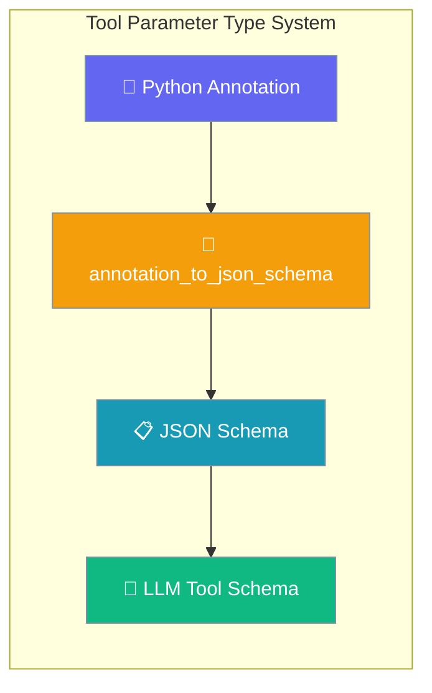
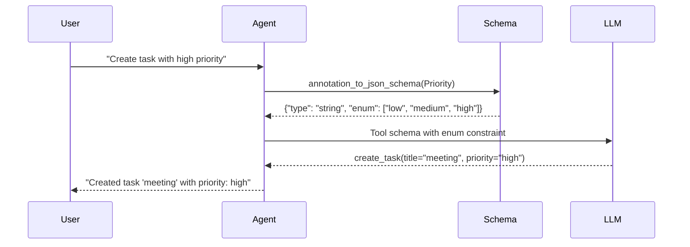

Use expressive Python type annotations in tool signatures and agents understand exactly what parameters they can pass.



## Quick Start

<Steps>
<Step title="Optional Parameter">
Create a tool where parameters can be omitted by the agent:

```python
from typing import Optional
from praisonaiagents import Agent, tool

@tool
def search(query: str, max_results: Optional[int] = None) -> str:
    """Search the web. Leave max_results blank to use the default."""
    limit = max_results or 10
    return f"Searched '{query}' (limit={limit})"

agent = Agent(
    instructions="You search the web for information",
    tools=[search]
)

agent.start("Find AI news")
```
</Step>

<Step title="Literal for Fixed Choices">
Restrict parameter values to specific literal options:

```python
from typing import Literal
from praisonaiagents import Agent, tool

@tool
def analyze(text: str, mode: Literal["fast", "deep"] = "fast") -> str:
    """Analyze text with different modes."""
    if mode == "deep":
        return f"Deep analysis of: {text}"
    return f"Quick analysis of: {text}"

agent = Agent(
    instructions="You analyze text content",
    tools=[analyze]
)

agent.start("Analyze this document in deep mode")
```
</Step>

<Step title="Enum for Choices">
Use Enum classes for reusable choice sets across tools:

```python
from enum import Enum
from praisonaiagents import Agent, tool

class Priority(str, Enum):
    LOW = "low"
    MEDIUM = "medium"
    HIGH = "high"

@tool
def create_task(title: str, priority: Priority = Priority.MEDIUM) -> str:
    """Create a new task with specified priority."""
    return f"Created task '{title}' with priority: {priority.value}"

agent = Agent(
    instructions="You manage tasks",
    tools=[create_task]
)

agent.start("Create a high priority task for the meeting")
```
</Step>
</Steps>

---

## How It Works

The agent understands your type annotations through this process:



| Python Annotation | JSON Schema Output |
|---|---|
| `str`, `int`, `float`, `bool` | `{"type": "string" | "integer" | "number" | "boolean"}` |
| `Optional[int]` | `{"anyOf": [{"type": "integer"}, {"type": "null"}]}` |
| `Union[str, int]` | `{"anyOf": [{"type": "string"}, {"type": "integer"}]}` |
| `Literal["fast", "deep"]` | `{"type": "string", "enum": ["fast", "deep"]}` |
| `Literal[1, 2, 3]` | `{"type": "integer", "enum": [1, 2, 3]}` |
| Enum subclass (str-valued) | `{"type": "string", "enum": ["...", ...]}` |
| `List[int]` | `{"type": "array", "items": {"type": "integer"}}` |
| `Dict[str, int]` | `{"type": "object", "additionalProperties": {"type": "integer"}}` |

---

## Choosing the Right Type

```mermaid
graph TD
    A[Need parameter?] --> B{Can be omitted?}
    B -->|Yes| C[Optional[T]]
    B -->|No| D{Fixed set of values?}
    D -->|Yes| E{Reused across tools?}
    E -->|Yes| F[Enum]
    E -->|No| G[Literal]
    D -->|No| H{Multiple types?}
    H -->|Yes| I[Union[T1, T2]]
    H -->|No| J[Simple type: str, int, etc.]
    
    classDef optional fill:#6366F1,stroke:#7C90A0,color:#fff
    classDef choice fill:#F59E0B,stroke:#7C90A0,color:#fff
    classDef simple fill:#10B981,stroke:#7C90A0,color:#fff
    
    class C optional
    class F,G choice
    class I,J simple
```

---

## Common Patterns

### Mode Flags with Defaults
```python
@tool
def process_data(data: str, mode: Literal["fast", "thorough"] = "fast") -> str:
    """Process data with different thoroughness levels."""
    if mode == "thorough":
        return f"Thoroughly processed: {data}"
    return f"Quick processing: {data}"
```

### Shared Choice Sets
```python
class Format(str, Enum):
    JSON = "json"
    CSV = "csv"
    XML = "xml"

@tool
def export_data(data: str, format: Format) -> str:
    """Export data in specified format."""
    return f"Exported as {format.value}: {data}"

@tool
def import_data(file_path: str, format: Format) -> str:
    """Import data from specified format."""
    return f"Imported {format.value} file: {file_path}"
```

### Structured Collections
```python
from typing import List, Dict

@tool
def batch_process(items: List[str], config: Dict[str, str]) -> str:
    """Process multiple items with configuration."""
    return f"Processed {len(items)} items with config: {config}"
```

---

## Best Practices

<AccordionGroup>
<Accordion title="Prefer Optional[T] over bare parameters">
Use `Optional[int]` with a default of `None` instead of leaving parameters untyped. This tells the agent the parameter can be omitted and what type to use when provided.

```python
# Good
def search(query: str, limit: Optional[int] = None) -> str:
    pass

# Avoid
def search(query: str, limit=None) -> str:
    pass
```
</Accordion>

<Accordion title="Use Literal for small fixed sets, Enum for reusable choices">
Choose `Literal[...]` when values are unique to one tool. Use `Enum` when the same choices appear across multiple tools.

```python
# Literal for one-off choices
def analyze(text: str, depth: Literal["surface", "deep"] = "surface"):
    pass

# Enum for shared choices
class Priority(str, Enum):
    LOW = "low"
    HIGH = "high"

def create_task(title: str, priority: Priority):
    pass

def update_task(id: str, priority: Priority):
    pass
```
</Accordion>

<Accordion title="Avoid Union for unrelated types">
Don't use `Union[str, dict]` for "either a string or a dict" - the LLM struggles with such choices. Create separate tools instead.

```python
# Avoid
def process(input: Union[str, Dict[str, str]]):
    pass

# Prefer
def process_text(text: str):
    pass

def process_data(data: Dict[str, str]):
    pass
```
</Accordion>

<Accordion title="Parameterize your collections">
Write `List[str]` instead of bare `list` so the agent knows what elements to include.

```python
# Good - agent knows to pass strings
def process_items(items: List[str]) -> str:
    pass

# Avoid - agent doesn't know element type
def process_items(items: list) -> str:
    pass
```
</Accordion>
</AccordionGroup>

---

## Related

<CardGroup cols={2}>
<Card title="Tool Schema Validation" icon="check-circle" href="/docs/features/tool-schema-validation">
Validate tool schemas and catch type errors
</Card>

<Card title="Custom Tools Guide" icon="wrench" href="/docs/guides/tools/create-custom-tools">
Complete guide to creating custom tools
</Card>

<Card title="Dynamic Tool Schemas" icon="refresh" href="/docs/features/dynamic-tool-schemas">
Generate schemas dynamically at runtime
</Card>

<Card title="Different Ways to Create Tools" icon="code" href="/docs/guides/tools/different-ways-to-create-tools">
Explore all methods for tool creation
</Card>
</CardGroup>