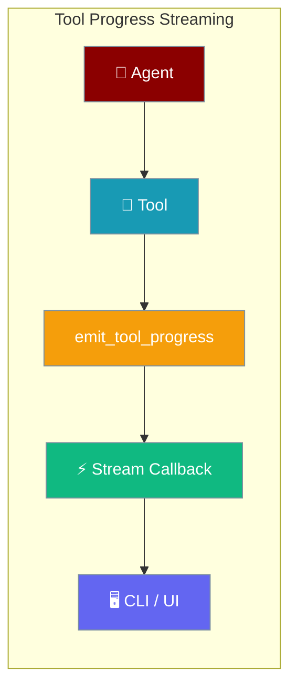
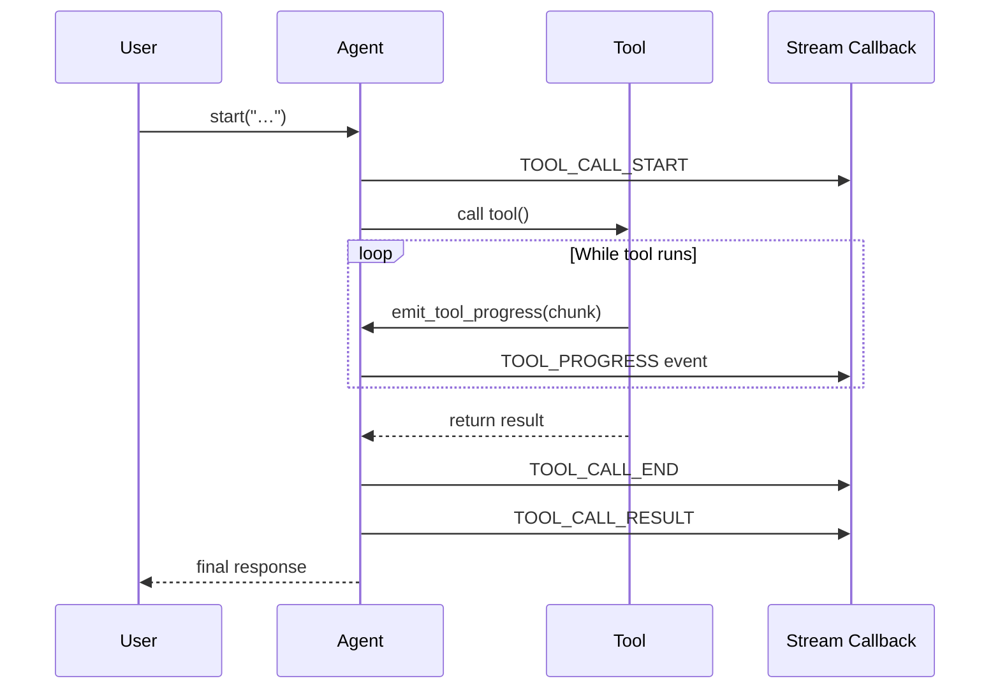

Long-running tools stream incremental output as they execute — no more silent waits.



## Quick Start

<Steps>

<Step title="Register a streaming callback">

```python
from praisonaiagents import Agent
from praisonaiagents.streaming import StreamEvent, StreamEventType, create_text_printer_callback

agent = Agent(name="assistant", instructions="You are a helpful assistant")
agent.stream_emitter.add_callback(create_text_printer_callback())
agent.start("List the files in the current directory")
```

Tool lifecycle events (`TOOL_CALL_START`, `TOOL_PROGRESS`, `TOOL_CALL_END`) flow through the same callback alongside text deltas.

</Step>

<Step title="Watch tool lifecycle events">

```python
from praisonaiagents import Agent
from praisonaiagents.streaming import StreamEvent, StreamEventType

def on_event(event: StreamEvent):
    if event.type == StreamEventType.TOOL_CALL_START:
        print(f"▶ Running tool: {event.tool_call['name']}")
    elif event.type == StreamEventType.TOOL_PROGRESS:
        stream = event.metadata.get("stream", "stdout") if event.metadata else "stdout"
        print(f"  [{stream}] {event.content}", end="")
    elif event.type == StreamEventType.TOOL_CALL_END:
        print(f"✅ Tool finished: {event.tool_call['name']}")

agent = Agent(name="assistant", instructions="You are a helpful assistant")
agent.stream_emitter.add_callback(on_event)
agent.start("Run a quick diagnostics check")
```

</Step>

<Step title="Emit progress from your own tool">

Add three lines to any tool function to stream live output:

```python
from praisonaiagents import Agent
from praisonaiagents.streaming import emit_tool_progress, create_text_printer_callback

def build_report(topic: str) -> str:
    """Build a report on a topic, streaming progress as it runs."""
    steps = ["Gathering data", "Analysing sources", "Writing summary", "Formatting output"]
    results = []
    for i, step in enumerate(steps):
        emit_tool_progress(f"{step}…\n", progress=(i + 1) / len(steps))
        results.append(f"[{step} done]")
    return "\n".join(results)

agent = Agent(name="reporter", instructions="You write reports", tools=[build_report])
agent.stream_emitter.add_callback(create_text_printer_callback())
agent.start("Build a report on renewable energy")
```

Running this prints `Gathering data…`, `Analysing sources…`, etc. live as each step runs — not after the whole tool returns.

</Step>

</Steps>

---

## How It Works

Every tool call is automatically wrapped by the agent in a progress channel. `emit_tool_progress` writes into that channel, and the agent forwards each chunk to every registered stream callback.



**Key design points:**

| Property | Detail |
|----------|--------|
| Zero overhead | When no callbacks are registered, `emit_tool_progress` is a cheap no-op |
| Multi-agent safe | The progress sink lives in a `contextvars.ContextVar` — each tool call gets its own isolated channel |
| Backward compatible | Calling `emit_tool_progress` from a tool that runs outside an agent returns `False` silently |
| Timeout safe | If the agent's timeout fires, the channel is closed so late emissions don't leak into the parent stream |

---

## Filtering Tool Events in a Callback

```python
from praisonaiagents.streaming import StreamEvent, StreamEventType

def my_callback(event: StreamEvent):
    if event.type == StreamEventType.TOOL_CALL_START:
        tool_name = event.tool_call["name"]
        tool_args = event.tool_call.get("arguments", {})
        agent = event.agent_id
        print(f"[{agent}] Starting {tool_name}({tool_args})")

    elif event.type == StreamEventType.TOOL_PROGRESS:
        content = event.content or ""
        stream_channel = event.metadata.get("stream", "stdout") if event.metadata else "stdout"
        progress_pct = event.metadata.get("progress") if event.metadata else None
        tool_name = event.tool_call["name"] if event.tool_call else "?"

        prefix = f"{int(progress_pct * 100)}% " if progress_pct is not None else ""
        print(f"[{tool_name}] {prefix}{content}", end="")

    elif event.type == StreamEventType.TOOL_CALL_END:
        print(f"Done: {event.tool_call['name']}")

    elif event.type == StreamEventType.TOOL_CALL_RESULT:
        pass  # Full result available in event.tool_call

    elif event.type == StreamEventType.DELTA_TEXT:
        print(event.content, end="", flush=True)
```

### TOOL_PROGRESS event fields

| Field | Type | Description |
|-------|------|-------------|
| `event.type` | `StreamEventType.TOOL_PROGRESS` | Always this value |
| `event.content` | `str` | The chunk text (e.g. one stdout line) |
| `event.metadata["stream"]` | `str` | `"stdout"` or `"stderr"` (if set by tool) |
| `event.metadata["progress"]` | `float` | 0.0–1.0 completion fraction (optional) |
| `event.tool_call["name"]` | `str` | Tool function name (set by agent wrapper) |
| `event.tool_call["id"]` | `str` | Tool call ID (set by agent wrapper) |
| `event.agent_id` | `str` | Agent name (set by agent wrapper) |

---

## `emit_tool_progress` Reference

```python
from praisonaiagents.streaming import emit_tool_progress

def emit_tool_progress(
    output: Optional[str] = None,
    *,
    progress: Optional[float] = None,           # 0.0–1.0 completion fraction
    metadata: Optional[Dict[str, Any]] = None,  # e.g. {"stream": "stderr"}
) -> bool:
    """Returns True if forwarded to an active sink, else False (cheap no-op)."""
```

| Parameter | Type | Description |
|-----------|------|-------------|
| `output` | `str \| None` | Text chunk to stream. Use `None` to send a progress-only update. |
| `progress` | `float \| None` | Completion fraction 0.0–1.0. Surfaced as `event.metadata["progress"]`. |
| `metadata` | `dict \| None` | Any extra fields to merge into `event.metadata`. Use `{"stream": "stderr"}` to colour-code error output in UIs. |

**Return value:** `True` if a sink is active and the event was forwarded. `False` if called outside an agent context (zero-cost no-op).

---

## `tool_progress_channel` Reference

The agent uses this internally, but you can use it to test tools in isolation:

```python
from praisonaiagents.streaming import tool_progress_channel, emit_tool_progress, StreamEventType

received = []

def test_sink(event):
    if event.type == StreamEventType.TOOL_PROGRESS:
        received.append(event.content)

with tool_progress_channel(test_sink):
    emit_tool_progress("step 1\n")
    emit_tool_progress("step 2\n", progress=0.5)
    emit_tool_progress("step 3\n", progress=1.0)

print(received)  # ['step 1\n', 'step 2\n', 'step 3\n']
```

Pass `None` to explicitly silence an inherited sink:

```python
with tool_progress_channel(None):
    emit_tool_progress("this won't reach anyone")
```

---

## Common Patterns

### 1 — Per-line subprocess output

```python
import subprocess
from praisonaiagents.streaming import emit_tool_progress

def run_tests(test_path: str) -> str:
    """Run pytest and stream output line-by-line."""
    proc = subprocess.Popen(
        ["pytest", test_path, "-v"],
        stdout=subprocess.PIPE,
        stderr=subprocess.STDOUT,
        text=True,
    )
    lines = []
    for line in proc.stdout:
        emit_tool_progress(line)
        lines.append(line)
    proc.wait()
    return "".join(lines)
```

### 2 — Percentage progress from a chunked download

```python
import urllib.request
from praisonaiagents.streaming import emit_tool_progress

def download_file(url: str, dest: str) -> str:
    """Download a file, streaming download progress."""
    with urllib.request.urlopen(url) as response:
        total = int(response.headers.get("Content-Length", 0))
        done = 0
        chunk_size = 64 * 1024
        with open(dest, "wb") as f:
            while chunk := response.read(chunk_size):
                f.write(chunk)
                done += len(chunk)
                pct = done / total if total else None
                emit_tool_progress(
                    f"Downloaded {done // 1024} KB\n",
                    progress=pct,
                )
    return f"Saved to {dest}"
```

### 3 — Status text from a multi-step pipeline

```python
from praisonaiagents.streaming import emit_tool_progress

def etl_pipeline(source: str) -> str:
    """Run an ETL pipeline with live status updates."""
    stages = [
        ("extract", lambda: f"Extracted data from {source}"),
        ("transform", lambda: "Applied 12 transformations"),
        ("load", lambda: "Loaded 1 000 rows"),
    ]
    results = []
    for i, (name, fn) in enumerate(stages):
        emit_tool_progress(f"step {i+1}/{len(stages)}: {name}…\n",
                           progress=(i + 1) / len(stages))
        results.append(fn())
    return "\n".join(results)
```

---

## Best Practices

<AccordionGroup>

<Accordion title="Keep emissions cheap — they fire on the hot path">
`emit_tool_progress` runs inline in your tool. Avoid heavy computation inside the call; just pass the string you already have.
</Accordion>

<Accordion title="Don't raise inside emit — the sink already swallows exceptions">
Callback errors are caught by the emitter. Your tool's main logic continues regardless. But clean callbacks are faster — don't put error-prone work there.
</Accordion>

<Accordion title="Use metadata stream key to colour-code channels">
```python
emit_tool_progress(error_line, metadata={"stream": "stderr"})
```
UIs and callbacks can use `event.metadata["stream"]` to render stderr in red and stdout in white.
</Accordion>

<Accordion title="Tool authors don't need to check for an active sink">
`emit_tool_progress` returns `False` when no sink is registered — it's a no-op. You can sprinkle it freely without guarding with `if has_callback:`.
</Accordion>

<Accordion title="Use tool_progress_channel for unit-testing your tools">
Wrap the tool call in `tool_progress_channel(my_test_sink)` to capture events without running a full agent.
</Accordion>

</AccordionGroup>

---

## Related

<CardGroup cols={2}>
<Card title="Streaming" icon="bolt" href="/docs/features/streaming">
  Core streaming — text deltas, reasoning, and error events
</Card>
<Card title="Streaming Tool Events" icon="play-circle" href="/docs/features/streaming-tool-events">
  Tool lifecycle events — TOOL_CALL_START, TOOL_CALL_END, TOOL_CALL_RESULT
</Card>
<Card title="SDK Streaming Module" icon="wave-pulse" href="/docs/sdk/streaming">
  Full StreamEvent and StreamEventType reference
</Card>
<Card title="Callbacks" icon="webhook" href="/docs/features/callbacks">
  Register callbacks and build custom stream consumers
</Card>
</CardGroup>
