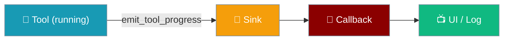

Call `emit_tool_progress()` from inside any tool to push partial output while it runs — zero overhead when no consumer is listening.

```python
from praisonaiagents import Agent
from praisonaiagents.streaming.events import emit_tool_progress

def compress_file(path: str) -> str:
    """Compress a large file, streaming progress."""
    chunks = list(range(10))
    total = len(chunks)
    for i, chunk in enumerate(chunks):
        emit_tool_progress(f"Compressed chunk {i}", progress=(i + 1) / total)
    return f"Compressed {path}"

agent = Agent(
    name="File Manager",
    instructions="Compress files on request.",
    tools=[compress_file],
    stream=True,
)
agent.start("Compress data.log")
```



## Quick Start

<Steps>
<Step title="Emit progress from your tool">
Call `emit_tool_progress` anywhere inside a tool function:

```python
from praisonaiagents.streaming.events import emit_tool_progress

def process_records(file_path: str) -> str:
    """Process records from a file."""
    records = ["record_1", "record_2", "record_3", "record_4", "record_5"]
    total = len(records)

    for i, record in enumerate(records):
        emit_tool_progress(
            f"Processing {record}",
            progress=(i + 1) / total,
        )

    return f"Processed {total} records from {file_path}"
```
</Step>

<Step title="Connect a streaming consumer">
Subscribe a callback that listens for `TOOL_PROGRESS` events:

```python
from praisonaiagents import Agent
from praisonaiagents.streaming.events import StreamEvent, StreamEventType

def on_event(event: StreamEvent) -> None:
    if event.type == StreamEventType.TOOL_PROGRESS:
        pct = (event.metadata or {}).get("progress")
        line = event.content or ""
        if pct is not None:
            print(f"[{pct:.0%}] {line}")
        else:
            print(line)

agent = Agent(
    name="File Manager",
    instructions="Process files on request.",
    tools=[process_records],
    stream=True,
)
agent.stream_emitter.add_callback(on_event)
agent.start("Process data.csv")
```
</Step>
</Steps>

---

## How It Works

```mermaid
sequenceDiagram
    participant Agent
    participant Loop as Tool Execution Loop
    participant Tool
    participant Channel as tool_progress_channel
    participant CB as Callback

    Agent->>Loop: run tool call
    Loop->>Channel: activate sink (tool_progress_channel(sink))
    Loop->>Tool: call tool function
    Tool->>Channel: emit_tool_progress("chunk 1", progress=0.25)
    Channel->>CB: StreamEvent(type=TOOL_PROGRESS, ...)
    Tool->>Channel: emit_tool_progress("chunk 2", progress=0.5)
    Channel->>CB: StreamEvent(type=TOOL_PROGRESS, ...)
    Tool-->>Loop: return result
    Loop->>Channel: deactivate sink
```

The channel is **thread-local** via `contextvars.ContextVar` — safe in multi-agent scenarios with concurrent tool calls.

---

## API Reference

### `emit_tool_progress`

```python
from praisonaiagents.streaming.events import emit_tool_progress

emit_tool_progress(
    output="Line of stdout",     # partial text chunk
    progress=0.5,                # completion fraction 0.0–1.0
    metadata={"stream": "stderr"},  # optional structured metadata
)
```

| Parameter | Type | Description |
|-----------|------|-------------|
| `output` | `str \| None` | Partial text or output chunk (e.g. a line of stdout) |
| `progress` | `float \| None` | Completion fraction in range 0.0–1.0, stored in `metadata["progress"]` |
| `metadata` | `dict \| None` | Additional structured metadata (e.g. `{"stream": "stderr"}`) |

**Returns** `True` if forwarded to an active sink, `False` if no sink is active (the common case outside an agent run — safe no-op).

### `StreamEventType.TOOL_PROGRESS`

The event type emitted by `emit_tool_progress`. Check `event.type == StreamEventType.TOOL_PROGRESS` in a stream callback to filter these events.

| Field | Type | Description |
|-------|------|-------------|
| `type` | `StreamEventType` | Always `StreamEventType.TOOL_PROGRESS` |
| `content` | `str \| None` | The `output` text passed to `emit_tool_progress` |
| `metadata` | `dict \| None` | Contains `progress` (float) and any extra metadata |
| `timestamp` | `float` | High-precision `time.perf_counter()` timestamp |

---

## Common Patterns

### Percentage progress bar

```python
from praisonaiagents.streaming.events import emit_tool_progress

def download_file(url: str) -> str:
    """Download a file with progress reporting."""
    total_chunks = 20
    for i in range(total_chunks):
        emit_tool_progress(
            f"Downloaded {(i + 1) * 5}%",
            progress=(i + 1) / total_chunks,
        )
    return f"Downloaded {url}"
```

### Separate stdout and stderr streams

```python
from praisonaiagents.streaming.events import emit_tool_progress

def run_build(command: str) -> str:
    """Run a build command with separated stdout/stderr."""
    emit_tool_progress("Build started", metadata={"stream": "stdout"})
    emit_tool_progress("Warning: deprecated API", metadata={"stream": "stderr"})
    emit_tool_progress("Build complete", progress=1.0, metadata={"stream": "stdout"})
    return "Build succeeded"
```

### Long-running shell command

```python
import subprocess
from praisonaiagents.streaming.events import emit_tool_progress

def run_tests(test_path: str) -> str:
    """Run tests and stream output."""
    result = subprocess.run(
        ["pytest", test_path, "-v"],
        capture_output=True, text=True
    )
    lines = result.stdout.splitlines()
    total = len(lines) or 1
    for i, line in enumerate(lines):
        emit_tool_progress(line, progress=(i + 1) / total)
    return f"Tests complete: {'passed' if result.returncode == 0 else 'failed'}"
```

---

## Best Practices

<AccordionGroup>
  <Accordion title="Zero overhead when unused">
    `emit_tool_progress` is a cheap no-op returning `False` when no sink is active. Sprinkle it freely in your tool code — it has no performance cost outside an agent run.
  </Accordion>
  <Accordion title="Keep messages short and structured">
    Progress messages should be brief — a single line of output or a status string. Use `metadata` for structured data and `progress` for the completion fraction. Avoid emitting full JSON blobs as the `output` string.
  </Accordion>
  <Accordion title="Don't emit too frequently">
    Very high-frequency calls (thousands per second) add overhead to the event path. Emit on meaningful boundaries: completed chunks, processed records, or at fixed time intervals.
  </Accordion>
  <Accordion title="Use progress for fractional completion">
    The `progress` parameter is a float in 0.0–1.0. It's stored under `metadata["progress"]` and is the standard way for consumers to render progress bars. If you don't know total size, omit it and just stream text output.
  </Accordion>
  <Accordion title="Sink failures never break tool execution">
    If the registered sink callback raises an exception, `emit_tool_progress` catches it, logs at DEBUG level, and returns `False`. Tool execution always continues regardless of progress delivery failures.
  </Accordion>
</AccordionGroup>

---

## Related

<CardGroup cols={2}>
  <Card title="Streaming" icon="bolt" href="/docs/features/streaming">
    Core streaming and event system
  </Card>
  <Card title="Streaming Tool Events" icon="wrench" href="/docs/features/streaming-tool-events">
    TOOL_CALL_START and TOOL_CALL_END events
  </Card>
  <Card title="Run Stream Events" icon="play" href="/docs/features/run-stream-events">
    All run-level streaming events
  </Card>
  <Card title="Custom Tools" icon="code" href="/docs/tools/custom">
    Building your own tools
  </Card>
</CardGroup>
