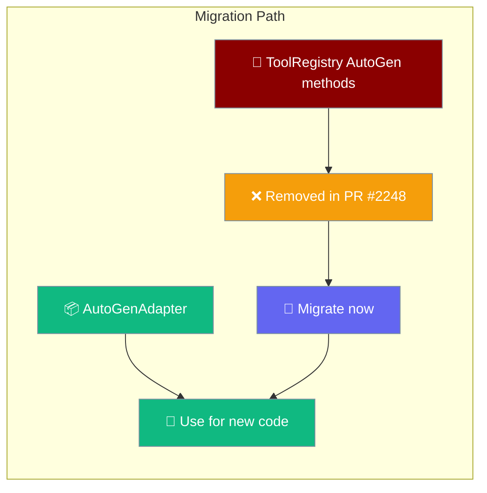

```python
from praisonai.agents_generator import AgentsGenerator
from praisonai.framework_adapters import AutoGenAdapter
from praisonai.tool_registry import ToolRegistry

# Create AutoGen tools using the adapter
adapter = AutoGenAdapter()
agent_gen = AgentsGenerator("agents.yaml", "autogen", config_list=[{"model": "gpt-4o"}])
result = agent_gen.generate_crew_and_kickoff()
print(result)
```

<Warning>
**Breaking change (PR #2248):** `ToolRegistry` AutoGen adapter methods — `register_autogen_adapter`, `get_autogen_adapter`, `list_autogen_adapters`, and `register_builtin_autogen_adapters` — have been **removed**. They were previously available for backward compatibility (since PR #1780) but are no longer present in the codebase. Migrate to `praisonai.persistence.factory` or the `AutoGenAdapter` class.
</Warning>

New code should use `AutoGenAdapter` from `praisonai.framework_adapters` for cleaner separation of concerns. For persistence, use `praisonai.persistence.factory`.



## Quick Start

Migrate from the removed ToolRegistry AutoGen methods to `AutoGenAdapter`.

<Steps>
<Step title="Legacy (removed — update required)">
```python
from praisonai.tool_registry import ToolRegistry

def search_tool(query: str) -> str:
    return f"Found results for: {query}"

registry = ToolRegistry()
registry.register_autogen_adapter("search", search_tool)
adapter = registry.get_autogen_adapter("search")
builtin_tools = registry.list_autogen_adapters()
registry.register_builtin_autogen_adapters()
```
</Step>

<Step title="Recommended (new code)">
```python
from praisonai.framework_adapters import AutoGenAdapter
from praisonai.tool_registry import ToolRegistry

def search_tool(query: str) -> str:
    return f"Found results for: {query}"

# Use AutoGenAdapter for AutoGen-specific features
adapter = AutoGenAdapter()

# Use ToolRegistry for general tool registration
registry = ToolRegistry()
registry.register_function("search", search_tool)
```
</Step>
</Steps>

---

## How It Works

The migration involves moving from ToolRegistry AutoGen methods to the dedicated AutoGenAdapter class.

```mermaid
sequenceDiagram
    participant User
    participant ToolRegistry
    participant AutoGenAdapter
    participant AutoGen
    
    User->>ToolRegistry: register_autogen_adapter()
    ToolRegistry->>AutoGen: Configure AutoGen tools
    AutoGen-->>User: Tool registered
    
    Note over User,AutoGen: Legacy path still works
    
    User->>AutoGenAdapter: Use AutoGenAdapter
    AutoGenAdapter->>AutoGen: Direct integration
    AutoGen-->>User: Tool registered
    
    Note over User,AutoGen: Recommended path for new code
    
    classDef legacy fill:#F59E0B,stroke:#7C90A0,color:#fff
    classDef new fill:#10B981,stroke:#7C90A0,color:#fff
    
    class ToolRegistry legacy
    class AutoGenAdapter new
```

## Configuration Options

Both approaches support the same configuration patterns for AutoGen tool integration.

| Option | Type | Default | Description |
|--------|------|---------|-------------|
| `tool_name` | `str` | Required | Name identifier for the tool |
| `adapter_function` | `Callable` | Required | Tool implementation function |
| `registry_instance` | `ToolRegistry` | `None` | Optional registry instance |
| `builtin_adapters` | `bool` | `False` | Whether to include builtin adapters |

## What Changed

| Method | Status | Replacement |
|--------|---------|-------------|
| `register_autogen_adapter(tool_type_name, adapter)` | **Removed (PR #2248)** | Use `AutoGenAdapter` from `praisonai.framework_adapters` |
| `get_autogen_adapter(tool_type_name)` | **Removed (PR #2248)** | Use `AutoGenAdapter` from `praisonai.framework_adapters` |
| `list_autogen_adapters()` | **Removed (PR #2248)** | Use `AutoGenAdapter` from `praisonai.framework_adapters` |
| `register_builtin_autogen_adapters()` | **Removed (PR #2248)** | Use `AutoGenAdapter` from `praisonai.framework_adapters` |

---

## Common Patterns

### Tool Registration

```python
# Legacy approach (still works)
from praisonai.tool_registry import ToolRegistry

def search_tool(query: str) -> str:
    return f"Searched for: {query}"

registry = ToolRegistry()
registry.register_autogen_adapter("search", search_tool)

# Recommended approach
from praisonai.framework_adapters import AutoGenAdapter

def search_tool(query: str) -> str:
    return f"Searched for: {query}"

adapter = AutoGenAdapter()
```

### Listing Available Tools

```python
# Legacy approach
from praisonai.tool_registry import ToolRegistry

registry = ToolRegistry()
autogen_tools = registry.list_autogen_adapters()
print(f"Available tools: {autogen_tools}")

# Recommended approach
from praisonai.framework_adapters import AutoGenAdapter

adapter = AutoGenAdapter()
# Use adapter's methods for AutoGen-specific functionality
```

### Builtin Registration

<Warning>
Since PR #2086, `AgentsGenerator.__init__` only calls `register_builtin_autogen_adapters()` when the chosen framework is in the autogen family (`autogen`, `autogen_v2`, `autogen_v4`, `ag2`). If you construct tools outside the orchestrator (e.g. using `ToolRegistry` directly with CrewAI or praisonai framework), and you want the autogen-shaped tool wrappers anyway, call `registry.register_builtin_autogen_adapters()` yourself.
</Warning>

```python
from praisonai.tool_registry import ToolRegistry

# Inside an autogen-family framework: orchestrator does this for you
# (called automatically by AgentsGenerator.__init__ when framework in
#  {"autogen", "autogen_v2", "autogen_v4", "ag2"})

# Outside framework dispatch (e.g. you only use ToolRegistry directly):
registry = ToolRegistry()
registry.register_builtin_autogen_adapters()   # call this yourself if you want them
```

<Note>
This change closes a hot-path regression where every `AgentsGenerator()` construction triggered the `praisonai_tools` import chain (`CodeDocsSearchTool`, `CSVSearchTool`, `DirectoryReadTool`, `PDFSearchTool`, `RagTool`, `ScrapeWebsiteTool`, `YoutubeChannelSearchTool`, ...) regardless of framework. CrewAI/praisonai users now skip the import entirely.
</Note>

---

## Best Practices

<AccordionGroup>
<Accordion title="Migrate legacy autogen adapter code">
AutoGen adapter methods on `ToolRegistry` have been removed (PR #2248). Update your code:

```python
# Before (broken — raises AttributeError)
from praisonai.tool_registry import ToolRegistry

def web_search(query: str) -> str:
    return f"Search results for: {query}"

registry = ToolRegistry()
registry.register_autogen_adapter("web_search", web_search)  # AttributeError
```
</Accordion>

<Accordion title="Use AutoGenAdapter for new projects">
For new code, prefer the AutoGenAdapter class for better separation:

```python
from praisonai.framework_adapters import AutoGenAdapter
from praisonai.tool_registry import ToolRegistry

def web_search(query: str) -> str:
    return f"Search results for: {query}"

# Recommended approach
adapter = AutoGenAdapter()
registry = ToolRegistry()
registry.register_function("web_search", web_search)
print("Tools registered using recommended pattern")
```
</Accordion>

<Accordion title="Migrate incrementally">
Gradually move from ToolRegistry AutoGen methods to AutoGenAdapter:

```python
from praisonai.tool_registry import ToolRegistry
from praisonai.framework_adapters import AutoGenAdapter

def search_tool(query: str) -> str:
    return f"Found: {query}"

def analyze_tool(data: str) -> str:
    return f"Analyzed: {data}"

# Step 1: Keep existing registrations
registry = ToolRegistry()
registry.register_autogen_adapter("search", search_tool)

# Step 2: Add new tools using recommended pattern
adapter = AutoGenAdapter()
registry.register_function("analyze", analyze_tool)

# Step 3: Gradually convert when ready
```
</Accordion>

<Accordion title="Test both approaches">
Ensure compatibility by testing both legacy and recommended patterns:

```python
from praisonai.tool_registry import ToolRegistry
from praisonai.framework_adapters import AutoGenAdapter

def test_tool(input: str) -> str:
    return f"Processed: {input}"

# Test legacy approach
registry = ToolRegistry()
registry.register_autogen_adapter("test", test_tool)
legacy_result = registry.get_autogen_adapter("test")

# Test recommended approach  
adapter = AutoGenAdapter()
registry.register_function("test", test_tool)
recommended_result = registry.get_function("test")

print(f"Both approaches work: {legacy_result is not None and recommended_result is not None}")
```
</Accordion>
</AccordionGroup>

---

## Related

<CardGroup cols={2}>
  <Card title="Framework Availability" icon="check-circle" href="/docs/features/framework-availability">
    Framework detection and availability checking
  </Card>
  <Card title="Thread Safety" icon="lock" href="/docs/features/thread-safety">
    Thread-safe tool registry operations
  </Card>
</CardGroup>
