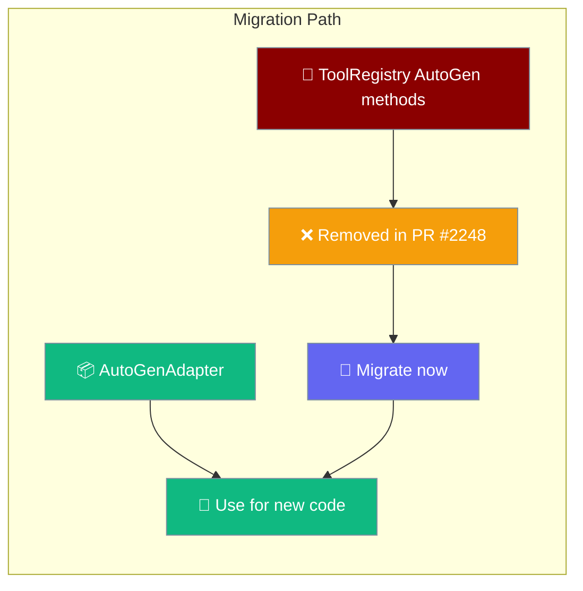

```python
from praisonaiagents import Agent

agent = Agent(name="migration-agent", instructions="Migrate tools from autogen to the registry.")
agent.start("Migrate my autogen tool definitions to the PraisonAI tool registry.")
```


AutoGen integration now lives in `AutoGenAdapter` — the old `ToolRegistry` autogen methods were removed in PR #2248.

<Note>
**Now supported (PR #2654):** YAML `tools:` under `framework: autogen` (v0.2) is fully wired via `register_for_llm` + `register_for_execution`. See [AutoGen v0.2 YAML Tools](/docs/features/autogen-yaml-tools).
</Note>

```python
from praisonai import PraisonAI

# AutoGenAdapter is wired automatically when framework is autogen-family
praison = PraisonAI(agent_file="agents.yaml", framework="autogen")
praison.run()
```

<Warning>
**Breaking change (PR #2248):** `ToolRegistry` AutoGen adapter methods — `register_autogen_adapter`, `get_autogen_adapter`, `list_autogen_adapters`, and `register_builtin_autogen_adapters` — have been **removed**. Migrate to `AutoGenAdapter` from `praisonai.framework_adapters` or `praisonai.persistence.factory`.
</Warning>


The user migrates legacy AutoGen ToolRegistry wiring; new integrations use AutoGenAdapter while removed registry methods are replaced.



## Quick Start

Migrate from the removed ToolRegistry AutoGen methods to `AutoGenAdapter`.

<Steps>
<Step title="Legacy (removed — update required)">
```python
from praisonai.tool_registry import ToolRegistry

def search_tool(query: str) -> str:
    return f"Found results for: {query}"

registry = ToolRegistry()
registry.register_autogen_adapter("search", search_tool)
adapter = registry.get_autogen_adapter("search")
builtin_tools = registry.list_autogen_adapters()
registry.register_builtin_autogen_adapters()
```
</Step>

<Step title="Recommended (new code)">
```python
from praisonai.framework_adapters import AutoGenAdapter
from praisonai.tool_registry import ToolRegistry

def search_tool(query: str) -> str:
    return f"Found results for: {query}"

# Use AutoGenAdapter for AutoGen-specific features
adapter = AutoGenAdapter()

# Use ToolRegistry for general tool registration
registry = ToolRegistry()
registry.register_function("search", search_tool)
```
</Step>
</Steps>

---

## How It Works

The migration involves moving from ToolRegistry AutoGen methods to the dedicated AutoGenAdapter class.

```mermaid
sequenceDiagram
    participant User
    participant ToolRegistry
    participant AutoGenAdapter
    participant AutoGen
    
    User->>ToolRegistry: register_autogen_adapter() ❌ removed
    Note over User,AutoGen: Do not use — raises AttributeError
    
    User->>AutoGenAdapter: Use AutoGenAdapter
    AutoGenAdapter->>AutoGen: Direct integration
    AutoGen-->>User: Tool registered
    
    Note over User,AutoGen: Recommended path for new code
    
    classDef legacy fill:#F59E0B,stroke:#7C90A0,color:#fff
    classDef new fill:#10B981,stroke:#7C90A0,color:#fff
    
    class ToolRegistry legacy
    class AutoGenAdapter new
```

## Configuration Options

Both approaches support the same configuration patterns for AutoGen tool integration.

| Option | Type | Default | Description |
|--------|------|---------|-------------|
| `tool_name` | `str` | Required | Name identifier for the tool |
| `adapter_function` | `Callable` | Required | Tool implementation function |
| `registry_instance` | `ToolRegistry` | `None` | Optional registry instance |
| `builtin_adapters` | `bool` | `False` | Whether to include builtin adapters |

## What Changed

| Method | Status | Replacement |
|--------|---------|-------------|
| `register_autogen_adapter(tool_type_name, adapter)` | **Removed (PR #2248)** | Use `AutoGenAdapter` from `praisonai.framework_adapters` |
| `get_autogen_adapter(tool_type_name)` | **Removed (PR #2248)** | Use `AutoGenAdapter` from `praisonai.framework_adapters` |
| `list_autogen_adapters()` | **Removed (PR #2248)** | Use `AutoGenAdapter` from `praisonai.framework_adapters` |
| `register_builtin_autogen_adapters()` | **Removed (PR #2248)** | Use `AutoGenAdapter` from `praisonai.framework_adapters` |

---

## Common Patterns

### Tool Registration

```python
# Removed (raises AttributeError)
from praisonai.tool_registry import ToolRegistry

registry = ToolRegistry()
registry.register_autogen_adapter("search", search_tool)  # ❌

# Recommended
from praisonai.framework_adapters import AutoGenAdapter
from praisonai.tool_registry import ToolRegistry

adapter = AutoGenAdapter()
registry = ToolRegistry()
registry.register_function("search", search_tool)
```

### Listing Available Tools

```python
# Removed
registry.list_autogen_adapters()  # ❌ AttributeError

# Recommended
from praisonai.framework_adapters import AutoGenAdapter

adapter = AutoGenAdapter()
# Use adapter methods for AutoGen-specific functionality
```

### Builtin Registration

<Warning>
Since PR #2086, `AgentsGenerator.__init__` registers builtin AutoGen adapters only when the framework is in the autogen family (`autogen`, `autogen_v2`, `autogen_v4`, `ag2`). `register_builtin_autogen_adapters()` on `ToolRegistry` was removed in PR #2248 — use `AutoGenAdapter` instead.
</Warning>

<Note>
This change closes a hot-path regression where every `AgentsGenerator()` construction triggered the `praisonai_tools` import chain (`CodeDocsSearchTool`, `CSVSearchTool`, `DirectoryReadTool`, `PDFSearchTool`, `RagTool`, `ScrapeWebsiteTool`, `YoutubeChannelSearchTool`, ...) regardless of framework. CrewAI/praisonai users now skip the import entirely.
</Note>

---

## Best Practices

<AccordionGroup>
<Accordion title="Migrate legacy autogen adapter code">
AutoGen adapter methods on `ToolRegistry` have been removed (PR #2248). Update your code:

```python
# Before (broken — raises AttributeError)
from praisonai.tool_registry import ToolRegistry

def web_search(query: str) -> str:
    return f"Search results for: {query}"

registry = ToolRegistry()
registry.register_autogen_adapter("web_search", web_search)  # AttributeError
```
</Accordion>

<Accordion title="Use AutoGenAdapter for new projects">
For new code, prefer the AutoGenAdapter class for better separation:

```python
from praisonai.framework_adapters import AutoGenAdapter
from praisonai.tool_registry import ToolRegistry

def web_search(query: str) -> str:
    return f"Search results for: {query}"

# Recommended approach
adapter = AutoGenAdapter()
registry = ToolRegistry()
registry.register_function("web_search", web_search)
print("Tools registered using recommended pattern")
```
</Accordion>

<Accordion title="Migrate incrementally">
Replace autogen adapter calls one at a time — each removed method raises `AttributeError`:

```python
from praisonai.tool_registry import ToolRegistry
from praisonai.framework_adapters import AutoGenAdapter

registry = ToolRegistry()
adapter = AutoGenAdapter()

# New tools: register_function
registry.register_function("analyse", analyse_tool)
```
</Accordion>

<Accordion title="Verify after migration">
Confirm tools resolve through the registry, not removed autogen methods:

```python
from praisonai.tool_registry import ToolRegistry

registry = ToolRegistry()
registry.register_function("test", test_tool)
assert registry.get_function("test") is not None
```
</Accordion>
</AccordionGroup>

---

## Related

<CardGroup cols={2}>
  <Card title="Framework Availability" icon="check-circle" href="/docs/features/framework-availability">
    Framework detection and availability checking
  </Card>
  <Card title="Thread Safety" icon="lock" href="/docs/features/thread-safety">
    Thread-safe tool registry operations
  </Card>
</CardGroup>
