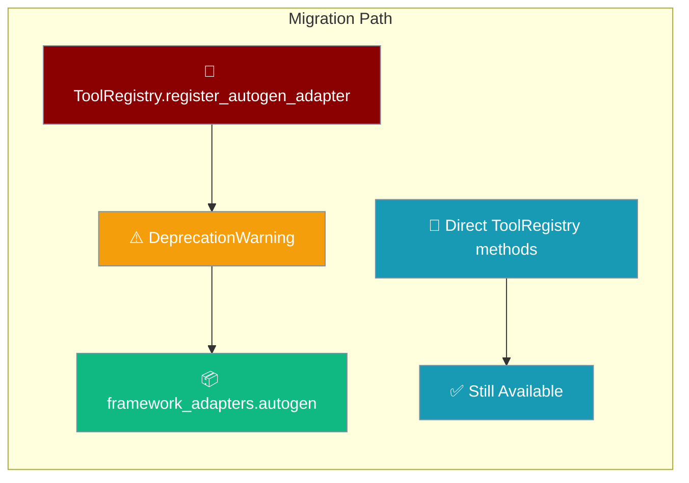
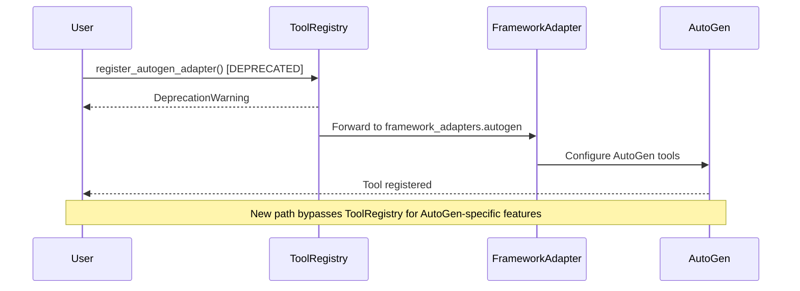

The AutoGen-specific methods on `ToolRegistry` are deprecated as of PR #1780. Move AutoGen tool registration to the AutoGen framework adapter.



## Quick Start

<Steps>
<Step title="Before (deprecated)">
```python
from praisonai.tool_registry import ToolRegistry

registry = ToolRegistry()

# These methods now emit DeprecationWarning
registry.register_autogen_adapter("my_tool", my_adapter)
adapter = registry.get_autogen_adapter("my_tool")
adapters = registry.list_autogen_adapters()
registry.register_builtin_autogen_adapters()
```
</Step>

<Step title="After (recommended)">
```python
from praisonai.framework_adapters.autogen import AutoGenAdapter
from praisonai.tool_registry import ToolRegistry

# AutoGen-specific functionality moved to framework adapter
adapter = AutoGenAdapter()
adapter.register_tool("my_tool", my_tool_function)

# General tool registry methods unchanged
registry = ToolRegistry()
registry.register_function("my_tool", my_tool_function)
```
</Step>
</Steps>

---

## How It Works



## What Changed

| Deprecated Method | Status | Replacement |
|-------------------|---------|-------------|
| `register_autogen_adapter(tool_type_name, adapter)` | **Deprecated** | Use `framework_adapters.autogen` module |
| `get_autogen_adapter(tool_type_name)` | **Deprecated** | Use `framework_adapters.autogen` module |
| `list_autogen_adapters()` | **Deprecated** | Use `framework_adapters.autogen` module |
| `register_builtin_autogen_adapters()` | **Deprecated** | Use `framework_adapters.autogen` module |

---

## Common Patterns

### Tool Registration

```python
# Before (deprecated)
from praisonai.tool_registry import ToolRegistry

def my_tool(query: str) -> str:
    return f"Processed: {query}"

registry = ToolRegistry()
registry.register_autogen_adapter("search", my_tool)  # DeprecationWarning

# After (recommended)
from praisonai.framework_adapters.autogen import AutoGenAdapter

adapter = AutoGenAdapter()
adapter.register_tool("search", my_tool)
```

### Listing Available Tools

```python
# Before (deprecated)
registry = ToolRegistry()
autogen_tools = registry.list_autogen_adapters()  # DeprecationWarning

# After (recommended)
from praisonai.framework_adapters.autogen import get_available_tools

autogen_tools = get_available_tools()
```

### Builtin Registration

```python
# Before (deprecated)
registry = ToolRegistry()
registry.register_builtin_autogen_adapters()  # DeprecationWarning

# After (recommended)
from praisonai.framework_adapters.autogen import register_builtin_tools

register_builtin_tools()
```

---

## Best Practices

<AccordionGroup>
<Accordion title="Suppress warnings during migration">
If you need time to migrate, suppress the deprecation warnings:

```python
import warnings

warnings.filterwarnings("ignore", category=DeprecationWarning, module="praisonai.tool_registry")

# Your existing code continues to work
from praisonai.tool_registry import ToolRegistry
registry = ToolRegistry()
registry.register_autogen_adapter("tool", adapter)  # No warning printed
```
</Accordion>

<Accordion title="General ToolRegistry methods are unchanged">
Only AutoGen-specific methods are deprecated. These continue to work normally:

```python
from praisonai.tool_registry import ToolRegistry

registry = ToolRegistry()

# These methods are NOT deprecated
registry.register_function("my_tool", my_function)
tool = registry.get_function("my_tool")
functions = registry.list_functions()
registry.clear()
```
</Accordion>

<Accordion title="Update imports incrementally">
Start by updating imports, then migrate method calls:

```python
# Step 1: Import the new module alongside existing code
from praisonai.tool_registry import ToolRegistry
from praisonai.framework_adapters.autogen import AutoGenAdapter

# Step 2: Create new adapter while keeping old registry
registry = ToolRegistry()
adapter = AutoGenAdapter()

# Step 3: Gradually move registration calls to adapter
adapter.register_tool("new_tool", new_function)
registry.register_autogen_adapter("old_tool", old_function)  # Still works

# Step 4: Remove old registry usage when ready
```
</Accordion>

<Accordion title="Test with warnings enabled">
Ensure your migration is complete by running tests with warnings as errors:

```python
import warnings

# Turn deprecation warnings into errors for testing
warnings.simplefilter("error", DeprecationWarning)

try:
    # Your code should not trigger any DeprecationWarning
    setup_tools()
    print("Migration complete - no deprecated methods called")
except DeprecationWarning as e:
    print(f"Migration incomplete: {e}")
```
</Accordion>
</AccordionGroup>

---

## Related

<CardGroup cols={2}>
  <Card title="Framework Availability" icon="check-circle" href="/docs/features/framework-availability">
    Framework detection and availability checking
  </Card>
  <Card title="Thread Safety" icon="lock" href="/docs/features/thread-safety">
    Thread-safe tool registry operations
  </Card>
</CardGroup>