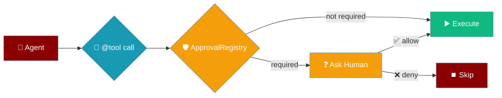
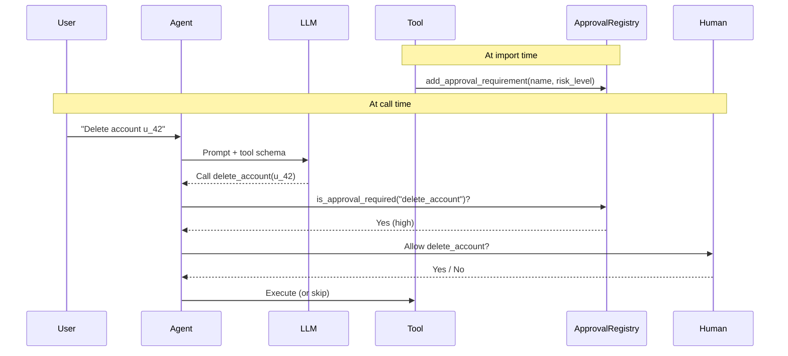
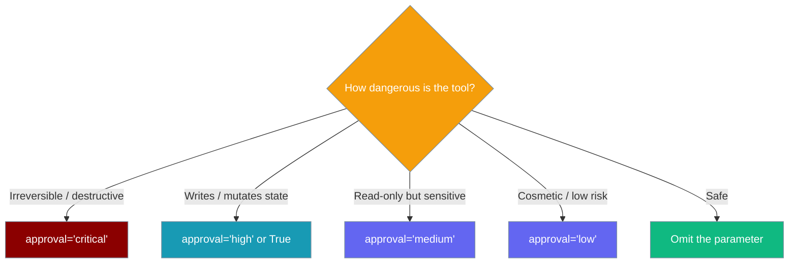

Declare a tool needs human approval directly on the `@tool` decorator; every runtime honours it.

```python
from praisonaiagents import Agent, tool

@tool(approval=True)
def delete_account(user_id: str) -> str:
    """Permanently delete a user account."""
    return f"Deleted {user_id}"

agent = Agent(
    name="Support",
    instructions="Help users. Ask before doing anything destructive.",
    tools=[delete_account],
)
agent.start("Delete account u_42")
```

The tool carries its own approval requirement — the agent pauses and asks a human before `delete_account` runs.

<Note>
**One vocabulary:** `approval=` is the same word you already use on the agent — `Agent(name="…", approval="high")`. See [Agent Approval](/features/approval). `requires_approval=` still works as a deprecated alias (below).
</Note>



## Quick Start

<Steps>
<Step title="One-line, high-risk default">
`approval=True` registers the tool at `"high"` risk:

```python
from praisonaiagents import Agent, tool

@tool(approval=True)
def refund(order_id: str) -> str:
    """Issue a refund on an order."""
    return f"Refunded {order_id}"

agent = Agent(
    name="Support",
    instructions="Help support agents process refunds.",
    tools=[refund],
)
agent.start("Refund order O-101")
```
</Step>

<Step title="Explicit risk level">
Pass a string to choose the level explicitly:

```python
from praisonaiagents import tool

@tool(approval="critical")
def deploy(env: str) -> str:
    """Deploy to an environment."""
    return f"Deployed to {env}"
```
</Step>

<Step title="Renamed tool">
Registration keys off the resolved tool name — not the function name:

```python
from praisonaiagents import tool

@tool(name="danger_op", approval=True)
def internal_fn(payload: str) -> str:
    """Run a dangerous operation."""
    return f"Ran {payload}"

# The approval requirement is registered under "danger_op".
```
</Step>
</Steps>

---

## How It Works

Registration happens once at import time; enforcement happens on every call.



| Stage | What happens |
|---|---|
| Import | The decorator calls `add_approval_requirement(tool.name, tool.risk_level)` on the global registry |
| Call | The agent checks `is_approval_required(name)` before running the tool |
| Ask | The active approval backend (console by default) asks a human |
| Run | The tool runs only after approval; otherwise it is skipped |

### Choose your level



---

## Configuration Options

**Accepted values for `approval` (canonical):**

| Value | Effect |
|---|---|
| `None` (default) | No change. Tool runs without approval. |
| `True` | Tool registered at `"high"` risk level. |
| `"critical"` | Tool registered at `"critical"` risk level. |
| `"high"` | Tool registered at `"high"` risk level. |
| `"medium"` | Tool registered at `"medium"` risk level. |
| `"low"` | Tool registered at `"low"` risk level. |
| Any other string | `ValueError` raised at decoration time (e.g. `"critial"` — typo guard). |

### Deprecated alias: `requires_approval`

`requires_approval=` is the old spelling. It still works but emits a `DeprecationWarning` — migrate to `approval=`.

```python
from praisonaiagents import tool

@tool(requires_approval=True)          # works, but warns
def legacy_delete(user_id: str) -> str:
    """Delete a user account."""
    return f"Deleted {user_id}"
# DeprecationWarning: use approval= instead of requires_approval=
```

| Call | Result |
|---|---|
| `@tool(approval=True)` | `"high"` risk. No warning. |
| `@tool(approval="critical")` | `"critical"`. No warning. |
| `@tool(requires_approval=True)` | `"high"`. **DeprecationWarning.** |
| `@tool(requires_approval=False)` (explicit) | No approval. **Still warns** — any use of the old spelling nudges migration. |
| `@tool(approval="critical", requires_approval="low")` | Both given → `approval` wins → `"critical"`. **DeprecationWarning.** |
| `@tool` (neither) | No approval. No warning. |

**Attributes on the returned `FunctionTool`:**

| Attribute | Type | Meaning |
|---|---|---|
| `.approval` | `bool \| str \| None` | Canonical. The resolved approval value. |
| `.requires_approval` | `bool \| str` | Deprecated alias. Populated with the same resolved value so existing readers keep working. |
| `.risk_level` | `str \| None` | Resolved level: `"high"` when `True`; the string itself when a string; `None` when unset |

<Warning>
**Fail-closed:** If the registry cannot install the requirement, the decorator raises `RuntimeError` and does **not** hand back an executable tool. A tool you asked to gate never runs ungated.
</Warning>

<Tip>
Misspelled levels are caught early. `@tool(approval="critial")` raises `ValueError` at decoration time, not silently at runtime.
</Tip>

---

## Common Patterns

### Mark one tool critical alongside safe tools

```python
from praisonaiagents import Agent, tool

@tool
def get_balance(account_id: str) -> str:
    """Read an account balance."""
    return f"{account_id}: $1,240.00"

@tool(approval="critical")
def wire_transfer(account_id: str, amount: float) -> str:
    """Wire money out of an account — irreversible."""
    return f"Wired ${amount} from {account_id}"

agent = Agent(
    name="Finance",
    instructions="Help with account questions. Confirm before moving money.",
    tools=[get_balance, wire_transfer],
)
agent.start("What's the balance on acct-9 and wire $500 out")
```

### Rename a tool and keep it gated

```python
from praisonaiagents import tool

@tool(name="prod_deploy", approval="critical")
def deploy(env: str) -> str:
    """Deploy to production."""
    return f"Deployed to {env}"

# The registry key is "prod_deploy" — the name the LLM and agent see.
```

### Compose with agent-level approval config

The decorator declares *what* needs approval; the agent config decides *how* to ask.

```python
from praisonaiagents import Agent, tool

@tool(approval=True)
def refund(order_id: str) -> str:
    """Issue a refund."""
    return f"Refunded {order_id}"

agent = Agent(
    name="AsyncSupport",
    instructions="Process refunds.",
    tools=[refund],
    approval={"backend": "slack"},   # decorator says gate it; agent says ask via Slack
)
agent.start("Refund order O-101")
```

---

## User interaction flow

A real run looks like this:

1. You run the agent: `agent.start("Delete account u_42")`.
2. The LLM decides to call `delete_account`.
3. The console approval prompt appears with five choices: `[o] once`, `[s] session`, `[a] always`, `[n] no`, `[d] deny & redirect`.
4. You pick — the tool runs, or is skipped.

See [Interactive Tool Approval](/features/interactive-approval) for the full prompt semantics.

---

## Best Practices

<AccordionGroup>
<Accordion title="Gate anything that writes or deletes">
Prefer `approval=True` for any tool that writes, mutates, or deletes state. `True` registers at `"high"` — safe default for destructive actions.
</Accordion>

<Accordion title="Reserve 'critical' for irreversible operations">
Use `'critical'` only for irreversible operations. Critical tools always re-prompt regardless of the argument cache, so they never slip through a cached grant. See the [approval cache](/docs/features/approval#argument-aware-approval-cache).
</Accordion>

<Accordion title="Keep the parameter on the definition, not the agent">
Declare approval on the tool itself. The tool then travels safely between agents — no agent can accidentally use it ungated.
</Accordion>

<Accordion title="Use a non-console backend for async agents">
`approval` on the decorator does not wire a backend — console stays the default. For async agents, combine with `Agent(approval={"backend": "slack"})` or another non-console backend.
</Accordion>
</AccordionGroup>

---

## Related

<CardGroup cols={2}>
<Card title="Approval" icon="shield-check" href="/features/approval">
  Agent-level approval config and the dangerous-tools registry
</Card>
<Card title="Interactive Approval" icon="terminal" href="/features/interactive-approval">
  The console prompt UX and scope choices
</Card>
<Card title="Approval Backends" icon="plug" href="/features/approval-backends">
  Slack, HTTP, webhook, and other channels
</Card>
<Card title="Tool Retry Policy" icon="rotate" href="/features/tool-retry-policy">
  A sibling decorator-level knob for retries
</Card>
</CardGroup>
