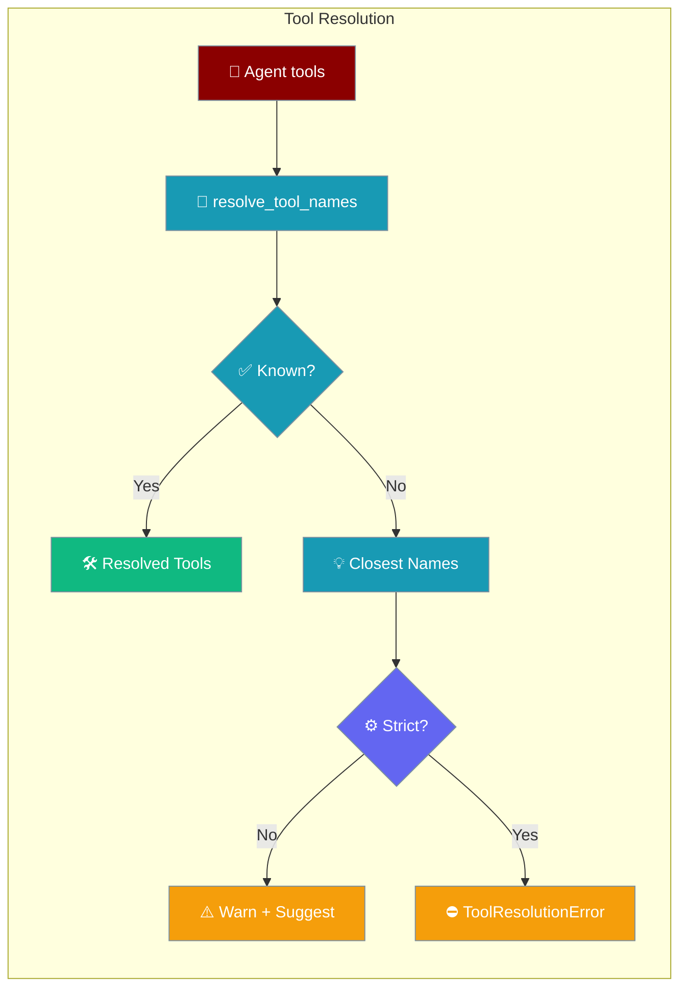
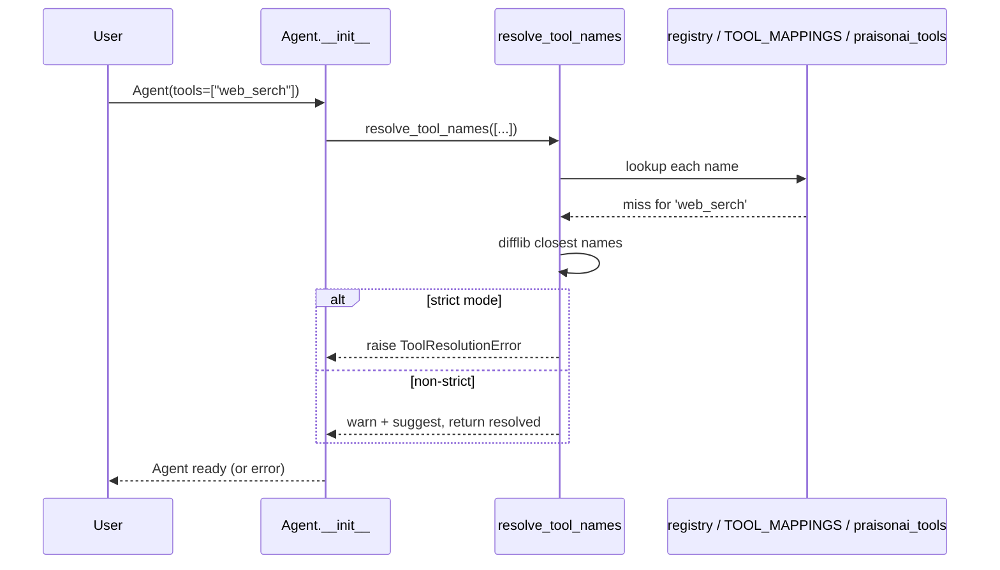
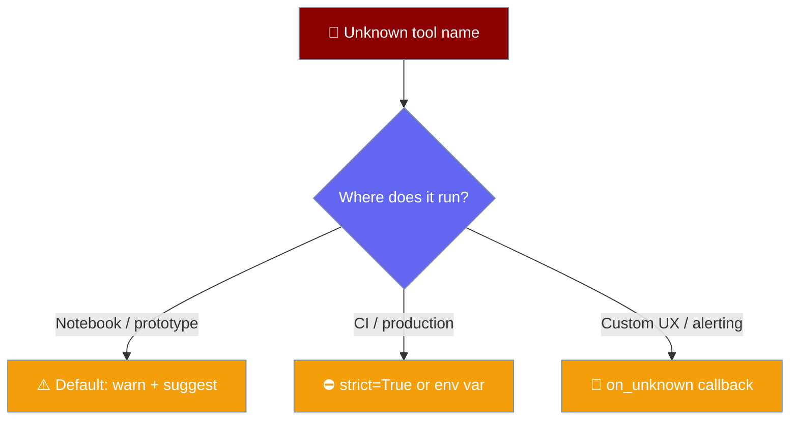

Typo a tool name and PraisonAI tells you what you meant — and, with strict mode on, refuses to start until you fix it.

```python
from praisonaiagents import Agent

Agent(name="Search", instructions="Search the web", tools=["internet_serch"])
# WARNING  Unknown tool 'internet_serch'. Did you mean 'internet_search'? Run 'praisonai tools list'.
```



## Quick Start

<Steps>
<Step title="Get a suggestion">
```python
from praisonaiagents import Agent

Agent(name="Assistant", instructions="Search the web", tools=["web_serch"])
# WARNING  Unknown tool 'web_serch'. Did you mean 'web_search'? Run 'praisonai tools list'.
```
</Step>

<Step title="Fail fast in CI">
```bash
export PRAISONAI_STRICT_TOOLS=true
python my_agent.py   # raises ToolResolutionError on any typo
```
</Step>

<Step title="Route suggestions yourself">
```python
from praisonaiagents.tools import resolve_tool_names

def my_reporter(unknown, suggestions):
    for name in unknown:
        print(f"Skipping unknown tool {name}; try {suggestions[name]}")

tools = resolve_tool_names(["web_serch"], on_unknown=my_reporter)
```
</Step>
</Steps>

---

## How It Works

Every tool name passes through `resolve_tool_names`, which looks it up, and on a miss computes the closest known names.



<Note>Suggestions use `difflib.get_close_matches` with a cutoff of `0.6` and up to `3` names per unknown tool.</Note>

The suggestion catalogue is the union of the registry (`get_registry().list_tools()`), the built-in `TOOL_MAPPINGS` keys, and `praisonai_tools.__all__` when the extra is installed.

---

## Choosing a Mode

Pick the behaviour that matches where your agent runs.



---

## Configuring Strict Mode

Turn strict mode on with an environment variable, a keyword argument, or a callback.

<Tabs>
<Tab title="Environment variable">
```bash
export PRAISONAI_STRICT_TOOLS=true   # 1 / true / yes (case-insensitive)
```
</Tab>
<Tab title="Argument">
```python
from praisonaiagents.tools import resolve_tool_names

resolve_tool_names(["web_serch"], strict=True)   # raises ToolResolutionError
```
</Tab>
<Tab title="Callback">
```python
from praisonaiagents.tools import resolve_tool_names

def _on_unknown(unknown, suggestions):
    raise SystemExit(f"unknown tools: {unknown}, suggestions: {suggestions}")

resolve_tool_names(["web_serch"], on_unknown=_on_unknown)
```
</Tab>
</Tabs>

The signature reads the environment variable only when `strict` is left unset:

```python
def resolve_tool_names(
    names: List[str],
    *,
    strict: Optional[bool] = None,
    on_unknown: Optional[Callable[[List[str], Dict[str, List[str]]], None]] = None,
) -> List[Any]:
    ...
```

| Argument | Type | Default | Behaviour |
|----------|------|---------|-----------|
| `names` | `List[str]` | — | Tool name strings to resolve. |
| `strict` | `Optional[bool]` | `None` | `True` raises on any unknown name; `False` warns and returns resolved tools; `None` reads `PRAISONAI_STRICT_TOOLS`. |
| `on_unknown` | `Optional[Callable]` | `None` | Called as `(unknown, suggestions)` in non-strict mode instead of the default warning. |

| Variable | Values (case-insensitive) | Effect |
|----------|---------------------------|--------|
| `PRAISONAI_STRICT_TOOLS` | `1`, `true`, `yes` → strict | Anything else → non-strict. Unset means non-strict. |

---

## The `ToolResolutionError` Shape

Strict mode raises `ToolResolutionError`, carrying the unknown names and their suggestions.

```python
from praisonaiagents import Agent
from praisonaiagents.tools import ToolResolutionError

try:
    Agent(tools=["web_serch"])   # with PRAISONAI_STRICT_TOOLS=true
except ToolResolutionError as e:
    print(e.unknown)       # ['web_serch']
    print(e.suggestions)   # {'web_serch': ['web_search']}
    print(str(e))          # "Unknown tool 'web_serch'. Did you mean 'web_search'? Run 'praisonai tools list'."
```

| Attribute | Type | Description |
|-----------|------|-------------|
| `unknown` | `list[str]` | Names that could not be resolved. |
| `suggestions` | `dict[str, list[str]]` | Closest known names for each unknown, up to 3 each. |
| `str(error)` | `str` | `Unknown tool 'web_serch'. Did you mean 'web_search'? Run 'praisonai tools list'.` |

`ToolResolutionError` subclasses `ValueError`, so existing `except ValueError:` blocks still catch it.

<Note>Strict mode also applies to `Agent(toolsets=[...])` — the toolset code path re-raises `ToolResolutionError` intact, preserving `.unknown` and `.suggestions`.</Note>

<Warning>The default is non-strict and backward-compatible: unknown names are dropped and resolved tools returned, now with a user-visible warning and suggestions.</Warning>

---

## Common Patterns

Break the build on a typo in CI, then keep exploration friendly locally.

```python
# CI entrypoint — fail fast
import os
os.environ["PRAISONAI_STRICT_TOOLS"] = "true"

from praisonaiagents import Agent
Agent(name="CI", instructions="Run checks", tools=["web_search", "read_file"])
```

Ship suggestions through your own logging or alerting for long-running services.

```python
import logging
from praisonaiagents.tools import resolve_tool_names

log = logging.getLogger("agents")

def report(unknown, suggestions):
    for name in unknown:
        log.error("unknown tool %s — try %s", name, suggestions[name])

resolve_tool_names(["web_serch", "read_fil"], on_unknown=report)
```

---

## Best Practices

<AccordionGroup>
<Accordion title="Turn on strict mode in CI">
Add `PRAISONAI_STRICT_TOOLS=true` to your CI environment so a mistyped tool name breaks the build instead of quietly shipping a tool-less agent.
</Accordion>
<Accordion title="Keep warn-and-continue for exploration">
Interactive exploration works better with the default — you get the "did you mean …?" hint without losing the running session.
</Accordion>
<Accordion title="Route suggestions through your own stack">
For long-running services, `on_unknown` sends the suggestion through the logger or alerting your app already uses.
</Accordion>
<Accordion title="Install praisonai-tools for richer suggestions">
The suggestion catalogue unions the registry, `TOOL_MAPPINGS`, and `praisonai_tools.__all__`. Installing `praisonai-tools` broadens the pool suggestions come from.
</Accordion>
</AccordionGroup>

---

## Related

<CardGroup cols={2}>
<Card title="Allowed Tools" icon="shield-check" href="/docs/features/allowed-tools">
  Restrict which tools an agent can call.
</Card>
<Card title="Tool Resolver" icon="wrench" href="/docs/features/tool-resolver">
  How tool names map to callables across sources.
</Card>
</CardGroup>
