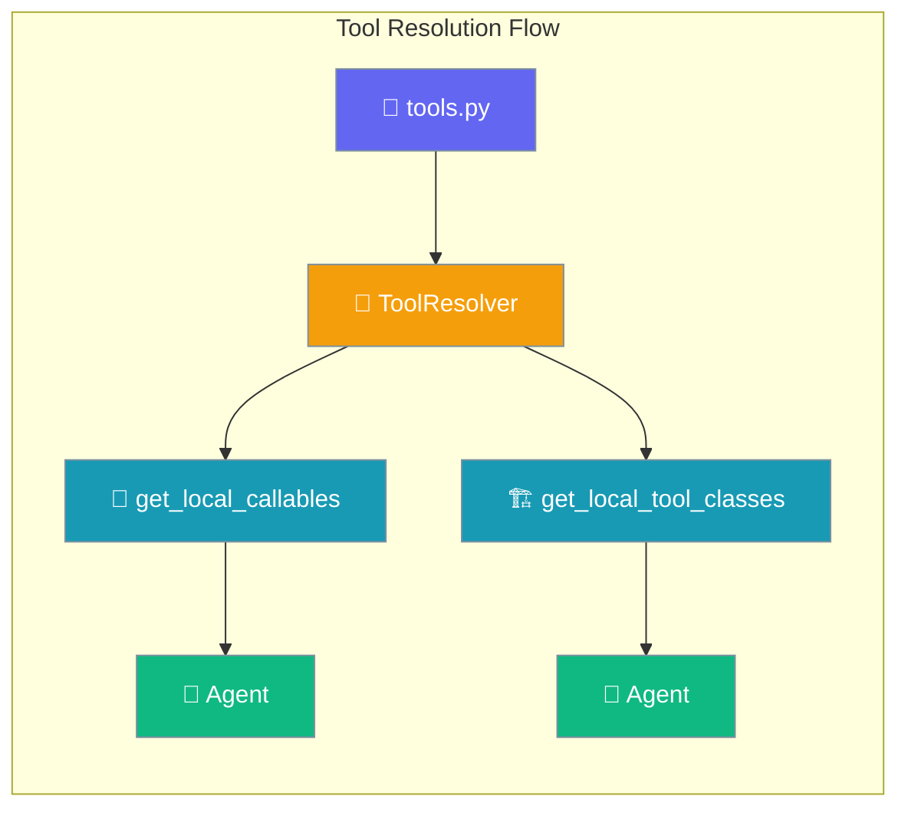
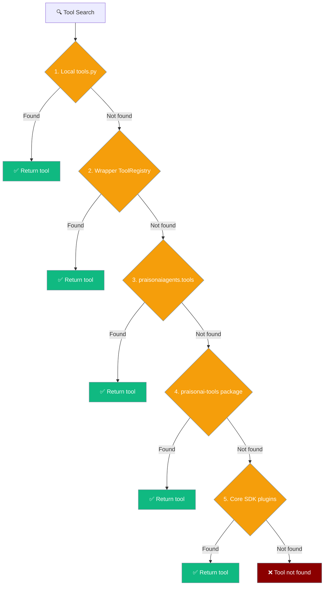
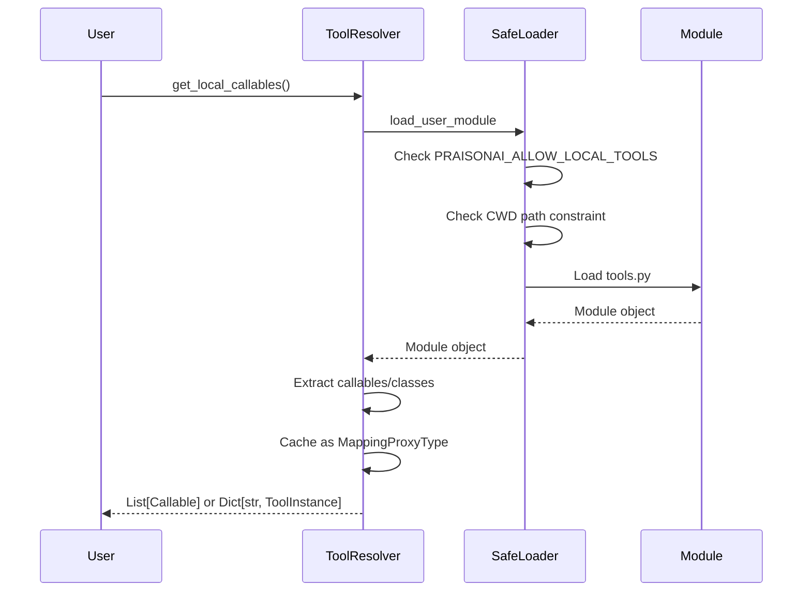
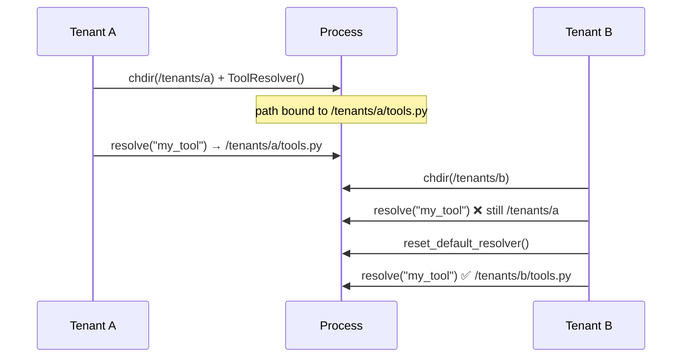
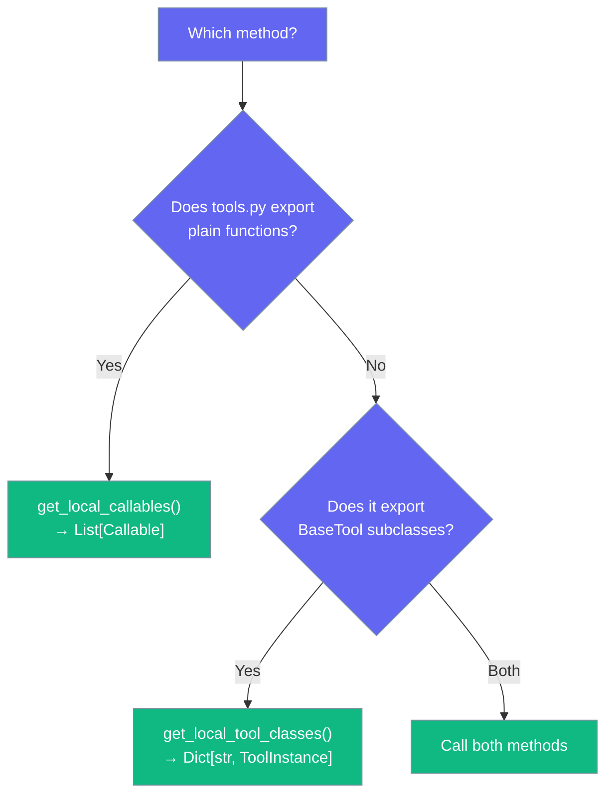
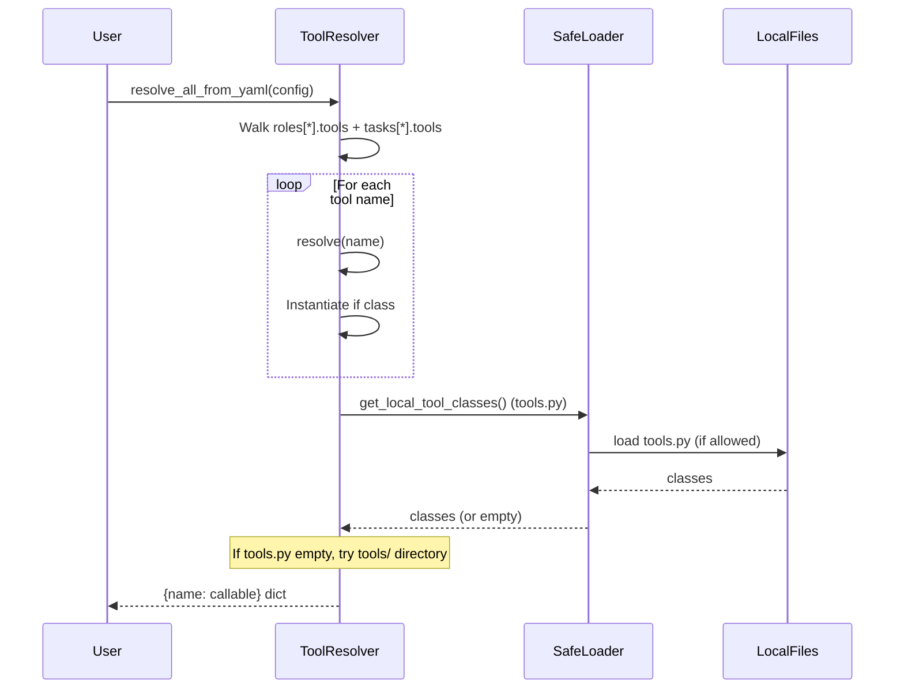
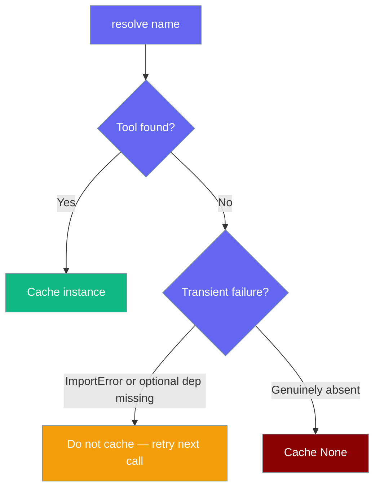

`ToolResolver` is the one place PraisonAI looks for `tools.py` — whether it ships callables or `BaseTool` classes.

```python
import os
from praisonaiagents import Agent

os.environ["PRAISONAI_ALLOW_LOCAL_TOOLS"] = "true"

agent = Agent(
    name="Tool User",
    instructions="Use available tools to help the user",
)
agent.start("Calculate something using my tools")
```

The user asks for a calculation; ToolResolver loads callables and BaseTool classes from tools.py for the agent.



## Quick Start

<Steps>
<Step title="Basic Usage">
Drop a `tools.py` next to your YAML/script, set the environment variable, and the resolver picks both kinds up automatically:

```bash
export PRAISONAI_ALLOW_LOCAL_TOOLS=true
```

```python
from praisonaiagents import Agent

# Tools from tools.py are automatically loaded
agent = Agent(
    name="Tool User",
    instructions="Use available tools to help the user"
)

agent.start("Calculate something using my tools")
```
</Step>

<Step title="Direct Python Usage">
When embedding PraisonAI in your own Python code:

```python
from praisonai.tool_resolver import ToolResolver

resolver = ToolResolver()  # defaults to ./tools.py
callables = resolver.get_local_callables()       # path A: functions
tool_classes = resolver.get_local_tool_classes() # path B: BaseTool instances

print(f"Found {len(callables)} functions")
print(f"Found {len(tool_classes)} tool classes")
```
</Step>
</Steps>

---

## Resolution Order

Tools are resolved in a specific order, with the first match winning:



CLI, YAML, recipes, templates, and Python all share this resolution chain. See [CLI Reference](/docs/cli/cli-reference) for `--tools` usage.

<Note>
**One resolution chain for every surface.** Whether you load tools via the CLI `--tools` flag, a YAML `tools:` list in `agents.yaml`, a recipe's `tools:` list, plain `Agent(tools=[...])` in Python, or `LocalManagedAgent(config=LocalManagedConfig(tools=[...]))` on the managed_local backend, PraisonAI walks the same five-source chain: local `tools.py` → wrapper `ToolRegistry` → `praisonaiagents.tools` → `praisonai-tools` → core SDK plugins. Tools registered through any of these become visible everywhere — no more "works in Python but not in the recipe, and now not in the local-managed backend either."

See [Local Managed Agents → Tool Name Resolution](/docs/concepts/managed-agents-local#tool-name-resolution) for the managed-local specifics (alias translation and compute-bridge wrapping run around resolution, not through it).
</Note>

<Note>
**Discovery matches resolution.** As of [PR #2476](https://github.com/MervinPraison/PraisonAI/pull/2476), `praisonai tools list` and `tools info` enumerate every source in this chain — including tools registered through the wrapper `ToolRegistry` (`register_function`) and core SDK registry (entry-point plugins). Each tool surfaces with its authoritative source via `ToolResolver.list_available_sources()`, so attribution matches the callable `resolve()` would actually return — no more "resolves at run time but invisible to the CLI."

Tools appear under one of four source labels: `builtin` (`praisonaiagents.tools`), `local` (your `tools.py`), `external` (`praisonai-tools` package), or `registered` (wrapper `ToolRegistry` or core SDK entry-point plugin). See [CLI tools reference](/docs/cli/tools) for the full label table and `--source` filter usage.

**Custom-sources subtlety:** a resolver built with an explicit `sources=` list does **not** enumerate the default built-in / external / core-registry sources in discovery (it would misrepresent what `resolve()` can return). The wrapper `ToolRegistry` is always enumerated when present, regardless of custom sources.
</Note>

<Note>
**Diagnostics and template dep-checks match resolution too.** As of [PR #2642](https://github.com/MervinPraison/PraisonAI/pull/2642), `praisonai tools doctor` and `praisonai tools discover` — and the YAML template dependency checker that runs when you load a template — all consult the same `ToolResolver` source list. So a tool that resolves at run time (via `praisonai_tools`, the wrapper `ToolRegistry`, the core registry, or an entry-point plugin) will no longer be flagged as "missing" by the doctor, hidden from `discover`, or blocked by the template loader. `tools doctor` now reports the full ~151 built-in tools instead of a subset.

Concretely, `praisonai tools list` / `tools info`, `ToolsDoctor.diagnose()`, and `DependencyChecker.check_tool()` all consult `ToolResolver.list_available_sources()`. Their outputs now agree with `resolve()` — a tool that resolves at run time is visible everywhere; a tool that doesn't resolve is reported as missing everywhere. Each site degrades gracefully to its previous partial scan when the resolver is unavailable. See [Tools Doctor](/docs/cli/tools-doctor), [Tools Discover](/docs/cli/tools-discover), and [Strict Tools Mode](/docs/cli/strict-tools) for the updated diagnostic documentation.
</Note>

---

## Registering Tools at Runtime

Register custom tools through the `ToolRegistry` for YAML pipeline access:

```python
from praisonai import PraisonAI
from praisonai.tool_registry import ToolRegistry

def my_search(query: str) -> str:
    """Custom search function."""
    return f"results for {query}"

praison = PraisonAI(agent_file="agents.yaml")
praison.agents_generator.tool_registry.register_function("my_search", my_search)
praison.run()
```

Then reference in your `agents.yaml`:

```yaml
roles:
  researcher:
    backstory: "You are a research specialist"
    goal: "Find information using available tools"
    tools:
      - my_search  # Now resolvable through the registry
```

For bulk registration from a module:

```python
import my_tools_module

# Register all public functions from a module
praison.agents_generator.tool_registry.register_from_module(my_tools_module)
```

---

## How It Works



The resolver delegates to `_safe_loader.load_user_module` for consistent environment variable checking and CWD path-traversal guard. The loaded module is reflected to extract either plain functions or tool class instances, then cached as an immutable view for thread safety.

The wrapper now invokes `resolve()` once per YAML-referenced tool name, with results cached via the resolve cache to avoid repeated lookups.

Directory mode iterates each `.py` file and unions the results using the same security gates and extraction logic.

### CLI and recipes use the same resolver (PR #1857, PR #2059, PR #2499)

`praisonai --tools tavily_search,my_tool "..."` goes through `ToolResolver.resolve(name, instantiate=True)`, identical to the YAML path. Recipe and template tool loading via `resolve_tools()` also delegates to `ToolResolver` (PR #2059), so wrapper `ToolRegistry` registrations, `praisonai-tools` package tools, and core SDK plugin tools are reachable from recipes and templates — not just the agent build path. As of PR #2499 the same chain also handles `--rewrite-tools` (query-rewrite), `--expand-tools` (prompt-expansion), and `research --tools`.

**Reachable from the CLI (default, YAML, and Python surfaces).** The `--tools` flag on default `run`, YAML `tools:` lists, and `Agent(tools=[...])` in Python all resolve names through this same chain. As of PR #2681, `run --output actions` also honours `--tools`/`--toolset` — previously they were dropped in actions mode. A name unknown to every source prints `Warning: Unknown tool '<name>'` and is skipped. See [Run](/docs/cli/run) and the [CLI reference](/docs/cli/cli).

---

## Multi-tenant usage

`ToolResolver` resolves `tools.py` **eagerly at construction time** using `Path.resolve()`. The path captured is the CWD when the resolver was created — not the CWD when `resolve()` is called later. This makes behaviour predictable in multi-tenant gateways where each tenant has a different working directory.

```python
from praisonai.tool_resolver import ToolResolver, reset_default_resolver

# Tenant A's request
os.chdir("/tenants/a")
resolver_a = ToolResolver()              # binds to /tenants/a/tools.py
tools_a = resolver_a.get_local_callables()

# Tenant B's request — must reset the process-wide default
os.chdir("/tenants/b")
reset_default_resolver()                 # clear the shared default
resolver_b = ToolResolver()              # binds to /tenants/b/tools.py
tools_b = resolver_b.get_local_callables()
```

<Warning>
If you use the module-level helpers (`resolve()`, `resolve_many()`, `list_available()`, etc.) they share a single process-default `ToolResolver`. Call `reset_default_resolver()` between tenants or after `os.chdir()` — otherwise the first caller's `tools.py` will be served to everyone.
</Warning>

### When to call `reset_default_resolver()`

| Situation | Call it? |
|-----------|----------|
| Single-tenant CLI | ❌ No |
| Multi-tenant gateway switching CWDs per request | ✅ Yes, before each tenant |
| Long-running server with hot-reload of tools | ✅ Yes, after tools change |
| Test setup/teardown | ✅ Yes, in a fixture |
| You always pass an explicit `tools_py_path` | ❌ No |




---

## Two Flavours of tools.py

| What's in `tools.py` | Method | Returned shape |
|----------------------|--------|----------------|
| Plain Python functions | `get_local_callables()` | `List[Callable]` |
| `praisonai_tools.BaseTool` / `praisonai.tools.BaseTool` / `langchain_community.tools.*` classes | `get_local_tool_classes()` | `Dict[str, ToolInstance]` (instantiated) |
| A directory of *.py files (each may contain BaseTool subclasses) | `get_local_tool_classes_from_dir(tools_dir)` | `Dict[str, ToolInstance]` (merged across files) |



If you need to resolve class tools by name (e.g. from a YAML `tools:` list), call `resolver.resolve("ToolClassName", instantiate=True)` — see [Common Patterns → Resolving Class Tools](#common-patterns) below.

**Example tools.py with functions:**
```python
# tools.py - Plain functions
def calculate_sum(a: int, b: int) -> int:
    """Add two numbers together."""
    return a + b

def get_weather(city: str) -> str:
    """Get weather for a city."""
    return f"Weather in {city}: sunny"
```

**Example tools.py with BaseTool classes:**
```python
# tools.py - BaseTool classes
from praisonai_tools import BaseTool

class CalculatorTool(BaseTool):
    name = "calculator"
    description = "Perform basic math operations"
    
    def _run(self, operation: str) -> str:
        # Implementation here
        return "42"

class WeatherTool(BaseTool):
    name = "weather"
    description = "Get weather information"
    
    def _run(self, city: str) -> str:
        return f"Weather in {city}: sunny"
```

---

## High-Level Loading Methods

For embedders and advanced users, `ToolResolver` exposes four convenience methods that combine resolution, instantiation, and security gating in a single call.

<Tabs>
<Tab title="Resolve everything in a YAML config">

```python
import yaml
from praisonai.tool_resolver import ToolResolver

with open("agents.yaml") as f:
    config = yaml.safe_load(f)

resolver = ToolResolver()
tools_dict = resolver.resolve_all_from_yaml(config)
# {"my_search": <function>, "CalculatorTool": <instance>, ...}
```

</Tab>

<Tab title="Load functions from a module">

```python
funcs = resolver.load_functions_from_module("./helpers/my_tools.py")
# {"calculate_sum": <function>, "get_weather": <function>}
```

</Tab>

<Tab title="Load BaseTool classes from a module">

```python
classes = resolver.load_classes_from_module("./tools.py")
# {"CalculatorTool": <CalculatorTool>, "WeatherTool": <WeatherTool>}
```

</Tab>

<Tab title="Load functions from a package directory">

```python
funcs = resolver.load_functions_from_package("./tools_pkg")
# Recursively unions every *.py (except __*.py) in the directory.
```

</Tab>
</Tabs>

All four methods enforce the `PRAISONAI_ALLOW_LOCAL_TOOLS=true` gate and CWD path constraints. See [Security](#security).



| Method | Returns | Purpose |
|--------|---------|---------|
| `resolve_all_from_yaml(yaml_config)` | `Dict[str, Callable]` | One call returns every tool referenced in a parsed YAML config, with classes instantiated and `tools.py` / `tools/` merged in. |
| `load_functions_from_module(path)` | `Dict[str, Callable]` | Load plain Python functions from a single `.py` file. |
| `load_classes_from_module(path)` | `Dict[str, Callable]` | Load and instantiate `BaseTool` subclasses and `langchain_community.tools.*` classes from a single `.py` file. |
| `load_functions_from_package(path)` | `Dict[str, Callable]` | Iterate `*.py` in a directory (skipping `__*.py`) and union the functions. |
| `list_available_sources()` | `Dict[str, str]` | Returns `{name: source}` where source is one of `"local"`, `"builtin"`, `"external"`, `"registered"`. Reflects the chain `resolve()` would actually use — used by `praisonai tools list` / `tools info` for authoritative source attribution. |

<Warning>
**Migration from `AgentsGenerator` (PR #2017).** `AgentsGenerator.load_tools_from_module`, `load_tools_from_module_class`, and `load_tools_from_package` have been removed. Use the equivalent `ToolResolver` methods above. The new versions enforce the `PRAISONAI_ALLOW_LOCAL_TOOLS` security gate uniformly.
</Warning>

<Note>
**PR #2017 security fix.** `load_functions_from_package()` now goes through `_safe_loader`, honouring `PRAISONAI_ALLOW_LOCAL_TOOLS` and the CWD path constraint. The previous `AgentsGenerator.load_tools_from_package` used `importlib.import_module()` directly and bypassed these checks.
</Note>

---

## Configuration Options

| Parameter | Where | Type | Default | Description |
|-----------|-------|------|---------|-------------|
| `tools_py_path` | `ToolResolver(...)` constructor | `Optional[str]` | `"tools.py"` | Path to the `tools.py` file to load (resolved eagerly against the current working directory). |
| `instantiate` | `resolver.resolve(name, ...)` | `bool` | `False` | When `True`, class tools (BaseTool subclasses, `langchain_community.tools.*` classes) are instantiated before being returned. Plain function tools are returned as-is. Safe with cache warm-up via `has_tool()` (since [PR #1858](https://github.com/MervinPraison/PraisonAI/pull/1858)). |
| `source_registry` | `ToolResolver(...)` constructor | `Optional[ToolSourceRegistry]` | Process-default (lazy, discovers `praisonai.tool_sources` entry points) | Injects a registry supplying third-party tool sources. See [Tool Source Registry](/docs/features/tool-source-registry). Pass `ToolSourceRegistry(discover_entry_points=False)` to opt out of third-party sources. |

```python
# Load from non-default path
resolver = ToolResolver(tools_py_path="/abs/path/to/my_tools.py")
```

<Note>
The `tools/` directory case takes an explicit `tools_dir` argument and is not bound to the constructor's `tools_py_path`.
</Note>

---

## Common Patterns

<Tabs>
<Tab title="Loading from Custom Path">
```python
from praisonai.tool_resolver import ToolResolver

# Load from specific file
resolver = ToolResolver(tools_py_path="/project/utils/custom_tools.py")
callables = resolver.get_local_callables()
```
</Tab>

<Tab title="Reloading After Edits">
```python
# In a long-lived process after editing tools.py
resolver.clear_cache()
updated_callables = resolver.get_local_callables()
```
</Tab>

<Tab title="Mixed Function and Class Tools">
```python
# Handle both types from the same tools.py
resolver = ToolResolver()
functions = resolver.get_local_callables()
tool_classes = resolver.get_local_tool_classes()

print(f"Functions: {[f.__name__ for f in functions]}")
print(f"Tool classes: {list(tool_classes.keys())}")
```
</Tab>

<Tab title="Loading from tools/ Directory">
```python
from praisonai.tool_resolver import ToolResolver

resolver = ToolResolver()
tools = resolver.get_local_tool_classes_from_dir("./tools")

print(f"Found {len(tools)} tools from directory")
print(f"Tool names: {list(tools.keys())}")
```
</Tab>

<Tab title="Resolving Class Tools">
```python
from praisonaiagents import Agent
from praisonai.tool_resolver import ToolResolver

# tools.py exports a BaseTool subclass (e.g. CalculatorTool)
resolver = ToolResolver()
calc = resolver.resolve("CalculatorTool", instantiate=True)

agent = Agent(
    name="Math Helper",
    instructions="Use the calculator to answer math questions",
    tools=[calc],
)

agent.start("What is 21 * 2?")
```
</Tab>
</Tabs>

---

## Local Tool Override Warning

When a class-based tool in your local `tools/` directory shares a name with a tool already resolved from the resolution chain (wrapper registry, `praisonaiagents.tools`, etc.), `resolve_all_from_yaml()` logs a warning:

```text
WARNING praisonai.tool_resolver: Local tool 'serper' overrides a tool already
resolved from the resolution chain
```

This warns you when a local definition silently wins over a built-in or registered tool of the same name. To resolve it, either rename your local tool or remove the conflicting source from the chain.

---

## Hot-Reload: `invalidate_local_tools_dir()`

In long-running processes (file watchers, dev servers), the `tools/` directory class scan is cached per-resolver. After editing `tools/*.py`, trigger a re-scan:

```python
from praisonai.tool_resolver import ToolResolver

resolver = ToolResolver()

# ... user edits tools/my_tool.py ...
resolver.invalidate_local_tools_dir()
# next resolve_all_from_yaml() re-scans the directory
```

`clear_cache()` also clears the directory cache alongside the resolve cache.

---

## Security

Security enforcement is handled by `_safe_loader.load_user_module`:

- **Environment gate**: Requires `PRAISONAI_ALLOW_LOCAL_TOOLS=true`  
- **CWD constraint**: Refuses paths outside current working directory
- **Path traversal protection**: Prevents `../` style attacks

See [Security Environment Variables](/docs/features/security-environment-variables#praisonai_allow_local_tools) for details.

```python
# These will be refused even with PRAISONAI_ALLOW_LOCAL_TOOLS=true
resolver = ToolResolver(tools_py_path="../outside_cwd/tools.py")  # ❌
resolver = ToolResolver(tools_py_path="/tmp/tools.py")           # ❌

# This works when inside your project directory
resolver = ToolResolver(tools_py_path="./utils/tools.py")        # ✅
```

---

## Per-Context Resolver (Multi-Project Safety)

When you call `resolve_tool(name)` without passing a resolver, PraisonAI now uses a **context-local** default resolver instead of a single process-wide singleton. Each agent/task/request anchors to its own working directory.

```python
from praisonai.tool_resolver import resolve_tool, reset_default_resolver
import os

# Agent A in /project_a — resolver anchors to /project_a/tools.py
os.chdir("/project_a")
tool_a = resolve_tool("my_tool")

# Agent B in /project_b in a different context — its resolver anchors to /project_b/tools.py
os.chdir("/project_b")
tool_b = resolve_tool("my_tool")  # picks up /project_b/tools.py, not /project_a/tools.py

# Long-lived daemons switching projects can explicitly reset:
reset_default_resolver()
```

### `reset_default_resolver()`

| | |
|---|---|
| **When to call** | Daemons or IDE plugins that switch the working directory between projects |
| **What it does** | Clears the cached `ToolResolver` in the current context so the next call re-anchors to the new CWD |
| **Import** | `from praisonai.tool_resolver import reset_default_resolver` |

---

## Caching Behaviour

- **Per-context cache**: Each context caches its own tools.py content
- **First call**: Loads and caches tools.py content

The `ToolResolver` maintains two separate caches for performance:

**Local `tools.py` cache**:
- **First call**: Loads and caches tools.py content
- **Subsequent calls**: Returns cached immutable view (`MappingProxyType`)
- **Thread safety**: Uses `_local_tools_lock` for concurrent access

**Resolve cache**:
- **Per-tool caching**: Memoises `resolve(name)` results for each tool name
- **Cacheable failures**: A tool genuinely absent from every source (local `tools.py`, `praisonaiagents.tools`, `praisonai-tools`, registry) is cached as `None` so repeated lookups don't walk the ladder again
- **Transient failures are NOT cached**: If `praisonaiagents` fails to import (`ImportError`) or an entry in `TOOL_MAPPINGS` exists but its optional dependency failed to load, the lookup is retried on the next call. Install the missing package and the next `resolve()` picks it up — no `clear_cache()` needed
- **`invalidate(name=None)`**: Clear one tool or the entire resolve cache. `ToolRegistry.set_resolver()` **appends** to a weak-ref list (PR #2122) — all registered resolvers are notified on `register_function()` / `clear()`. Resolvers held only by `ToolRegistry` are GC'd; dead refs are cleaned lazily on each invalidation. Multi-tenant gateways can wire one resolver per tenant without overwriting each other.
- **Thread safety**: Uses `_resolve_cache_lock` for concurrent access. Fixed in [PR #2147](https://github.com/MervinPraison/PraisonAI/pull/2147) — an earlier lock-free fast-path read could race with `ToolRegistry.invalidate()` and miss freshly-registered tools; the cache lookup now happens inside the lock.

<Tip>
Before PR #2079, missing optional dependencies could get stuck as `None` in the cache. Install the dep, call `resolve()` again, and it just works.
</Tip>



```python
resolver = ToolResolver()

# First resolve() walks sources and caches result
tool1 = resolver.resolve("tavily_search")

# Invalidate one tool after registry change
resolver.invalidate("tavily_search")
tool2 = resolver.resolve("tavily_search")  # Re-resolves from sources

# Or clear everything
resolver.invalidate()
```

### ToolSource protocol

`ToolSource` is a supported extensibility hook — pass custom sources via `ToolResolver(sources=[...])` to fully control resolution order.

`resolve()` walks `self._sources` when custom sources are provided. Each source's `lookup(name)` is called in order; the first non-`None` result wins. A source that raises an exception does **not** poison the cache — `allow_none_cache=False` ensures the next call after a dependency installs can still resolve the tool.

```python
from praisonai.tool_resolver import ToolResolver, ToolSource

class MyToolSource:
    name = "my_tools"
    def lookup(self, name: str):
        if name == "my_custom_tool":
            return my_custom_tool
        return None

resolver = ToolResolver(sources=[MyToolSource()])
tool = resolver.resolve("my_custom_tool")
```

### Entry-point tool sources

Third-party packages can register `ToolSource` implementations via the `praisonai.tool_sources` entry-point group — `ToolResolver` appends them after the default 5-step chain. See [Tool Source Registry](/docs/features/tool-source-registry) for the full pattern, plugin authoring, and opt-out.

```python
from praisonai.tool_resolver import ToolResolver, ToolSourceRegistry

# Opt out of installed third-party tool sources
resolver = ToolResolver(
    source_registry=ToolSourceRegistry(discover_entry_points=False),
)
```

The built-in chain (local `tools.py` → wrapper registry → `praisonaiagents` → `praisonai-tools` → core registry) is **owned by `ToolResolver.default_sources()`** and is unaffected by the registry — entry-point sources are always appended, never inserted, so a third-party plugin cannot silently shadow a first-party tool.

**Composing custom and default sources:**

The `default_sources(registry=None)` method returns the historical 5-step resolution chain as a list of `ToolSource` objects (`local-tools.py` → `wrapper-registry` → `praisonaiagents` → `praisonai-tools` → `core-registry`). Prepend your custom source to search it first while keeping all built-in sources:

```python
from praisonai.tool_resolver import ToolResolver
from praisonai.tool_registry import ToolRegistry

registry = ToolRegistry()
resolver = ToolResolver(
    registry=registry,
    sources=[MyToolSource(), *ToolResolver(registry=registry).default_sources(registry)],
)
```

**Auto-wiring with `registry=`:**

Passing `registry=` to `ToolResolver(...)` automatically calls `registry.set_resolver(self)`. This means `register_function()` on the registry will automatically invalidate the resolver's cache — no manual `set_resolver()` call needed:

```python
from praisonai.tool_resolver import ToolResolver
from praisonai.tool_registry import ToolRegistry

registry = ToolRegistry()
resolver = ToolResolver(registry=registry)  # auto-wires: registry.set_resolver(resolver)

registry.register_function("new_tool", my_tool)  # automatically invalidates resolver cache
tool = resolver.resolve("new_tool")              # re-resolves from sources
```

**Class tools and the cache:** When `tools.py` exports `BaseTool` subclasses (rather than plain functions), pass `instantiate=True` to get a ready-to-use instance back. The cache returns the same instantiation path whether or not `has_tool()` or `validate_yaml_tools()` warmed the cache first — so YAML validation flows that check tools exist before resolving them no longer return uninstantiated classes (fixed in [PR #1858](https://github.com/MervinPraison/PraisonAI/pull/1858)).

```python
from praisonai.tool_resolver import ToolResolver

resolver = ToolResolver()

# Warming the cache via has_tool() first is safe — the next resolve(instantiate=True)
# will still hand back an instance, not the raw class.
if resolver.has_tool("CalculatorTool"):
    calc = resolver.resolve("CalculatorTool", instantiate=True)
    # calc is an instance of CalculatorTool, ready to run
```

### Resetting the Default Resolver

Call `reset_default_resolver()` to clear the context-local resolver cache.
Useful between tenants, on CWD change, or in test setup so that local
`tools.py` resolution is not affected by previous calls.

```python
import os
from praisonai.tool_resolver import reset_default_resolver

# Switching tenants / projects
os.chdir("/path/to/tenant_b")
reset_default_resolver()  # next ToolResolver() reload picks up the new CWD
```

This clears the context-local resolver cache, forcing the next tool
resolution to create a fresh resolver anchored to the current working directory.

`clear_cache()` now clears both caches — useful after editing `tools.py` and after registering new tools in the wrapper `ToolRegistry` at runtime.


---

## Best Practices

<AccordionGroup>
<Accordion title="Keep tools.py in your CWD">
Place `tools.py` in your current working directory. Paths outside CWD are refused even with the environment variable set. This prevents path traversal attacks from HTTP API callers.

```bash
# Good structure
project/
├── agents.yaml
├── tools.py          # ✅ In CWD
└── utils/
    └── helpers.py

# Bad structure  
project/
├── agents.yaml
└── ../tools/
    └── tools.py      # ❌ Outside CWD
```
</Accordion>

<Accordion title="Prefer functions for praisonaiagents">
Use plain Python functions for `praisonaiagents` agents. Reserve `BaseTool` classes for crewai-style flows or when you need complex tool state management.

```python
# Simple and effective
def process_data(data: str) -> str:
    """Process some data."""
    return data.upper()

# Only when you need complex behavior
class DataProcessorTool(BaseTool):
    name = "data_processor"
    
    def __init__(self):
        self.state = {}  # Complex state management
```
</Accordion>

<Accordion title="Import from the wrapper package">
Don't import `ToolResolver` from `praisonaiagents` — it lives in the wrapper at `praisonai.tool_resolver`. The wrapper handles YAML-based tool resolution.

```python
# Correct
from praisonai.tool_resolver import ToolResolver

# Incorrect - won't work
from praisonaiagents.tool_resolver import ToolResolver  # ❌
```
</Accordion>

<Accordion title="Set environment variable only in trusted environments">
Set `PRAISONAI_ALLOW_LOCAL_TOOLS=true` only in development or trusted deployment environments. This prevents arbitrary code execution from untrusted working directories.

```bash
# Development
export PRAISONAI_ALLOW_LOCAL_TOOLS=true

# Production - keep disabled unless absolutely necessary
# unset PRAISONAI_ALLOW_LOCAL_TOOLS
```
</Accordion>
</AccordionGroup>

---

## Related

<CardGroup cols={2}>
<Card title="Tool Source Registry" icon="puzzle-piece" href="/docs/features/tool-source-registry">
  Plug third-party tool sources via entry points
</Card>
<Card title="Tools Resolve (CLI)" icon="terminal" href="/docs/cli/tools-resolve">
  Recipe and template tool resolution via resolve_tools()
</Card>
<Card title="Create Custom Tools" icon="wrench" href="/docs/guides/tools/create-custom-tools">
  Build tools for agents and YAML configs
</Card>
<Card title="Security Environment Variables" icon="shield-check" href="/docs/features/security-environment-variables">
  Environment variable security controls
</Card>
<Card title="Tools" icon="wrench" href="/docs/tools">
  General tools documentation
</Card>
</CardGroup>