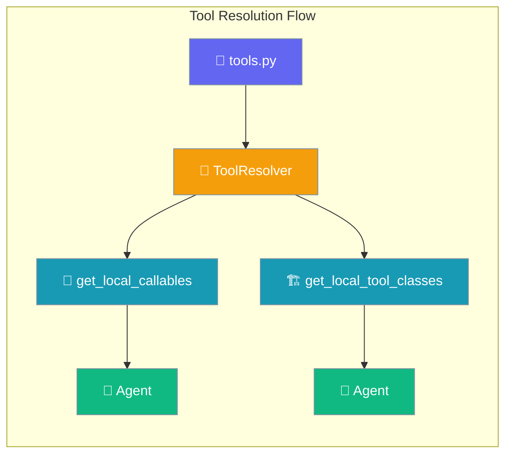
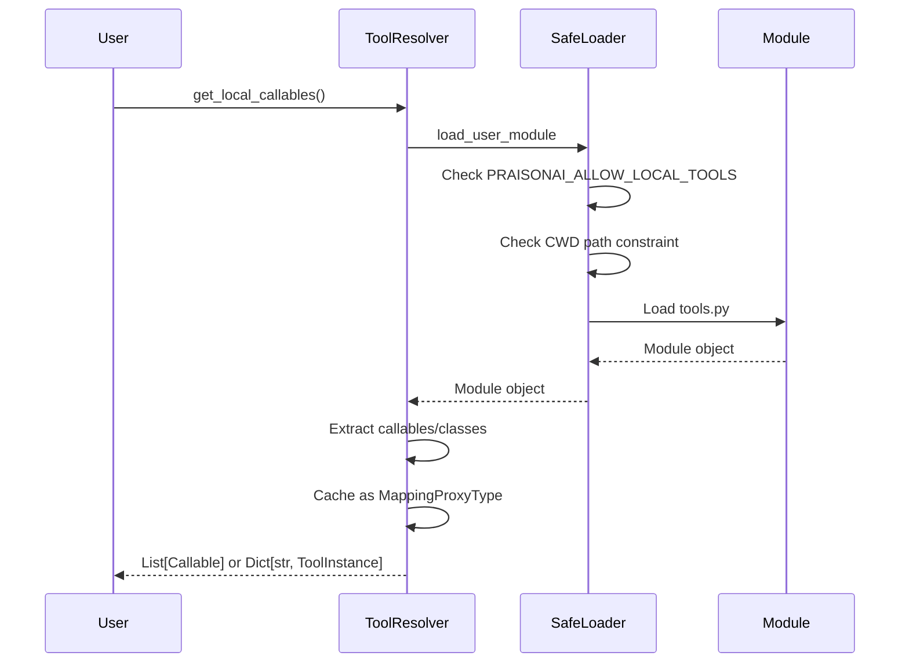
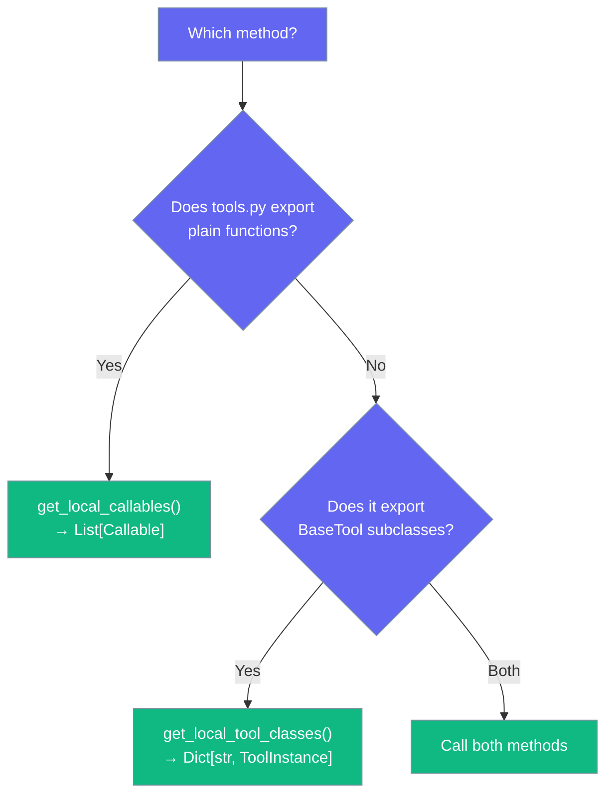

`ToolResolver` is the one place PraisonAI looks for `tools.py` — whether it ships callables or `BaseTool` classes.



## Quick Start

<Steps>
<Step title="Basic Usage">
Drop a `tools.py` next to your YAML/script, set the environment variable, and the resolver picks both kinds up automatically:

```bash
export PRAISONAI_ALLOW_LOCAL_TOOLS=true
```

```python
from praisonaiagents import Agent

# Tools from tools.py are automatically loaded
agent = Agent(
    name="Tool User",
    instructions="Use available tools to help the user"
)

agent.start("Calculate something using my tools")
```
</Step>

<Step title="Direct Python Usage">
When embedding PraisonAI in your own Python code:

```python
from praisonai.tool_resolver import ToolResolver

resolver = ToolResolver()  # defaults to ./tools.py
callables = resolver.get_local_callables()       # path A: functions
tool_classes = resolver.get_local_tool_classes() # path B: BaseTool instances

print(f"Found {len(callables)} functions")
print(f"Found {len(tool_classes)} tool classes")
```
</Step>
</Steps>

---

## How It Works



The resolver delegates to `_safe_loader.load_user_module` for consistent environment variable checking and CWD path-traversal guard. The loaded module is reflected to extract either plain functions or tool class instances, then cached as an immutable view for thread safety.

The wrapper now invokes `resolve()` once per YAML-referenced tool name, with results cached via the resolve cache to avoid repeated lookups.

---

## Two Flavours of tools.py

| What's in `tools.py` | Method | Returned shape |
|----------------------|--------|----------------|
| Plain Python functions | `get_local_callables()` | `List[Callable]` |
| `praisonai_tools.BaseTool` / `praisonai.tools.BaseTool` / `langchain_community.tools.*` classes | `get_local_tool_classes()` | `Dict[str, ToolInstance]` (instantiated) |



**Example tools.py with functions:**
```python
# tools.py - Plain functions
def calculate_sum(a: int, b: int) -> int:
    """Add two numbers together."""
    return a + b

def get_weather(city: str) -> str:
    """Get weather for a city."""
    return f"Weather in {city}: sunny"
```

**Example tools.py with BaseTool classes:**
```python
# tools.py - BaseTool classes
from praisonai_tools import BaseTool

class CalculatorTool(BaseTool):
    name = "calculator"
    description = "Perform basic math operations"
    
    def _run(self, operation: str) -> str:
        # Implementation here
        return "42"

class WeatherTool(BaseTool):
    name = "weather"
    description = "Get weather information"
    
    def _run(self, city: str) -> str:
        return f"Weather in {city}: sunny"
```

---

## Configuration Options

| Parameter | Type | Default | Description |
|-----------|------|---------|-------------|
| `tools_py_path` | `Optional[str]` | `"tools.py"` | Path to tools.py file to load |

```python
# Load from non-default path
resolver = ToolResolver(tools_py_path="/abs/path/to/my_tools.py")
```

---

## Common Patterns

<Tabs>
<Tab title="Loading from Custom Path">
```python
from praisonai.tool_resolver import ToolResolver

# Load from specific file
resolver = ToolResolver(tools_py_path="/project/utils/custom_tools.py")
callables = resolver.get_local_callables()
```
</Tab>

<Tab title="Reloading After Edits">
```python
# In a long-lived process after editing tools.py
resolver.clear_cache()
updated_callables = resolver.get_local_callables()
```
</Tab>

<Tab title="Mixed Function and Class Tools">
```python
# Handle both types from the same tools.py
resolver = ToolResolver()
functions = resolver.get_local_callables()
tool_classes = resolver.get_local_tool_classes()

print(f"Functions: {[f.__name__ for f in functions]}")
print(f"Tool classes: {list(tool_classes.keys())}")
```
</Tab>
</Tabs>

---

## Security

Security enforcement is handled by `_safe_loader.load_user_module`:

- **Environment gate**: Requires `PRAISONAI_ALLOW_LOCAL_TOOLS=true`  
- **CWD constraint**: Refuses paths outside current working directory
- **Path traversal protection**: Prevents `../` style attacks

See [Security Environment Variables](/docs/features/security-environment-variables#praisonai_allow_local_tools) for details.

```python
# These will be refused even with PRAISONAI_ALLOW_LOCAL_TOOLS=true
resolver = ToolResolver(tools_py_path="../outside_cwd/tools.py")  # ❌
resolver = ToolResolver(tools_py_path="/tmp/tools.py")           # ❌

# This works when inside your project directory
resolver = ToolResolver(tools_py_path="./utils/tools.py")        # ✅
```

---

## Caching Behaviour

The `ToolResolver` maintains two separate caches for performance:

**Local `tools.py` cache**:
- **First call**: Loads and caches tools.py content  
- **Subsequent calls**: Returns cached immutable view (`MappingProxyType`)
- **Thread safety**: Uses `_local_tools_lock` for concurrent access

**Resolve cache**:
- **Per-tool caching**: Memoises `resolve(name)` results for each tool name
- **Negative results**: Unknown tool names are cached too, so repeated lookups don't walk every source
- **Thread safety**: Uses `_resolve_cache_lock` for concurrent access

```python
resolver = ToolResolver()

# First resolve() walks the 5-source ladder and caches result
tool1 = resolver.resolve("tavily_search")  # Loads from source

# Second resolve() returns cached result immediately  
tool2 = resolver.resolve("tavily_search")  # Uses cache

# Clear both caches
resolver.clear_cache()
tool3 = resolver.resolve("tavily_search")  # Loads from source again
```

`clear_cache()` now clears both caches — useful after editing `tools.py` and after registering new tools in the wrapper `ToolRegistry` at runtime.

---

## Best Practices

<AccordionGroup>
<Accordion title="Keep tools.py in your CWD">
Place `tools.py` in your current working directory. Paths outside CWD are refused even with the environment variable set. This prevents path traversal attacks from HTTP API callers.

```bash
# Good structure
project/
├── agents.yaml
├── tools.py          # ✅ In CWD
└── utils/
    └── helpers.py

# Bad structure  
project/
├── agents.yaml
└── ../tools/
    └── tools.py      # ❌ Outside CWD
```
</Accordion>

<Accordion title="Prefer functions for praisonaiagents">
Use plain Python functions for `praisonaiagents` agents. Reserve `BaseTool` classes for crewai-style flows or when you need complex tool state management.

```python
# Simple and effective
def process_data(data: str) -> str:
    """Process some data."""
    return data.upper()

# Only when you need complex behavior
class DataProcessorTool(BaseTool):
    name = "data_processor"
    
    def __init__(self):
        self.state = {}  # Complex state management
```
</Accordion>

<Accordion title="Import from the wrapper package">
Don't import `ToolResolver` from `praisonaiagents` — it lives in the wrapper at `praisonai.tool_resolver`. The wrapper handles YAML-based tool resolution.

```python
# Correct
from praisonai.tool_resolver import ToolResolver

# Incorrect - won't work
from praisonaiagents.tool_resolver import ToolResolver  # ❌
```
</Accordion>

<Accordion title="Set environment variable only in trusted environments">
Set `PRAISONAI_ALLOW_LOCAL_TOOLS=true` only in development or trusted deployment environments. This prevents arbitrary code execution from untrusted working directories.

```bash
# Development
export PRAISONAI_ALLOW_LOCAL_TOOLS=true

# Production - keep disabled unless absolutely necessary
# unset PRAISONAI_ALLOW_LOCAL_TOOLS
```
</Accordion>
</AccordionGroup>

---

## Related

<CardGroup cols={2}>
<Card title="Security Environment Variables" icon="shield-check" href="/docs/features/security-environment-variables">
  Environment variable security controls
</Card>
<Card title="Tools" icon="wrench" href="/docs/tools">
  General tools documentation
</Card>
</CardGroup>