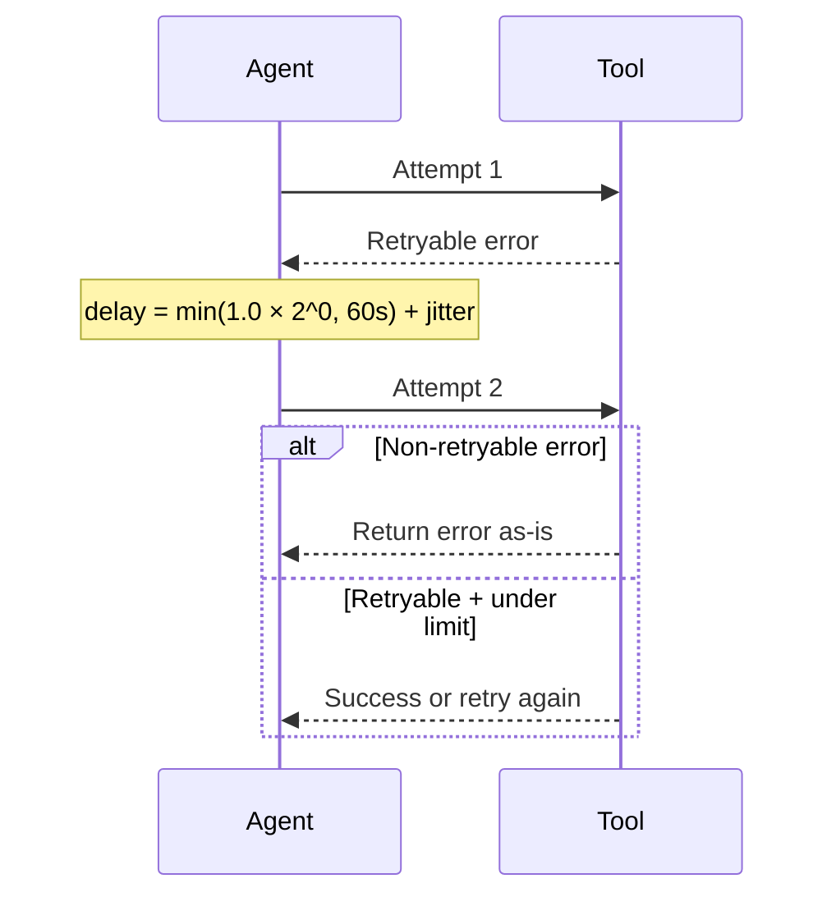
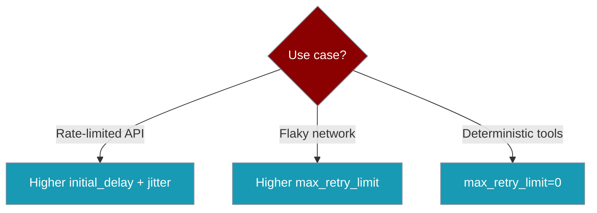

`ExecutionConfig` retry settings re-run retryable tool failures and guardrail validation errors with exponential backoff and jitter. For tools, `max_retry_limit` / `retry_*` are **translated into the effective `RetryPolicy`** — the single tool-retry budget shared with `ToolConfig(retry_policy=...)`.

```python
from praisonaiagents import Agent, tool

@tool
def fetch_report(query: str) -> str:
    """Fetch a report from a flaky API."""
    return f"Report for: {query}"

agent = Agent(name="Resilient Agent", tools=[fetch_report], max_retry_limit=3)
agent.start("Get me the latest report")
```

The user requests a report; transient tool failures retry with exponential backoff and jitter until success or the limit is reached.


```mermaid
graph LR
    Request[📝 Request] --> Tool[🔧 Tool]
    Tool -->|Fail| Backoff[⏱️ Backoff]
    Backoff --> Retry[🔄 Retry]
    Retry -->|Success| Done[✅ Done]

    classDef agent fill:#8B0000,stroke:#7C90A0,color:#fff
    classDef tool fill:#189AB4,stroke:#7C90A0,color:#fff

    class Request,Done agent
    class Tool,Backoff,Retry tool
```

## Quick Start

<Steps>
<Step title="Enable with defaults">
Retries with backoff are automatic when you set `max_retry_limit`:

```python
from praisonaiagents import Agent, tool

@tool
def fetch_report(query: str) -> str:
    """Fetch a report from a flaky API."""
    return f"Report for: {query}"

agent = Agent(
    name="Resilient Agent",
    instructions="Fetch data from flaky APIs",
    tools=[fetch_report],
    max_retry_limit=3,
)
agent.start("Get me the latest report")
```
</Step>

<Step title="Fine-tune backoff">
Use `ExecutionConfig` for delay, factor, and jitter:

```python
from praisonaiagents import Agent, ExecutionConfig, tool

@tool
def fetch_report(query: str) -> str:
    """Fetch a report from a flaky API."""
    return f"Report for: {query}"

agent = Agent(
    name="Resilient Agent",
    instructions="Fetch data from flaky APIs",
    tools=[fetch_report],
    execution=ExecutionConfig(
        max_retry_limit=3,
        retry_initial_delay=0.5,
        retry_backoff_factor=2.0,
        retry_jitter=0.2,
    ),
)
```
</Step>
</Steps>

---

## How It Works


```mermaid
sequenceDiagram
    participant Agent
    participant Tool
    Agent->>Tool: Attempt 1
    Tool-->>Agent: Retryable error
    Note over Agent: delay = min(1.0 × 2^0, 60s) + jitter
    Agent->>Tool: Attempt 2
    alt Non-retryable error
        Tool-->>Agent: Return error as-is
    else Retryable + under limit
        Tool-->>Agent: Success or retry again
    end
```

Total attempts = `1 + max_retry_limit`. Default `max_retry_limit=2` → up to **3** attempts.

Delay: `min(initial_delay × factor^(attempt−1), 60s) + random(0, jitter × base)`.

The translation maps `max_retry_limit` → `max_attempts` (`= limit + 1`), `retry_initial_delay` (seconds) → `initial_delay_ms`, `retry_backoff_factor` → `backoff_factor`, and `retry_jitter` (fraction) → `jitter=True` + `jitter_factor`. The translated policy sets `max_delay_ms = max(60000, initial_delay_ms)`, so `ExecutionConfig` users keep the historical **60-second** delay cap (a plain `RetryPolicy` defaults to a 30-second cap).

---

## Choosing Your Settings


```mermaid
graph TB
    Q{Use case?} -->|Rate-limited API| A[Higher initial_delay + jitter]
    Q -->|Flaky network| B[Higher max_retry_limit]
    Q -->|Deterministic tools| C[max_retry_limit=0]

    classDef agent fill:#8B0000,stroke:#7C90A0,color:#fff
    classDef tool fill:#189AB4,stroke:#7C90A0,color:#fff

    class Q agent
    class A,B,C tool
```

---

## Configuration

| Field | Type | Default | Description |
|---|---|---|---|
| `max_retry_limit` | `int` | `2` | Max retries after the first attempt |
| `retry_initial_delay` | `float` | `1.0` | First retry delay (seconds) |
| `retry_backoff_factor` | `float` | `2.0` | Exponential multiplier per attempt |
| `retry_jitter` | `float` | `0.1` | Jitter fraction of base delay |

<Note>
These fields are one spelling of the tool-retry budget. An explicit `ToolConfig(retry_policy=...)` (or per-tool `@tool(retry_policy=...)`) **wins over** the `ExecutionConfig` alias. See [Tool Retry Policy](/features/tool-retry-policy).
</Note>

---

## What Gets Retried

| Outcome | Retried? |
|---|---|
| Tool timeouts | ✅ |
| Circuit breaker open | ✅ |
| Unexpected exceptions (not `ValueError` / `TypeError` / `AttributeError`) | ✅ |
| Guardrail validation failures | ✅ |
| Tool returns `{"error": ...}` without `timeout` / `circuit_open` | ❌ |
| Programming errors (`ValueError`, `TypeError`, `AttributeError`) | ❌ |

---

## Common Patterns

**Disable retries:**

```python
agent = Agent(name="strict", max_retry_limit=0)
```

**Rate-limited APIs:**

```python
execution=ExecutionConfig(
    max_retry_limit=4,
    retry_initial_delay=2.0,
    retry_backoff_factor=3.0,
    retry_jitter=0.3,
)
```

**Low-latency tools:**

```python
execution=ExecutionConfig(
    max_retry_limit=2,
    retry_initial_delay=0.1,
    retry_backoff_factor=1.5,
)
```

---

## Best Practices

<AccordionGroup>
<Accordion title="Set jitter for parallel agents">
Jitter spreads retry timing across agents and reduces thundering-herd spikes on shared APIs.
</Accordion>

<Accordion title="Don't retry programming errors">
`ValueError`, `TypeError`, and `AttributeError` are treated as code bugs and are not retried.
</Accordion>

<Accordion title="Backoff is capped at 60s">
Very large backoff factors cannot exceed a 60-second base delay per attempt.
</Accordion>

<Accordion title="Guardrails share these settings">
Guardrail validation retries use the same `ExecutionConfig` backoff values. This is independent of tool retry — the fields still feed guardrail-retry backoff even when a `ToolConfig(retry_policy=...)` overrides the tool budget.
</Accordion>

<Accordion title="One budget, not two">
For tools, `ExecutionConfig.retry_*` is an alias translated into the effective `RetryPolicy` — the same budget as `ToolConfig(retry_policy=...)`. Setting an explicit `retry_policy` overrides the `ExecutionConfig` spelling.
</Accordion>
</AccordionGroup>

---

## Related

<CardGroup cols={2}>
<Card title="ExecutionConfig" icon="gauge-high" href="/configuration/execution-config">
  Full execution configuration reference
</Card>
<Card title="Guardrails" icon="shield" href="/features/guardrails">
  Input and output validation
</Card>
<Card title="Loop Guardrails" icon="shield-halved" href="/features/loop-guardrails">
  Cap tool calls per turn
</Card>
<Card title="Structured LLM Errors" icon="circle-alert" href="/features/structured-llm-errors">
  LLM-level retry and error handling
</Card>
</CardGroup>
